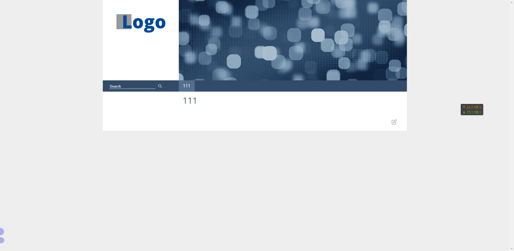
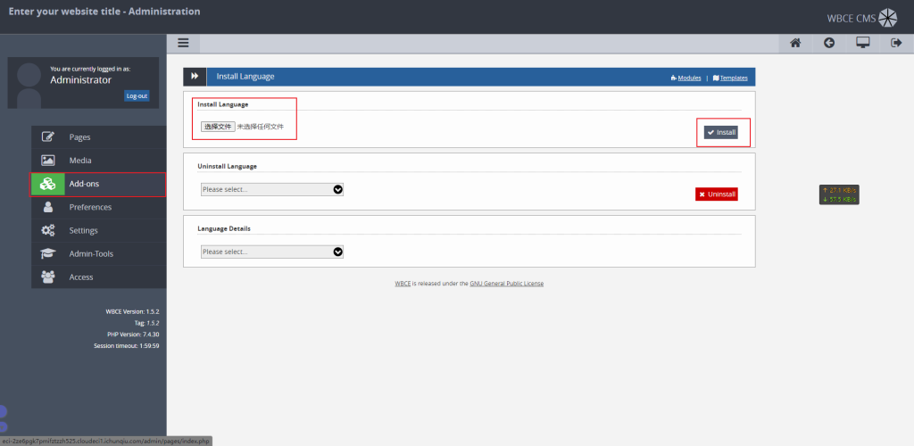
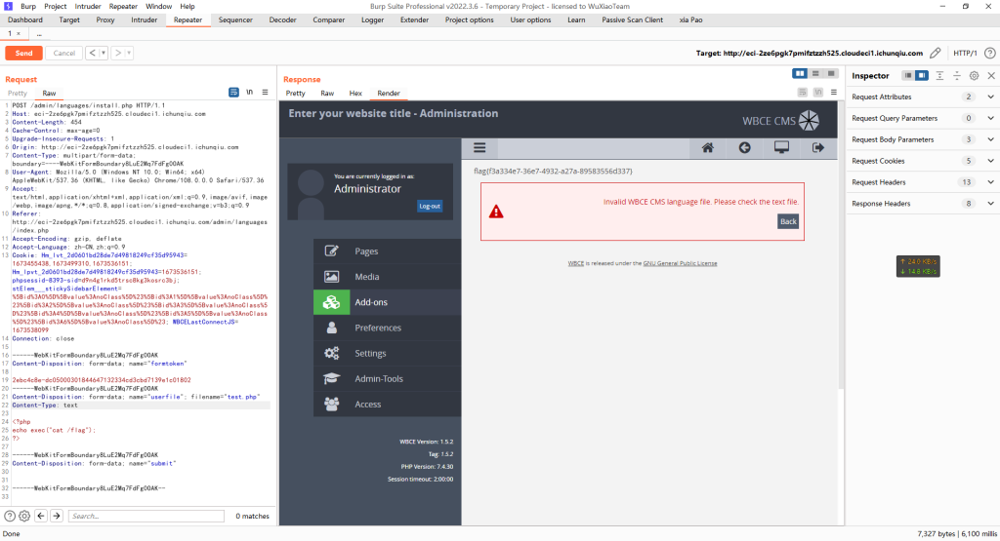
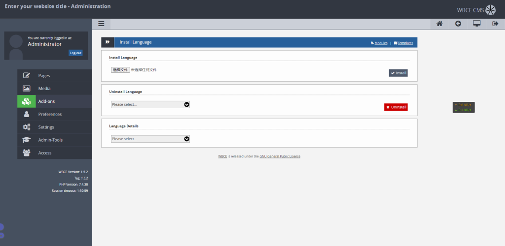
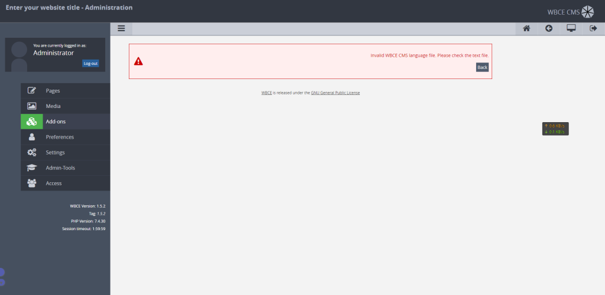
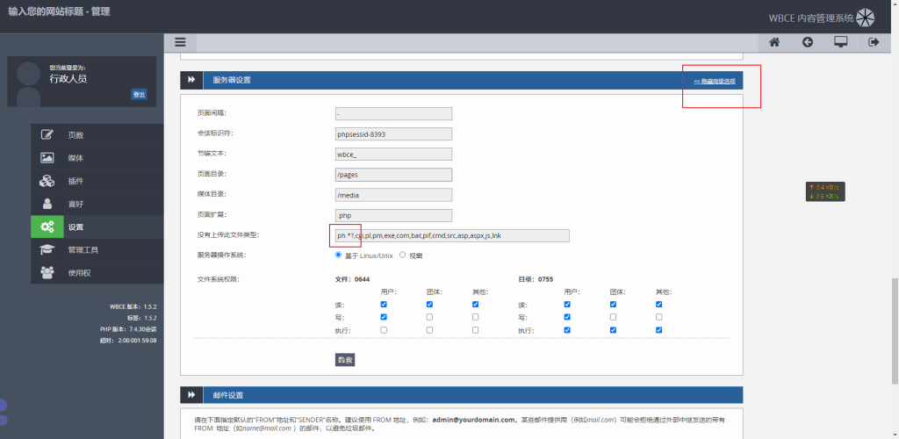
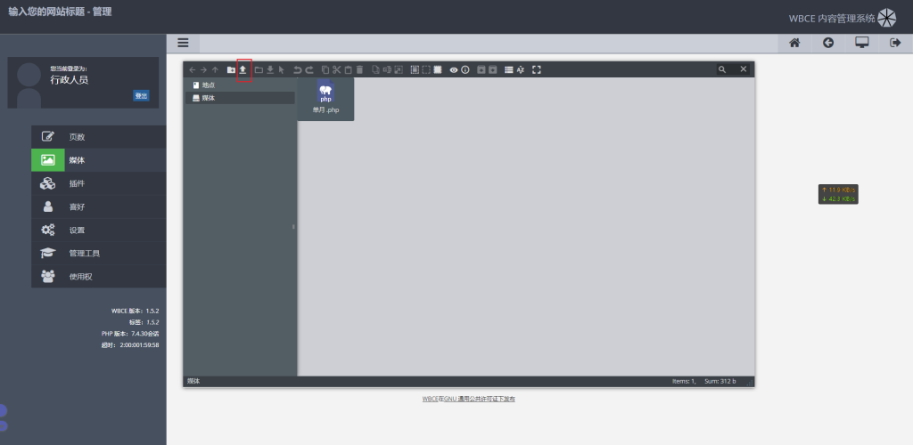
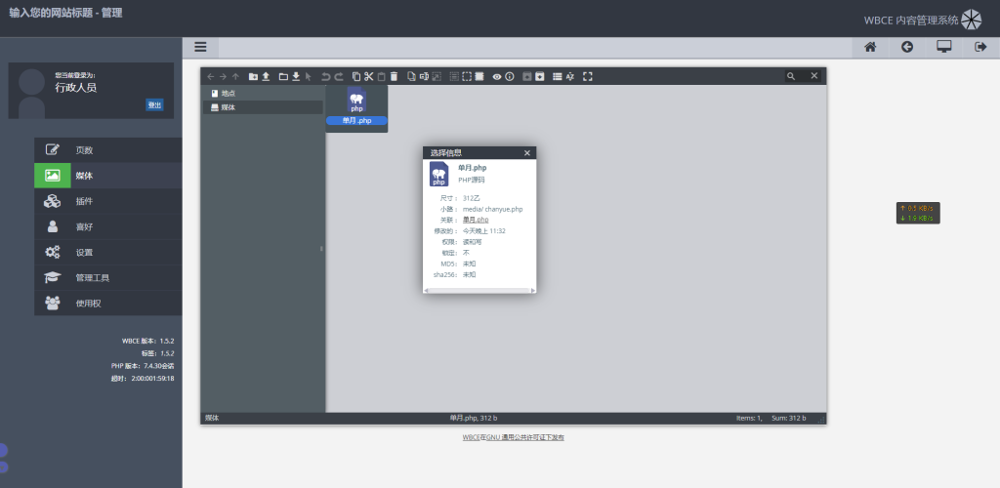
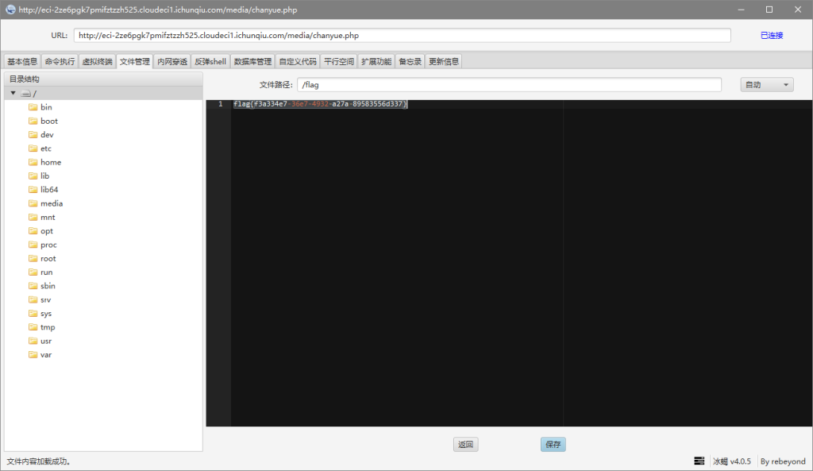

# CVE-2022-25099（WBCE CMS v1.5.2 RCE）

<div style="text-align: right;">

date: "2023-01-12"

</div>


## 漏洞描述

- WBCE CMS v1.5.2 /language/install.php 文件存在漏洞，攻击者可精心构造文件上传造成RCE

## 漏洞原理

- 暂无

## 漏洞复现

下图url页面是进去之后重构过的，正常来说这里是显示的”该网站还在建设中“，在url后面加上/admin/进入后台登陆页面，弱口令为：admin/123456




在/language/install.php路径下查找，在Add-ons下，直接将下列代码传上去，即可查看到flag

```php
<?php
echo exec("cat /flag");
?>
```





登陆后台后点击install 直接上传php，显示报错





寻找第二处漏洞点，来到设置下的更多高级选项中，将`ph.*?,`删除



来到媒体，点击上传，直接上传shell.php



右击上传的php获取shell路径，直接冰蝎连接获取flag





