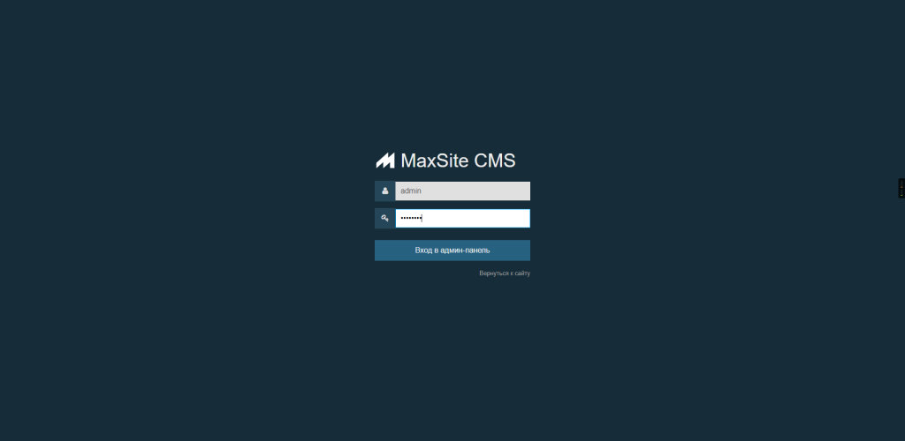
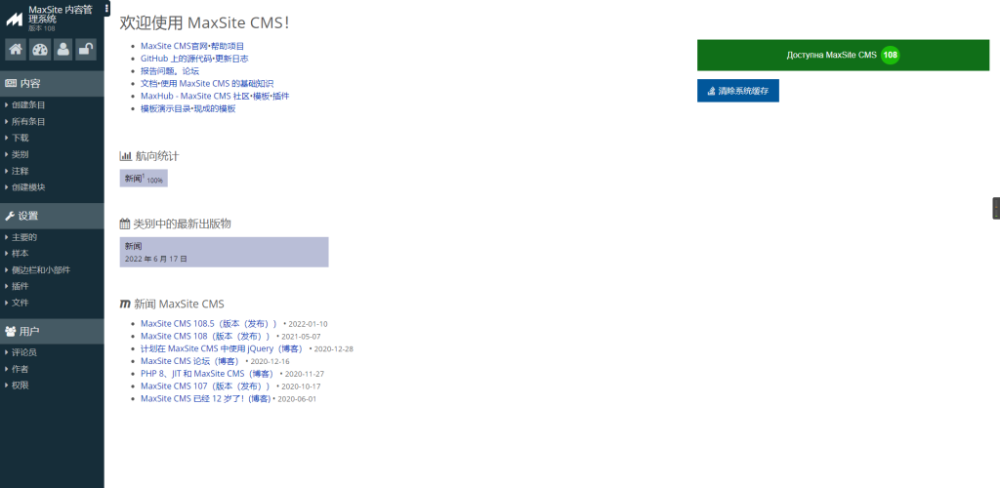
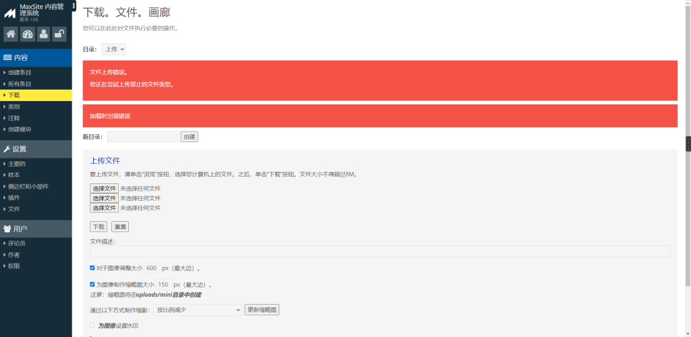
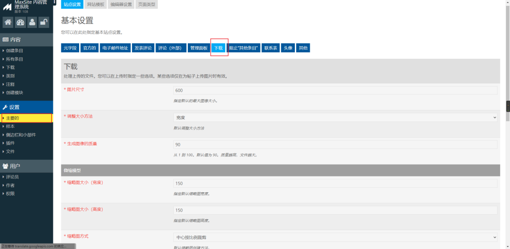
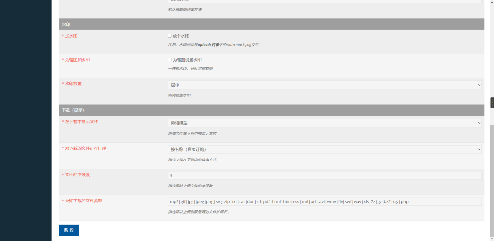
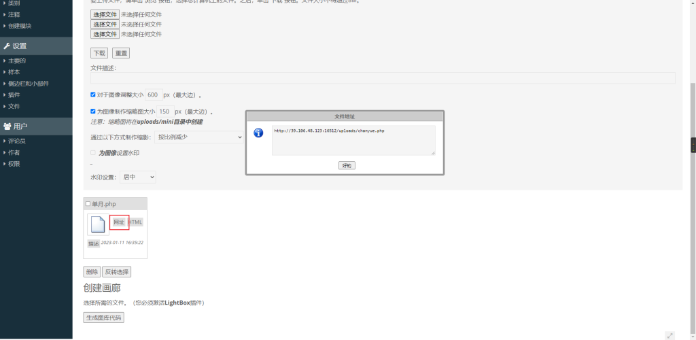
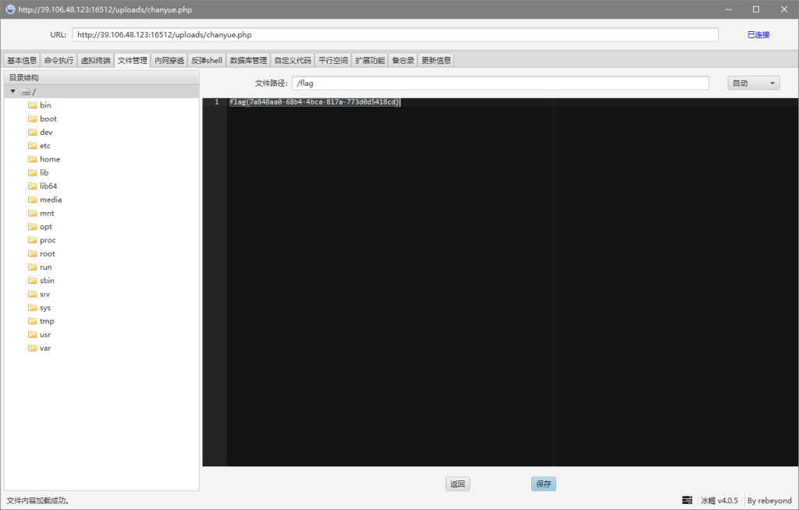

# CVE-2022-25411（Maxsite CMS文件上传漏洞）

date: "2023-01-11"

## 漏洞描述

- MaxSite CMS是俄国MaxSite CMS开源项目的一款网站内容管理系统。
- Maxsite CMS存在文件上传漏洞，攻击者可利用该漏洞通过精心制作的PHP文件执行任意代码。账户为弱口令

## 漏洞原理

- 暂无

## 漏洞复现

后台登录地址：http://example.com/admin/ ，弱口令：admin/admin888

找到一个上传的地方，直接上传shell.php提示错误

我们来到基本设置，找到下载，在运行下载的文件类型中填入php

再次上传，上传成功后底部会有上传文件的地址：http://example.com:16512/uploads/chanyue.php

### 四、冰蝎连接

