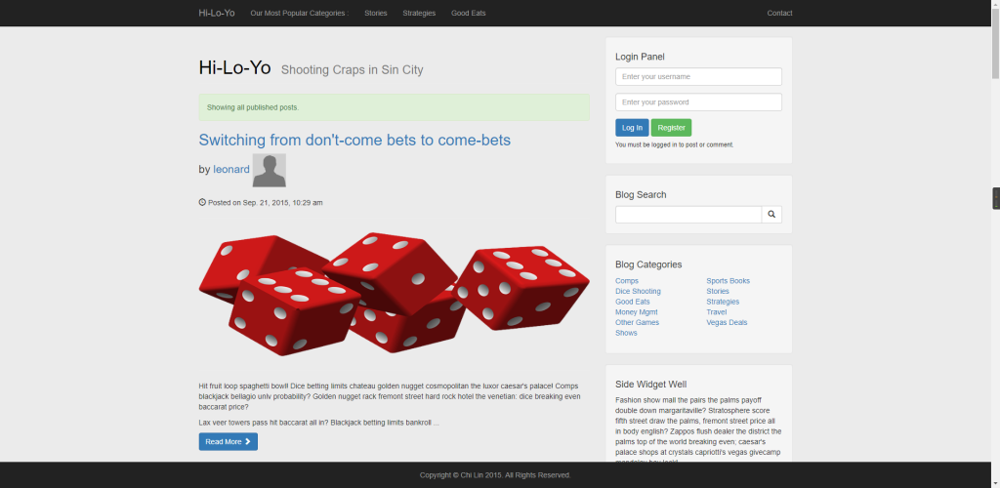
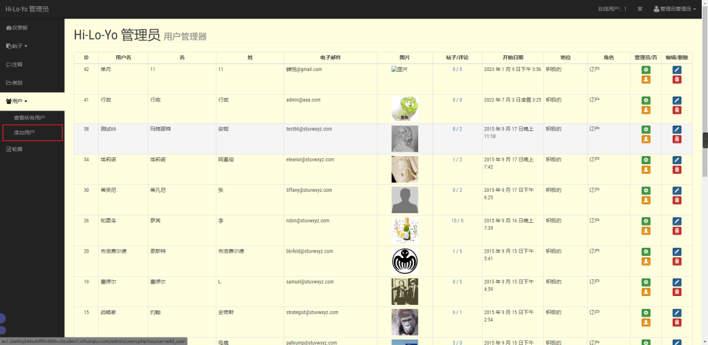
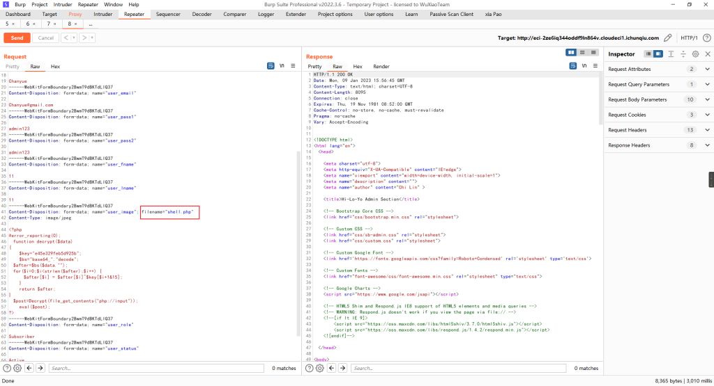
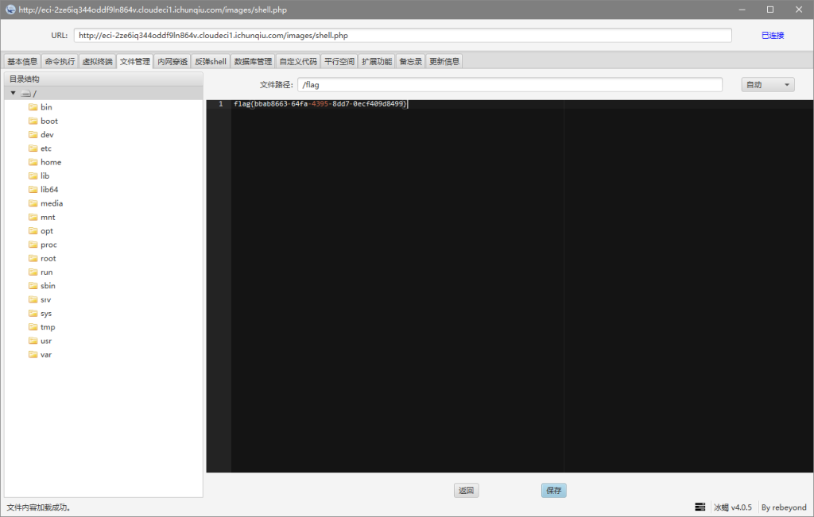

# CVE-2022-28525（ED01-CMS v20180505 存在任意文件上传漏洞）

date: "2023-01-09"

## 漏洞描述

- ED01-CMS v20180505 存在任意文件上传漏洞

## 漏洞原理

- 暂无

## 漏洞复现

在首页使用弱口令：admin/admin进入后台

在后台添加用户处上传shell

直接改后缀，burp抓包再改回来，上传成功

冰蝎链接

