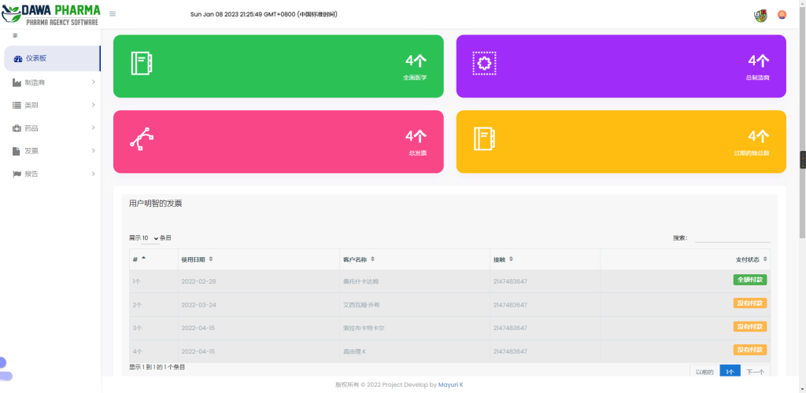
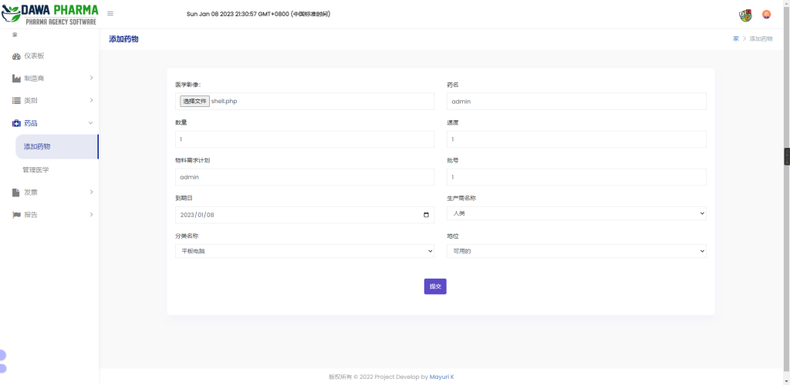
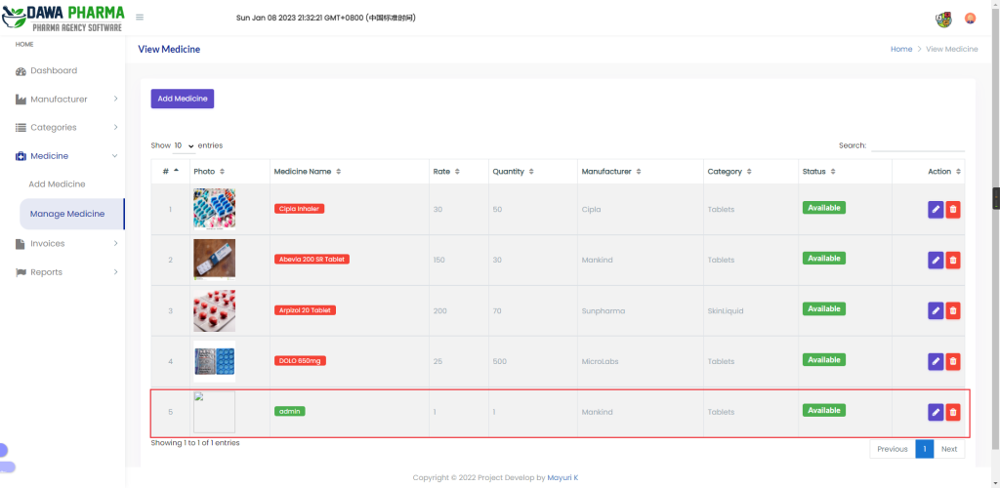
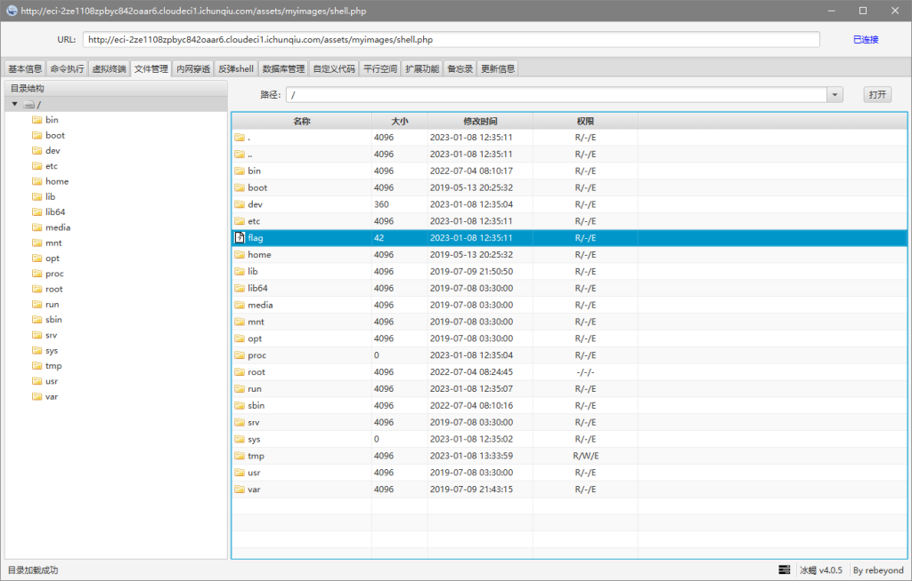

# CVE-2022-30887（MPMS任意文件上传漏洞）

date: "2023-01-08"

## 漏洞描述

- 多语言药房管理系统 (MPMS) 是用 PHP 和 MySQL 开发的
- 该CMS中php\_action/editProductImage.php存在任意文件上传漏洞，进而导致任意代码执行。

## 漏洞原理

- 暂无

## 漏洞复现

通过查看源码得到默认账号密码为：mayuri.infospace@gmail.com/mayurik，成功登录后台

在“添加药物”处进行文件上传

复制图片地址，冰蝎直接连接

注：
- 可以去作者网站获取源码，源码是以邮件形式发送，所以邮箱要填写真实的，且qq邮箱不行，最好使用gmail邮箱
- `\\dawapharma\\dawapharma\\database\\mayurik\_pharmacy.sql`185行可以得到账号密码