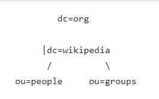
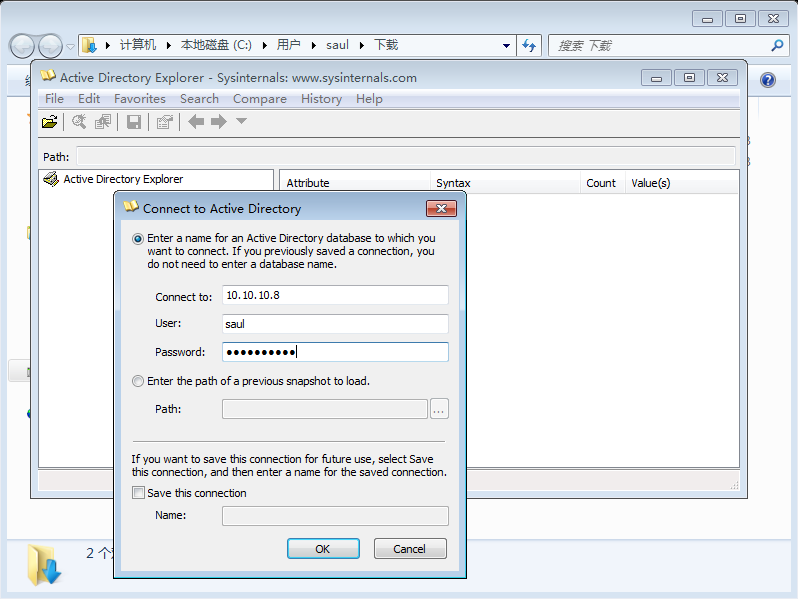
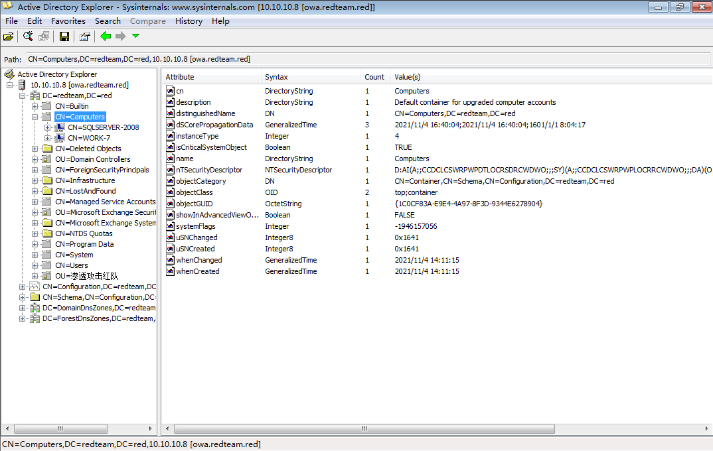
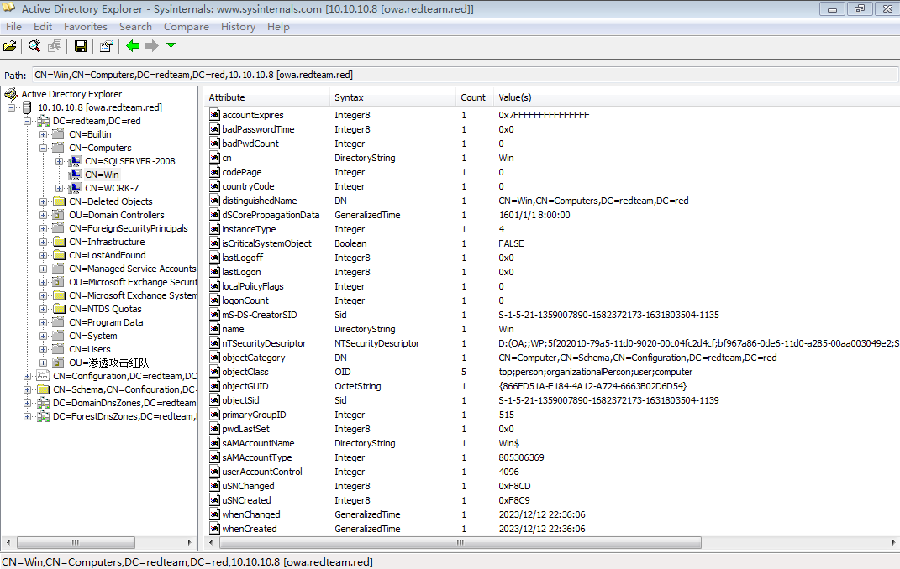
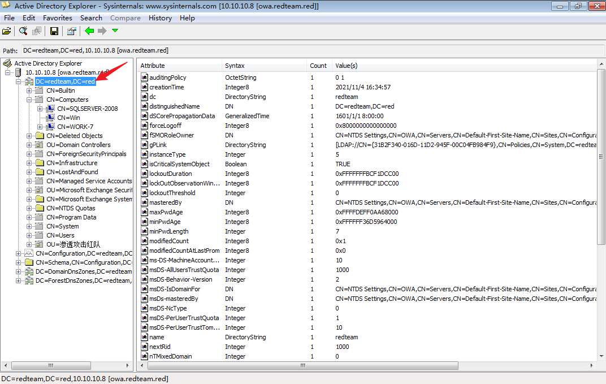
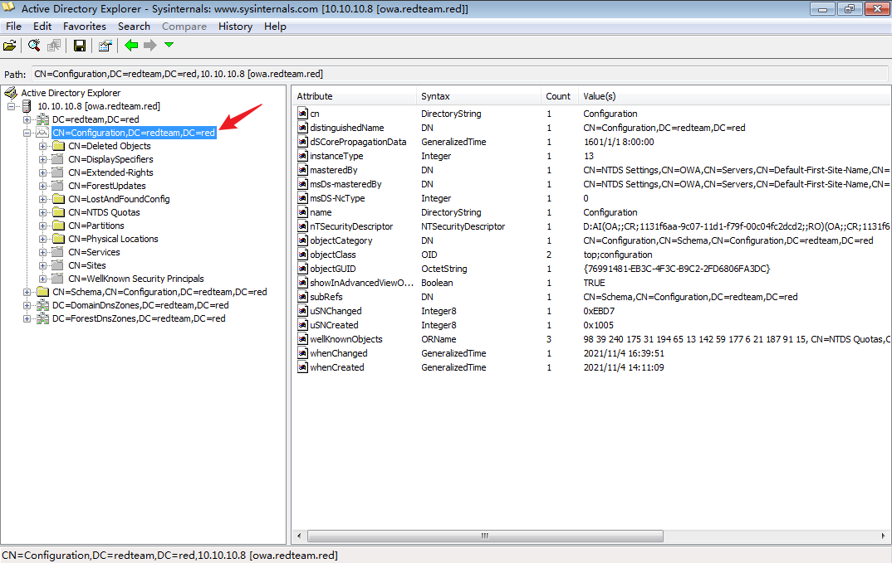
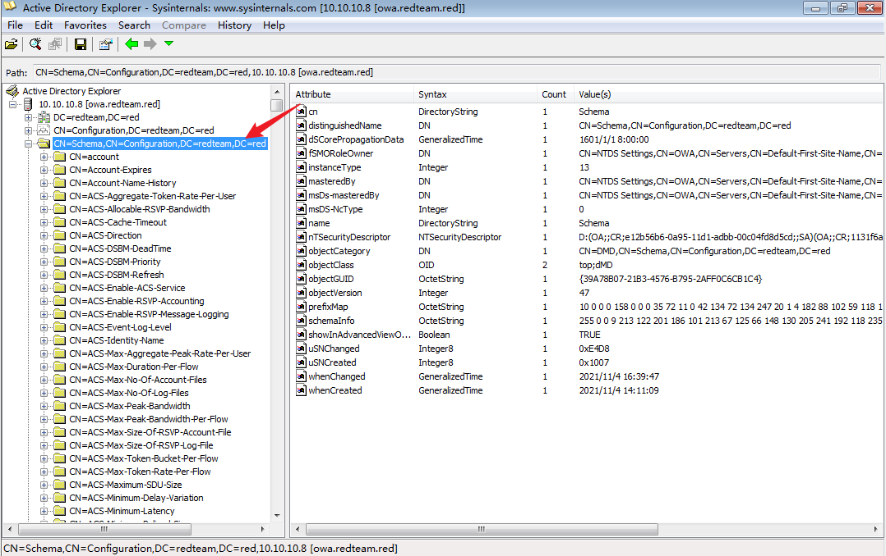
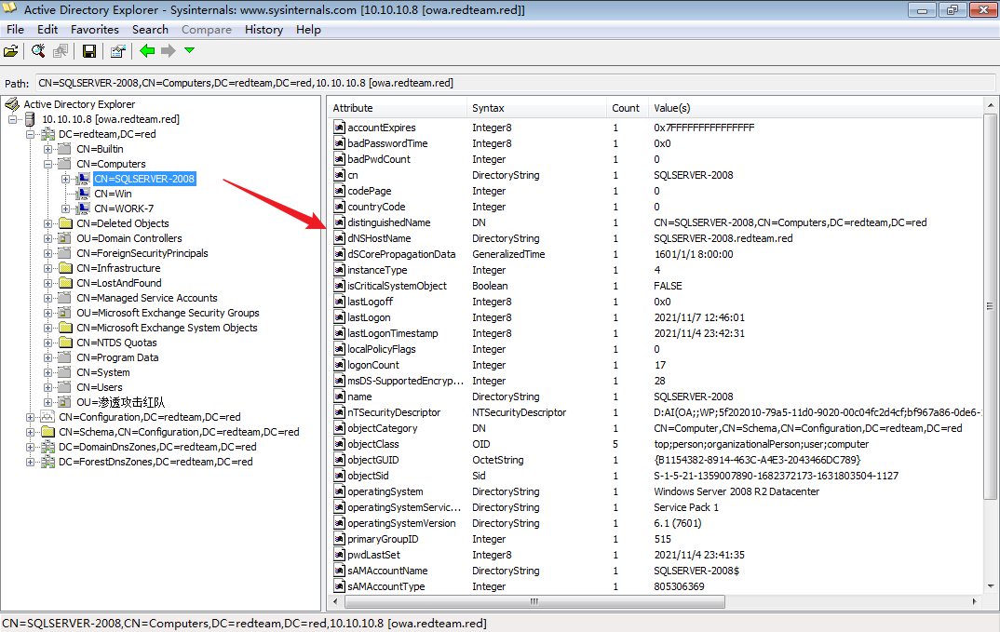
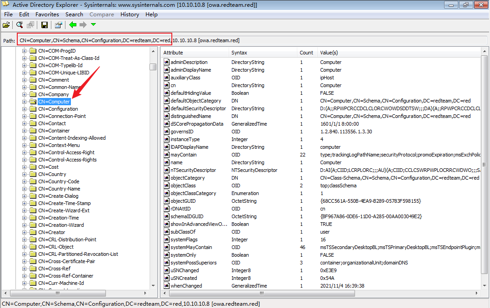
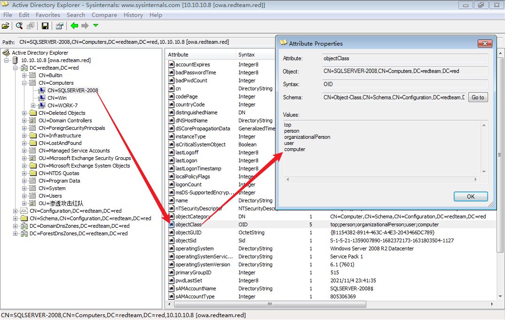

# 活动目录-AD

<div style="text-align: right;">

date: "2023-03-06"

</div>

> 活动目录是指安装在域控制器上，为整个域环境提供集中式目录管理服务的组件

活动目录存储了域环境中各种对象的信息，如域、用户、用户组、计算机、组织单位、共享资源、安全策略等

目录数据存储在域控制器的 **Ntds.dit** 文件中

## 活动目录作用

1. 计算机集中管理：集中管理所有加入域的服务器及客户端计算机，统一下发组策略
2. 用户集中管理：集中管理域用户、组织通讯录、用户组、对用户进行统一的身份认证、资源授权
3. 资源集中管理：集中管理域中的打印机、文件共享服务等网络资源
4. 环境集中配置：集中的配置域中计算机的工作环境，统一计算机桌面、统一网络连接配置、统一计算机安全配置等
5. 应用集中管理：对域内所有计算机统一推送软件、安全补丁、防病毒系统、安装网络打印机等

## Ntds.dit 文件
NTDS.dit 是域控制器保存的一个二进制文件，是**主要的活动目录数据库**，其文件路径为域控制器的`%SystemRoot%\ntds\ntds.dit`，其中存储有关域用户、用户密码的哈希散列值、用户组、组成员身份和组策略的信息。其**加密方式是使用存储在系统SYSTEM文件的密钥对这些哈希值进行加密**，非域环境中，用户凭据等信息是存储在**本地SAM文件**中

## 目录服务与LADP

> 活动目录是一种目录服务数据库，目录数据库将所有数据组织成一个有层次的树状结构，其中每个节点就是一个对象，有关这个对象的所有信息作为这个对象的属性被存储

### LDAP-轻量目录访问协议

LDAP是用来访问目录服务数据库的一个协议，活动目录就是利用LDAP名称路径来描述对象在活动目录中的位置

#### 基本概念

1. 目录树：在一个目录数据库中，整个目录中的消息集可以表示为一个目录信息树。树中的每一个节点是一个条目
2. 条目：目录数据库中的每个条目就是一条记录。每个条目有自己的唯一绝对可辨识名称（DN）
3. 绝对可辨识名称（DN）：指向一个LDAP对象的完整路径，DN由对象本体开始，向上延伸到域顶级的DNS命名空间。CN代表通用名，OU代表着组织单位，DC代表域组件。
4. 相对可辨识名称（RDN）：用于指向一个LDAP对象的相对路径。
5. 属性：用于描述数据库中每个条目的具体信息



例如上图绝对可辨识名称（DN）可以为：`ou=people,dc=wikipedoa,dc=org`

## 活动目录的访问

正常情况（非渗透测试）下可使用微软官方的连接工具：[AD EXplorer](https://learn.microsoft.com/en-us/sysinternals/downloads/adexplorer)来访问活动目录，可以在域中的任意主机，以域用户身份连接域控制器进行查看域中的各种信息，正常情况下根据权限不同，可以执行不同的操作。

### 实验

> 普通域用户添加机器到域中

可以根据下图看到当前 `CN=Computers` 下仅有 SQLSERVER-2008 和 WORK-7 两台机器





使用 `addcomputer.py` 以普通域用户 saul 将机器 Win$ 添加至域内

```shell
┌──(kali㉿kali)-[~/Desktop/impacket/examples]
└─$ python3 addcomputer.py -computer-name 'Win$' -computer-pass 'Admin@123' -dc-ip 192.168.36.131 'redteam/saul:admin!@#45' -method SAMR
Impacket v0.10.0 - Copyright 2022 SecureAuth Corporation

[!] No DC host set and 'redteam' doesn't look like a FQDN. DNS resolution of short names will probably fail.
[*] Successfully added machine account Win$ with password Admin@123.

```



## 活动目录分区

> 活动目录预定义了域分区、配置分区和架构分区三个区域

### 域分区-Domain NC

用于存储与该域有关的对象信息，这些信息是特定于该域的，如该域中的计算机、用户、组、组织单位等信息。在域林中，每个域的域控制器各自拥有一份属于自己的域分区，只会被复制到本域的所有域控制器中

域分区有如下内容：

1. `CN=Builtin`：内置了本地域组的安全组的容器
2. `CN=Computers`：机器用户容器，其中包含所有加入域的主机
3. `OU=ForeignSecurityPrincipals`：包含域中所有来自域的林外部域的组中的成员
4. `CN=Managed Service Accounts`：托管服务账户的容器
5. `CN=System`：各种预配置对象的容器，包含信任对象、DNS对象和组策略对象
6. `CN=Users`：用户和组对象的默认容器

下图箭头所指即为 redteam 域的域分区




### 配置分区-Configuration NC

用于存储整个域林的主要配置信息，包括有关站点、服务、分区和整个活动目录结构的信息。整个域林共享一份相同的配置分区，会被复制到域林中所有的域的域控制器上


下图箭头所指即为 redteam 域的配置分区



### 架构分区-Schema NC

存储整个域林的架构信息，包括活动目录中所有类、对象和属性的定义数据。整个域林共享一份相同的架构分区，会被复制到林中所有域的所有域控制器中

下图箭头所指即为 redteam 域的架构分区



活动目录的所有类（类可以看作是一组属性的集合）都存储在架构分区中，是架构分区的一个条目，选中条目后，在右窗格会显示描述它的属性

如下图所示



条目具有那些属性是由其所属的类所决定的，例如上图中的 `CN=SQLSERVER-2008` 是 computer 类的示例，computer 类是存储在架构分区中的一个条目，如下图所示



在LDAP中，类是存在继承关系的，子类可以继承父类的所有属性，而`top`类是所有类的父类，并且，活动目录中的每个条目都有 `objectClass` 属性，该属性的值指向该示例对象所继承的所有类




## 活动目录的查询

### LDAP按位查询
LDAP中有些属性是位属性，它们由一个个位标志构成，不同的位可由不同的数值表示，属性的值位各位值的总和。此时不能再对某属性进行查询，而需要对属性的标志位进行查询。

#### LDAP按位查询语法

```
<属性名称>:<BitfilterRule-ID>:=<十进制的位值>
```

`BitfilterRule-ID` 指的就是为查询规则对应的ID，如下表所示：


| 位查询规则                         | BitfilterRule-ID        |
| ---------------------------------- | ----------------------- |
| LDAP_MATCHING_RULE_BIT_AND         | 1.2.840.113556.1.4.803  |
| LDAP_MATCHING_RULE_OR              | 1.2.840.113556.1.4.804  |
| LDAP_MATCHING_RULE_TRANSITIVE_EVAL | 1.2.840.113556.1.4.1941 |
| LDAP_MATCHING_RULE_DN_WITH_DATA    | 1.2.840.113556.1.4.2253 |

以用户属性 `userAccountControl` 为例介绍位查询的过程，`userAccountControl` 是位属性，其中标志位记录了域用户账号的很多属性

| 属性标志                       | 标志说明                               | 十六进制值 | 十进制值 |
| ------------------------------ | -------------------------------------- | ---------- | -------- |
| SCRIPT                         | 将运行登录脚本                         | 0x0001     | 1        |
| ACCOUNTDISABLE                 | 已禁用用户账户                         | 0x0002     | 2        |
| HOMEDIR_REQUIRED               | 主页文件夹是必需的                     | 0x0008     | 8        |
| LOCKOUT                        | 用户锁定                               | 0x0010     | 16       |
| PASSWD_NOTREQD                 | 不需密码                               | 0x0020     | 32       |
| PASSWD_CANT_CHANGE             | 用户不能更改密码                       | 0x0040     | 64       |
| ENCRYPTED_TEXT_PWD_ALLOWED     | 用户可以发送加密密码                   | 0x0080     | 128      |
| TEMP_DUPLICATE_ACCOUNT         | 本地用户账户                           | 0x0100     | 256      |
| NORMAL_ACCOUNT                 | 表示典型用户的默认账户类型             | 0x0200     | 512      |
| INTERDOMAIN_TRUST_ACCOUNT      |                                        | 0x0800     | 2048     |
| WORKSTATION_TRUST_ACCOUNT      |                                        | 0x1000     | 4096     |
| SERVER_TRUST_ACCOUNT           | 该域的域控制器的计算机账户             | 0x2000     | 8192     |
| DONT_EXPIRE_PASSWORD           | 用户密码永不过期                       | 0x10000    | 65536    |
| MNS_LOGON_ACCOUNT              | MNS登录账户                            | 0x20000    | 131072   |
| SMARTCARD_REQUIRED             | 强制用户使用智能卡登录                 | 0x40000    | 262144   |
| TRUSTED_FOR_DELEGATION         | 信任运行服务的服务账户进行Kerberos委派 | 0x80000    | 524288   |
| NOT_DELEGATED                  |                                        | 0x100000   | 1048576  |
| USE_DES_KEY_ONLY               | 将此用户限制为仅使用DES加密类型的密钥  | 0x200000   | 2097152  |
| DONT_REQ_PREAUTH               | 此账户不需要Kerberos预身份验证来登录   | 0x400000   | 4194304  |
| PASSWORD_EXPIRED               | 用户密码已过期                         | 0x800000   | 8388608  |
| TRUSTED_TO_AUTH_FOR_DELEGATION | 账户已启用委派                         | 0x1000000  | 16777216 |

##### 例子

账户 T1sts 的 `userAccountControl` 属性只有 `HOMEDIR_REQUIRED` 和 `MNS_LOGON_ACCOUNT` 两个位置有值，那么用户 T1sts 的 `userAccountControl` 属性的值为：0x0008 + 0x20000，转为十进制为：131080

现在要查询**域中所有设置 `HOMEDIR_REQUIRED` 和 `MNS_LOGON_ACCOUNT`位的对象**就是查询 `userAccountControl` 属性的值 131080 的对象，查询语句如下：

```
(userAccountControl:1.2.840.113556.1.4.803:=131080)
```

#### 使用 AdFind 查询活动目录

> 可在域内任意主机上使用，域渗透使用较多

详细使用方法请查看另一篇文章：[AdFind](/docs/tool/lateral_movement/adfind.md)