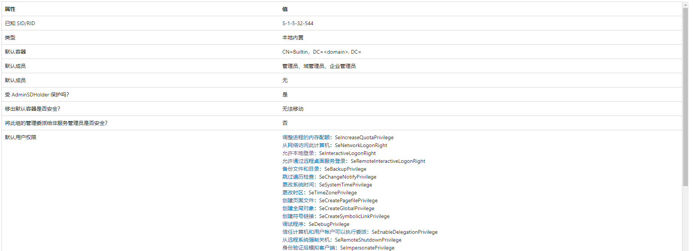
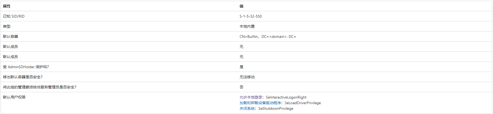
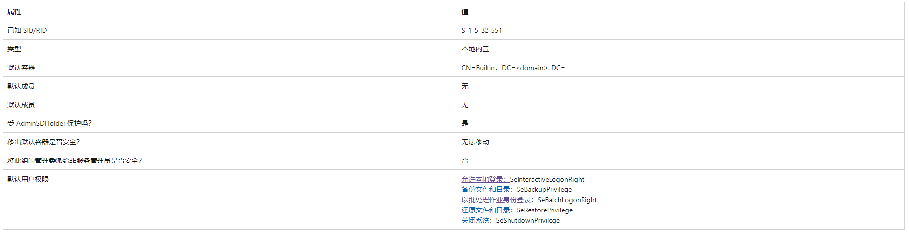
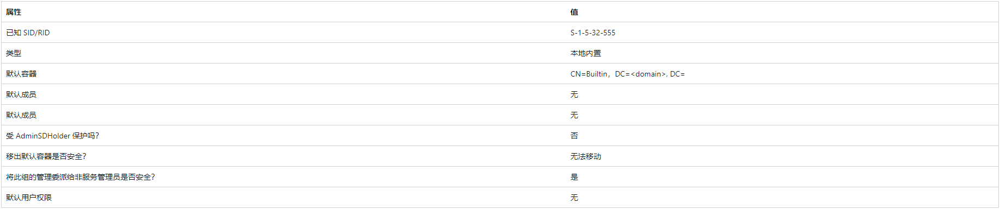
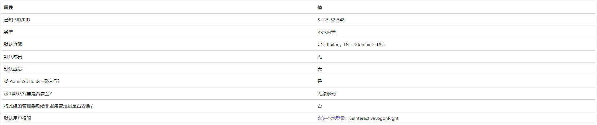
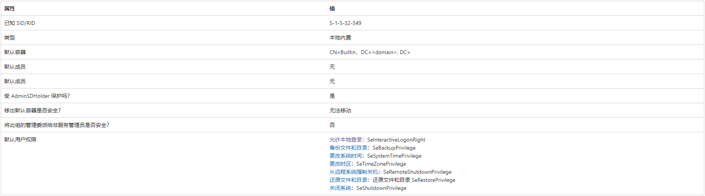

域用户组的分类和权限

date: "2023-01-08"

> 在域环境中，为方便对用户权限进行管理，需要将具有相同权限的用户划为一组。这样，只要对这个用户组赋予一定的权限，那么该组内的用户就获得了相同的权限

# 组的用途

> 组（Group）是用户账号的集合，按照用途可以分为通讯组和安全组。

1. 通讯组就是一个通讯群组。例如，把某部门所有员工拉进同一个通讯组，当给这个通讯组发信息时，组内的所有用户都能收到。
2. 安全组则是用户权限的集合。例如，管理员在日常的网络管理中，不必向每个用户账号都设置单独的访问权限，只需要创建一个组，再将需要该特权的用户拉进这个组即可。

# 安全组的权限

> 根据组的作用范围，安全组可以分为**域本地组、通用组和全局组**。注意，这里的作用范围指的是组在域树或域林中应用的范围

## 域本地组

域本地组作用于本域，主要用于访问同一个域中的资源。除了本组内的用户，域本地组还可以包含域林内的任何一个域和通用组、全局组的用户，但无法包含其他域中的域本地组。域本地组只能访问本域中的资源，无法访问其他不同域中的资源。管理员进行域组管理时，只能为域本地组授予本域的资源访问权限，无法授予对其他不同域中的资源访问权限。

当域林中多个域的用户想要访问一个域的资源时，可以从其他域向这个域的域本地组添加用户、通用组和全局组。

注意：域本地组在活动目录中都是 Group 类（ Group 类是用来支持分组管理的）的实例，而域组的作用类型是由其 `groupType` 属性决定的，该属性是一个位属性。

| 十六进制值 | 十进制值   | 说明                                                       |
| ---------- | ---------- | ---------------------------------------------------------- |
| 0x00000001 | 1          | 指定一个组为系统创建的组                                   |
| 0x00000002 | 2          | 指定一个组为全局组                                         |
| 0x00000004 | 4          | 指定一个组为域本地组                                       |
| 0x00000008 | 8          | 指定一个组为通用组                                         |
| 0x00000010 | 16         | 为 Windows Server 授权管理器指定一个 APP_BASIC 组          |
| 0x00000020 | 32         | 为 Windows Server 授权管理器指定一个 APP_QUERY 组          |
| 0x80000000 | 2147483648 | 指定一个组为安全组，如果未设置此位标志，则该组默认是通讯组 |

常见的系统内置的域本地组及其权限如下：

1. `Administrators`：管理员组，该组的成员可以不受限制地访问域中资源，是域林强大的服务管理组
2. `Print Operators`：打印机操作员组，该组地成员可以管理网络中的打印机，还可以在本地登录和关闭域控制器
3. `Backup Operators`：备份操作员组，该组的成员可以在域控制器中执行备份和还原操作，还可以在本地登录和关闭域控制器**（其成员可以远程备份必要的注册表配置单元以转储 SAM 和 LSA 机密，然后进行 DCSync）**
4. `Remote Desktop Users`：远程登陆组，只有该组的成员才有远程登陆服务的权限
5. `Account Operators`：账号操作员组，该组的成员可以创建和管理该域中的用户和组，还为其设置权限，也可以在本地登录域控制器，如果获得 `Acount Operators` 组用户就可以获得域内除了域控的所有主机权限。（基于资源的约束性委派）
6. `Server Operators`：服务器操作员组，该组的成员可以管理域服务器

### Administrators

参考文章：[administrators 官方说明](https://learn.microsoft.com/zh-cn/windows-server/identity/ad-ds/manage/understand-security-groups#administrators)

1. `Administrators` 组的成员对计算机具有完全且不受限制的访问权限。 如果将计算机提升为域控制器，则 `Administrators` 组的成员可以不受限制地访问域。
2. `Administrators` 组适用于默认 `Active Directory` 安全组列表中的 Windows Server 操作系统。
3. `Administrators` 组具有内置功能，使其成员能够完全控制系统。 无法重命名、删除或移除此组。 此内置组控制对其域中所有域控制器的访问，并且可以更改所有管理组的成员身份。 
4. 以下组的成员可以修改 `Administrators` 组成员身份：**默认服务管理员、域中的域管理员和企业管理员。**
5. 此组具有获取目录中任何对象或域控制器上任何资源的所有权的特殊权限。 此帐户被视为服务管理员组，因为其成员对域中的域控制器具有完全访问权限。
6. 默认用户权限更改：Windows Server 2008 中存在“允许通过终端服务登录”，现已替换为允许通过远程桌面服务登录。从扩展坞中移除计算机已在 Windows Server 2012 R2 中删除。

### Print Operators

参考文章：[Print Operators 官方说明](https://learn.microsoft.com/zh-cn/windows-server/identity/ad-ds/manage/understand-security-groups#print-operators)

1. 此组的成员可以管理、创建、共享和删除连接到域中域控制器的打印机。 
2. 还可以管理域中的 `Active Directory` 打印机对象。 
3. 此组的成员可以在本地登录到并关闭域中的域控制器。
4. 此组中没有默认的成员。 由于此组的成员可以在域中的所有域控制器上加载和卸载设备驱动程序，因此请谨慎添加用户。 无法重命名、删除或移除此组。
5. `Print Operators` 组适用于默认 `Active Directory` 安全组中的 Windows Server 操作系统。

### Backup Operators

参考文章：[Backup Operators 官方说明](https://learn.microsoft.com/zh-cn/windows-server/identity/ad-ds/manage/understand-security-groups#backup-operators)

1. `Backup Operator` 组的成员可以备份和还原计算机上的所有文件，而不管保护这些文件的权限如何。
2. `Backup Operators` 还可以登录并关闭计算机。 无法重命名、删除或移除此组。 
3. 默认情况下，此内置组没有成员，它可以在域控制器上执行备份和还原操作。 
4. 以下组的成员可以修改 `Backup Operators` 组成员身份：*默认服务管理员、域中的域管理员和企业管理员*。
5. `Backup Operators` 组的成员不能修改任何管理组的成员身份。 尽管此组的成员无法更改服务器设置或修改目录的配置，但他们具有替换域控制器上的文件（包括操作系统文件）所需的权限。 由于此组的成员可以替换域控制器上的文件，因此他们被视为服务管理员。
6. `Backup Operators` 组适用于默认 `Active Directory` 安全组中的 Windows Server 操作系统。

### Remote Desktop Users

参考文章：[Remote Desktop Users 官方说明](https://learn.microsoft.com/zh-cn/windows-server/identity/ad-ds/manage/understand-security-groups#remote-desktop-users)

1. 使用 RD 会话主机服务器上的 `Remote Desktop Users` 组授予用户和组远程连接到 RD 会话主机服务器的权限。 无法重命名、删除或移除此组。 此组显示为 SID，直到域控制器成为主域控制器并拥有操作主机 (FSMO) 角色。
2. `Remote Desktop Users` 组适用于默认 `Active Directory` 安全组中的 Windows Server 操作系统。

### Account Operators

参考文章：[Account Operators 官方说明](https://learn.microsoft.com/zh-cn/windows-server/identity/ad-ds/manage/understand-security-groups#account-operators)

1. `Account Operators` 组向用户授予有限的帐户创建权限，**此组的成员可以创建和修改大多数类型的帐户，包括用户帐户、本地组和全局组**。 
2. `Account Operators` 组成员可以本地登录到域控制器。
3. `Account Operators` 组的成员无法管理 `Administrator 用户帐户`、`管理员的用户帐户`或 `Administrators`、`Server Operators`、`Account Operators`、`Backup Operators` 或 `Print Operators 组`。 此组的成员无法修改用户权限。
4. `Account Operators` 组适用于默认 `Active Directory` 安全组列表中的 Windows Server 操作系统。
5. 默认情况下，此内置组没有成员。 该组可以创建和管理域中的用户和组，包括其自己的成员身份和 `Server Operators` 组的成员身份。 此组被视为服务管理员组，因为它可以修改服务器操作员 `Server Operators`，进而修改域控制器设置。 最佳做法是将此组的成员身份留空，并且不要将其用于任何委派管理。 无法重命名、删除或移除此组。

### Server Operators

参考文章：[Server Operators 官方说明](https://learn.microsoft.com/zh-cn/windows-server/identity/ad-ds/manage/understand-security-groups#server-operators)

1. `Server Operators` 组的成员可以管理域控制器，该组仅存在于域控制器上。 默认情况下，该组没有任何成员。 
2. `Server Operators` 组的成员可以执行以下操作：以交互方式登录到服务器、创建和删除网络共享资源、启动和停止服务、备份和还原文件、格式化计算机的硬盘驱动器，以及关闭计算机。 无法重命名、删除或移除此组。
3. 默认情况下，此内置组没有成员。 该组有权访问域控制器上的服务器配置选项。 其成员身份由域中的服务管理员组 `Administrators` 和 `Domain Admins` 以及林根域中的 `Enterprise Admins` 组控制。
4. 此组中的成员无法更改任何管理组成员身份。 此组被视为服务管理员帐户，因为其成员对域控制器具有物理访问权限。 此组的成员可以执行备份和还原等维护任务，并且可以更改域控制器上安装的二进制文件。
5. `Server Operators` 组适用于默认 `Active Directory` 安全组中的 Windows Server 操作系统。

对本地组相关实验如下：

1. [Print Operators 实验](/docs/knowledge/domain_penetration/experiment/experiment_PrintOperator.md)
2. [Backup Operators 实验](/docs/knowledge/domain_penetration/experiment/experiment_BackupOperator.md)
3. [Account Operators 实验](/docs/knowledge/domain_penetration/experiment/experiment_Account.md)

