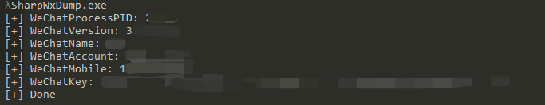
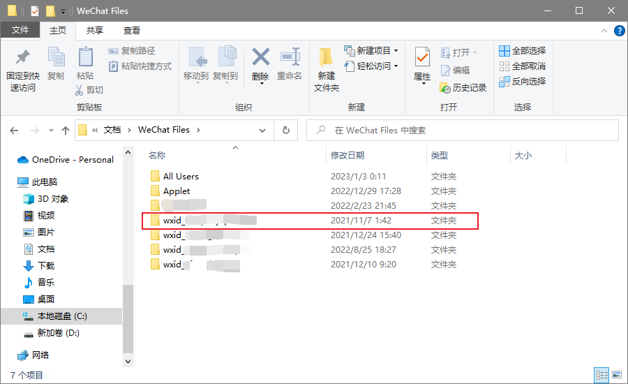
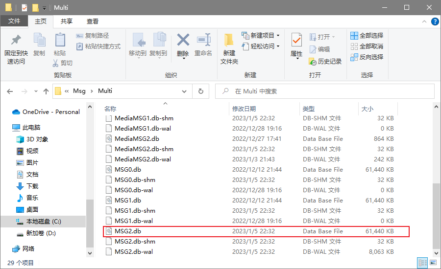
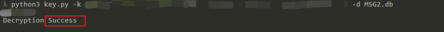
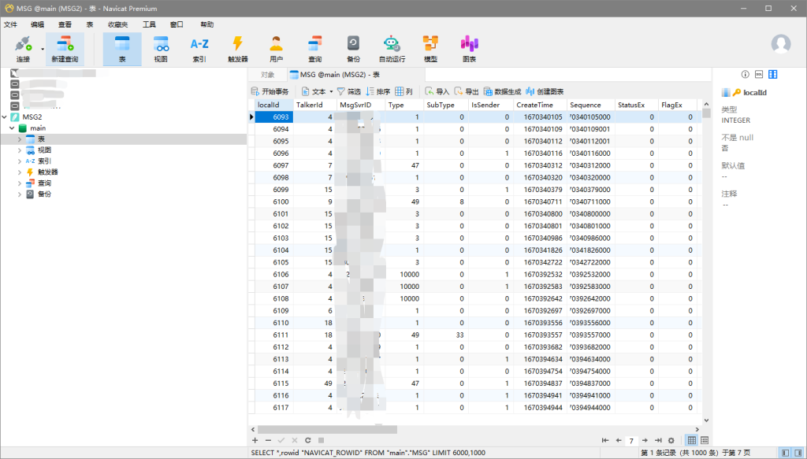

# PC端微信个人信息与聊天记录电子取证

<div style="text-align: right;">

date: "2023-01-05"

</div>

**声明：本文章仅学习使用，禁止从事非法测试，如因此产生一切不良后果与文章作者无关**

参考文章：[红队攻防之PC端微信个人信息与聊天记录取证](https://mp.weixin.qq.com/s/4DbXOS5jDjJzM2PN0Mp2JA)

工具：[SharpWxDump](https://github.com/AdminTest0/SharpWxDump)

## 前提条件

1. 微信处于登陆状态

2. 微信版本低于3.8.1.26

## 说明

1. 版本 < 3.7.0.30 只运行不登录能获取个人信息，登录后可以获取数据库密钥

3. 版本 > 3.7.0.30 只运行不登录不能获取个人信息，登录后都能获取

5. 低于3.7.0.30版本会直接返回邮箱地址，大于3.7.0.30版本则不显示任何信息

## 步骤

运行软件，会显示进程id、当前版本、微信昵称、微信账号、手机号、以及数据库密钥



寻找聊天记录，默认在`C:\\Users\\计算机用户名\\Documents\\Wechat Files`文件夹下



若用户太多，可打开`C:\\Users\\计算机用户名\\Documents\\WeChat Files\\wxid\_手动打码\\Msg\\Multi`文件夹，查看`MSG2.db`的修改时间来判断是否为当前登陆用户。



聊天记录文件：`MSG.db`，超出240MB会自动生成MSG1.db，以此类推

```

wxid_xxxxxxxx\Msg\Multi\MSG0.db > 聊天记录
wxid_xxxxxxxx\Msg\Multi\MSG1.db > 聊天记录
wxid_xxxxxxxx\Msg\Multi\MSG2.db > 聊天记录
wxid_xxxxxxxx\Msg\MicroMsg.db > Contact字段 > 好友列表
wxid_xxxxxxxx\Msg\MediaMsg.db > 语音 > 格式为silk
```

随后开始解密数据库，解密脚本如下：

```
from Crypto.Cipher import AES
import hashlib, hmac, ctypes, sys, getopt

SQLITE_FILE_HEADER = bytes('SQLite format 3', encoding='ASCII') + bytes(1)
IV_SIZE = 16
HMAC_SHA1_SIZE = 20
KEY_SIZE = 32
DEFAULT_PAGESIZE = 4096
DEFAULT_ITER = 64000
opts, args = getopt.getopt(sys.argv[1:], 'hk:d:')
input_pass = ''
input_dir = ''

for op, value in opts:
    if op == '-k':
        input_pass = value
    else:
        if op == '-d':
            input_dir = value

password = bytes.fromhex(input_pass.replace(' ', ''))

with open(input_dir, 'rb') as (f):
    blist = f.read()
print(len(blist))
salt = blist[:16]
key = hashlib.pbkdf2_hmac('sha1', password, salt, DEFAULT_ITER, KEY_SIZE)
first = blist[16:DEFAULT_PAGESIZE]
mac_salt = bytes([x ^ 58 for x in salt])
mac_key = hashlib.pbkdf2_hmac('sha1', key, mac_salt, 2, KEY_SIZE)
hash_mac = hmac.new(mac_key, digestmod='sha1')
hash_mac.update(first[:-32])
hash_mac.update(bytes(ctypes.c_int(1)))

if hash_mac.digest() == first[-32:-12]:
    print('Decryption Success')
else:
    print('Password Error')
blist = [blist[i:i + DEFAULT_PAGESIZE] for i in range(DEFAULT_PAGESIZE, len(blist), DEFAULT_PAGESIZE)]

with open(input_dir, 'wb') as (f):
    f.write(SQLITE_FILE_HEADER)
    t = AES.new(key, AES.MODE_CBC, first[-48:-32])
    f.write(t.decrypt(first[:-48]))
    f.write(first[-48:])
    for i in blist:
        t = AES.new(key, AES.MODE_CBC, i[-48:-32])
        f.write(t.decrypt(i[:-48]))
        f.write(i[-48:])
```

运行`python3 key.py -k 数据库密钥 -d MSG2.db`，出现Decrption Success即算成功



将其拖入Navicat中即可访问



查找敏感信息语句：  
`SELECT * FROM "MSG" WHERE StrContent like'%密码%'`
