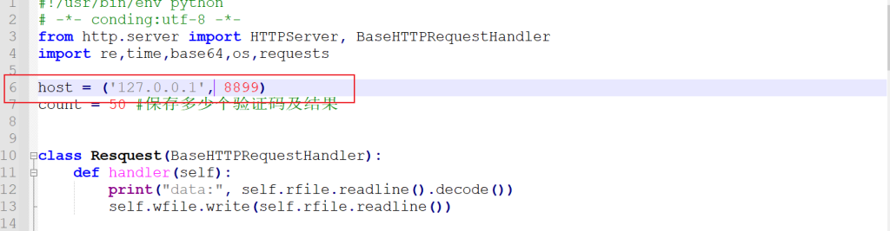
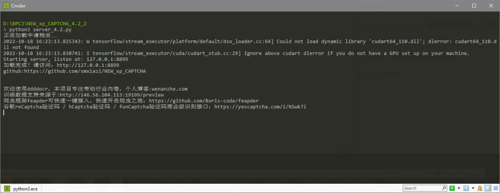
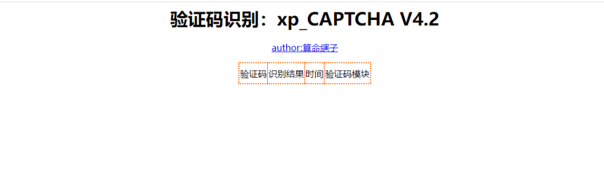
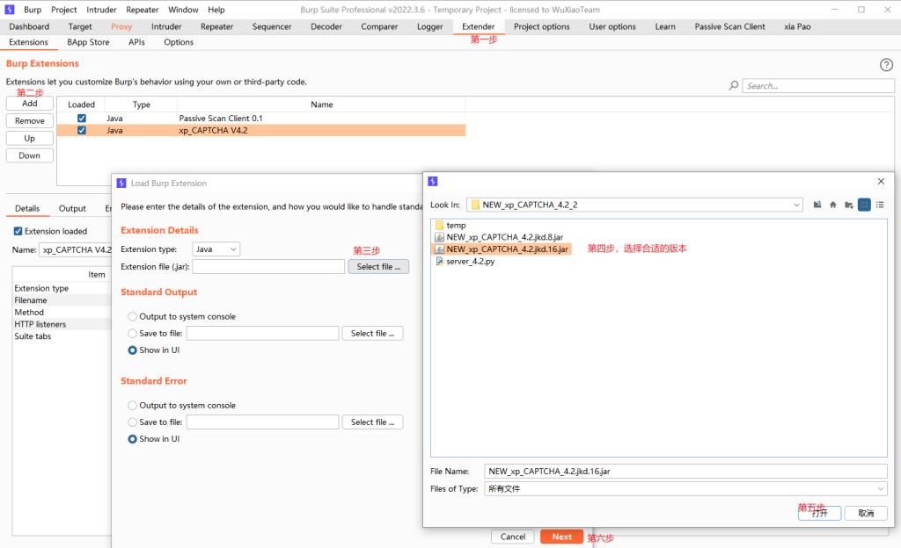
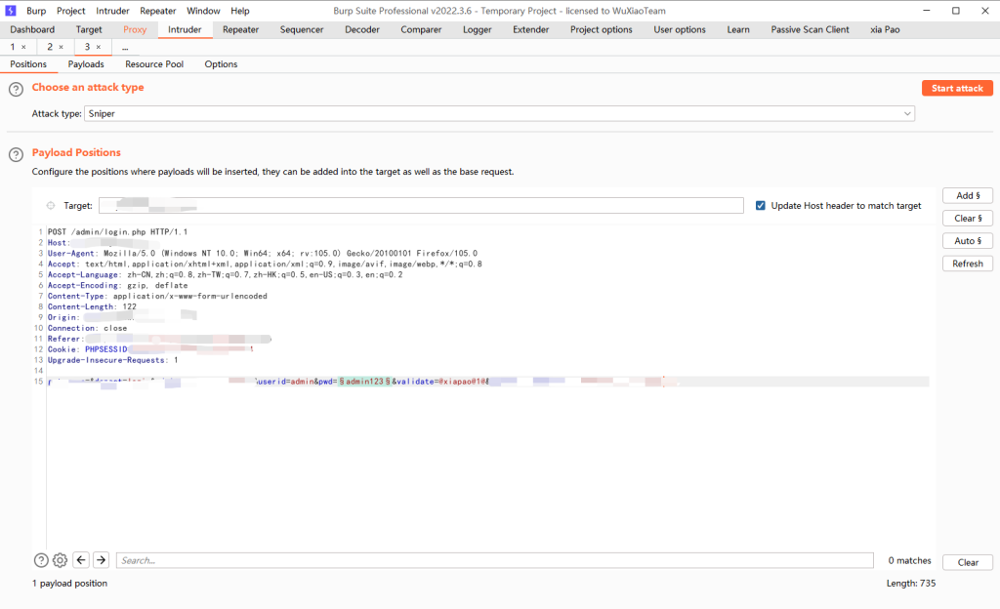
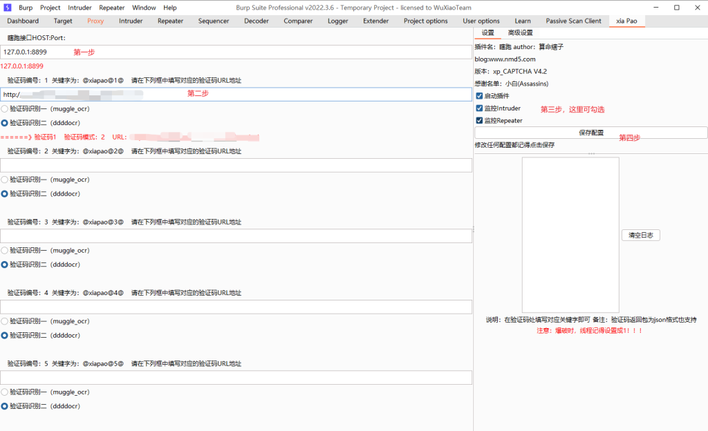
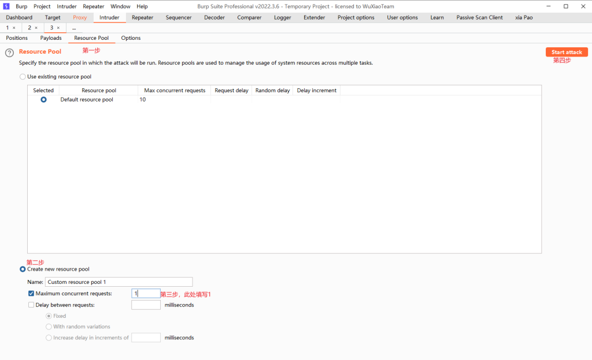
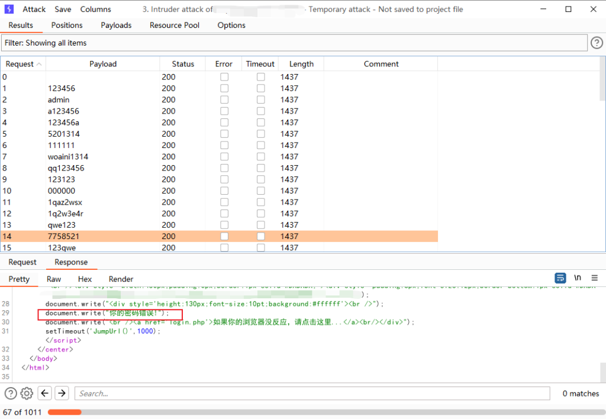

# Burp爆破识别验证码

date: "2022-10-18"

由于之前一直想实现此项技术，在网上也翻看了许多资料，基本都是基于[captcha-killer](https://github.com/c0ny1/captcha-killer)和[captcha-killer-modified](https://github.com/f0ng/captcha-killer-modified)，结合第三方ocr识别接口来识别图片验证码

常见的ocr识别接口有三种：

1.[ddddocr](https://github.com/sml2h3/ddddocr)：可直接输入`pip3 install ddddocr`安装，python版本需为3.8以上

2.[muggle-ocr](https://opentuna.cn/pypi/web/simple/muggle-ocr/)：`python3 setup.py install`

3.[第三方付费接口](http://www.kuaishibie.cn)：框架可以下载[xp\_CAPTCHA\_api V2.2](https://github.com/smxiazi/xp_CAPTCHA)，接口需付费使用，价格为1块钱识别500次，准确率很高，支持多种验证码格式

**_以下的步骤使用的框架为[xp\_CAPTCHA V4.2](https://github.com/smxiazi/NEW_xp_CAPTCHA)，使用的接口是ddddocr。_**

**一、下载上述框架后，编辑server.py，将主机地址改为本地或服务器IP，然后运行server.py**

**二、访问网址127.0.0.1:8899，出现以下界面即配置成功**

**三、添加插件**

**四、将需要爆破的地方标记，验证码则填入@xiapao@1@admin**

**五、在xiapao的地方填入验证码的url**

**六、设置相关payload，线程只能调成1，否则会失败**

