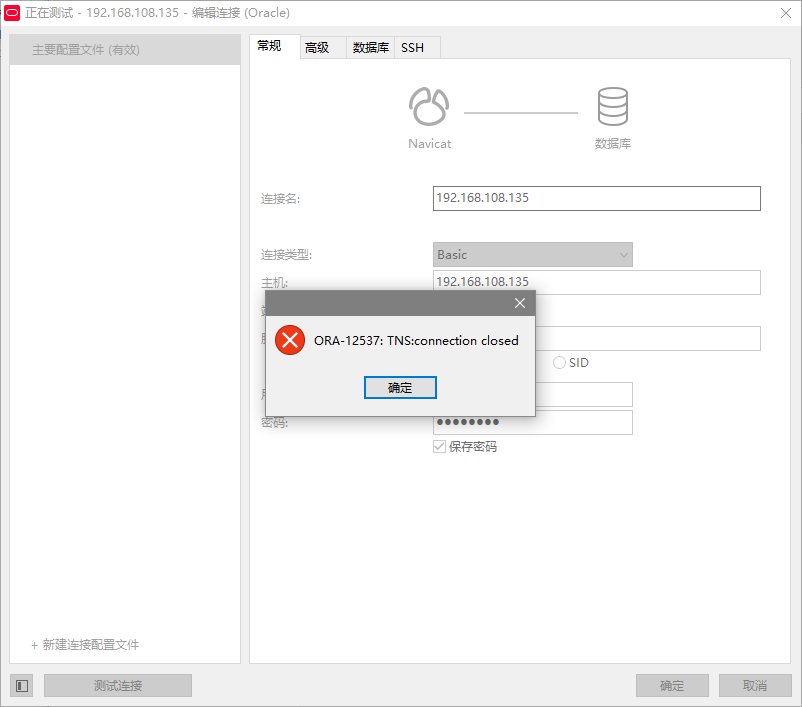
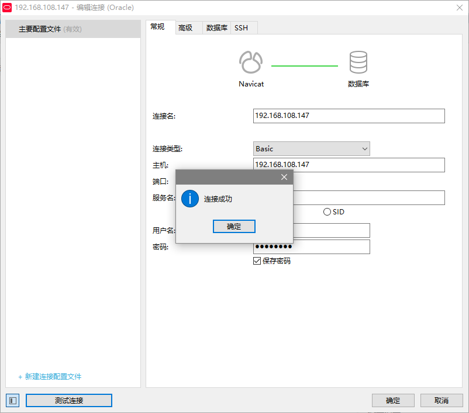

# 物理机访问虚拟机的Oracle数据库

date: "2022-11-16"

## 前提条件

1. 已安装并运行Oracle数据库

2. 防火墙及相关防护软件已关闭

3. 报错问题：ORA-12537:TNS:connection closed

报错页面如下：

## 解决方案

1. 以管理员身份打开cmd

2. 输入命令`lsnrctl status`，查看当前监听状态

3. 可以看到重点需关注的内容：监听程序参数文件、监听端点概要…

4. 监听端点概要中会出现`(DESCRIPTION=(ADDRESS=(PROTOCOL=tcp)(HOST=127.0.0.1)(PORT=1521)))`这样一段话，我们需要将localhost（127.0.0.1）改为电脑型号

5. 进入监听程序参数文件给出的路径下，将listener.ora和tnsnames.ora文件内HOST=xxxxx全改为**HOST=电脑型号**

6. 随后重启服务：`lsnrctl stop`（关闭监听服务），`lsnrctl start`（开启监听服务），似乎有更快捷的一个指令即可完成两个操作：`lsnrctl reload`（一个更比两个强）

7. 重启另一个服务：OracleService数据库名称，例如：`net stop oracleServiceXE`（关闭服务），`net start oracleServiceXE`（开启服务）

8. 输入`lsnrctl status`，发现监听端点概要…中localhost已变成电脑型号

9. 此时物理机使用Navicat输入账号密码连接数据库即可

连接成功提示

## 注意事项

1. 本次运行环境为Oracle21c

2. 连接成功后过段时间连不上了查看虚拟机IP地址是否发生变化
