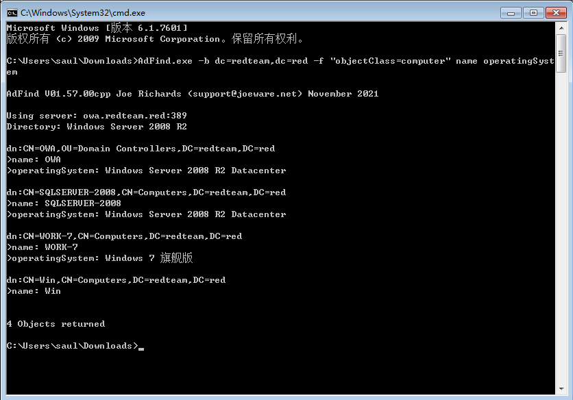
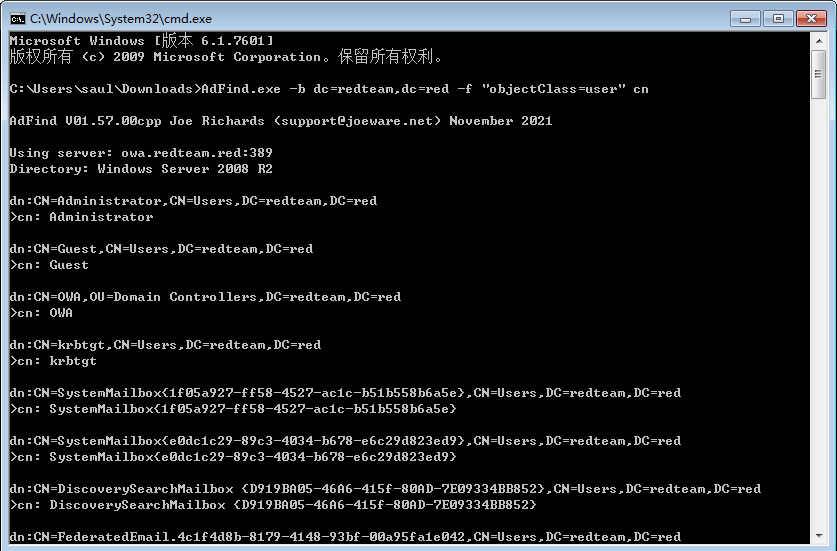
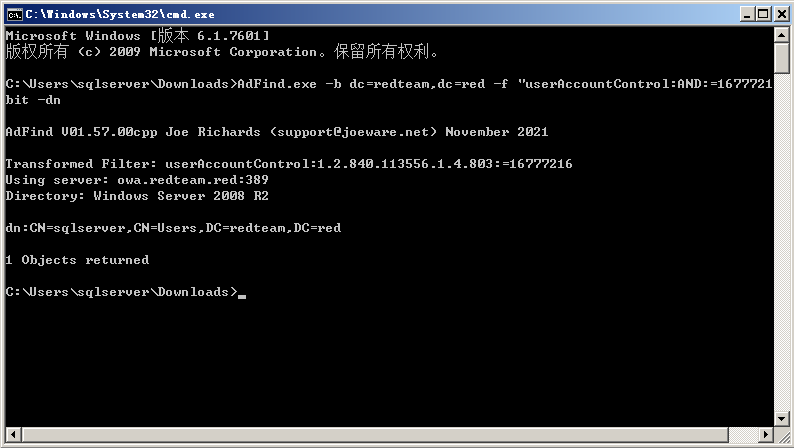

# Adfind
<div style="text-align: right;">

date: "2023-12-13"

</div>

## 基础使用

语法格式：

```bash
Adfind.exe [switches] [-b basedn] [-f filter] [attr list]
```

1. `-b`：指定一个 BaseDN 作为查询的根，BaseDN指的就是绝对可辨识名称
2. `-f`：LDAP过滤条件
3. `attr list`：需要显示的属性


## 常用命令

### 查询域中机器

| 查询需求                                                     | AdFind命令                                                   |
| ------------------------------------------------------------ | ------------------------------------------------------------ |
| 查询hack-my.com域的所有computer对象并显示所有属性            | Adfind.exe -b dc=hack-my,dc=com -f "objectClass=computer"    |
| 查询hack-my.com域的所有computer对象并过滤对象的name和operatingSystem属性 | Adfind.exe -b dc=hack-my,dc=com -f "objectClass=computer" name operatingSystem |
| 查询指定主机的相关信息                                       | Adfind.exe -sc c:<Name/SamAccountName>                       |
| 查询当前域中主机的数量                                       | Adfind.exe -sc adobjcnt:computer                             |
| 查询当前域中被禁用的主机                                     | Adfind.exe -sc computers_disabled                            |
| 查询当前域中不需要密码的主机                                 | Adfind.exe -sc computers_pwdnotreqd                          |
| 查询当前域中在线的计算机                                     | Adfind.exe -sc computers_active                              |

### 查询域中用户

| 查询需求                                            | AdFind命令                                               |
| --------------------------------------------------- | -------------------------------------------------------- |
| 查询hack-my.com域中的所有user对象并过滤对象的cn属性 | Adfind.exe -b dc=hack-my,dc=com -f "objectClass=user" cn |
| 查询当前登录的用户信息和Token                       | Adfind.exe -sc whoami                                    |
| 查询指定用户的相关信息                              | Adfind.exe -sc u:<Name/SamAccountName>                   |
| 查询当前域中用户的数量                              | Adfind.exe -sc adobjcnt:user                             |
| 查询当前域中被禁用的用户                            | Adfind.exe -sc users_disabled                            |
| 查询域中密码永不过期的用户                          | Adfind.exe -sc users_noexpire                            |
| 查询当前域中不需要密码的用户                        | Adfind.exe -sc users_pwdnotreqd                          |

### 查询域控制器

| 查询需求                                 | AdFind命令                  |
| ---------------------------------------- | --------------------------- |
| 查询当前域中所有域控制器（返回FQDN信息） | Adfind.exe -sc dclist       |
| 查询当前域中所有只读域控制器             | Adfind.exe -sc dclist:rodc  |
| 查询当前域中所有可读域写控制器           | Adfind.exe -sc dclist:!rodc |

### 其它查询

| 查询需求                             | AdFind命令                                                   |
| ------------------------------------ | ------------------------------------------------------------ |
| 查询所有的组策略对象并显示所有属性   | Adfind.exe -sc gpodmp                                        |
| 查询域信任关系                       | Adfind.exe -f "objectclass=trusteddomain"                    |
| 查询hack-my.com域中具有最高权限的SPN | Adfind.exe -b "DC=hack-my,DC=com" -f "&(servicePrincipalName=*)(admincount=1)" servicePrincipalName |

### 按位查询使用

AdFind提供按位查询方式，用来替换复杂的 `BitFilterRule-ID`

| 位查询规则                         | BitfilterRule-ID        |
| ---------------------------------- | ----------------------- |
| LDAP_MATCHING_RULE_BIT_AND         | 1.2.840.113556.1.4.803  |
| LDAP_MATCHING_RULE_OR              | 1.2.840.113556.1.4.804  |
| LDAP_MATCHING_RULE_TRANSITIVE_EVAL | 1.2.840.113556.1.4.1941 |
| LDAP_MATCHING_RULE_DN_WITH_DATA    | 1.2.840.113556.1.4.2253 |


## 实验环境

1. 查询 redteam 域中所有的 `computer` 对象，并过滤对象的 `name` 和 `operathing System` 属性

```shell
AdFind.exe -b dc=redteam,dc=red -f "objectClass=computer" name operatingSystem
```



2. 查询 redteam 域中所有的 `user` 对象，并过滤对象的 `cn` 属性

```shell
AdFind.exe -b dc=redteam,dc=red -f "objectClass=user" cn
```


3. 查询 redteam 域中所有 `userAccountControl` 属性设置了 `TRUSTED_TO_AUTH_FOR_DELEGATION` 标志位的对象

```shell
AdFind.exe -b dc=redteam,dc=red -f "userAccountControl:AND:=16777216" -bit -dn
```

